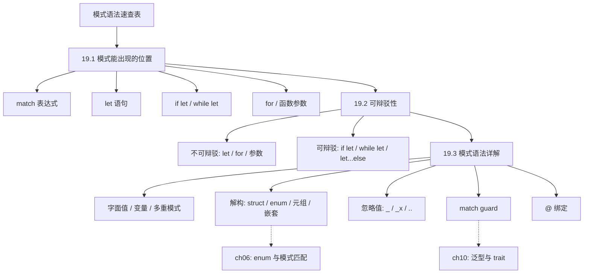
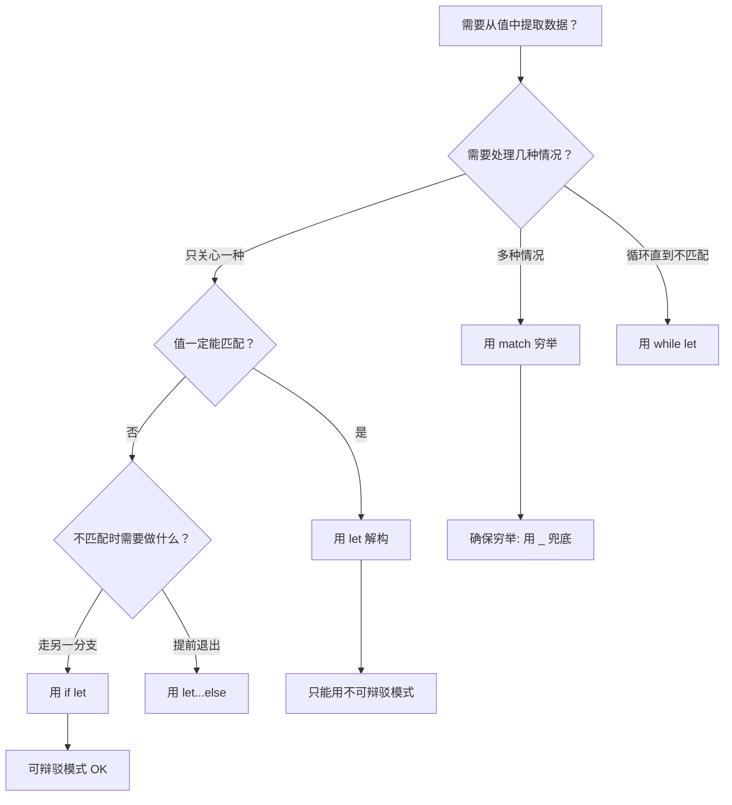
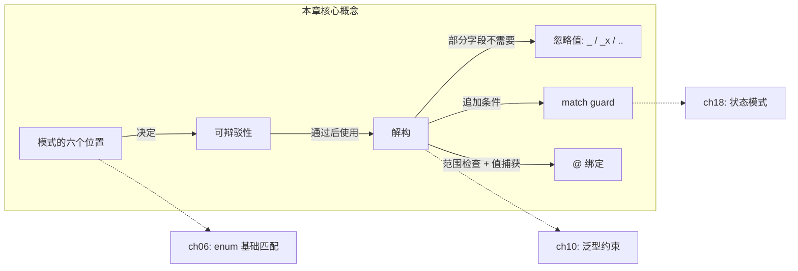

# 第 19 章 — 模式与匹配（Patterns and Matching）

> **对应原文档**：Chapter 19 — Patterns and Matching  
> **预计学习时间**：2–3 天（模式语法种类繁多，需要逐个过一遍并动手实验；重点理解解构、`@` 绑定和 match guard 的组合用法）  
> **本章目标**：掌握模式能出现的所有位置、可辩驳性的区别、完整的模式语法清单；能在实际代码中灵活运用解构、忽略值、match guard 和 `@` 绑定  
> **前置知识**：ch06, ch10  
> **已有技能读者建议**：你可以把"模式"理解成比 `switch`/解构/TS 类型收窄更强的一套语法系统：它既能解构又能绑定，还能配合 guard 表达条件。全局口径见 [`doc/rust/js-ts-styleguide.md`](js-ts-styleguide.md)。

---

## 目录

- [章节概述](#章节概述)
- [本章知识地图](#本章知识地图)
- [已有技能快速对照（JS/TS → Rust）](#已有技能快速对照jsts--rust)
- [迁移陷阱（JS → Rust）](#迁移陷阱js--rust)
- [模式语法速查表](#模式语法速查表)
- [19.1 模式能出现的所有位置](#191-模式能出现的所有位置)
- [19.2 可辩驳性（Refutability）](#192-可辩驳性refutability)
- [19.3 模式语法详解](#193-模式语法详解)
- [反面示例（常见新手错误）](#反面示例常见新手错误)
- [本章小结](#本章小结)
- [概念关系总览](#概念关系总览)
- [自查清单](#自查清单)
- [实操练习](#实操练习)
- [学习明细与练习任务](#学习明细与练习任务)
- [常见问题 FAQ](#常见问题-faq)
- [个人总结](#个人总结)
- [学习时间表](#学习时间表)

## 章节概述

| 小节 | 内容 | 重要性 |
|------|------|--------|
| 模式语法速查表 | 完整模式语法一览 | ★★★★★ |
| 19.1 模式的位置 | match/if let/while let/for/let/fn 参数 | ★★★★★ |
| 19.2 可辩驳性 | irrefutable vs refutable | ★★★★☆ |
| 19.3 模式语法详解 | 解构、忽略、guard、@ 绑定 | ★★★★★ |

---

## 本章知识地图



> **阅读方式**：实线箭头表示"先学 → 后学"的依赖关系。虚线箭头指向相关章节。

---

## 已有技能快速对照（JS/TS → Rust）

| JS/TS | Rust | 关键差异 |
|---|---|---|
| `switch` + 手写 default | `match`（穷尽） | Rust 让"漏分支"变成编译错误 |
| 解构赋值 `{x, y}` / `[a, b]` | 模式可出现在 `let`/参数/for/while let 等处 | 模式不止 match，几乎到处可用 |
| TS narrowing（基于条件） | match guard / `@` 绑定 | 同时"测试 + 绑定"更紧凑 |

---

## 迁移陷阱（JS → Rust）

- **以为模式只在 match 里**：实际上 `let`、函数参数、`for` 解构都在用模式；理解这一点能让你写出更地道的 Rust。  
- **滥用 `_` 掩盖未来改动**：通配符会让新增变体/字段时编译器失去提醒能力；能写清楚就写清楚。  
- **忽略"可辩驳性"**：`let` 绑定需要不可辩驳模式，`if let`/`while let` 才适合可辩驳模式；这是 Rust 控制流设计的核心之一。  

---

## 模式语法速查表

先看全貌——Rust 的模式远不止 `match` 里那几行。

| 模式语法 | 示例 | 说明 |
|----------|------|------|
| **字面值** | `1`, `'a'`, `true` | 精确匹配某个常量 |
| **命名变量** | `x`, `name` | 匹配任意值并绑定到变量（不可辩驳） |
| **多重模式 `\|`** | `1 \| 2 \| 3` | 模式"或"运算，匹配其中任意一个 |
| **范围 `..=`** | `1..=5`, `'a'..='z'` | 闭区间匹配，仅支持数字和 `char` |
| **解构 struct** | `Point { x, y }` | 将字段绑定到同名变量 |
| **解构 struct（重命名）** | `Point { x: a, y: b }` | 将字段绑定到不同名变量 |
| **解构 enum** | `Some(val)`, `Msg::Move { x, y }` | 按变体结构提取内部数据 |
| **解构元组** | `(a, b, c)` | 按位置绑定元组元素 |
| **解构嵌套** | `Message::ChangeColor(Color::Rgb(r,g,b))` | 多层嵌套一次解构 |
| **通配符 `_`** | `_` | 匹配任意值，**不绑定** |
| **嵌套 `_`** | `Some(_)`, `(_, y, _)` | 只忽略部分字段 |
| **`_x` 前缀** | `_unused` | 绑定值但抑制未使用警告（**仍会转移所有权**） |
| **`..` 忽略剩余** | `Point { x, .. }`, `(first, .., last)` | 忽略未列出的所有字段/元素 |
| **match guard** | `Some(x) if x > 5` | 在匹配后附加额外条件 |
| **`@` 绑定** | `id @ 3..=7` | 测试值的同时将其绑定到变量 |
| **引用模式** | `&val`, `&(x, y)` | 解构引用 |

---

## 19.1 模式能出现的所有位置

模式不只在 `match` 里——你一直在用，只是没意识到。

### match 表达式

最常见的位置，要求**穷举**所有可能值：

```rust
match VALUE {
    PATTERN => EXPRESSION,
    PATTERN => EXPRESSION,
    _ => EXPRESSION,        // 兜底分支
}
```

```rust
match x {
    None => None,
    Some(i) => Some(i + 1),
}
```

规则：
- 必须穷举（exhaustive）——漏掉任何可能值都会编译报错
- `_` 匹配一切但不绑定，常用于最后一个分支
- 变量名（如 `other`）也能兜底，且会绑定值

### let 语句

`let` 本身就是模式匹配：

```rust
let PATTERN = EXPRESSION;

let x = 5;                    // x 是一个模式
let (a, b, c) = (1, 2, 3);   // 元组解构
```

元素数量不匹配 → 编译错误：

```rust
let (x, y) = (1, 2, 3);  // ✗ 3 元素元组不能匹配 2 个变量
```

### if let / else if let

只关心一种情况时比 `match` 简洁，可以链式组合 `if let` / `else if` / `else if let`：

```rust
if let Some(color) = favorite_color {
    println!("用 {color} 做背景");
} else if let Ok(age) = age {
    println!("年龄: {age}");
} else {
    println!("用默认颜色");
}
```

注意：`if let Ok(age) = age` 中的 `age` 是新的遮蔽变量，仅在该 `{}` 块内有效。`if let` **不检查穷举性**。

### while let 条件循环

```rust
while let Ok(value) = rx.recv() {
    println!("{value}");    // recv() 返回 Err 时退出循环
}
```

### for 循环 / 函数参数

```rust
for (index, value) in v.iter().enumerate() { }  // (index, value) 是模式

fn print_coordinates(&(x, y): &(i32, i32)) {    // 参数也是模式
    println!("坐标: ({x}, {y})");
}
```

### 所有位置汇总

| 位置 | 要求不可辩驳？ | 示例 |
|------|--------------|------|
| `match` 分支 | 最后一个分支需不可辩驳 | `match x { 1 => ..., _ => ... }` |
| `let` 语句 | **是** | `let (a, b) = (1, 2);` |
| `for` 循环 | **是** | `for (i, v) in iter.enumerate()` |
| 函数参数 | **是** | `fn foo((x, y): (i32, i32))` |
| `if let` | 否（本来就是处理可能失败的情况） | `if let Some(x) = opt { ... }` |
| `while let` | 否 | `while let Ok(v) = rx.recv()` |
| `let...else` | 否（refutable + 显式处理失败） | `let Some(x) = opt else { return; };` |

---

## 19.2 可辩驳性（Refutability）

### 两种模式

| | 不可辩驳（Irrefutable） | 可辩驳（Refutable） |
|---|---|---|
| **含义** | 对任何可能的值都能匹配 | 对某些值可能匹配失败 |
| **示例** | `x`、`(a, b)`、`_` | `Some(x)`、`Ok(v)`、`1` |
| **适用位置** | `let`、`for`、函数参数 | `if let`、`while let`、`let...else`、`match`（非兜底分支） |

### 常见错误

```rust
let Some(x) = some_option_value;         // ✗ let 要求不可辩驳，None 未覆盖

// 修复一：if let
if let Some(x) = some_option_value { println!("{x}"); }

// 修复二：let...else（不匹配时必须发散：return/break/panic）
let Some(x) = some_option_value else { return; };

// 反向错误：不可辩驳模式 + let...else → 警告（else 永远不执行）
let x = 5 else { return; };  // ⚠ irrefutable pattern
```

### 模式匹配语法决策流程



### 个人理解：为什么 `let` 只接受不可辩驳模式

初学时总觉得 `let Some(x) = opt;` 不能编译很奇怪——为什么不能像 `if let` 那样匹配？想明白后发现原因很简单：

**`let` 是声明语句，必须保证变量一定被初始化。** 如果模式匹配可能失败，那 `x` 在失败时就没有值——而 Rust 绝对不允许使用未初始化的变量。所以 `let` 只能接受"不可能失败"的不可辩驳模式。

这样记忆最清晰：
- `let` = "我一定能拿到值" → 不可辩驳模式
- `if let` = "我试着拿，拿不到就走另一条路" → 可辩驳模式
- `let...else` = "我试着拿，拿不到就直接退出" → 可辩驳模式 + 强制发散

这个设计和 Rust 的核心哲学一脉相承：**在编译期就消除"变量可能没有值"的隐患**，而不是像某些语言那样留给运行时去 null check。

---

## 19.3 模式语法详解

### 字面值匹配

直接用常量值作为模式：

```rust
let x = 1;
match x {
    1 => println!("一"),
    2 => println!("二"),
    3 => println!("三"),
    _ => println!("其他"),
}
```

### 命名变量与遮蔽

**重点坑**：`match`/`if let`/`while let` 会开启新作用域，模式中的变量会**遮蔽**外层同名变量。

```rust
let x = Some(5);
let y = 10;

match x {
    Some(50) => println!("得到 50"),
    Some(y) => println!("匹配到 y = {y}"),   // 这里的 y 是新变量，值为 5
    _ => println!("默认, x = {x:?}"),
}

println!("结束: x = {x:?}, y = {y}");
// 输出: 匹配到 y = 5
// 输出: 结束: x = Some(5), y = 10    ← 外层 y 未改变
```

想比较外部变量？→ 用 match guard（见后文）。

### 多重模式 `|`

模式的"或"运算：

```rust
let x = 1;
match x {
    1 | 2 => println!("一或二"),
    3 => println!("三"),
    _ => println!("其他"),
}
```

### 范围匹配 `..=`

闭区间匹配，比写一堆 `|` 简洁：

```rust
match x {
    1..=5 => println!("1 到 5"),
    _ => println!("其他"),
}

match ch {
    'a'..='j' => println!("前段字母"),
    'k'..='z' => println!("后段字母"),
    _ => println!("其他"),
}
```

> 只有数字和 `char` 类型支持范围模式——编译器需要能判断范围是否为空。

### 解构 struct

```rust
struct Point { x: i32, y: i32 }

let p = Point { x: 0, y: 7 };

// 完整写法：字段重命名
let Point { x: a, y: b } = p;    // a = 0, b = 7

// 简写：变量名 = 字段名
let Point { x, y } = p;          // x = 0, y = 7
```

在 `match` 中可以混合字面值和变量：

```rust
match p {
    Point { x, y: 0 } => println!("在 x 轴上, x = {x}"),
    Point { x: 0, y } => println!("在 y 轴上, y = {y}"),
    Point { x, y } => println!("不在轴上: ({x}, {y})"),
}
```

### 解构 enum

模式必须对应 enum 变体的数据结构：

```rust
enum Message {
    Quit,
    Move { x: i32, y: i32 },
    Write(String),
    ChangeColor(i32, i32, i32),
}

match msg {
    Message::Quit => println!("退出"),
    Message::Move { x, y } => println!("移动到 ({x}, {y})"),
    Message::Write(text) => println!("文本: {text}"),
    Message::ChangeColor(r, g, b) => println!("颜色 ({r}, {g}, {b})"),
}
```

### 解构嵌套 / 混合结构

多层嵌套可以一次性解到底：

```rust
// enum 嵌套 enum
match msg {
    Message::ChangeColor(Color::Rgb(r, g, b)) => println!("RGB: ({r},{g},{b})"),
    Message::ChangeColor(Color::Hsv(h, s, v)) => println!("HSV: ({h},{s},{v})"),
    _ => (),
}

// struct + 元组混合
let ((feet, inches), Point { x, y }) = ((3, 10), Point { x: 3, y: -10 });
```

### 忽略值：`_` / `_x` / `..`

```rust
fn foo(_: i32, y: i32) { }               // _ 忽略单个参数，不绑定

let _x = 5;                               // _x 抑制未使用警告，但仍绑定

match origin {
    Point { x, .. } => println!("{x}"),   // .. 忽略剩余字段 y, z
}

let numbers = (2, 4, 8, 16, 32);
match numbers {
    (first, .., last) => println!("{first}, {last}"),  // 2, 32
}
```

> `..` 只能在一个模式中出现一次，`(.., second, ..)` 有歧义会报错。

**`_` vs `_x` 的所有权区别**（重要）：

```rust
let s = Some(String::from("hello"));
if let Some(_s) = s { }   // _s 拿走了所有权 → s 已被移动
if let Some(_) = s { }    // _ 不绑定 → s 未被移动，后续可用
```

| 语法 | 绑定 | 转移所有权 | 用途 |
|------|-----|-----------|------|
| `_` | 否 | 否 | 完全忽略某个值 |
| `_x` | 是 | **是** | 暂时不用的变量，抑制警告 |
| `..` | 否 | 否 | 忽略多个剩余字段/元素 |

### Match Guard（匹配守卫）

在模式后追加 `if` 条件，只有条件为 `true` 时才进入该分支：

```rust
let num = Some(4);
match num {
    Some(x) if x % 2 == 0 => println!("{x} 是偶数"),
    Some(x) => println!("{x} 是奇数"),
    None => (),
}
```

**解决变量遮蔽问题**——用 guard 引用外部变量：

```rust
let x = Some(5);
let y = 10;

match x {
    Some(50) => println!("得到 50"),
    Some(n) if n == y => println!("匹配到 n = {n}"),  // y 是外部的 10
    _ => println!("默认, x = {x:?}"),
}
// 输出: 默认, x = Some(5)   ← 5 != 10
```

**`|` 与 guard 的优先级**：guard 作用于整个 `|` 模式组：

```rust
let x = 4;
let y = false;

match x {
    4 | 5 | 6 if y => println!("yes"),   // 等价于 (4|5|6) if y
    _ => println!("no"),
}
// 输出: no   ← y 为 false，虽然 x 匹配了 4
```

> 注意：guard 不纳入穷举检查——编译器不会因为 guard 而认为你漏了分支。

### `@` 绑定

> **⚠️ 进阶内容**：`@` 绑定是模式语法中最高级的功能之一，能同时测试范围并捕获值。初次阅读可先理解概念，实际使用时再回来查阅语法。

同时测试值**并**绑定到变量：

```rust
match msg {
    Message::Hello { id: id @ 3..=7 } => println!("id 在范围内: {id}"),  // 测试 + 使用
    Message::Hello { id: 10..=12 }    => println!("另一范围"),           // 只测试，无法用值
    Message::Hello { id }             => println!("其他: {id}"),         // 只绑定，无条件
}
```

| 分支 | 测试范围 | 使用值 | `@` 的价值：鱼和熊掌兼得 |
|------|---------|-------|------------------------|
| `id @ 3..=7` | 能 | 能 | |
| `10..=12` | 能 | **不能** | |
| `id` | 不能 | 能 | |

### 个人理解：`@` 绑定的记忆技巧

`@` 绑定是模式匹配中最容易忘记的语法，但它解决的问题很实用。记忆口诀：**"先检查范围，再绑定到名字"**。

用一个例子来理解"为什么需要 `@`"——没有 `@` 时的困境：
- `id: 3..=7` → 能检查范围，但用不了具体值（不知道 id 到底是 3 还是 7）
- `id` → 能拿到具体值，但没有范围限制（不知道是不是在 3..=7 内）

有了 `@` → `id @ 3..=7` 鱼和熊掌兼得：既检查了范围，又把具体值绑定到 `id`。

把 `@` 读作 "at"——"把这个值**绑定到** id，**同时检查**它在 3..=7 范围内"。变量名在左，约束在右，`@` 在中间做桥梁。

---

## 反面示例（常见新手错误）

以下是使用模式匹配时最容易犯的错误，提前认识它们可以节省大量调试时间。

### 错误 1：在 `let` 中使用可辩驳模式

```rust
let Some(x) = some_option_value;  // ✗ 编译错误
```

**编译器报错**：`refutable pattern in local binding`

**修正**：使用 `if let` 或 `let...else`：

```rust
if let Some(x) = some_option_value {
    println!("{x}");
}
// 或
let Some(x) = some_option_value else { return; };
```

---

### 错误 2：`_x` 意外转移所有权

```rust
let s = Some(String::from("hello"));

if let Some(_s) = s {
    // _s 绑定了值，所有权被转移
}

println!("{s:?}");  // ✗ 编译错误：s 已被移动
```

**修正**：如果只是想忽略值而不转移所有权，使用 `_` 而非 `_x`：

```rust
if let Some(_) = s {
    // _ 不绑定，所有权未被转移
}
println!("{s:?}");  // ✓ OK
```

---

### 错误 3：match 中变量遮蔽导致的逻辑错误

```rust
let x = Some(5);
let y = 10;

match x {
    Some(y) => println!("匹配: {y}"),  // 这里 y 是新变量 = 5，不是外部的 10！
    _ => (),
}
```

**修正**：要与外部变量比较，使用 match guard：

```rust
match x {
    Some(n) if n == y => println!("等于 y: {n}"),
    Some(n) => println!("不等于 y: {n}"),
    _ => (),
}
```

---

### 错误 4：`..` 使用两次导致歧义

```rust
let numbers = (1, 2, 3, 4, 5);
match numbers {
    (.., second, ..) => println!("{second}"),  // ✗ 编译错误：歧义
}
```

**编译器报错**：`.. can only be used once per tuple pattern`

**修正**：`..` 在一个模式中只能出现一次，明确你要哪个位置：

```rust
match numbers {
    (_, second, ..) => println!("{second}"),  // ✓ second = 2
}
```

---

## 本章小结

| 概念 | 一句话 |
|------|-------|
| 模式能出现的位置 | `match`、`if let`、`while let`、`for`、`let`、函数参数 |
| 不可辩驳 vs 可辩驳 | `let`/`for`/参数要不可辩驳；`if let`/`while let`/`let...else` 接受可辩驳 |
| `\|` 多重模式 | 模式"或"运算 |
| `..=` 范围 | 闭区间匹配，仅支持数字和 `char` |
| 解构 | struct / enum / 元组 / 嵌套，一次性提取内部数据 |
| `_` vs `_x` vs `..` | 不绑定 / 绑定但抑制警告 / 忽略剩余 |
| match guard | `if` 追加条件，解决遮蔽问题 |
| `@` 绑定 | 测试 + 绑定同时完成 |

---

## 概念关系总览



> 实线箭头 = 本章内的概念关系；虚线箭头 = 在后续章节中进一步展开。

---

## 自查清单

- [ ] 能列出模式可以出现的六个位置
- [ ] 清楚哪些位置要求不可辩驳模式，哪些接受可辩驳模式
- [ ] 能解释 `_` 和 `_x` 在所有权上的区别
- [ ] 能用 `..` 在 struct 和元组中忽略剩余字段
- [ ] 能正确使用 `|` 组合多个模式
- [ ] 能用 `..=` 写范围匹配
- [ ] 理解 match 内命名变量的遮蔽行为
- [ ] 能用 match guard 引用外部变量解决遮蔽问题
- [ ] 能区分 `(4 | 5 | 6) if y` 与 `4 | 5 | (6 if y)` 的优先级
- [ ] 能用 `@` 绑定同时测试范围并捕获值
- [ ] 能写出嵌套解构（enum 套 enum / struct 套元组）

---

## 实操练习

### VS Code + rust-analyzer 实操步骤

1. **创建练习项目**：`cargo new ch19-patterns-practice && cd ch19-patterns-practice`
2. **在 `src/main.rs` 中输入以下代码**：

```rust
fn main() {
    let point = (3, -5);

    match point {
        (0, 0) => println!("原点"),
        (x, 0) => println!("在 x 轴: {x}"),
        (0, y) => println!("在 y 轴: {y}"),
        (x, y) => println!("普通点: ({x}, {y})"),
    }
}
```

3. **运行 `cargo run`**，观察输出结果
4. **故意制造可辩驳性错误**：把 `match` 改为 `let (0, y) = point;`，观察编译器报错
5. **练习 `@` 绑定**：添加以下代码体验"测试 + 绑定"：

```rust
let num = 5;
match num {
    n @ 1..=5 => println!("1-5 范围内: {n}"),
    n @ 6..=10 => println!("6-10 范围内: {n}"),
    n => println!("其他: {n}"),
}
```

6. **练习 `_` vs `_x`**：用 `String` 类型测试所有权转移的区别

> **关键观察点**：注意 match guard 和 `@` 绑定如何让模式匹配既精确又灵活。养成"用 `match` 替代一串 `if/else`"的习惯。

---

## 学习明细与练习任务

### 知识点掌握清单

#### 模式位置与可辩驳性

- [ ] 能列出模式可以出现的六个位置
- [ ] 理解每个位置对可辩驳性的要求
- [ ] 能区分 `let` / `if let` / `let...else` 的使用场景

#### 模式语法

- [ ] 掌握解构 struct / enum / 元组 / 嵌套的写法
- [ ] 理解 `_` / `_x` / `..` 三种忽略方式的区别
- [ ] 掌握 match guard 和 `@` 绑定的语法

---

### 练习任务（由易到难）

#### 任务 1：模式全家桶 ⭐ 基础｜约 30 分钟｜必做

实现一个 `describe_point` 函数，接收 `(i32, i32)` 元组，使用模式匹配输出：

1. `(0, 0)` → "原点"
2. `(x, 0)` → "在 x 轴上, x = {x}"
3. `(0, y)` → "在 y 轴上, y = {y}"
4. `(x, y)` 且 `x == y` → "在对角线上, 值 = {x}"（需要 match guard）
5. `(x, y)` 其他 → "普通点 ({x}, {y})"

扩展：再定义一个 `enum Shape`，包含 `Circle(f64)`、`Rectangle { w: f64, h: f64 }`、`Triangle(f64, f64, f64)`，写一个 `area` 函数对每种变体用模式匹配计算面积。

---

#### 任务 2：`@` 绑定实战 ⭐⭐ 进阶｜约 30 分钟｜必做

定义 HTTP 状态码处理：

```rust
enum HttpStatus {
    Code(u16),
}
```

使用 `match` + `@` 绑定实现：
- `code @ 200..=299` → 打印 "成功: {code}"
- `code @ 300..=399` → 打印 "重定向: {code}"
- `code @ 400..=499` → 打印 "客户端错误: {code}"
- `code @ 500..=599` → 打印 "服务器错误: {code}"
- 其他 → 打印 "未知状态码: {code}"

思考：如果不用 `@`，你需要怎么写才能同时检查范围和使用具体值？

---

#### 任务 3：嵌套解构与 guard 组合 ⭐⭐⭐ 挑战｜约 45 分钟｜选做

定义以下数据结构：

```rust
enum Color { Rgb(u8, u8, u8), Hsv(u16, u8, u8) }
enum Command {
    SetForeground(Color),
    SetBackground(Color),
    Print { text: String, bold: bool },
    Quit,
}
```

实现 `execute_command` 函数，使用嵌套解构 + match guard 处理所有变体，并满足以下规则：
- `SetForeground(Rgb(r, g, b))` 且 `r + g + b > 500` → 打印"亮色前景"
- `Print { text, bold: true }` → 打印 `"**{text}**"`
- 其他情况合理处理

---

### 学习时间参考

| 任务 | 建议时间 |
|------|---------|
| 阅读本章内容 | 2 - 3 小时 |
| 理解可辩驳性与模式位置 | 1 小时 |
| 任务 1（必做） | 30 分钟 |
| 任务 2（必做） | 30 分钟 |
| 任务 3（选做） | 45 分钟 |
| **合计** | **2 - 3 天（每天 1-2 小时）** |

---

## 常见问题 FAQ

**Q1: `_` 和 `..` 有什么区别？**  
`_` 忽略单个值，`..` 忽略"剩余的所有"。struct 中用 `Point { x, .. }` 忽略其余字段，元组中用 `(first, .., last)` 忽略中间所有元素。`..` 在一个模式中只能出现一次。

**Q2: match guard 会影响穷举检查吗？**  
不会。编译器在检查穷举时会忽略 guard 条件，所以即使你的 guard 逻辑上已经覆盖了所有情况，仍然需要 `_` 兜底分支。

**Q3: `let...else` 和 `if let` 怎么选？**  
`if let` 适合"匹配时做一件事，不匹配时做另一件事或什么都不做"。`let...else` 适合"不匹配就提前退出（return/break/panic），匹配的值继续在后续代码中使用"——它避免了 `if let` 的嵌套层级。

**Q4: 为什么 `match` 中的变量会遮蔽外层变量？**  
因为 `match` 每个分支开启新作用域。模式中的名字是"声明新变量"而非"与同名变量比较"。要与外部变量比较，用 match guard：`Some(n) if n == outer_var`。

**Q5: `@` 绑定和 match guard 能组合使用吗？**  
可以。例如 `id @ 3..=7 if id != 5` 先用 `@` 绑定范围内的值到 `id`，再用 guard 排除特定值。

---

## 个人总结

本章是 Rust 模式匹配的"完全手册"，学完后最大的感受是：**模式匹配在 Rust 中无处不在，远不只是 `match` 语句**。几个核心收获：

1. **模式的六个位置要烂熟于心**：`match`、`if let`、`while let`、`for`、`let`、函数参数——理解了这一点，很多之前"凭直觉"写的代码突然有了理论基础。
2. **可辩驳性是理解编译错误的关键**：为什么 `let Some(x) = opt` 不行？因为 `let` 要求不可辩驳。这个概念打通后，`if let` / `let...else` / `while let` 的使用场景就自然清晰了。
3. **`_` vs `_x` 的所有权区别是隐藏陷阱**：看起来只差一个字符，但 `_x` 会转移所有权而 `_` 不会，这在处理 `String` 等非 Copy 类型时可能导致意外的编译错误。
4. **`@` 绑定是"范围检查 + 值捕获"的唯一方案**：没有 `@`，你只能二选一（检查范围或捕获值），有了 `@` 就能鱼和熊掌兼得。

> 模式匹配是 Rust 表达力的核心来源之一。写 Rust 代码时，如果发现自己在写一连串 `if`/`else` 判断，先想想能不能用 `match` + 模式匹配优雅地重写。

---

## 学习时间表

| 天数 | 内容 | 目标 |
|------|------|------|
| 第 1 天 | 模式语法速查表 + 19.1 模式的位置 + 19.2 可辩驳性 | 记住模式能出现的六个位置，理解可辩驳 vs 不可辩驳的区分规则 |
| 第 2 天 | 19.3 模式语法详解（字面值、解构、忽略、guard、@ 绑定） | 逐个过一遍所有模式语法，重点理解 `_` vs `_x` 的所有权区别和 match guard 的优先级 |
| 第 3 天 | 动手练习 + 自查清单 + FAQ 复习 | 完成 `describe_point` 和 HTTP 状态码练习，通过自查清单查漏补缺 |

---

*上一章：[第 18 章 — 面向对象编程特性](./ch18-oop.md)*  
*下一章：[第 20 章 — 高级特性](./ch20-advanced-features.md)*

---

*文档基于：The Rust Programming Language（2024 Edition）*  
*生成日期：2026-02-20*
