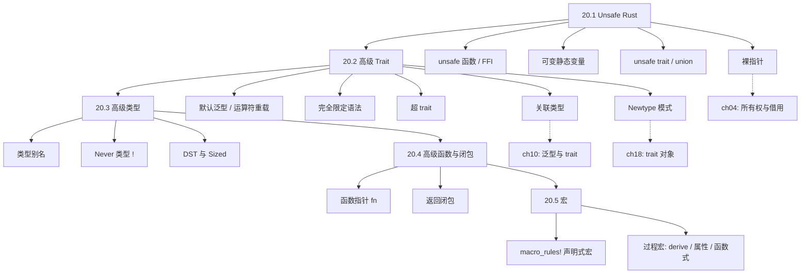
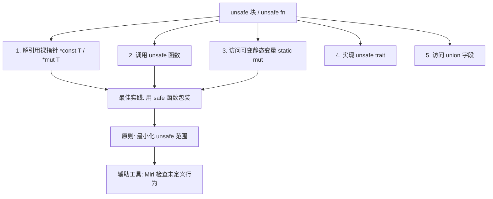
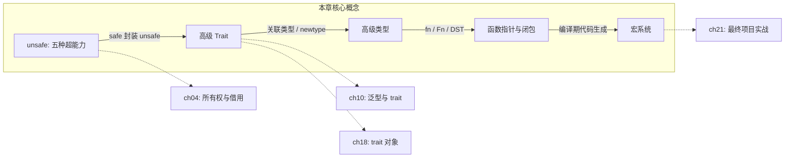

# 第 20 章 — 高级特性（Advanced Features）

> **对应原文档**：Chapter 20 — Advanced Features  
> **预计学习时间**：4–5 天（本章是各种高级主题的"大杂烩"，每节相对独立，可以按需挑读；但建议至少通读一遍，遇到时能快速定位）  
> **本章目标**：理解 unsafe Rust 的五种超能力及其使用场景；掌握关联类型、默认泛型参数、完全限定语法、超 trait、newtype 模式；熟悉类型别名、never 类型、动态大小类型；了解函数指针与返回闭包的区别；入门声明式宏与过程宏  
> **前置知识**：ch04-ch19（建议完成全部基础章节）  
> **已有技能读者建议**：这一章有点像"深入语言机制与元编程"：macro 不是运行时反射，unsafe 也不是"随便写就行"。建议按需阅读，但一定要形成两条底线：unsafe 只封装成安全抽象；宏优先用于减少样板而不是制造魔法。全局口径见 [`doc/rust/js-ts-styleguide.md`](js-ts-styleguide.md)。

---

## 目录

- [章节概述](#章节概述)
- [本章知识地图](#本章知识地图)
- [已有技能快速对照（JS/TS → Rust）](#已有技能快速对照jsts--rust)
- [迁移陷阱（JS → Rust）](#迁移陷阱js--rust)
- [20.1 Unsafe Rust](#201-unsafe-rust)
  - [为什么需要 unsafe？](#为什么需要-unsafe)
  - [五种超能力](#五种超能力)
  - [裸指针（Raw Pointers）](#裸指针raw-pointers)
  - [调用 unsafe 函数](#调用-unsafe-函数)
  - [安全抽象包装 unsafe 代码](#安全抽象包装-unsafe-代码)
  - [extern 函数与 FFI](#extern-函数与-ffi)
  - [可变静态变量](#可变静态变量)
  - [实现 unsafe trait](#实现-unsafe-trait)
  - [访问 union 字段](#访问-union-字段)
  - [使用 Miri 检查 unsafe 代码](#使用-miri-检查-unsafe-代码)
  - [个人理解：unsafe 不意味着"不安全"](#个人理解unsafe-不意味着不安全)
- [20.2 高级 Trait](#202-高级-trait)
  - [关联类型（Associated Types）](#关联类型associated-types)
  - [默认泛型参数与运算符重载](#默认泛型参数与运算符重载)
  - [完全限定语法（Fully Qualified Syntax）](#完全限定语法fully-qualified-syntax)
  - [超 trait（Supertraits）](#超-traitsupertrait)
  - [Newtype 模式绕过孤儿规则](#newtype-模式绕过孤儿规则)
- [20.3 高级类型](#203-高级类型)
  - [类型别名（Type Aliases）](#类型别名type-aliases)
  - [Never 类型 !](#never-类型-)
  - [动态大小类型（DST）与 Sized Trait](#动态大小类型dst与-sized-trait)
- [20.4 高级函数与闭包](#204-高级函数与闭包)
  - [函数指针 fn](#函数指针-fn)
  - [返回闭包](#返回闭包)
- [20.5 宏（Macros）](#205-宏macros)
  - [宏 vs 函数](#宏-vs-函数)
  - [声明式宏 macro_rules!](#声明式宏-macro_rules)
  - [过程宏（Procedural Macros）](#过程宏procedural-macros)
  - [三种过程宏对比](#三种过程宏对比)
  - [个人建议：宏的学习策略](#个人建议宏的学习策略)
- [反面示例（常见新手错误）](#反面示例常见新手错误)
- [本章小结](#本章小结)
- [概念关系总览](#概念关系总览)
- [自查清单](#自查清单)
- [实操练习](#实操练习)
- [学习明细与练习任务](#学习明细与练习任务)
- [常见问题 FAQ](#常见问题-faq)
- [个人总结](#个人总结)
- [学习时间表](#学习时间表)

---

## 章节概述

| 小节 | 内容 | 重要性 |
|------|------|--------|
| 20.1 Unsafe | 5 种超能力、原始指针、FFI | ★★★★★ |
| 20.2 高级 Trait | 关联类型、默认泛型、完全限定语法、Newtype | ★★★★★ |
| 20.3 高级类型 | 类型别名、never 类型、DST | ★★★★☆ |
| 20.4 函数与闭包 | 函数指针 fn、返回闭包 | ★★★☆☆ |
| 20.5 宏 | macro_rules!、过程宏 | ★★★★☆ |

---

## 本章知识地图



> **阅读方式**：实线箭头表示"先学 → 后学"的依赖关系。虚线箭头指向相关前置章节。本章各节相对独立，可按需跳读。

---

## 已有技能快速对照（JS/TS → Rust）

| JS/TS 世界 | Rust 世界 | 关键差异 |
|---|---|---|
| 运行时动态（反射/patch） | 编译期强类型 + 宏 | Rust 更偏"编译期生成/检查"，而非运行时改写 |
| "不安全操作"多靠约定 | `unsafe` 显式标记边界 | unsafe 是能力开关，目标是把危险封装在小范围 |
| Babel/TS transform（直觉） | `macro_rules!` / 过程宏 | Rust 宏是语言级元编程，受更强的语法/类型约束 |

---

## 迁移陷阱（JS → Rust）

- **把 unsafe 当成"逃生舱"**：unsafe 不是绕过编译器写快一点，而是为了构建更底层能力；正确做法是"unsafe 内部实现 + safe API 对外"。  
- **把宏当字符串拼接/AST 黑魔法**：声明式宏更像语法级模板；过程宏才像编译期插件，但也应克制使用。  
- **忽略 API 兼容性**：宏、trait、类型别名等高级特性一旦进入公共 API，后续修改成本会比 JS/TS 大得多（因为类型系统会波及下游）。  

---

## 20.1 Unsafe Rust

### 为什么需要 unsafe？

Rust 的编译器是保守的——它宁可拒绝一些合法代码，也不放过可能不安全的代码。但底层硬件本身就是不安全的，某些系统编程场景（操作系统、FFI、高性能数据结构）必须突破编译器的限制。`unsafe` 就是告诉编译器："这段代码的安全性由我来保证。"

### 五种超能力

> **⚠️ 进阶内容**：unsafe 是 Rust 底层编程的核心能力，理解五种超能力是使用 unsafe 的前提。

在 `unsafe` 块中可以做五件 safe Rust 做不到的事：

| # | 超能力 | 说明 |
|---|--------|------|
| 1 | 解引用裸指针 | `*const T`（不可变）/ `*mut T`（可变） |
| 2 | 调用 unsafe 函数/方法 | 函数签名前有 `unsafe` 关键字 |
| 3 | 访问或修改可变静态变量 | `static mut` 全局变量 |
| 4 | 实现 unsafe trait | trait 声明前有 `unsafe` |
| 5 | 访问 union 的字段 | 主要用于 C 互操作 |

> **关键认知**：`unsafe` 不会关闭借用检查器！引用在 unsafe 块中仍然被检查。`unsafe` 只是解锁了上面五种操作，并不意味着代码一定有问题。

#### Unsafe 五种超能力概览



### 裸指针（Raw Pointers）

裸指针与引用的区别：

- 可以同时拥有对同一位置的不可变和可变指针
- 不保证指向有效内存
- 允许为 null
- 不自动清理

```rust
let mut num = 5;

// 创建裸指针（safe 代码中可以创建，但不能解引用）
let r1 = &raw const num;   // *const i32
let r2 = &raw mut num;     // *mut i32

// 解引用必须在 unsafe 块中
unsafe {
    println!("r1 = {}", *r1);
    println!("r2 = {}", *r2);
}
```

也可以从任意地址创建裸指针（通常不要这样做）：

```rust
let address = 0x012345usize;
let r = address as *const i32; // 可以创建，但解引用是未定义行为
```

### 调用 unsafe 函数

```rust
unsafe fn dangerous() {}

unsafe {
    dangerous();
}
```

在 unsafe 函数体内执行 unsafe 操作仍需使用 `unsafe` 块——编译器会提醒你。

### 安全抽象包装 unsafe 代码

标准库的 `split_at_mut` 就是一个经典例子。纯 safe Rust 无法实现它，因为借用检查器不理解"借用同一切片的不同部分"是安全的：

```rust
use std::slice;

fn split_at_mut(values: &mut [i32], mid: usize) -> (&mut [i32], &mut [i32]) {
    let len = values.len();
    let ptr = values.as_mut_ptr();

    assert!(mid <= len);

    unsafe {
        (
            slice::from_raw_parts_mut(ptr, mid),
            slice::from_raw_parts_mut(ptr.add(mid), len - mid),
        )
    }
}
```

注意：整个函数并不需要标记为 `unsafe`——我们用 safe 的 API 包装了内部的 unsafe 操作。这是 Rust 社区推荐的模式。

### extern 函数与 FFI

调用 C 函数：

```rust
unsafe extern "C" {
    safe fn abs(input: i32) -> i32; // 标记 safe 表示我们确认它是安全的
}

fn main() {
    println!("|-3| = {}", abs(-3)); // 不需要 unsafe 块
}
```

让 Rust 函数被其他语言调用：

```rust
#[unsafe(no_mangle)]
pub extern "C" fn call_from_c() {
    println!("Just called a Rust function from C!");
}
```

### 可变静态变量

```rust
static mut COUNTER: u32 = 0;

unsafe fn add_to_count(inc: u32) {
    unsafe {
        COUNTER += inc;
    }
}

fn main() {
    unsafe {
        // SAFETY: 单线程中调用
        add_to_count(3);
        println!("COUNTER: {}", *(&raw const COUNTER));
    }
}
```

可变静态变量的问题在于多线程数据竞争。尽量用 `Mutex`、`AtomicU32` 等替代。

### 实现 unsafe trait

当 trait 的某些方法有编译器无法验证的不变量时，需要声明为 `unsafe trait`：

```rust
unsafe trait Foo {
    // ...
}

unsafe impl Foo for i32 {
    // ...
}
```

典型例子：`Send` 和 `Sync`。如果你的类型包含裸指针但确实是线程安全的，就需要手动 `unsafe impl Send`。

### 访问 union 字段

`union` 类似 `struct`，但所有字段共享同一块内存（同一时刻只有一个字段有效）。主要用于与 C 代码互操作，访问字段是 unsafe 的，因为 Rust 无法保证当前存储的是哪个字段。

### 使用 Miri 检查 unsafe 代码

Miri 是 Rust 官方的动态检测工具，能在运行时发现未定义行为：

```bash
rustup +nightly component add miri
cargo +nightly miri run
cargo +nightly miri test
```

> Miri 发现问题 → 一定有 bug；Miri 没发现 → 不代表没有问题。它是必要的辅助手段，不是万能的。

### 个人理解：unsafe 不意味着"不安全"

很多初学者（包括我自己）一开始看到 `unsafe` 这个关键字，本能反应是"这段代码很危险，不应该用"。但深入理解后会发现，`unsafe` 的真正含义不是"这段代码不安全"，而是**"编译器无法自动验证这段代码的安全性，需要程序员自己来保证"**。

可以类比为开车：

- **safe Rust** = 开着各种安全辅助系统（ABS、ESP、车道保持）的自动驾驶模式，系统帮你避免危险
- **unsafe Rust** = 切换到手动模式，你关掉了部分辅助系统来做一些高级操作（比如漂移过弯），但方向盘和刹车还在你手上

关键实践原则：

1. **unsafe 块应该尽量小**——只包裹真正需要的那一两行操作，不要把整个函数都标记为 unsafe
2. **对外暴露 safe API**——`split_at_mut` 内部有 unsafe，但外部调用完全是 safe 的，这是 Rust 社区推崇的模式
3. **写清楚 `// SAFETY:` 注释**——解释为什么你认为这段 unsafe 代码是正确的，这既是给代码审查者看的，也是给未来的自己看的
4. **用 Miri 测试**——这是你的安全网，虽然不能发现所有问题，但能捕获很多常见的未定义行为

> 一句话总结：`unsafe` 不是"关闭安全检查"，而是"安全责任从编译器转移到程序员"。写 unsafe 代码时，你就是编译器。

---

## 20.2 高级 Trait

### 关联类型（Associated Types）

关联类型在 trait 定义中声明一个类型占位符，由实现者指定具体类型：

```rust
pub trait Iterator {
    type Item;  // 关联类型
    fn next(&mut self) -> Option<Self::Item>;
}

impl Iterator for Counter {
    type Item = u32;  // 具体化
    fn next(&mut self) -> Option<Self::Item> {
        // ...
    }
}
```

**关联类型 vs 泛型**：

| | 关联类型 | 泛型 |
|---|---------|------|
| 实现次数 | 一个类型只能实现一次 | 可以为不同的泛型参数实现多次 |
| 调用时 | 无需指定类型 `counter.next()` | 可能需要类型注解消歧 |
| 适用场景 | 一对一关系（Iterator 的 Item） | 一对多关系 |

如果用泛型定义 `Iterator<T>`，则 `Counter` 可以同时实现 `Iterator<u32>` 和 `Iterator<String>`，调用时必须注解。关联类型保证了一个类型只有一种 `Iterator` 实现。

### 默认泛型参数与运算符重载

`Add` trait 的定义使用了默认泛型参数：

```rust
trait Add<Rhs=Self> {
    type Output;
    fn add(self, rhs: Rhs) -> Self::Output;
}
```

`Rhs=Self` 表示默认右操作数类型与自身相同。重载 `+` 运算符：

```rust
use std::ops::Add;

#[derive(Debug, Copy, Clone, PartialEq)]
struct Point {
    x: i32,
    y: i32,
}

impl Add for Point {
    type Output = Point;
    fn add(self, other: Point) -> Point {
        Point {
            x: self.x + other.x,
            y: self.y + other.y,
        }
    }
}
```

自定义 `Rhs` 实现不同类型相加：

```rust
struct Millimeters(u32);
struct Meters(u32);

impl Add<Meters> for Millimeters {
    type Output = Millimeters;
    fn add(self, other: Meters) -> Millimeters {
        Millimeters(self.0 + (other.0 * 1000))
    }
}
```

### 完全限定语法（Fully Qualified Syntax）

当多个 trait 有同名方法时，需要消歧：

```rust
trait Pilot {
    fn fly(&self);
}
trait Wizard {
    fn fly(&self);
}
struct Human;

impl Pilot for Human {
    fn fly(&self) { println!("This is your captain speaking."); }
}
impl Wizard for Human {
    fn fly(&self) { println!("Up!"); }
}
impl Human {
    fn fly(&self) { println!("*waving arms furiously*"); }
}

fn main() {
    let person = Human;
    person.fly();          // 调用 Human 自身的方法
    Pilot::fly(&person);   // 调用 Pilot trait 的方法
    Wizard::fly(&person);  // 调用 Wizard trait 的方法
}
```

对于没有 `self` 参数的关联函数，必须用完全限定语法：

```rust
trait Animal {
    fn baby_name() -> String;
}
struct Dog;

impl Dog {
    fn baby_name() -> String { String::from("Spot") }
}
impl Animal for Dog {
    fn baby_name() -> String { String::from("puppy") }
}

fn main() {
    // Dog::baby_name() → "Spot"
    // Animal::baby_name() → 编译错误！不知道是哪个实现
    println!("{}", <Dog as Animal>::baby_name()); // → "puppy"
}
```

通用语法：`<Type as Trait>::function(receiver_if_method, args...)`

### 超 trait（Supertraits）

一个 trait 可以依赖另一个 trait——语法上类似 trait bound：

```rust
use std::fmt;

trait OutlinePrint: fmt::Display {
    fn outline_print(&self) {
        let output = self.to_string(); // 因为要求 Display，所以可用 to_string
        let len = output.len();
        println!("{}", "*".repeat(len + 4));
        println!("*{}*", " ".repeat(len + 2));
        println!("* {output} *");
        println!("*{}*", " ".repeat(len + 2));
        println!("{}", "*".repeat(len + 4));
    }
}
```

实现 `OutlinePrint` 的类型**必须**同时实现 `Display`，否则编译失败。

### Newtype 模式绕过孤儿规则

孤儿规则（orphan rule）：只能在 trait 或类型所在的 crate 中实现 trait。想给 `Vec<String>` 实现 `Display`？用 newtype 包装：

```rust
use std::fmt;

struct Wrapper(Vec<String>);

impl fmt::Display for Wrapper {
    fn fmt(&self, f: &mut fmt::Formatter) -> fmt::Result {
        write!(f, "[{}]", self.0.join(", "))
    }
}

fn main() {
    let w = Wrapper(vec![String::from("hello"), String::from("world")]);
    println!("w = {w}"); // w = [hello, world]
}
```

缺点：`Wrapper` 没有 `Vec<String>` 的方法。解决方案：
- 实现 `Deref` trait 自动解引用到内部类型
- 或者手动委托需要的方法

Newtype 没有运行时开销——编译时会被消除。

---

## 20.3 高级类型

### 类型别名（Type Aliases）

`type` 关键字创建类型同义词（不是新类型！）：

```rust
type Kilometers = i32;

let x: i32 = 5;
let y: Kilometers = 5;
println!("x + y = {}", x + y); // OK，Kilometers 就是 i32
```

> 注意与 newtype 的区别：`type Kilometers = i32` 不创建新类型，`struct Kilometers(i32)` 才创建新类型。

类型别名最大的用处是简化冗长的类型：

```rust
type Thunk = Box<dyn Fn() + Send + 'static>;

fn takes_long_type(f: Thunk) { /* ... */ }
fn returns_long_type() -> Thunk { Box::new(|| ()) }
```

`std::io` 中广泛使用了类型别名：

```rust
type Result<T> = std::result::Result<T, std::io::Error>;

// 于是 Write trait 的签名变得简洁
pub trait Write {
    fn write(&mut self, buf: &[u8]) -> Result<usize>;
    fn flush(&mut self) -> Result<()>;
}
```

### Never 类型 `!`

> **⚠️ 进阶内容**：never 类型是 Rust 类型系统中较抽象的概念，理解它有助于理解 `match` 分支的类型兼容性。

`!` 是空类型（empty type），表示"永远不会返回"：

```rust
fn bar() -> ! {
    panic!("永远不返回");
}
```

`!` 可以强转为任何类型，这解释了为什么 `match` 中 `continue`、`panic!`、无限 `loop` 能与其他分支共存：

```rust
let guess: u32 = match guess.trim().parse() {
    Ok(num) => num,       // u32
    Err(_) => continue,   // ! 强转为 u32
};
```

`Option::unwrap` 的实现也依赖这一特性：

```rust
impl<T> Option<T> {
    pub fn unwrap(self) -> T {
        match self {
            Some(val) => val,       // T
            None => panic!("..."),  // ! 强转为 T
        }
    }
}
```

无限循环的类型也是 `!`：

```rust
loop {
    print!("and ever ");
    // 永远不会结束 → 表达式类型是 !
}
```

### 动态大小类型（DST）与 `Sized` Trait

> **⚠️ 进阶内容**：DST 是理解 `str`、`dyn Trait` 等类型的底层原理。日常开发中很少直接操作 DST，但理解它能帮你读懂编译器关于 `Sized` 的错误信息。

DST（Dynamically Sized Types）是编译期无法确定大小的类型，如 `str`、`dyn Trait`。

```rust
// 以下代码无法编译——str 大小不确定
let s1: str = "Hello there!";   // ✗
let s2: str = "How's it going?"; // ✗
```

解决方案：把 DST 放在指针后面 → `&str`、`Box<str>`、`Rc<str>`。

`Sized` trait 由编译器自动实现——大小已知的类型才有。泛型函数默认有 `Sized` bound：

```rust
fn generic<T>(t: T) { }
// 实际上等价于：
fn generic<T: Sized>(t: T) { }
```

用 `?Sized` 放宽约束，允许接收 DST（必须通过引用传递）：

```rust
fn generic<T: ?Sized>(t: &T) { }
```

`?Trait` 语法只对 `Sized` 有效，其他 trait 不支持。

---

## 20.4 高级函数与闭包

### 函数指针 `fn`

函数可以作为参数传递，类型是 `fn`（小写）：

```rust
fn add_one(x: i32) -> i32 {
    x + 1
}

fn do_twice(f: fn(i32) -> i32, arg: i32) -> i32 {
    f(arg) + f(arg)
}

fn main() {
    let answer = do_twice(add_one, 5);
    println!("The answer is: {answer}"); // 12
}
```

**`fn` vs `Fn`**：

| | `fn`（函数指针） | `Fn`（闭包 trait） |
|---|-----------------|-------------------|
| 类型还是 trait | 具体类型 | trait |
| 能否捕获环境 | 不能 | 能 |
| 兼容性 | `fn` 实现了所有三个闭包 trait | 闭包不一定是 `fn` |
| 与 C 互操作 | 可以传给 C | 不能 |

> 写泛型函数时，推荐用 `Fn` trait 而非 `fn` 类型——这样既能接受函数也能接受闭包。

枚举变体的构造器也是函数指针：

```rust
enum Status {
    Value(u32),
    Stop,
}

let list: Vec<Status> = (0u32..20).map(Status::Value).collect();
```

### 返回闭包

单一闭包类型可以用 `impl Fn`：

```rust
fn returns_closure() -> impl Fn(i32) -> i32 {
    |x| x + 1
}
```

但如果需要返回不同实现的闭包（放入 `Vec` 等），`impl Fn` 不行，因为每个闭包是不同的 opaque 类型。用 trait 对象：

```rust
fn returns_closure() -> Box<dyn Fn(i32) -> i32> {
    Box::new(|x| x + 1)
}

fn returns_init_closure(init: i32) -> Box<dyn Fn(i32) -> i32> {
    Box::new(move |x| x + init)
}

fn main() {
    let handlers = vec![returns_closure(), returns_init_closure(123)];
    for handler in handlers {
        println!("{}", handler(5)); // 6, 128
    }
}
```

---

## 20.5 宏（Macros）

### 宏 vs 函数

| | 宏 | 函数 |
|---|---|------|
| 展开时机 | 编译期 | 运行期 |
| 参数个数 | 可变 `println!("a", b, c)` | 固定 |
| 能否实现 trait | 能（derive 宏） | 不能 |
| 定义复杂度 | 高（写生成代码的代码） | 低 |
| 作用域 | 必须在调用前定义或引入 | 随处定义随处调用 |

### 声明式宏 `macro_rules!`

类似 `match` 的模式匹配，匹配的是 Rust 代码结构：

```rust
#[macro_export]
macro_rules! vec {
    ( $( $x:expr ),* ) => {
        {
            let mut temp_vec = Vec::new();
            $(
                temp_vec.push($x);
            )*
            temp_vec
        }
    };
}
```

拆解：
- `$( $x:expr ),*` → 匹配零个或多个逗号分隔的表达式
- `$x:expr` → 捕获一个表达式，绑定到 `$x`
- `$( temp_vec.push($x); )*` → 对每个匹配的 `$x` 重复生成代码

调用 `vec![1, 2, 3]` 展开为：

```rust
{
    let mut temp_vec = Vec::new();
    temp_vec.push(1);
    temp_vec.push(2);
    temp_vec.push(3);
    temp_vec
}
```

### 过程宏（Procedural Macros）

过程宏更像函数——接收 `TokenStream`，输出 `TokenStream`。三种形式：

#### 1. 自定义 derive 宏

```rust
// hello_macro_derive/src/lib.rs
use proc_macro::TokenStream;
use quote::quote;

#[proc_macro_derive(HelloMacro)]
pub fn hello_macro_derive(input: TokenStream) -> TokenStream {
    let ast = syn::parse(input).unwrap();
    impl_hello_macro(&ast)
}

fn impl_hello_macro(ast: &syn::DeriveInput) -> TokenStream {
    let name = &ast.ident;
    let generated = quote! {
        impl HelloMacro for #name {
            fn hello_macro() {
                println!("Hello, Macro! My name is {}!", stringify!(#name));
            }
        }
    };
    generated.into()
}
```

使用方式：

```rust
use hello_macro::HelloMacro;
use hello_macro_derive::HelloMacro;

#[derive(HelloMacro)]
struct Pancakes;

fn main() {
    Pancakes::hello_macro(); // Hello, Macro! My name is Pancakes!
}
```

关键依赖：

```toml
# hello_macro_derive/Cargo.toml
[lib]
proc-macro = true

[dependencies]
syn = "2.0"
quote = "1.0"
```

- `syn`：将 `TokenStream` 解析为语法树
- `quote`：将语法树转回 Rust 代码
- `proc_macro`：编译器提供的 API（内置，无需声明依赖）

#### 2. 属性式宏（Attribute-like Macros）

比 derive 更灵活——可以应用到函数、结构体等任何项目上：

```rust
// 用法
#[route(GET, "/")]
fn index() { }

// 定义
#[proc_macro_attribute]
pub fn route(attr: TokenStream, item: TokenStream) -> TokenStream {
    // attr = GET, "/"
    // item = fn index() { }
    // ...
}
```

#### 3. 函数式宏（Function-like Macros）

看起来像函数调用，但能做 `macro_rules!` 做不到的复杂处理：

```rust
// 用法
let sql = sql!(SELECT * FROM posts WHERE id=1);

// 定义
#[proc_macro]
pub fn sql(input: TokenStream) -> TokenStream {
    // 解析 SQL 语法并在编译期校验
    // ...
}
```

### 三种过程宏对比

| | derive 宏 | 属性式宏 | 函数式宏 |
|---|----------|---------|---------|
| 入口注解 | `#[proc_macro_derive(Name)]` | `#[proc_macro_attribute]` | `#[proc_macro]` |
| 参数 | `input: TokenStream` | `attr + item: TokenStream` | `input: TokenStream` |
| 适用范围 | struct / enum | 任何项目 | 任意代码 |
| 典型用途 | 自动实现 trait | Web 框架路由注解 | DSL / SQL 校验 |

#### 宏类型决策流程

```mermaid
flowchart TD
    needMacro["需要代码生成？"] --> simple{"简单的模式替换？"}
    simple -->|"是"| useMacroRules["声明式宏 macro_rules!"]
    simple -->|"否"| needDerive{"需要自动 impl trait？"}
    needDerive -->|"是"| useDerive["derive 宏"]
    needDerive -->|"否"| needAttr{"需要标注在 fn/struct 上？"}
    needAttr -->|"是"| useAttr["属性式宏"]
    needAttr -->|"否"| useFnMacro["函数式宏"]
    useMacroRules --> example1["例: vec! / hashmap!"]
    useDerive --> example2["例: #[derive(Serialize)]"]
    useAttr --> example3["例: #[route(GET, \"/\")]"]
    useFnMacro --> example4["例: sql!(SELECT ...)"]
```

### 个人建议：宏的学习策略

这一节内容量很大，三种过程宏看起来挺吓人的。我的建议是**分阶段学习**：

**第一阶段（当前）**：只需掌握 `macro_rules!`

- 能**读懂**标准库和常见 crate 中的声明式宏（如 `vec!`、`println!`）
- 能**写出**简单的模式匹配宏（如下面练习中的 `hashmap!`）
- 理解 `$x:expr`、`$( ... ),*` 等基本语法

**第二阶段（需要时再学）**：过程宏

- 当你第一次需要写自定义 derive 时再来深入学习
- 这通常发生在：你在开发一个库，需要减少用户的样板代码
- 推荐资源：《The Little Book of Rust Macros》和 `proc-macro-workshop` 仓库

**原因**：过程宏需要单独的 crate、需要理解 `TokenStream` 和语法树操作、需要 `syn` + `quote` 两个依赖库——学习成本较高。在你还没有实际需求的情况下硬学，容易忘记，投入产出比不高。而 `macro_rules!` 在日常开发中出现频率远高于过程宏，优先掌握它性价比最高。

---

## 反面示例（常见新手错误）

以下是使用高级特性时最容易犯的错误，提前认识它们可以节省大量调试时间。

### 错误 1：unsafe 块范围过大

```rust
// ✗ 反模式：整个函数都是 unsafe
unsafe fn process_data(ptr: *const u8, len: usize) -> Vec<u8> {
    let slice = std::slice::from_raw_parts(ptr, len);
    let mut result = Vec::new();
    for &byte in slice {
        result.push(byte);
    }
    result
}
```

**修正**：只在必要的操作上使用 unsafe，其余逻辑保持 safe：

```rust
fn process_data(ptr: *const u8, len: usize) -> Vec<u8> {
    // SAFETY: 调用方保证 ptr 指向有效的 len 字节内存
    let slice = unsafe { std::slice::from_raw_parts(ptr, len) };
    let mut result = Vec::new();
    for &byte in slice {
        result.push(byte);
    }
    result
}
```

---

### 错误 2：混淆类型别名与 newtype

```rust
type UserId = u64;
type OrderId = u64;

fn get_user(id: UserId) { /* ... */ }

let order_id: OrderId = 42;
get_user(order_id);  // ✓ 编译通过！但语义上是错的
```

**修正**：如果需要类型安全，使用 newtype 而非类型别名：

```rust
struct UserId(u64);
struct OrderId(u64);

fn get_user(id: UserId) { /* ... */ }

let order_id = OrderId(42);
// get_user(order_id);  // ✗ 编译错误：类型不匹配——这才是我们想要的
```

---

### 错误 3：忘记 `// SAFETY:` 注释

```rust
unsafe {
    let slice = std::slice::from_raw_parts(ptr, len);  // 为什么这是安全的？
}
```

**修正**：每个 unsafe 块都应附带 SAFETY 注释：

```rust
// SAFETY: ptr 由 Vec::as_ptr() 获得，len 等于 Vec::len()，
// 且 Vec 在此作用域内未被修改，因此指针和长度都有效。
unsafe {
    let slice = std::slice::from_raw_parts(ptr, len);
}
```

---

## 本章小结

| 主题 | 一句话总结 |
|------|-----------|
| unsafe | 五种超能力，最小化 unsafe 块，用 safe 函数包装 |
| 关联类型 | 一对一的类型关系，避免泛型歧义 |
| 运算符重载 | 实现 `std::ops` 中对应的 trait |
| 完全限定语法 | `<Type as Trait>::method()` 解决同名方法冲突 |
| 超 trait | `trait A: B` 要求实现 A 必须先实现 B |
| newtype | 绕过孤儿规则，零运行时开销 |
| 类型别名 | `type X = LongType` 简化冗长类型，不创建新类型 |
| never 类型 | `!` 可强转为任何类型，用于 `panic!`/`continue`/无限循环 |
| DST | 必须放在指针后面，`?Sized` 放宽泛型约束 |
| 函数指针 | `fn` 是类型不是 trait，实现了三个闭包 trait |
| 返回闭包 | 单一类型用 `impl Fn`，多种闭包用 `Box<dyn Fn>` |
| 声明式宏 | `macro_rules!` 基于模式匹配生成代码 |
| 过程宏 | `TokenStream` → 语法操作 → `TokenStream` |

---

## 概念关系总览



> 实线箭头 = 本章内的概念关系；虚线箭头 = 相关前置/后续章节。

---

## 自查清单

- [ ] 能说出 unsafe Rust 的五种超能力
- [ ] 理解裸指针 `*const T` / `*mut T` 与引用的区别
- [ ] 能用 safe 函数包装 unsafe 代码（如 `split_at_mut` 的实现思路）
- [ ] 理解关联类型与泛型参数的选择场景
- [ ] 能用 `<Type as Trait>::method()` 消歧同名方法
- [ ] 理解 `trait OutlinePrint: Display` 的含义
- [ ] 能用 newtype 绕过孤儿规则
- [ ] 理解 `type Alias = T` 与 `struct NewType(T)` 的区别
- [ ] 理解 `!` 类型为何能与其他类型共存于 match 分支
- [ ] 理解 `?Sized` 的作用
- [ ] 区分 `fn`（函数指针）与 `Fn`（闭包 trait）
- [ ] 知道返回不同闭包时为何需要 `Box<dyn Fn>`
- [ ] 能读懂简单的 `macro_rules!` 定义
- [ ] 知道过程宏的三种形式及各自的入口注解

---

## 实操练习

### VS Code + rust-analyzer 实操步骤

1. **创建练习项目**：`cargo new ch20-advanced-practice && cd ch20-advanced-practice`
2. **在 `src/main.rs` 中实验运算符重载**：

```rust
use std::ops::Add;

#[derive(Debug, Copy, Clone)]
struct Vec2 { x: f64, y: f64 }

impl Add for Vec2 {
    type Output = Vec2;
    fn add(self, other: Vec2) -> Vec2 {
        Vec2 { x: self.x + other.x, y: self.y + other.y }
    }
}

fn main() {
    let a = Vec2 { x: 1.0, y: 2.0 };
    let b = Vec2 { x: 3.0, y: 4.0 };
    println!("{:?}", a + b);
}
```

3. **运行 `cargo run`**，确认运算符重载生效
4. **实验完全限定语法**：创建两个 trait 有同名方法，观察编译器如何提示消歧
5. **实验 newtype 模式**：给 `Vec<String>` 包装一个 `Wrapper`，为它实现 `Display`
6. **写一个简单的声明式宏**：在 `src/main.rs` 中定义 `hashmap!` 宏（见练习任务 3）

> **关键观察点**：注意 unsafe 块中借用检查器仍然生效——unsafe 只是解锁了五种特殊操作，不是"关闭所有检查"。

---

## 学习明细与练习任务

### 知识点掌握清单

#### Unsafe Rust

- [ ] 能说出五种超能力
- [ ] 理解裸指针与引用的区别
- [ ] 能用 safe 函数包装 unsafe 操作

#### 高级 Trait

- [ ] 理解关联类型 vs 泛型的选择
- [ ] 掌握完全限定语法
- [ ] 能用 newtype 绕过孤儿规则

#### 宏系统

- [ ] 能读懂 `macro_rules!` 定义
- [ ] 知道三种过程宏的区别

---

### 练习任务（由易到难）

#### 任务 1：safe 抽象 unsafe 操作 ⭐⭐ 进阶｜约 30 分钟｜必做

实现一个 `safe_transmute<T, U>(value: T) -> U` 函数，要求：
- 在内部使用 `unsafe` 进行类型转换
- 编译期断言 `T` 和 `U` 大小一致（用 `assert_eq!(std::mem::size_of::<T>(), std::mem::size_of::<U>())`）
- 外部调用时不需要 `unsafe`
- 测试：将 `u32` 转为 `f32`，再转回 `u32`，值不变

---

#### 任务 2：运算符重载 + newtype ⭐⭐ 进阶｜约 45 分钟｜必做

定义一个 `Meters(f64)` 和 `Kilometers(f64)` 类型，实现：
- `Meters + Meters -> Meters`
- `Kilometers + Kilometers -> Kilometers`
- `Kilometers + Meters -> Kilometers`（自动转换）
- 为两个类型都实现 `Display`

---

#### 任务 3：声明式宏 ⭐⭐⭐ 挑战｜约 60 分钟｜选做

写一个 `hashmap!` 宏，支持以下语法：

```rust
let map = hashmap! {
    "key1" => 1,
    "key2" => 2,
    "key3" => 3,
};
```

展开后应等价于创建一个 `HashMap` 并插入所有键值对。

<details>
<summary>提示</summary>

```rust
macro_rules! hashmap {
    ( $( $key:expr => $value:expr ),* $(,)? ) => {
        {
            let mut map = std::collections::HashMap::new();
            $(
                map.insert($key, $value);
            )*
            map
        }
    };
}
```

</details>

---

### 学习时间参考

| 任务 | 建议时间 |
|------|---------|
| 阅读本章内容 | 3 - 4 小时 |
| 理解 unsafe 五种超能力 | 1 - 2 小时 |
| 理解高级 Trait | 1 - 2 小时 |
| 任务 1（必做） | 30 分钟 |
| 任务 2（必做） | 45 分钟 |
| 任务 3（选做） | 1 小时 |
| **合计** | **4 - 5 天（每天 1-2 小时）** |

---

## 常见问题 FAQ

**Q1：什么时候该用 unsafe？**  
A：只有当你确实需要五种超能力之一，且无法用 safe Rust 实现时才用。常见场景：FFI 调用、实现底层数据结构（链表、图等）、性能关键路径中绕过借用检查。永远保持 unsafe 块最小化，外部暴露 safe API。

**Q2：关联类型和泛型到底怎么选？**  
A：如果一个类型对某个 trait 只应该有一种实现（如 `Iterator` 的 `Item`），用关联类型。如果同一类型可能有多种实现（如 `From<T>` 可以从多种类型转换），用泛型。

**Q3：`macro_rules!` 和过程宏选哪个？**  
A：简单的模式替换用 `macro_rules!`（如 `vec!`、`hashmap!`）。需要解析/生成复杂代码（如自动 derive、DSL 编译期校验）用过程宏。过程宏需要独立 crate，开发成本更高。

---

> 本章内容你可能不会每天用到，但当你在编译器错误信息或别人的代码中遇到这些特性时，知道它们的存在并能查阅就够了。把这一章当作参考手册——需要时回来翻。

---

## 个人总结

第 20 章是全书最"杂"的一章，五个小节各自独立，像是一个高级特性的"工具箱"。学完这章后我的体会：

1. **unsafe 是 Rust 的安全阀，不是逃生舱**：它的存在不是让你绕过安全机制，而是在系统编程场景中提供必要的底层控制能力。好的 Rust 代码应该把 unsafe 包裹在 safe 的 API 后面，让调用者无感知。

2. **高级 trait 是 Rust 表达力的核心**：关联类型、完全限定语法、超 trait、newtype 模式——这些特性让 Rust 的类型系统既强大又灵活。特别是 newtype 模式，几乎零成本地绕过孤儿规则，是实际开发中的高频技巧。

3. **宏是"写代码的代码"**：`macro_rules!` 足以应对大多数场景，过程宏则是库作者的利器。不必一次学完，知道它们的存在和适用场景，需要时能查阅即可。

4. **这一章适合当参考手册**：不需要一次性记住所有内容，但要知道"Rust 有这个能力"，遇到相关编译错误或第三方代码时能快速回来查阅。

---

## 学习时间表

| 天数 | 学习内容 | 目标 |
|------|---------|------|
| 第 1 天 | 20.1 Unsafe Rust | 理解五种超能力，手写 `split_at_mut` 的 safe 封装，跑一遍 Miri |
| 第 2 天 | 20.2 高级 Trait（上） | 关联类型 vs 泛型、默认泛型参数、运算符重载练习 |
| 第 3 天 | 20.2 高级 Trait（下）+ 20.3 高级类型 | 完全限定语法、超 trait、newtype 模式；类型别名、never 类型、DST |
| 第 4 天 | 20.4 函数与闭包 + 20.5 宏 | 函数指针 vs 闭包 trait；`macro_rules!` 练习（hashmap! 宏） |
| 第 5 天 | 练习 + 复习 | 完成三个练习任务，过一遍自查清单，标记薄弱点 |

---

*上一章：[第 19 章 — 模式与匹配](./ch19-patterns.md)*  
*下一章：[第 21 章 — 最终项目：多线程 Web 服务器](./ch21-web-server.md)*

---

*文档基于：The Rust Programming Language（2024 Edition）*  
*生成日期：2026-02-20*
