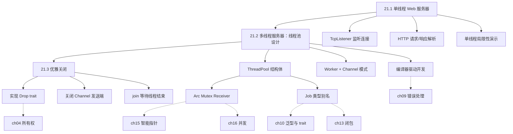
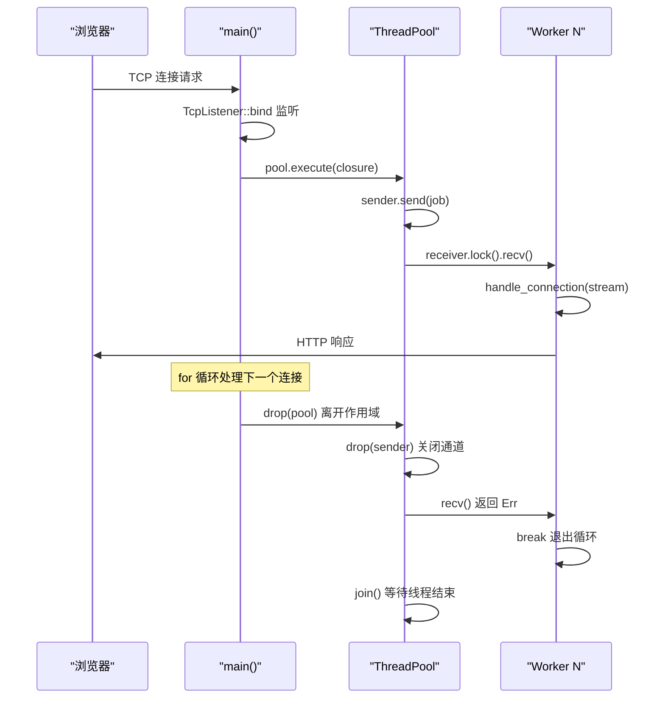
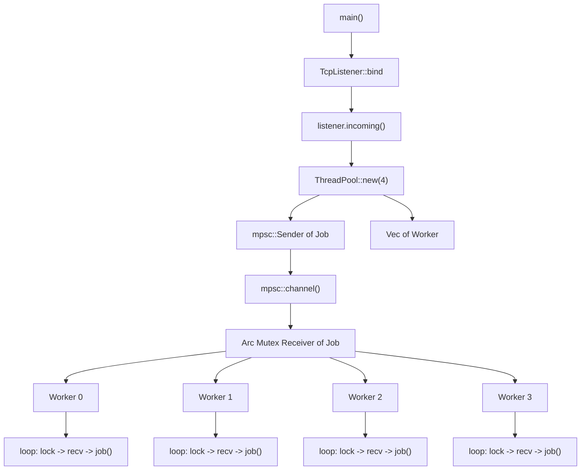
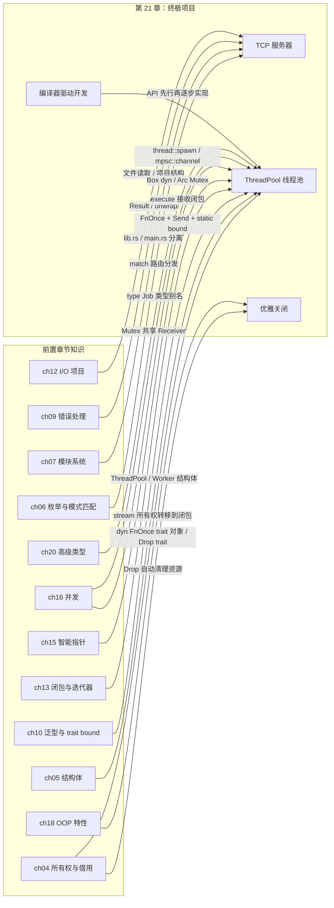

# 第 21 章 — 终极项目：构建多线程 Web 服务器

> **对应原文档**：The Rust Programming Language, Chapter 21  
> **预计学习时间**：3–5 天（这是全书的压轴项目，需要综合运用所有权、trait、闭包、并发、智能指针等知识，建议跟着敲一遍再自己默写一遍）  
> **本章目标**：从零构建一个能处理 HTTP 请求的多线程 Web 服务器，掌握线程池设计模式、通道通信机制、优雅关闭策略；理解编译器驱动开发（compiler-driven development）的实战流程  
> **前置知识**：ch04-ch20（建议完成全部前置章节）  
> **已有技能读者建议**：你可以把目标想成"用 Rust 写一个最小版 Node `http.createServer` + 线程池版的并行处理"，但实现路径完全不同：Rust 直接操作 TCP 流与线程池，并用类型系统把并发安全写死。全局口径见 [`doc/rust/js-ts-styleguide.md`](js-ts-styleguide.md)。

---

## 目录

- [章节概述](#章节概述)
- [本章知识地图](#本章知识地图)
- [已有技能快速对照（JS/TS → Rust）](#已有技能快速对照jsts--rust)
- [迁移陷阱（JS → Rust）](#迁移陷阱js--rust)
- [整体架构图](#整体架构图)
- [21.1 单线程 Web 服务器](#211-单线程-web-服务器)
  - [TCP 与 HTTP 基础](#tcp-与-http-基础)
  - [第一步：监听 TCP 连接](#第一步监听-tcp-连接)
  - [第二步：读取 HTTP 请求](#第二步读取-http-请求)
  - [第三步：发送 HTTP 响应](#第三步发送-http-响应)
  - [第四步：返回真实 HTML](#第四步返回真实-html)
  - [单线程的局限性](#单线程的局限性)
- [21.2 多线程服务器：线程池设计之路](#212-多线程服务器线程池设计之路)
  - [为什么不能"每请求一线程"？](#为什么不能每请求一线程)
  - [线程池：固定数量的工人](#线程池固定数量的工人)
  - [API 先行：编译器驱动开发](#api-先行编译器驱动开发)
  - [演进步骤（跟着编译器走）](#演进步骤跟着编译器走)
  - [个人理解：编译器驱动开发的魅力](#个人理解编译器驱动开发的魅力)
- [21.3 优雅关闭（Graceful Shutdown）](#213-优雅关闭graceful-shutdown)
  - [问题：Ctrl+C 太暴力](#问题ctrlc-太暴力)
  - [实现 Drop trait](#实现-drop-trait)
  - [第二个障碍：Worker 不会停下来](#第二个障碍worker-不会停下来)
  - [关闭的完整时序](#关闭的完整时序)
  - [个人理解：Drop trait 在资源管理中的核心作用](#个人理解drop-trait-在资源管理中的核心作用)
- [关键代码：最终版本](#关键代码最终版本)
- [项目文件结构](#项目文件结构)
- [反面示例（常见错误与编译器报错）](#反面示例常见错误与编译器报错)
- [知识交汇点总览](#知识交汇点总览)
- [概念关系总览](#概念关系总览)
- [实操练习](#实操练习)
- [本章小结](#本章小结)
- [学习明细与练习任务](#学习明细与练习任务)
- [常见问题 FAQ](#常见问题-faq)

---

## 章节概述

| 小节 | 内容 | 重要性 |
|------|------|--------|
| 整体架构 | TCP 监听 → 线程池 → 响应 | ★★★★★ |
| 21.1 单线程服务器 | TcpListener、HTTP 解析 | ★★★★☆ |
| 21.2 多线程 | 线程池设计、Worker 模式 | ★★★★★ |
| 21.3 优雅关闭 | Drop 实现、终止信号 | ★★★★★ |

---

## 本章知识地图



> **阅读方式**：箭头表示"先学 → 后学"的依赖关系。虚线箭头指向本章综合运用的前置章节知识。

---

## 已有技能快速对照（JS/TS → Rust）

| Node/JS 服务端直觉 | 本章的 Rust 做法 | 关键差异 |
|---|---|---|
| `http.createServer((req,res)=>...)` | `TcpListener` + 解析请求行 | 更底层：你需要自己处理协议细节 |
| 并发多靠事件循环 | 多线程线程池（workers） | 真并行；共享资源必须显式同步 |
| `cluster`/worker threads | `ThreadPool` + channel | 模型相近，但 Rust 更强调所有权与生命周期 |
| 进程退出由运行时收尾 | `Drop` 做优雅关闭 | 资源释放是语言机制的一部分 |

---

## 迁移陷阱（JS → Rust）

- **把"高层框架体验"带到这里**：这章故意用标准库走到 TCP 层，目的是理解线程池与资源管理，不是写一个生产级框架。  
- **忽略阻塞与线程占用**：单线程版本会被 `sleep` 卡住；多线程版本要控制线程数量（线程池）。  
- **把关闭逻辑留到最后**：优雅关闭是资源管理练习的核心之一；`Drop` 与 channel 关闭语义要一起理解。  

---

## 整体架构图





> `Job = Box<dyn FnOnce() + Send + 'static>`  
> 优雅关闭：`drop(sender)` → `recv()` 返回 `Err` → Worker `break` → `join()`

---

## 21.1 单线程 Web 服务器

### TCP 与 HTTP 基础

| 协议 | 层级 | 职责 | Rust 模块 |
|------|------|------|-----------|
| **TCP** | 传输层 | 保证字节流可靠送达 | `std::net::TcpListener` / `TcpStream` |
| **HTTP** | 应用层 | 定义请求/响应的文本格式 | 需要自己解析（或用 crate） |

> TCP 是"快递公司"，HTTP 是"包裹里的信件格式"。`TcpListener` 在端口上等包裹，`TcpStream` 是一次连接的双向管道。

### 第一步：监听 TCP 连接

```rust
use std::net::TcpListener;

fn main() {
    let listener = TcpListener::bind("127.0.0.1:7878").unwrap();

    for stream in listener.incoming() {
        let stream = stream.unwrap();
        println!("Connection established!");
    }
}
```

**关键点**：`bind` 来自网络术语"绑定端口"，返回 `Result<TcpListener, E>`。端口 `7878` 在手机键盘上对应 `rust`。`incoming()` 返回迭代器，每个元素是 `Result<TcpStream, Error>`——迭代的是**连接尝试**而非成功连接。

### 第二步：读取 HTTP 请求

```rust
use std::{
    io::{BufReader, prelude::*},
    net::{TcpListener, TcpStream},
};

fn main() {
    let listener = TcpListener::bind("127.0.0.1:7878").unwrap();

    for stream in listener.incoming() {
        let stream = stream.unwrap();
        handle_connection(stream);
    }
}

fn handle_connection(mut stream: TcpStream) {
    let buf_reader = BufReader::new(&stream);
    let http_request: Vec<_> = buf_reader
        .lines()
        .map(|result| result.unwrap())
        .take_while(|line| !line.is_empty())
        .collect();

    println!("Request: {http_request:#?}");
}
```

**设计决策**：`BufReader` 加一层缓冲减少系统调用并提供 `lines()` 方法；`take_while(!empty)` 是因为 HTTP 用空行分隔 header 和 body；`stream` 要 `mut` 因为读取会改变内部游标。

**HTTP 请求格式**：

```
GET / HTTP/1.1\r\n          ← 请求行：方法 URI 版本
Host: 127.0.0.1:7878\r\n   ← 头部
User-Agent: ...\r\n         ← 头部
\r\n                        ← 空行 = header 结束
（可选的 body）
```

### 第三步：发送 HTTP 响应

把 `println!` 替换为写入流：`stream.write_all(b"HTTP/1.1 200 OK\r\n\r\n")`。浏览器会显示空白页而非报错——说明 HTTP 握手成功了。响应格式是 `状态行\r\n头部\r\n\r\nBody`，`Content-Length` 告诉浏览器 Body 有多长。

### 第四步：返回真实 HTML

在项目根目录放一个 `hello.html` 和一个 `404.html`，然后修改 `handle_connection`：

```rust
use std::fs;

fn handle_connection(mut stream: TcpStream) {
    let buf_reader = BufReader::new(&stream);
    let request_line = buf_reader.lines().next().unwrap().unwrap();

    let (status_line, filename) = if request_line == "GET / HTTP/1.1" {
        ("HTTP/1.1 200 OK", "hello.html")
    } else {
        ("HTTP/1.1 404 NOT FOUND", "404.html")
    };

    let contents = fs::read_to_string(filename).unwrap();
    let length = contents.len();

    let response =
        format!("{status_line}\r\nContent-Length: {length}\r\n\r\n{contents}");

    stream.write_all(response.as_bytes()).unwrap();
}
```

**重构技巧**：把 `if/else` 收窄为返回元组 `(status_line, filename)`，共享后续的"读文件 → 拼响应 → 写流"逻辑——只在一个地方更新。

### 单线程的局限性

用 `match` 加一个 `/sleep` 路径来模拟慢请求：

```rust
use std::{thread, time::Duration};

let (status_line, filename) = match &request_line[..] {
    "GET / HTTP/1.1" => ("HTTP/1.1 200 OK", "hello.html"),
    "GET /sleep HTTP/1.1" => {
        thread::sleep(Duration::from_secs(5));
        ("HTTP/1.1 200 OK", "hello.html")
    }
    _ => ("HTTP/1.1 404 NOT FOUND", "404.html"),
};
```

> **关键实验**：先访问 `/sleep`，再快速访问 `/`，你会发现 `/` 必须等 5 秒——因为单线程是串行处理的，一个慢请求会阻塞后面所有请求。

---

## 21.2 多线程服务器：线程池设计之路

### 为什么不能"每请求一线程"？

`thread::spawn(|| { handle_connection(stream) })` 看似简单，但 10 万请求 = 10 万线程——内存耗尽、上下文切换开销爆炸（DoS 攻击的原理之一）。

### 线程池：固定数量的工人

| 方案 | 优点 | 缺点 |
|------|------|------|
| 每请求一线程 | 实现简单 | 无上限，易被攻击 |
| **线程池** | 线程数可控 | 需要任务队列 |
| async I/O | 更轻量 | 需要 runtime |

### API 先行：编译器驱动开发

Rust 社区有一种实践叫**编译器驱动开发**（compiler-driven development）——先写出你想要的调用方式，然后让编译器的错误信息指导你一步步实现。

**目标 API**：

```rust
fn main() {
    let listener = TcpListener::bind("127.0.0.1:7878").unwrap();
    let pool = ThreadPool::new(4);

    for stream in listener.incoming() {
        let stream = stream.unwrap();

        pool.execute(|| {
            handle_connection(stream);
        });
    }
}
```

### 演进步骤（跟着编译器走）

**第 1 步：空结构体**

```rust
// src/lib.rs
pub struct ThreadPool;
```

编译器报错：`no function named new found` → 加 `new` 和 `execute`。

**第 2 步：`new` + `execute` 签名**

`execute` 的签名直接参考 `thread::spawn`——`FnOnce` 因为闭包只执行一次，`Send` 因为跨线程传递，`'static` 因为不知道线程运行多久。编译通过，但什么都不做。

**第 3 步：Worker 结构体**

`thread::spawn` 创建线程时需要立刻给代码，但我们想让线程**先创建好再等任务**。引入 `Worker` 作为中间层——它持有一个 `JoinHandle` 和一个 `id`，对外不暴露（私有结构体）。

**第 4 步：引入 Channel 做任务队列**

> **深入理解**（选读）：为什么需要 `Arc<Mutex<Receiver>>`？

`mpsc` 的 `Receiver` 是单消费者，不能 `clone`。但我们需要多个 Worker 共享同一个接收端。`Mutex` 保证同一时刻只有一个 Worker 取任务；`Arc` 让多个 Worker 共享所有权。这是第 15 章（智能指针）和第 16 章（并发）知识的直接应用。

```rust
use std::{
    sync::{Arc, Mutex, mpsc},
    thread,
};

type Job = Box<dyn FnOnce() + Send + 'static>;

pub struct ThreadPool {
    workers: Vec<Worker>,
    sender: mpsc::Sender<Job>,
}

impl ThreadPool {
    pub fn new(size: usize) -> ThreadPool {
        assert!(size > 0);

        let (sender, receiver) = mpsc::channel();
        let receiver = Arc::new(Mutex::new(receiver));

        let mut workers = Vec::with_capacity(size);

        for id in 0..size {
            workers.push(Worker::new(id, Arc::clone(&receiver)));
        }

        ThreadPool { workers, sender }
    }

    pub fn execute<F>(&self, f: F)
    where
        F: FnOnce() + Send + 'static,
    {
        let job = Box::new(f);
        self.sender.send(job).unwrap();
    }
}
```

**`Job` 类型别名**：`type Job = Box<dyn FnOnce() + Send + 'static>` 是本项目的核心类型——`Box` 堆分配不定大小的闭包，`dyn FnOnce()` 是 trait 对象（第 18 章），`Send` 保证线程安全（第 16 章），`'static` 保证闭包不依赖短命引用（第 10 章）。

**第 5 步：Worker 的事件循环**

```rust
impl Worker {
    fn new(id: usize, receiver: Arc<Mutex<mpsc::Receiver<Job>>>) -> Worker {
        let thread = thread::spawn(move || {
            loop {
                let job = receiver.lock().unwrap().recv().unwrap();
                println!("Worker {id} got a job; executing.");
                job();
            }
        });

        Worker { id, thread }
    }
}
```

> **深入理解**（选读）：`let job = ...recv()` vs `while let` 的锁持有陷阱

**为什么用 `let job = receiver.lock()...recv()` 而不是 `while let`？**

这是本章一个非常精妙的陷阱。对比两种写法：

```rust
// ✅ 正确：lock() 的 MutexGuard 在 let 语句结束时立即 drop
loop {
    let job = receiver.lock().unwrap().recv().unwrap();
    job();  // 执行期间 Mutex 已经释放
}

// ❌ 错误：MutexGuard 的生命周期延长到整个 while let 块
while let Ok(job) = receiver.lock().unwrap().recv() {
    job();  // 执行期间 Mutex 仍被持有！其他 Worker 拿不到锁
}
```

> **核心原因**：`let` 语句中的临时值在该行结束时 drop，而 `while let` / `if let` / `match` 会把临时值的生命周期延长到整个关联块。这意味着 `while let` 版本在执行 `job()` 时仍持有 Mutex 锁，其他 Worker 无法获取新任务——线程池实质上退化为单线程！

### 个人理解：编译器驱动开发的魅力

这一节的开发过程让我印象深刻——不是先设计好所有细节再动手写，而是**先写出你想要的调用方式，然后让编译器告诉你要实现什么**。

具体流程是这样的：

1. **先写 `main.rs` 中的调用代码**：`let pool = ThreadPool::new(4); pool.execute(|| { ... })`——这是你的"需求文档"
2. **编译 → 报错**：`cannot find type ThreadPool` → 那就创建一个空结构体
3. **再编译 → 再报错**：`no method named new` → 加上 `new` 方法
4. **继续编译 → 继续报错**：`no method named execute` → 加上 `execute` 方法，参考 `thread::spawn` 的签名
5. **反复迭代**：每次编译器报错都是在告诉你"下一步该做什么"

这种方式的好处：

- **编译器就是你的结对编程伙伴**：它不会忘记任何细节，每个报错都是一个具体的、可操作的指引
- **永远不会迷失方向**：你不需要提前规划好所有代码结构，编译器会引导你一步步走向完成
- **天然产出最小实现**：你只写编译器要求你写的东西，不会过度设计
- **信心来自绿色的编译通过**：每一轮 fix-compile 循环都给你一个小小的正反馈

> 这种开发方式在 Rust 中特别有效，因为 Rust 的类型系统足够强大，编译器的错误信息足够具体。如果你写 Python 或 JavaScript，编译器（或解释器）能告诉你的信息有限；但 Rust 编译器几乎能指导你完成整个设计。

---

## 21.3 优雅关闭（Graceful Shutdown）

### 问题：Ctrl+C 太暴力

如果直接按 Ctrl+C，所有线程立刻被杀死——正在处理的请求会被截断。我们需要：

1. 通知所有 Worker "没有新任务了"
2. 等每个 Worker 完成当前工作后再退出

### 实现 `Drop` trait

**第一个障碍：`join()` 需要所有权**

`JoinHandle::join()` 的签名是 `fn join(self) -> Result<T>`——它消耗 `self`。但 `Drop::drop(&mut self)` 只给了可变引用，不能直接 move 出来。

解决方案是用 `Vec::drain(..)`，它会把所有元素从 Vec 中移出并返回迭代器：

```rust
impl Drop for ThreadPool {
    fn drop(&mut self) {
        for worker in self.workers.drain(..) {
            println!("Shutting down worker {}", worker.id);
            worker.thread.join().unwrap();
        }
    }
}
```

> **深入理解**（选读）：`drain(..)` vs `Option<JoinHandle>` 的 `take()`
>
> 另一种方法是把 `thread` 字段改成 `Option<JoinHandle<()>>`，然后用 `.take()` 取出。但这意味着代码中到处都要处理 `Option`，只为了 drop 时用一次，不够优雅。`drain(..)` 更符合 Rust 惯用法。

### 第二个障碍：Worker 不会停下来

Worker 里是 `loop { recv()... }`——一个无限循环。`join()` 会永远等下去。

**解决思路**：关闭 channel 的发送端 → `recv()` 返回 `Err` → Worker 收到信号后 `break`。

**最终实现**：

```rust
pub struct ThreadPool {
    workers: Vec<Worker>,
    sender: Option<mpsc::Sender<Job>>,  // 用 Option 包裹
}

impl ThreadPool {
    pub fn new(size: usize) -> ThreadPool {
        assert!(size > 0);

        let (sender, receiver) = mpsc::channel();
        let receiver = Arc::new(Mutex::new(receiver));
        let mut workers = Vec::with_capacity(size);

        for id in 0..size {
            workers.push(Worker::new(id, Arc::clone(&receiver)));
        }

        ThreadPool {
            workers,
            sender: Some(sender),
        }
    }

    pub fn execute<F>(&self, f: F)
    where
        F: FnOnce() + Send + 'static,
    {
        let job = Box::new(f);
        self.sender.as_ref().unwrap().send(job).unwrap();
    }
}

impl Drop for ThreadPool {
    fn drop(&mut self) {
        // 第一步：关闭发送端，触发所有 recv() 返回 Err
        drop(self.sender.take());

        // 第二步：等待所有 Worker 完成
        for worker in self.workers.drain(..) {
            println!("Shutting down worker {}", worker.id);
            worker.thread.join().unwrap();
        }
    }
}
```

Worker 端配合修改：

```rust
impl Worker {
    fn new(id: usize, receiver: Arc<Mutex<mpsc::Receiver<Job>>>) -> Worker {
        let thread = thread::spawn(move || {
            loop {
                let message = receiver.lock().unwrap().recv();

                match message {
                    Ok(job) => {
                        println!("Worker {id} got a job; executing.");
                        job();
                    }
                    Err(_) => {
                        println!("Worker {id} disconnected; shutting down.");
                        break;
                    }
                }
            }
        });

        Worker { id, thread }
    }
}
```

### 关闭的完整时序

```
1. main() 中 for stream in listener.incoming().take(2) 处理 2 个请求后退出
2. pool 离开作用域 → Drop::drop() 被调用
3. drop(self.sender.take()) → sender 被销毁 → channel 关闭
4. 所有 Worker 的 recv() 返回 Err → match 走 Err 分支 → break 退出循环
5. 逐个 worker.thread.join() → 等待线程真正结束
6. 程序干净退出
```

运行输出示例：

```
Worker 0 got a job; executing.
Worker 3 got a job; executing.
Shutting down.
Shutting down worker 0
Worker 1 disconnected; shutting down.
Worker 2 disconnected; shutting down.
Worker 3 disconnected; shutting down.
Worker 0 disconnected; shutting down.
Shutting down worker 1
Shutting down worker 2
Shutting down worker 3
```

> Worker 的关闭顺序不确定——这是并发的本质。`join()` 的顺序是确定的（按 `drain` 的迭代顺序），但 Worker 内部何时收到 `Err` 是由线程调度决定的。

### 个人理解：Drop trait 在资源管理中的核心作用

这一节的优雅关闭设计，是 Rust 中 **RAII（Resource Acquisition Is Initialization）** 模式的极致体现。RAII 的核心思想是：**资源的生命周期绑定到对象的生命周期，对象被销毁时资源自动释放**。

在本项目中，`Drop` trait 做了三件事：

1. **关闭通道**：`drop(self.sender.take())` 销毁发送端，通道自动关闭
2. **通知工人**：通道关闭后，所有 `recv()` 返回 `Err`，Worker 自动退出循环
3. **等待完成**：`join()` 确保每个线程处理完当前任务后才真正结束

对比其他语言的做法：

| 语言 | 资源清理方式 | 问题 |
|------|------------|------|
| C | 手动调用 `close()`/`free()` | 容易忘记，导致资源泄漏 |
| Java/Go | GC + `finally`/`defer` | 不确定的析构时机，`finally` 可能被跳过 |
| **Rust** | **`Drop` trait** | **编译器保证：变量离开作用域时自动调用，不会遗漏** |

> 关键洞察：Rust 的 `Drop` 不仅仅是"析构函数"——它是一种**设计模式的语言级支持**。你可以把任何"收尾工作"放进 `Drop` 里：关闭文件、断开数据库连接、发送关闭信号、写入日志……而且编译器保证它一定会被执行（除非 `std::mem::forget`），执行时机是确定的（离开作用域时），不需要 GC 也不需要手动调用。

这也解释了为什么 Rust 没有垃圾回收器却能安全地管理资源——`Drop` + 所有权系统 = 编译期确定的、自动的、零遗漏的资源管理。

---

## 关键代码：最终版本

### `src/main.rs`

```rust
use hello::ThreadPool;
use std::{
    fs,
    io::{BufReader, prelude::*},
    net::{TcpListener, TcpStream},
    thread,
    time::Duration,
};

fn main() {
    let listener = TcpListener::bind("127.0.0.1:7878").unwrap();
    let pool = ThreadPool::new(4);

    for stream in listener.incoming().take(2) {
        let stream = stream.unwrap();

        pool.execute(|| {
            handle_connection(stream);
        });
    }

    println!("Shutting down.");
}

fn handle_connection(mut stream: TcpStream) {
    let buf_reader = BufReader::new(&stream);
    let request_line = buf_reader.lines().next().unwrap().unwrap();

    let (status_line, filename) = match &request_line[..] {
        "GET / HTTP/1.1" => ("HTTP/1.1 200 OK", "hello.html"),
        "GET /sleep HTTP/1.1" => {
            thread::sleep(Duration::from_secs(5));
            ("HTTP/1.1 200 OK", "hello.html")
        }
        _ => ("HTTP/1.1 404 NOT FOUND", "404.html"),
    };

    let contents = fs::read_to_string(filename).unwrap();
    let length = contents.len();

    let response =
        format!("{status_line}\r\nContent-Length: {length}\r\n\r\n{contents}");

    stream.write_all(response.as_bytes()).unwrap();
}
```

### `src/lib.rs`

```rust
use std::{
    sync::{Arc, Mutex, mpsc},
    thread,
};

pub struct ThreadPool {
    workers: Vec<Worker>,
    sender: Option<mpsc::Sender<Job>>,
}

type Job = Box<dyn FnOnce() + Send + 'static>;

impl ThreadPool {
    pub fn new(size: usize) -> ThreadPool {
        assert!(size > 0);

        let (sender, receiver) = mpsc::channel();
        let receiver = Arc::new(Mutex::new(receiver));
        let mut workers = Vec::with_capacity(size);

        for id in 0..size {
            workers.push(Worker::new(id, Arc::clone(&receiver)));
        }

        ThreadPool {
            workers,
            sender: Some(sender),
        }
    }

    pub fn execute<F>(&self, f: F)
    where
        F: FnOnce() + Send + 'static,
    {
        let job = Box::new(f);
        self.sender.as_ref().unwrap().send(job).unwrap();
    }
}

impl Drop for ThreadPool {
    fn drop(&mut self) {
        drop(self.sender.take());

        for worker in self.workers.drain(..) {
            println!("Shutting down worker {}", worker.id);
            worker.thread.join().unwrap();
        }
    }
}

struct Worker {
    id: usize,
    thread: thread::JoinHandle<()>,
}

impl Worker {
    fn new(id: usize, receiver: Arc<Mutex<mpsc::Receiver<Job>>>) -> Worker {
        let thread = thread::spawn(move || {
            loop {
                let message = receiver.lock().unwrap().recv();

                match message {
                    Ok(job) => {
                        println!("Worker {id} got a job; executing.");
                        job();
                    }
                    Err(_) => {
                        println!("Worker {id} disconnected; shutting down.");
                        break;
                    }
                }
            }
        });

        Worker { id, thread }
    }
}
```

---

## 项目文件结构

```
hello/
├── Cargo.toml
├── hello.html          ← 成功页面
├── 404.html            ← 错误页面
└── src/
    ├── main.rs         ← 服务器入口：监听、路由、handle_connection
    └── lib.rs          ← 线程池实现：ThreadPool + Worker
```

分成 bin + lib 是因为线程池可以在其他项目中复用，也可以单独写测试。

---

## 反面示例（常见错误与编译器报错）

以下是构建本项目过程中最容易犯的错误，提前认识它们可以节省大量调试时间。

### 错误 1：`while let` 导致线程池退化为单线程

```rust
// ❌ MutexGuard 生命周期延长到整个 while let 块
while let Ok(job) = receiver.lock().unwrap().recv() {
    job(); // Mutex 锁未释放，其他 Worker 阻塞！
}
```

**编译器不报错，但运行时退化为单线程**——这是逻辑错误而非编译错误。正确写法用 `loop` + `let`：

```rust
// ✅ MutexGuard 在 let 语句结束时立即 drop
loop {
    let job = receiver.lock().unwrap().recv().unwrap();
    job(); // 执行时锁已释放
}
```

### 错误 2：忘记 `Send + 'static` trait bound

```rust
// ❌ 编译错误
pub fn execute<F>(&self, f: F)
where
    F: FnOnce(),  // 缺少 Send + 'static
{
    let job = Box::new(f);
    self.sender.send(job).unwrap();
}
```

编译器报错：

```
error[E0277]: `F` cannot be sent between threads safely
  --> src/lib.rs:27:30
   |
27 |         self.sender.send(job).unwrap();
   |                          ^^^ `F` cannot be sent between threads safely
   |
help: consider further restricting this bound
   |
24 |     F: FnOnce() + Send + 'static,
   |                 +++++++++++++++++
```

**修复**：闭包要跨线程传递，必须加 `Send`；线程运行时间不确定，必须加 `'static`。

### 错误 3：在 `Drop` 中直接 `join` 而未关闭通道

```rust
// ❌ 死锁：Worker 永远在 recv() 等待，join() 永远等 Worker
impl Drop for ThreadPool {
    fn drop(&mut self) {
        for worker in self.workers.drain(..) {
            worker.thread.join().unwrap(); // 永远不会返回！
        }
    }
}
```

**修复**：必须先 `drop(self.sender.take())` 关闭通道，让 Worker 的 `recv()` 返回 `Err` 并 `break`，然后 `join()` 才能成功。

### 错误 4：`Receiver` 没有用 `Arc<Mutex>` 包裹

```rust
// ❌ 编译错误：mpsc::Receiver 没有实现 Clone
for id in 0..size {
    workers.push(Worker::new(id, receiver.clone())); // 不能 clone！
}
```

编译器报错：

```
error[E0599]: no method named `clone` found for struct `Receiver<Job>` in the current scope
```

**修复**：用 `Arc::new(Mutex::new(receiver))` 包裹，多个 Worker 通过 `Arc::clone` 共享。

---

## 知识交汇点总览

这个项目是对全书知识的综合检验，几乎每个章节的概念都有用到：

| Rust 概念 | 在本项目中的体现 | 对应章节 |
|-----------|-----------------|---------|
| 所有权 & 借用 | `stream` 从 main 移动到闭包 | 第 4 章 |
| 结构体 & 方法 | `ThreadPool`、`Worker` 的定义和 `impl` 块 | 第 5 章 |
| 枚举 & 模式匹配 | `match &request_line[..]` 路由分发 | 第 6 章 |
| 模块系统 | `use hello::ThreadPool`，lib.rs / main.rs 分离 | 第 7 章 |
| 错误处理 | `unwrap()` 以及 `recv()` 返回 `Result` | 第 9 章 |
| 泛型 & trait bound | `execute<F>` 的 `F: FnOnce() + Send + 'static` | 第 10 章 |
| I/O 项目经验 | 文件读取、命令行项目结构 | 第 12 章 |
| 闭包 | `pool.execute(\|\| { handle_connection(stream) })` | 第 13 章 |
| Cargo & crate | bin + lib 双 crate 结构 | 第 14 章 |
| 智能指针 | `Box<dyn FnOnce()>`、`Arc<Mutex<T>>` | 第 15 章 |
| 并发 | `thread::spawn`、`mpsc::channel`、`Mutex`、`Arc` | 第 16 章 |
| OOP 特性 | trait 对象 `dyn FnOnce()`、`Drop` trait 实现 | 第 18 章 |
| 高级类型 | `type Job = Box<dyn FnOnce() + Send + 'static>` 类型别名 | 第 20 章 |

---

## 概念关系总览



> 实线箭头 = 前置章节知识在本项目中的具体应用。本章是全书知识的"期末考试"——几乎每个前置章节的核心概念都有体现。

---

## 实操练习

### VS Code + rust-analyzer 实操步骤

从零搭建本章的 Web 服务器项目。请按顺序逐步执行。

### 第 1 步：创建项目

```bash
cargo new hello && cd hello
```

### 第 2 步：创建 HTML 文件

在项目根目录创建 `hello.html`：

```html
<!DOCTYPE html>
<html lang="en">
  <head><title>Hello!</title></head>
  <body><h1>Hello!</h1><p>Hi from Rust</p></body>
</html>
```

创建 `404.html`：

```html
<!DOCTYPE html>
<html lang="en">
  <head><title>404</title></head>
  <body><h1>Oops!</h1><p>Sorry, I don't know what you're asking for.</p></body>
</html>
```

### 第 3 步：编写单线程版本

在 `src/main.rs` 中编写单线程 Web 服务器（参考 21.1 节代码），运行 `cargo run`，打开浏览器访问 `http://127.0.0.1:7878`，确认看到 Hello 页面。

### 第 4 步：测试单线程阻塞

添加 `/sleep` 路由（5 秒延迟），先访问 `/sleep` 再快速访问 `/`，**亲身感受**单线程阻塞。

### 第 5 步：创建线程池

新建 `src/lib.rs`，按编译器驱动开发的方式逐步实现 `ThreadPool`：

1. 先在 `main.rs` 写 `use hello::ThreadPool; let pool = ThreadPool::new(4);`
2. 运行 `cargo check`，按编译器报错逐步实现
3. 每修复一个报错就再次 `cargo check`，直到全部通过

### 第 6 步：实现优雅关闭

1. 在 `main.rs` 中把 `listener.incoming()` 改为 `.take(2)`
2. 在 `lib.rs` 中为 `ThreadPool` 实现 `Drop` trait
3. 运行 `cargo run`，访问两次后观察关闭输出

### 第 7 步：不看笔记默写

关掉所有参考代码，从 `cargo new hello` 开始，尝试从零默写整个项目。遇到卡壳记下来，这就是你需要重点复习的知识点。

> **关键观察点**：整个开发过程中，注意编译器错误信息的引导——它会告诉你"下一步该做什么"。这就是编译器驱动开发的精髓。

---

## 本章小结

### 原书要点回顾

> 本章你学会了如何：
>
> - 用 `TcpListener` 监听 TCP 连接并解析 HTTP 请求/响应
> - 构建线程池实现真正的并行请求处理
> - 用 `Drop` trait 实现优雅关闭，确保资源安全释放
> - 体验编译器驱动开发的完整流程

### 核心收获

| 知识点 | 一句话总结 |
|--------|-----------|
| `TcpListener` | 绑定端口、监听连接，`incoming()` 返回连接流迭代器 |
| HTTP 解析 | 请求行 + 头部 + 空行 + Body，手动解析文本协议 |
| `ThreadPool` | 固定线程数 + channel 任务队列，避免每请求一线程 |
| `Worker` | 持有 `JoinHandle`，循环 `recv()` 获取并执行 Job |
| `Arc<Mutex<Receiver>>` | 多 Worker 共享单消费者通道的标准模式 |
| `Job` 类型 | `Box<dyn FnOnce() + Send + 'static>` 的 trait 对象 |
| `Drop` trait | 关闭 sender → recv 返回 Err → Worker break → join |
| 编译器驱动开发 | 先写 API 调用，让编译器指导实现 |

### 个人总结

第 21 章是全书的压轴项目，虽然代码量不算大（完整版不到 200 行），但它几乎综合运用了前 20 章学到的每一个核心概念。学完这章后我的体会：

1. **这个项目是 Rust 知识的"期末考试"**：所有权、trait、闭包、泛型、智能指针、并发、模块系统——全部融合在一个真实的项目中。如果你能独立默写出这个项目，说明你已经真正掌握了 Rust 的核心知识。

2. **编译器驱动开发改变了我对写代码的认知**：以前写代码总想"先想清楚再动手"，但在 Rust 中你可以先写出理想的 API，然后让编译器一步步引导你实现。编译器不是阻碍你的敌人，而是帮助你的伙伴。

3. **优雅关闭体现了 Rust 的设计哲学**：`Drop` + 所有权 + channel 的组合，让资源清理变得自动、确定、安全。不需要设置标志位，不需要发送特殊信号，只需要"销毁发送端"——剩下的事情系统自动完成。这就是 Rust "零成本抽象"和"安全即默认"的最佳诠释。

4. **从玩具项目到真实框架只差一步**：理解了 TCP 监听 → 线程分发 → 请求处理 → 响应返回的核心流程后，再去看 Axum 或 Actix-web 的源码，你会发现它们做的事情本质上一样，只是多了路由匹配、中间件、async runtime 等"增值服务"。

---

## 学习明细与练习任务

### 知识点掌握清单

#### TCP 与 HTTP 基础

- [ ] 能默写出单线程 web 服务器（`TcpListener` → `BufReader` → 解析请求行 → 返回文件）
- [ ] 理解 HTTP 请求/响应的文本格式（请求行、状态行、Content-Length、空行分隔）

#### 线程池设计

- [ ] 能解释为什么"每请求一线程"在生产环境中不可行
- [ ] 能描述 `ThreadPool` 的三个组件：`Vec<Worker>`、`Sender<Job>`、`Arc<Mutex<Receiver<Job>>>`
- [ ] 能解释 `type Job = Box<dyn FnOnce() + Send + 'static>` 中每个部分的作用
- [ ] 理解 `let job = receiver.lock().unwrap().recv()` 与 `while let Ok(job) = receiver.lock().unwrap().recv()` 的关键区别（MutexGuard 生命周期）

#### 优雅关闭

- [ ] 能画出优雅关闭的时序图：drop sender → recv 返回 Err → break → join
- [ ] 理解为什么 `sender` 要用 `Option` 包裹（在 `drop` 中需要 `take()` 来转移所有权）

#### 编译器驱动开发

- [ ] 能解释编译器驱动开发的流程：写调用代码 → 编译 → 按错误提示实现 → 重复

---

### 练习任务（由易到难）

#### 任务 1：从零默写整个项目 ⭐⭐⭐ 进阶｜约 60 分钟｜必做

不看任何参考，从 `cargo new hello` 开始，默写出完整的多线程 Web 服务器（含 `main.rs`、`lib.rs`、HTML 文件）。

**验收标准**：
1. 访问 `/` 返回 hello 页面
2. 访问 `/sleep` 不阻塞其他请求
3. `take(2)` 后程序优雅关闭，所有 Worker 打印关闭信息

<details>
<summary>卡壳提示</summary>

如果卡在某一步，回到"演进步骤（跟着编译器走）"那一节，按编译器报错逐步推进。

</details>

---

#### 任务 2：添加更健壮的错误处理 ⭐⭐⭐ 进阶｜约 45 分钟｜强烈建议

当前代码中大量使用 `unwrap()`，在生产环境中这不可接受。尝试：

1. 把 `ThreadPool::new` 改成 `ThreadPool::build`，返回 `Result<ThreadPool, PoolCreationError>`
2. 把 `handle_connection` 中的 `unwrap()` 替换为 `?` 操作符，优雅地处理文件读取失败、流写入失败等情况
3. 在 `Worker` 的 `loop` 中，如果 `lock()` 返回 `Err`（mutex 被 poison），打印错误日志而不是 panic

**提示**：可以参考第 9 章的错误处理模式和第 12 章 `Config::build` 的设计。

---

#### 任务 3：添加中间件模式 ⭐⭐⭐⭐ 挑战｜约 90 分钟｜选做

本章服务器通过简单的 `if/else` 处理路由。在 Node.js 中（如 Express/Koa），我们通常通过"中间件"模式洋葱式处理请求。

**挑战**：尝试在 `handle_connection` 中引入一个简单的中间件概念：
1. 提取出一个 `Request` 结构体和 `Response` 结构体。
2. 编写一个前置处理函数 `logger_middleware(req: &Request)`，用来在控制台打印 `[Time] Method URI`。
3. 编写一个后置处理函数 `add_header_middleware(res: &mut Response)`，用来自动附加 `Server: Rust-ThreadPool-Server` 的 HTTP Header。
4. 把这套流程串联到 `handle_connection` 的解析-处理-返回阶段。

这能帮助你理解在强类型的 Rust 下，如何安全地传递和变异请求上下文（引出后面真实框架如 Axum 的中间件设计）。

---

#### 任务 4：用 async/await 重写 ⭐⭐⭐⭐⭐ 挑战｜约 120 分钟｜选做

本章故意用了线程池而非 async。尝试用 `tokio` 重写整个服务器：

1. `cargo add tokio --features full`
2. 把 `main` 改成 `#[tokio::main] async fn main()`
3. 用 `tokio::net::TcpListener` 替换 `std::net::TcpListener`
4. 用 `tokio::spawn` 替换线程池
5. 对比两种方案在 `/sleep` 场景下的行为差异

**思考题**：async 版本还需要 `Arc<Mutex<Receiver>>` 吗？为什么？

---

### 学习时间参考

| 天数 | 学习内容 | 目标 |
|------|---------|------|
| 第 1 天 | 整体架构 + 21.1 单线程服务器 | 跟着敲完单线程版本，用浏览器测试，理解 HTTP 请求/响应格式 |
| 第 2 天 | 21.2 线程池设计 | 体验编译器驱动开发的全过程，理解 `Arc<Mutex<Receiver>>` 的设计，注意 `let` vs `while let` 的锁陷阱 |
| 第 3 天 | 21.3 优雅关闭 + 完整代码整合 | 实现 `Drop` trait，理解关闭时序，把完整项目跑通 |
| 第 4 天 | 默写 + 任务 1-2 | 不看笔记从零默写整个项目；尝试任务 2（错误处理改进） |
| 第 5 天 | 复习 + 进阶（可选） | 过一遍知识点掌握清单；有余力的话尝试任务 3 或任务 4 |

---

## 常见问题 FAQ

**Q1：为什么选 `mpsc::channel` 而不是 `crossbeam` 的多消费者通道？**

标准库的 `mpsc` 是 multiple-producer single-consumer，本身不支持多消费者。我们用 `Arc<Mutex<Receiver>>` 把它"变成"了多消费者。这是教学目的——展示如何组合基本原语。生产环境中可以用 `crossbeam::channel`，它原生支持 MPMC，性能也更好。

---

**Q2：`while let` 的锁持有问题是 Rust 特有的吗？**

是的，这与 Rust 的临时值生命周期规则有关。在 `let x = expr;` 中，`expr` 里的临时值在该行结束后 drop。但 `while let` / `if let` / `match` 中，临时值的生命周期延长到整个块。这是语言规范定义的行为，也是 Rust 开发者需要特别注意的地方。

---

**Q3：`Option<Sender>` 的 `take()` 到底做了什么？**

`Option::take()` 将 `self` 中的值取出并返回，同时把 `self` 替换为 `None`。效果等价于 `std::mem::replace(self, None)`。在 drop 中先 `take()` sender 再 `drop()` 它，确保 channel 在 join Worker 之前关闭。

---

**Q4：如果某个 Worker 在执行 job 时 panic 了会怎样？**

那个 Worker 的线程会终止，`Mutex` 进入 "poisoned" 状态。其他 Worker 调用 `lock().unwrap()` 时也会 panic，导致整个服务器崩溃。生产代码中应该用 `lock().unwrap_or_else(|e| e.into_inner())` 来恢复被 poison 的 Mutex，或者使用 `catch_unwind` 在 Worker 内部捕获 panic。

---

**Q5：这个项目和 Actix / Axum 有什么关系？**

真实框架增加了路由、中间件、结构化解析、async runtime、TLS 等，但底层 TCP 监听 → 分发 → 处理 → 响应的流程是一样的。理解本项目后再看框架源码会清晰很多。

---

> **全书完成！** 恭喜你从第 1 章的 `Hello, World!` 一路走到了构建多线程 Web 服务器。Rust 的学习曲线确实陡峭，但你已经爬过了最难的部分。接下来可以参考[附录](appendix.md)中的关键词索引和补充材料，或者用 Axum / Actix-web 写一个真实的 Web 项目来巩固所学。有了前 21 章的基础，你一定能读懂任何 Rust 项目的源码。

---

*文档基于：The Rust Programming Language（Rust 1.90.0 / 2024 Edition）*  
*生成日期：2026-02-20*
