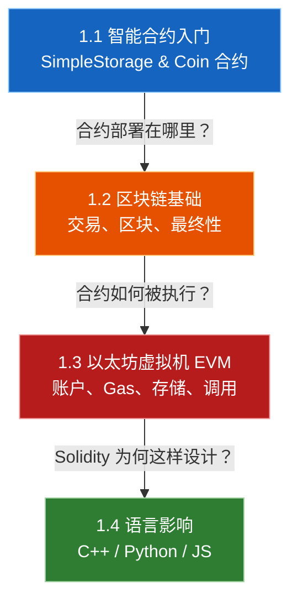
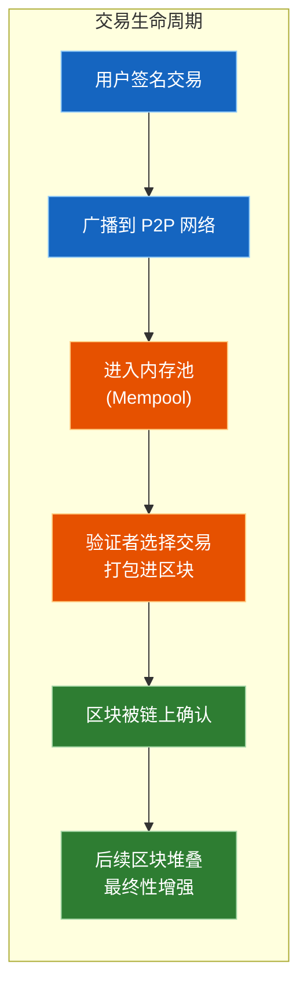
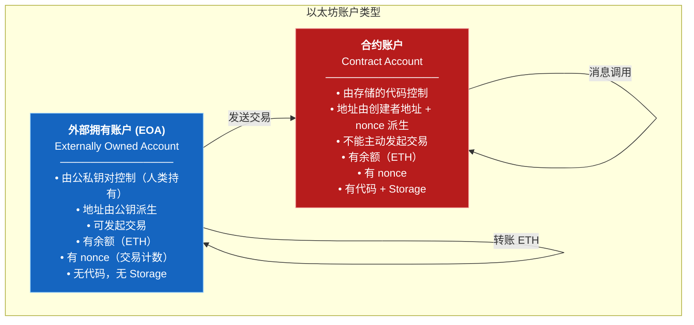
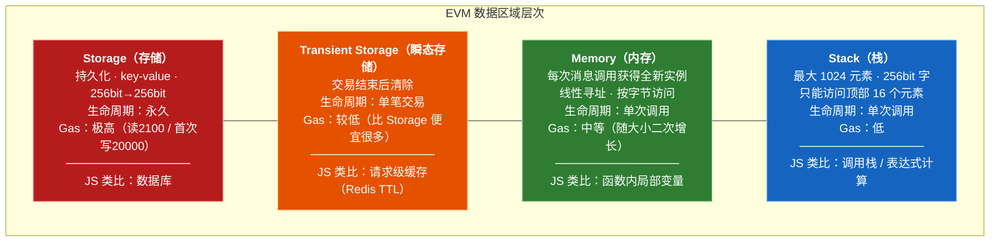

# 第 1 章 — 区块链与智能合约基础（Blockchain & Smart Contracts）

> **对应原文档**：`introduction-to-smart-contracts.rst`、`language-influences.rst`
> **预计学习时间**：2 - 3 天
> **本章目标**：理解区块链、以太坊、EVM 的核心概念，建立智能合约的心智模型，在 Remix 中部署第一个合约

> **前置知识**：无（本章是系列起点）

> **JS/TS 读者建议**：本系列专为 JavaScript/TypeScript 开发者编写。每个 Solidity 概念都会给出 JS 对比，帮助你快速建立映射关系。如果你熟悉 Express/Koa 后端开发、ES6 class 语法和 `async/await`，学习过程会更加顺畅。

---

## 目录

- [章节概述](#章节概述)
- [本章知识地图](#本章知识地图)
- [JS/TS 快速对照表](#jsts-快速对照表)
- [迁移陷阱（JS → Solidity）](#迁移陷阱js--solidity)
- [1.1 智能合约入门](#11-智能合约入门)
  - [1.1.1 第一个合约示例 — SimpleStorage](#111-第一个合约示例--simplestorage)
  - [1.1.2 代币合约示例 — Coin（子货币）](#112-代币合约示例--coin子货币)
- [1.2 区块链基础](#12-区块链基础)
  - [1.2.1 交易（Transactions）](#121-交易transactions)
  - [1.2.2 区块（Blocks）](#122-区块blocks)
- [1.3 以太坊虚拟机（EVM）](#13-以太坊虚拟机evm)
  - [1.3.1 EVM 概述](#131-evm-概述)
  - [1.3.2 账户（Accounts）](#132-账户accounts)
  - [1.3.3 交易与消息调用](#133-交易与消息调用)
  - [1.3.4 Gas 机制](#134-gas-机制)
  - [1.3.5 存储、瞬态存储、内存与栈](#135-存储瞬态存储内存与栈)
  - [1.3.6 Calldata、Returndata 和 Code](#136-calldatareturndatacode)
  - [1.3.7 指令集](#137-指令集)
  - [1.3.8 消息调用（Message Calls）](#138-消息调用message-calls)
  - [1.3.9 Delegatecall 与库](#139-delegatecall-与库)
  - [1.3.10 日志（Logs）](#1310-日志logs)
  - [1.3.11 合约创建（Create）](#1311-合约创建create)
  - [1.3.12 Self-destruct 与合约停用](#1312-self-destruct-与合约停用)
  - [1.3.13 预编译合约（Precompiled Contracts）](#1313-预编译合约precompiled-contracts)
- [1.4 Solidity 的语言影响](#14-solidity-的语言影响)
  - [1.4.1 来自 C++ 的影响](#141-来自-c-的影响)
  - [1.4.2 来自 Python 的影响](#142-来自-python-的影响)
  - [1.4.3 来自 JavaScript 的影响](#143-来自-javascript-的影响)
  - [1.4.4 Solidity 的独创特性](#144-solidity-的独创特性)
- [Remix 实操指南](#remix-实操指南)
- [本章小结](#本章小结)
- [学习明细与练习任务](#学习明细与练习任务)
- [常见问题 FAQ](#常见问题-faq)

---

## 章节概述

本章是整个 Solidity 学习系列的起点，覆盖四大主题：


| 小节                 | 内容                                     | 重要性   |
| ------------------ | -------------------------------------- | ----- |
| 1.1 智能合约入门         | 通过 SimpleStorage 和 Coin 两个完整示例入门智能合约   | ★★★★★ |
| 1.2 区块链基础          | 理解交易的原子性、区块排序与最终性                      | ★★★★☆ |
| 1.3 以太坊虚拟机（EVM）    | EVM 架构：账户、Gas、存储层次、消息调用等核心机制           | ★★★★★ |
| 1.4 Solidity 的语言影响 | Solidity 从 C++、Python、JavaScript 继承了什么 | ★★★☆☆ |


> **学习建议**：1.1 和 1.3 是本章的重中之重。1.1 让你写出第一个能跑的合约，1.3 让你理解合约在底层是如何运行的。建议按顺序阅读，因为后面的概念依赖前面的知识。

---

## 本章知识地图




---

## JS/TS 快速对照表


| 你熟悉的 JS/TS 世界                     | Solidity / 区块链世界         | 本章你需要建立的直觉                         |
| --------------------------------- | ------------------------ | ---------------------------------- |
| Express/Koa 后端服务                  | 智能合约（Smart Contract）     | 合约是运行在区块链上的"后端服务"，但一旦部署就不能改代码      |
| 数据库（MongoDB / PostgreSQL）         | Storage（链上存储）            | 写入成本极高（Gas），要精打细算每个字节              |
| API endpoint（`app.get('/users')`） | `external` / `public` 函数 | 函数就是合约的"接口"                        |
| `req.user` / JWT payload          | `msg.sender`             | 每笔交易自带调用者身份，无需额外认证系统               |
| `npm` package                     | Library / Interface      | Solidity 也有代码复用机制                  |
| `class` 的 `constructor`           | `constructor()`          | 几乎一致——部署时执行一次                      |
| `EventEmitter.emit()`             | `emit Event()`           | 链上事件，前端通过 Web3 监听                  |
| `Map` 对象                          | `mapping(key => value)`  | 类似但不可遍历，没有 `.keys()` / `.values()` |
| `throw new Error()`               | `revert` / `require`     | 失败时回滚所有状态变更                        |
| `npm run build` → `node dist/`    | 编译 → 部署（deploy）          | 合约需要先编译为字节码，再发交易部署到链上              |
| API rate limiting + 计费            | Gas 机制                   | 每条指令消耗 Gas，Gas 不足则交易失败             |
| 环境变量 / 配置文件                       | 无等价物                     | 合约代码和状态完全公开透明，没有"密钥文件"             |


---

## 迁移陷阱（JS → Solidity）

### 陷阱 1：以为变量赋值很"便宜"

在 JS 里 `let x = 42` 只是内存操作，微秒级完成。但在 Solidity 里，写入 Storage 是链上最昂贵的操作之一。

```javascript
// JS — 赋值就是赋值，没有额外成本
let userData = {};
userData.name = "Alice";
userData.age = 30;
userData.email = "alice@example.com";
```

```solidity
// Solidity — 每次写 Storage 都要消耗大量 Gas！
// 第一次写入一个 slot: ~20,000 Gas
// 修改已有 slot: ~5,000 Gas
contract UserData {
    string public name;    // 每个状态变量 = 一个 Storage slot
    uint public age;
    string public email;

    function setUser(string memory _name, uint _age, string memory _email) public {
        name = _name;     // 消耗 Gas！
        age = _age;       // 消耗 Gas！
        email = _email;   // 消耗 Gas！
    }
}
```

> **经验法则**：在 Solidity 中，能不写 Storage 就别写。优先用 `memory` 变量做中间计算，最后只把必要结果写入 Storage。

---

### 陷阱 2：以为 `for` 循环可以随便用

JS 里遍历一万条数据毫无压力；Solidity 里无限制循环可能耗尽 Gas 导致交易失败。

```javascript
// JS — 遍历大数组完全没问题
const users = getMillionUsers();
users.forEach(user => processUser(user));
```

```solidity
// Solidity — 危险！如果 users 数组很大，Gas 可能不够
contract BadLoop {
    address[] public users;

    function processAll() public {
        // 如果 users 有 10,000 个元素，这个交易大概率会 out-of-gas
        for (uint i = 0; i < users.length; i++) {
            // 每次循环都消耗 Gas
            _processUser(users[i]);
        }
    }
}
```

> **正确做法**：使用分页处理（`processRange(uint start, uint count)`），或让用户自己调用处理自己的数据。

---

### 陷阱 3：以为函数执行失败只是"报错"

JS 里函数抛异常，前面的操作（如数据库写入）仍然生效。Solidity 里 `revert` 会**回滚所有状态变更**。

```javascript
// JS — 异常不会自动回滚之前的操作
async function transfer(from, to, amount) {
    await db.debit(from, amount);     // 已执行
    await db.credit(to, amount);      // 如果这里抛异常...
    // from 的钱已经扣了，但 to 没收到 —— 数据不一致！
}
```

```solidity
// Solidity — revert 自动回滚所有状态变更
function transfer(address to, uint amount) public {
    balances[msg.sender] -= amount;   // 如果下面 revert...
    balances[to] += amount;
    require(amount > 0, "Amount must be positive");
    // 如果 require 失败，上面两行的修改全部撤销！数据始终一致。
}
```

> **关键区别**：Solidity 的交易天然具有数据库事务的原子性（Atomicity），不需要手动管理事务。

---

### 陷阱 4：以为代码部署后还能改

JS 后端可以随时 `git push` + 重启更新。智能合约一旦部署，代码就**永久固化在区块链上**。

```javascript
// JS — 发现 bug？改代码重新部署就行
// server.js v1 → v2 → v3... 随时更新
app.get('/api/data', (req, res) => {
    // 修复 bug，重新 deploy
});
```

```solidity
// Solidity — 合约部署后代码不可修改！
contract ImmutableContract {
    // 这段代码一旦上链，永远不会改变
    // 发现 bug？只能部署一个新合约，然后迁移数据
}
```

> **应对方案**：使用代理模式（Proxy Pattern）实现可升级合约——但这属于高级话题，后续章节会讲。

---

### 陷阱 5：以为所有数据都是"私有"的

JS 里 `private` 变量外部无法访问。Solidity 里 `private` 只是"其他合约无法通过函数调用读取"，但链上所有数据对任何人都**完全可见**。

```javascript
// JS — private 字段真的是私有的
class Wallet {
    #secretKey = "my-secret-key"; // 外部无法访问
}
```

```solidity
// Solidity — private 不代表"保密"！
contract Wallet {
    uint private secretNumber = 42;
    // 任何人都可以通过读取链上 Storage slot 获得这个值
    // 千万不要在合约里存放密码、私钥等敏感信息！
}
```

> **铁律**：**永远不要在智能合约中存储密钥、密码或任何需要保密的数据。** 区块链是公开透明的账本。

---

## 1.1 智能合约入门

### 1.1.1 第一个合约示例 — SimpleStorage

让我们从最简单的合约开始——设置一个变量的值，并允许其他合约访问它。现在不需要理解每个细节，后续章节会逐步深入。

#### 完整合约代码

```solidity
// SPDX-License-Identifier: GPL-3.0
pragma solidity >=0.4.16 <0.9.0;

contract SimpleStorage {
    uint storedData;

    function set(uint x) public {
        storedData = x;
    }

    function get() public view returns (uint) {
        return storedData;
    }
}
```

#### 逐行解析

**第 1 行：`// SPDX-License-Identifier: GPL-3.0`**

```
SPDX-License-Identifier    → 机器可读的许可证标识符
GPL-3.0                     → 指定使用 GPL 3.0 开源许可证
```

在区块链世界中，发布源代码是默认行为（合约需要开源以供验证）。SPDX 标识符让工具能自动识别许可证类型。

> **JS 对比**：类似 `package.json` 中的 `"license": "MIT"` 字段。

**第 2 行：`pragma solidity >=0.4.16 <0.9.0;`**

```
pragma solidity    → 编译器版本指令（pragma = 编译指示）
>=0.4.16 <0.9.0   → 指定源代码适用的编译器版本范围
                     >= 0.4.16（含）到 < 0.9.0（不含）
```

这确保合约不会被新的（可能有破坏性变更的）编译器版本编译。

> **JS 对比**：类似 `package.json` 中的 `"engines": { "node": ">=16 <22" }`，指定 Node.js 版本范围。

**第 4 行：`contract SimpleStorage {`**

```
contract           → 定义合约的关键字
SimpleStorage      → 合约名称（PascalCase 命名约定）
{ ... }            → 合约体
```

Solidity 中的 `contract` 是代码（函数）和数据（状态）的集合，部署后驻留在以太坊区块链的某个特定地址上。

> **JS 对比**：
>
> ```javascript
> // JS class — 概念上最接近的对比
> class SimpleStorage {
>     // ...
> }
> ```
>
> 但 `contract` 比 `class` 多了很多限制：不可继续修改、代码公开、每次调用都要付 Gas。

**第 5 行：`uint storedData;`**

```
uint         → unsigned integer（无符号整数），默认 256 位（uint256）
storedData   → 状态变量名
```

这声明了一个**状态变量**（state variable），它持久存储在区块链的 Storage 中。你可以把它想象成数据库中的一个字段——可以通过合约函数查询和修改。

> **JS 对比**：
>
> ```javascript
> class SimpleStorage {
>     storedData = 0;  // 类的实例属性
> }
> ```
>
> **关键区别**：JS 属性存在内存中，进程结束就没了；Solidity 状态变量存在区块链上，永久保留。

**第 7-9 行：`set` 函数**

```solidity
function set(uint x) public {
    storedData = x;
}
```

```
function     → 函数定义关键字
set          → 函数名
(uint x)     → 参数列表：一个无符号整数参数 x
public       → 可见性修饰符：任何人都能调用
```

这个函数修改状态变量 `storedData` 的值。注意，访问当前合约的成员（如状态变量）时**不需要** `this.` 前缀——直接用变量名即可。这与 JS 不同，在 Solidity 中 `this.storedData` 和 `storedData` 有完全不同的含义（后续章节讲解）。

> **JS 对比**：
>
> ```javascript
> class SimpleStorage {
>     storedData = 0;
>     set(x) {           // JS 的 class 方法
>         this.storedData = x;   // JS 里必须加 this
>     }
> }
> ```

**第 11-13 行：`get` 函数**

```solidity
function get() public view returns (uint) {
    return storedData;
}
```

```
view         → 标记此函数不修改状态（只读）
returns (uint) → 声明返回值类型
```

`view` 是一个重要的修饰符——它告诉编译器和 EVM 这个函数只读取状态、不修改状态。调用 `view` 函数不需要发送交易，也不消耗 Gas（从外部调用时）。

> **JS 对比**：
>
> ```javascript
> class SimpleStorage {
>     storedData = 0;
>     get() {           // JS 里没有"只读方法"的概念
>         return this.storedData;
>     }
> }
> ```
>
> **关键区别**：JS 没有 `view` 的概念——任何方法都可以随意修改状态。Solidity 强制区分读写，有助于安全和 Gas 优化。

#### 合约的关键特性

这个合约虽然简单，但展示了一些重要概念：

1. **任何人都能调用** `set` 覆盖已有的数值——合约没有访问控制
2. **数据永远保留在区块链上**——即使被覆盖，历史值仍可在区块链记录中找到
3. **无法阻止别人发布这个数字**——以太坊基础设施使得全世界任何人都能存储和读取

> **注意**：Solidity 中所有标识符（合约名、函数名、变量名）只能使用 ASCII 字符集。但 `string` 类型的变量可以存储 UTF-8 编码数据。

---

### 1.1.2 代币合约示例 — Coin（子货币）

下面的合约实现了一个最简单的加密货币。只有合约创建者可以发行新币（mint），但任何人都可以互相转账——只需要一个以太坊密钥对，无需用户名和密码。

#### 完整合约代码

```solidity
// SPDX-License-Identifier: GPL-3.0
pragma solidity ^0.8.26;

// This will only compile via IR
contract Coin {
    // "public" 关键字使变量可从合约外部访问
    address public minter;
    mapping(address => uint) public balances;

    // Event 允许客户端监听合约的特定变化
    event Sent(address from, address to, uint amount);

    // Constructor 代码仅在合约创建时运行一次
    constructor() {
        minter = msg.sender;
    }

    // 向某个地址发送新创建的代币
    // 只有合约创建者才能调用
    function mint(address receiver, uint amount) public {
        require(msg.sender == minter);
        balances[receiver] += amount;
    }

    // Error 允许提供操作失败的详细信息
    error InsufficientBalance(uint requested, uint available);

    // 从调用者向某个地址发送已有的代币
    function send(address receiver, uint amount) public {
        require(amount <= balances[msg.sender], InsufficientBalance(amount, balances[msg.sender]));
        balances[msg.sender] -= amount;
        balances[receiver] += amount;
        emit Sent(msg.sender, receiver, amount);
    }
}
```

#### 逐概念解析

##### `address` 类型

```solidity
address public minter;
```

`address` 是一个 160 位（20 字节）的值，用于存储以太坊地址。它不允许算术运算，适合存储合约地址或外部账户地址。

> **JS 对比**：
>
> ```javascript
> class Coin {
>     minter = "0x1234...abcd";  // JS 里就是一个字符串
> }
> ```
>
> Solidity 把 `address` 作为一等公民类型，提供了 `.balance`、`.transfer()`、`.send()` 等内置方法。

##### `public` 关键字与自动生成的 getter

`public` 关键字不仅设置可见性，还**自动生成一个 getter 函数**。对于 `address public minter;`，编译器自动生成：

```solidity
function minter() external view returns (address) { return minter; }
```

你不需要手动写这个函数——编译器帮你搞定。

> **JS 对比**：类似给 class 属性写了一个 getter：
>
> ```javascript
> class Coin {
>     #minter;
>     get minter() { return this.#minter; }
> }
> ```

##### `mapping` 数据结构

```solidity
mapping(address => uint) public balances;
```

`mapping` 将地址映射到无符号整数，可以理解为一个**虚拟初始化的哈希表**——每个可能的 key 都存在，默认值为 0。

> **JS 对比**：
>
> ```javascript
> const balances = new Map();
> // 但有两个关键区别：
> // 1. Solidity mapping 无法遍历（没有 .keys()、.values()、.entries()）
> // 2. Solidity mapping 无法获取长度（没有 .size）
> // 你无法列出所有 key 或 value！
> ```

对于 `mapping(address => uint) public balances;`，编译器自动生成：

```solidity
function balances(address account) external view returns (uint) {
    return balances[account];
}
```

你可以用这个函数查询任意账户的余额。

##### `event` 和 `emit`

```solidity
event Sent(address from, address to, uint amount);
```

事件（Event）是合约与外界通信的方式。当事件被触发（emit）时，以太坊客户端（如 Web 应用）可以低成本地监听这些事件。

```solidity
emit Sent(msg.sender, receiver, amount);
```

> **JS 对比**：
>
> ```javascript
> // 非常类似 Node.js 的 EventEmitter
> const EventEmitter = require('events');
> const contract = new EventEmitter();
>
> // 声明事件 ≈ 定义事件类型
> // event Sent(address from, address to, uint amount);
>
> // 触发事件
> contract.emit('Sent', { from: sender, to: receiver, amount: 100 });
>
> // 监听事件
> contract.on('Sent', ({ from, to, amount }) => {
>     console.log(`Transfer: ${amount} coins from ${from} to ${to}`);
> });
> ```

用 web3.js 监听链上事件的实际代码：

```javascript
Coin.Sent().watch({}, '', function(error, result) {
    if (!error) {
        console.log("Coin transfer: " + result.args.amount +
            " coins were sent from " + result.args.from +
            " to " + result.args.to + ".");
        console.log("Balances now:\n" +
            "Sender: " + Coin.balances.call(result.args.from) +
            "Receiver: " + Coin.balances.call(result.args.to));
    }
})
```

##### `constructor` 构造函数

```solidity
constructor() {
    minter = msg.sender;
}
```

构造函数在合约**创建时执行且仅执行一次**，之后无法再被调用。这里它将部署合约的地址永久记录为 `minter`。

`msg` 是一个特殊的全局变量（与 `tx` 和 `block` 一起），包含允许访问区块链属性的信息。`msg.sender` 始终是当前（外部）函数调用的发起者地址。

> **JS 对比**：
>
> ```javascript
> class Coin {
>     constructor(deployer) {
>         this.minter = deployer;   // 概念几乎一致
>     }
> }
> ```
>
> **区别**：Solidity 的 `constructor` 在部署交易执行时自动获取 `msg.sender`，不需要手动传参。

##### `require` 条件检查

```solidity
require(msg.sender == minter);
```

`require` 定义了一个**必须满足的条件**——如果条件为 `false`，整个交易回滚，所有状态变更撤销。

在 `mint` 函数中，`require(msg.sender == minter)` 确保只有合约创建者才能铸造新币。

> **JS 对比**：
>
> ```javascript
> function mint(receiver, amount) {
>     if (msg.sender !== this.minter) {
>         throw new Error("Only minter can mint");  // 类似 require 失败
>     }
>     // ...
> }
> // 但 JS 的 throw 不会自动回滚之前的数据库操作！
> // Solidity 的 require 失败 = 整个交易原子回滚
> ```

##### 自定义 `error` 类型

```solidity
error InsufficientBalance(uint requested, uint available);
```

自定义错误（Error）允许你向调用者提供操作失败的详细信息。错误与 `revert` 语句配合使用，`revert` 会无条件中止并回滚所有变更。

```solidity
require(amount <= balances[msg.sender], InsufficientBalance(amount, balances[msg.sender]));
```

当 `require` 条件不满足时，将返回 `InsufficientBalance` 错误信息给调用者（最终传递到前端应用或区块浏览器），便于调试和用户提示。

> **JS 对比**：
>
> ```javascript
> // 类似自定义 Error 类
> class InsufficientBalance extends Error {
>     constructor(requested, available) {
>         super(`Insufficient balance: requested ${requested}, available ${available}`);
>         this.requested = requested;
>         this.available = available;
>     }
> }
>
> function send(receiver, amount) {
>     if (amount > this.balances[msg.sender]) {
>         throw new InsufficientBalance(amount, this.balances[msg.sender]);
>     }
> }
> ```

##### 溢出保护

注意 `mint` 函数中的 `balances[receiver] += amount;`——从 Solidity 0.8 开始，默认启用**检查算术**（Checked Arithmetic）。如果 `balances[receiver] + amount` 超过 `uint256` 的最大值（`2^256 - 1`），交易会自动回滚。

> **JS 对比**：JS 的 `Number` 在大数时会丢失精度（`Number.MAX_SAFE_INTEGER` = 2^53 - 1），需要用 `BigInt` 处理。Solidity 的 `uint256` 原生支持 256 位整数运算。

##### 重要提示：代币与区块浏览器

> 如果你用这个合约向某个地址发送代币，在区块浏览器上查看该地址时不会看到任何变化——因为转账记录和余额变化**只存储在这个特定合约的 Storage 中**。通过事件（events），你可以创建一个追踪新代币交易和余额的"区块浏览器"，但需要检查的是代币合约地址，而不是代币持有者的地址。

---

## 1.2 区块链基础

区块链的概念对程序员来说并不难理解。大多数复杂的底层技术（挖矿、哈希、椭圆曲线密码学、P2P 网络等）只是为了提供一组特性和承诺。一旦你接受这些特性，就不必深究底层——就像你不需要知道 AWS 的内部工作原理也能使用它。

### 1.2.1 交易（Transactions）

**区块链是一个全局共享的事务性数据库。** 这意味着网络中的每个参与者都能读取数据库中的条目。如果你想修改数据，需要创建一笔**交易**（transaction），且该交易必须被所有其他参与者接受。

"交易"这个词意味着你想做的修改（假设你同时修改两个值）**要么全部完成，要么全部不做**。此外，当你的交易正在执行时，其他交易不能修改同一数据。

> **JS 对比 — 数据库事务**：
>
> ```javascript
> // SQL 事务的原子性 — Solidity 交易天然具备这个特性
> const trx = await db.transaction();
> try {
>     await trx('accounts').where({ id: from }).decrement('balance', amount);
>     await trx('accounts').where({ id: to }).increment('balance', amount);
>     await trx.commit();   // 全部成功
> } catch (err) {
>     await trx.rollback(); // 全部回滚
> }
>
> // Solidity 里不需要手动管理事务！
> // 每笔交易自动具备原子性——要么全部状态变更生效，要么全部回滚
> ```

**示例**：想象一个记录所有账户余额的电子货币。如果请求从 A 转账到 B，数据库的事务性确保：如果金额从 A 扣除了，那么必然也会加到 B 上。如果因为任何原因无法加到 B，A 的余额也不会被修改。

**密码学签名**：每笔交易都由发送者（创建者）进行密码学签名。这使得对数据库特定修改的访问控制变得简单直接。在电子货币的例子中，一个简单的检查就能确保只有持有该账户密钥的人才能从中转账。

### 1.2.2 区块（Blocks）

一个需要克服的主要障碍是**双花攻击**（Double-Spend Attack）：如果网络中存在两笔交易，都想花光同一个账户的余额怎么办？只有一笔能是有效的，通常是先被接受的那一笔。问题在于，在点对点网络中，"先"不是一个客观概念。

**解决方案**：你不需要关心这个问题。系统会为你选择一个全局接受的交易排序来解决冲突。交易被打包成所谓的"**区块**"（block），然后在所有参与节点中执行和分发。如果两笔交易相互矛盾，排在第二个的会被拒绝，不会成为区块的一部分。

区块按时间顺序排列形成链——这就是"**区块链**"这个名字的由来。区块以大致固定的间隔被添加到链上（以太坊目前约 12 秒一个区块）。

**区块确认与最终性**：作为排序选择机制（称为**证明/见证**，attestation）的一部分，区块可能偶尔被回滚，但只会发生在链的"尖端"。在某个区块上面添加的后续区块越多，该区块被回滚的可能性就越小。所以你的交易可能会被回滚甚至从区块链中移除，但等待时间越长，这种可能性就越低。

> **注意**：交易不保证被包含在下一个区块或任何特定的未来区块中——这由矿工/验证者决定。如果需要定时调用合约，可以使用智能合约自动化工具或预言机服务。




---

## 1.3 以太坊虚拟机（EVM）

### 1.3.1 EVM 概述

以太坊虚拟机（Ethereum Virtual Machine，EVM）是以太坊智能合约的**运行时环境**。它不仅仅是沙箱化的，而是**完全隔离的**——运行在 EVM 中的代码：

- **无法访问网络**
- **无法访问文件系统**
- **无法访问其他进程**
- 甚至对其他智能合约的访问也是**有限的**

> **JS 对比**：
>
> ```javascript
> // 想象一个极端受限的 Node.js 环境：
> // - 没有 fs 模块
> // - 没有 net/http 模块
> // - 没有 child_process
> // - 没有 setTimeout/setInterval
> // - 你只能做纯计算 + 读写一个 key-value 数据库
> // 这就是 EVM 的感觉
> ```

### 1.3.2 账户（Accounts）

以太坊有两种账户，它们共享同一个地址空间：




**两种账户的共同点**：

- 都有一个持久的 **key-value 存储**（Storage），映射 256 位字到 256 位字
- 都有一个以太币**余额**（以 Wei 为单位，`1 ether = 10^18 wei`），可以通过包含以太币的交易来修改

**两种账户的差异**：


| 特性         | 外部拥有账户（EOA） | 合约账户          |
| ---------- | ----------- | ------------- |
| 控制方式       | 公私钥对（人类）    | 代码逻辑          |
| 地址来源       | 公钥派生        | 创建者地址 + nonce |
| 能否发起交易     | 能           | 不能（只能响应）      |
| 有无代码       | 无           | 有             |
| 有无 Storage | 有（但通常为空）    | 有（合约状态存于此）    |


> EVM 对待两种账户是平等的，不会因为账户是否存储代码而区别对待。

### 1.3.3 交易与消息调用

**交易**是从一个账户发送到另一个账户的消息（目标可以是相同账户，也可以为空）。交易可以包含**二进制数据**（称为 payload / 载荷）和**以太币**。

**目标账户包含代码**：代码被执行，payload 作为输入数据提供。

**目标账户为空**（交易没有接收者或接收者为 `null`）：交易**创建一个新合约**。新合约的地址不是零地址，而是由发送者地址和其发送交易数量（nonce）派生的。这种合约创建交易的 payload 被当作 EVM 字节码执行，执行的输出数据作为合约代码永久存储。

这意味着——为了创建合约，你发送的不是合约的实际代码，而是**返回合约代码的代码**。

> **注意**：合约正在创建期间，其代码仍然为空。因此，在构造函数执行完成之前，不应回调正在构建中的合约。

### 1.3.4 Gas 机制

每笔交易在创建时都会被收取一定数量的 **Gas**，由交易发起者（`tx.origin`）支付。EVM 执行交易时，Gas 按照特定规则逐渐消耗。如果在任何时刻 Gas 耗尽（变为负数），将触发 **out-of-gas 异常**，结束执行并**回滚当前调用帧中对状态的所有修改**。

> **JS 对比 — API rate limiting + 计费**：
>
> ```javascript
> // 想象每次 API 调用都按"计算复杂度"收费
> // 类似 AWS Lambda 按执行时间和内存计费
>
> async function callSmartContract() {
>     const gasLimit = 100000;       // 你愿意支付的 Gas 上限
>     const gasPrice = 20;           // 每单位 Gas 的价格（Gwei）
>     const maxCost = gasLimit * gasPrice;  // 预付最大费用
>
>     // 执行合约...
>     // 实际消耗了 50000 Gas
>     // 剩余 50000 Gas 退还给你
>     // 如果消耗超过 100000，交易失败，已消耗的 Gas 不退！
> }
> ```

**Gas 机制的目的**：

1. **激励节约使用 EVM 执行时间**——每条指令都有成本
2. **补偿 EVM 执行者**（验证者/矿工）的工作
3. **限制每个区块的工作量**——每个区块有 Gas 上限

**Gas Price**：由交易发起者设定。发起者需要预付 `gas_price × gas` 给 EVM 执行者。执行后剩余的 Gas 会退还。如果发生异常导致回滚，已使用的 Gas 不退还。执行者可以选择是否包含某笔交易，因此设置过低的 Gas Price 会导致交易长时间不被处理。

#### Gas 费用参考表


| 操作                   | Gas 消耗（约值） | JS 类比             |
| -------------------- | ---------- | ----------------- |
| 基础交易费                | 21,000     | 打开一个 HTTP 连接的固定开销 |
| Storage 首次写入（SSTORE） | ~20,000    | `INSERT INTO` 数据库 |
| Storage 修改           | ~5,000     | `UPDATE` 数据库      |
| Storage 读取（SLOAD）    | 2,100      | `SELECT` 数据库      |
| 内存操作                 | 3+         | 读写局部变量            |
| 算术运算（ADD/MUL）        | 3-5        | `a + b`           |
| 合约调用                 | 2,600+     | 调用外部 API          |
| 合约创建（CREATE）         | 32,000+    | 部署新服务             |
| 发送 ETH               | 9,000      | 银行转账              |


> **经验法则**：Storage 操作最贵（磁盘写入），算术最便宜（CPU 计算），内存操作居中。

### 1.3.5 存储、瞬态存储、内存与栈

EVM 有多个数据存储区域，各有不同的生命周期和成本：




#### Storage（存储）

每个账户都有一个称为 **Storage** 的数据区域，在函数调用和交易之间**持久保存**。Storage 是一个将 256 位字映射到 256 位字的 key-value 存储。

关键特性：

- 无法从合约内部枚举 Storage（不能 `for...of` 遍历）
- 读取成本高，初始化和修改成本更高
- 一个合约**只能读写自己的 Storage**，不能访问其他合约的 Storage

> **优化建议**：应最小化持久存储的数据量。派生计算、缓存、聚合等数据应存储在合约外部。

#### Transient Storage（瞬态存储）

类似 Storage，但在**每笔交易结束后清除**。存储的值只在交易首次调用发起的函数调用链中持久存在。交易结束后，值不可用于后续交易。

> 瞬态存储的读写成本显著低于 Storage，适合在交易执行期间传递临时数据。

#### Memory（内存）

合约为每次**消息调用**获得一个全新的 Memory 实例。Memory 是线性的，可按字节寻址：

- 读取宽度限制为 256 位
- 写入可以是 8 位或 256 位
- 访问新的内存区域时按字（256 位）扩展
- Memory 越大，Gas 成本**二次增长**（quadratic scaling）

#### Stack（栈）

EVM 不是寄存器机器，而是**栈机器**——所有计算在栈上进行。

- 最大 1024 个元素
- 每个元素 256 位
- 只能访问顶部 16 个元素（可复制或交换）
- 其他操作从栈顶取出元素并将结果压入栈顶
- 可以把栈元素移到 Storage 或 Memory 以进行更深层访问

> **JS 对比总结**：
>
>
> | EVM 数据区域          | JS/TS 类比                       | 生命周期   |
> | ----------------- | ------------------------------ | ------ |
> | Storage           | 数据库（PostgreSQL）                | 永久     |
> | Transient Storage | 请求级缓存（类似 Express `res.locals`） | 单笔交易   |
> | Memory            | 函数内局部变量                        | 单次函数调用 |
> | Stack             | V8 调用栈 / 表达式求值栈                | 单次指令执行 |
>

### 1.3.6 Calldata、Returndata 和 Code

除了上述四大存储区域，还有其他在智能合约交易执行中常规使用的数据区域。

**Calldata（调用数据）**

作为智能合约交易的一部分发送的数据区域。例如，创建合约时，calldata 是新合约的构造器代码。外部函数的参数总是初始存储在 calldata 中（ABI 编码形式），然后根据声明解码到指定位置：

- 声明为 `memory` → 编译器在函数开始时积极解码到内存
- 声明为 `calldata` → 延迟解码，仅在访问时才解码
- 值类型和 `storage` 指针 → 直接解码到栈上

**Returndata（返回数据）**

智能合约在调用后返回值的方式。外部 Solidity 函数通常使用 `return` 关键字将值 ABI 编码到 returndata 区域。

**Code（代码）**

存储智能合约 EVM 指令的区域。代码是 EVM 在智能合约执行期间读取、解释和执行的字节。指令数据作为合约账户状态字段的一部分持久存储。

重要：`immutable`（不可变）和 `constant`（常量）变量存储在 Code 区域中——所有对 immutable 的引用被替换为其赋值，constant 表达式在引用处内联展开。

### 1.3.7 指令集

EVM 的指令集刻意保持**最小化**，以避免可能导致共识问题的错误或不一致实现。所有指令操作的基本数据类型是 256 位字（或内存/字节数组的切片）。

具备的操作包括：

- 常规**算术**运算（加减乘除）
- **位运算**、**逻辑运算**和**比较运算**
- **条件跳转**和**无条件跳转**
- 访问当前区块的属性（如区块号和时间戳）

### 1.3.8 消息调用（Message Calls）

合约可以通过**消息调用**（message calls）调用其他合约或向非合约账户发送以太币。消息调用类似于交易——有源地址、目标地址、数据载荷、以太币、Gas 和返回数据。实际上，每笔交易都由一个顶层消息调用组成，该调用可以进一步创建新的消息调用。

**Gas 转发规则**：合约可以决定在内部消息调用中发送多少剩余 Gas，以及保留多少。如果内部调用发生 out-of-gas 异常（或其他异常），这会通过栈上的错误值发出信号。在这种情况下，只有与调用一起发送的 Gas 被消耗。Solidity 中，调用合约默认在这种情况下触发手动异常，让异常"冒泡"到调用栈上层。

被调用的合约获得全新的 Memory 实例，并可以访问调用载荷（通过 calldata）。执行完成后，可以返回数据，存储在调用者预分配的内存位置。

**关键限制**：

- **调用深度限制**：消息调用深度限制为 **1024**——对于更复杂的操作，应优先使用循环而非递归调用
- **63/64 Gas 规则**：消息调用中只能转发 **63/64** 的 Gas，这在实践中导致深度限制约为 1000

> **JS 对比**：
>
> ```javascript
> // 类似函数调用栈的最大深度
> // Node.js 默认 ~10,000 层递归就会栈溢出
> // EVM 限制为 1024 层，且每层只能转发 63/64 的 Gas
>
> function recursiveCall(depth) {
>     if (depth >= 1024) throw new Error("Max call depth exceeded");
>     return recursiveCall(depth + 1);  // 在 Solidity 中这样做非常危险
> }
> ```

### 1.3.9 Delegatecall 与库

存在一种特殊的消息调用变体——**delegatecall**。它与普通消息调用几乎相同，区别在于：目标地址的代码在**调用合约的上下文中执行**，且 `msg.sender` 和 `msg.value` **不改变**。

这意味着合约可以在运行时从另一个地址**动态加载代码**。Storage、当前地址和余额仍然指向调用合约，只有代码取自被调用地址。

这使得 Solidity 中的"**库**"（library）特性成为可能——可复用的库代码可以应用于合约的 Storage，例如实现复杂数据结构。

> **JS 对比**：
>
> ```javascript
> // 类似 Function.prototype.call() 改变 this 上下文
> const libraryCode = {
>     sort() {
>         this.data.sort();  // 操作的是调用者的 data，不是 library 的
>     }
> };
>
> const myContract = { data: [3, 1, 2] };
> libraryCode.sort.call(myContract);  // delegatecall 的 JS 近似
> console.log(myContract.data);       // [1, 2, 3]
> ```

### 1.3.10 日志（Logs）

可以将数据存储在一个特殊的索引数据结构中，该结构一直映射到区块级别。这个特性称为**日志**（logs），Solidity 用它来实现**事件**（events）。

关键特性：

- 合约创建日志后**无法再访问日志数据**
- 但日志可以从区块链**外部被高效访问**
- 日志数据的一部分存储在 **Bloom 过滤器** 中，使得搜索可以在高效且密码学安全的方式下进行
- 轻节点（不下载完整区块链的节点）也能找到这些日志

> **JS 对比**：
>
> ```javascript
> // 类似只写日志系统（如 CloudWatch Logs）
> // 合约内部不能读取过去的日志
> // 但外部客户端可以高效查询
>
> // console.log() → 类似 emit Event()
> // CloudWatch Logs Insights 查询 → 类似用 Bloom Filter 检索事件
> ```

### 1.3.11 合约创建（Create）

合约可以使用特殊操作码**创建其他合约**（不是简单地向零地址发送交易）。这些 **create 调用**和普通消息调用的唯一区别是：载荷数据被执行，结果作为代码存储，调用者/创建者在栈上收到新合约的地址。

### 1.3.12 Self-destruct 与合约停用

从区块链中移除代码的唯一方式是合约执行 `selfdestruct` 操作。账户中剩余的以太币发送到指定目标，然后 Storage 和代码从状态中移除。

> **警告：EIP-6780 行为变更**
>
> 从 **EVM >= Cancun**（坎昆硬分叉）开始，`selfdestruct` 将**只发送所有以太币到指定接收者**，而**不再销毁合约**。
>
> 但是——如果 `selfdestruct` 在**创建合约的同一笔交易中**被调用，则保留坎昆之前的行为（即销毁合约，删除所有数据、Storage、代码和账户本身）。
>
> 详见 [EIP-6780](https://eips.ethereum.org/EIPS/eip-6780)。

**其他注意事项**：

- 即使合约被 `selfdestruct` 移除，它仍然是区块链历史的一部分，大多数以太坊节点可能仍保留着它。`selfdestruct` 不等于从硬盘删除数据。
- 即使合约代码不包含 `selfdestruct` 调用，合约仍然可以通过 `delegatecall` 或 `callcode` 执行该操作。
- `selfdestruct` 操作码已在 Solidity 0.8.18 中被**弃用**（按 [EIP-6049](https://eips.ethereum.org/EIPS/eip-6049) 建议）。编译器会在使用时发出警告。

**推荐的停用方式**：不使用 `selfdestruct`，而是通过修改合约内部状态使所有函数 revert，从而"**禁用**"合约。这样合约变得不可用，并立即返还发送的以太币。

```solidity
contract Disableable {
    bool public disabled;
    address public owner;

    modifier notDisabled() {
        require(!disabled, "Contract is disabled");
        _;
    }

    function disable() public {
        require(msg.sender == owner);
        disabled = true;
    }

    function doSomething() public notDisabled {
        // 合约逻辑...
    }
}
```

### 1.3.13 预编译合约（Precompiled Contracts）

存在一小组特殊的合约地址：地址范围 `1` 到 `0x0a`（含）包含"**预编译合约**"。它们可以像其他合约一样被调用，但其行为（和 Gas 消耗）**不是由存储在该地址的 EVM 代码定义**的，而是直接在 EVM 执行环境本身中实现的。

预编译合约通常执行密码学操作（如椭圆曲线运算、哈希等），因为用 EVM 字节码实现太昂贵。

- 不同的 EVM 兼容链可能使用不同的预编译合约集
- 未来可能会添加新的预编译合约到以太坊主链
- 可以合理预期它们始终在 `1` 到 `0xffff`（含）的范围内

---

## 1.4 Solidity 的语言影响

Solidity 是一种**花括号语言**，受到多种知名编程语言的影响和启发。Solidity 受 C++ 的影响最深，但也借鉴了 Python、JavaScript 等语言的概念。

### 1.4.1 来自 C++ 的影响

C++ 对 Solidity 的影响体现在：


| C++ 特性    | Solidity 中的体现                  | 示例                                                |
| --------- | ------------------------------ | ------------------------------------------------- |
| 变量声明语法    | `uint256 x = 42;`              | 类型在前，变量名在后                                        |
| for 循环    | `for (uint i = 0; i < n; i++)` | 语法完全一致                                            |
| 函数重载      | 同名函数、不同参数列表                    | `function foo(uint)` 和 `function foo(uint, uint)` |
| 隐式/显式类型转换 | `uint8` → `uint256` 隐式安全转换     | 缩窄转换需显式                                           |
| 多继承       | `contract C is A, B { }`       | 支持多个父合约                                           |


```solidity
// Solidity 中的 C++ 风格语法
contract CppInfluence {
    uint256 public counter = 0;

    function increment() public {
        for (uint i = 0; i < 10; i++) {
            counter += 1;
        }
    }

    function add(uint a, uint b) public pure returns (uint) {
        return a + b;
    }

    function add(uint a, uint b, uint c) public pure returns (uint) {
        return a + b + c;
    }
}
```

### 1.4.2 来自 Python 的影响

Python 对 Solidity 的影响体现在：


| Python 特性        | Solidity 中的体现     |
| ---------------- | ----------------- |
| 装饰器（Decorators）  | `modifier`（功能更受限） |
| 多继承              | 支持，使用 C3 线性化解析顺序  |
| `super` 关键字      | 调用父合约的函数          |
| 值类型/引用类型的赋值与拷贝语义 | 类似 Python 的语义     |


```solidity
// modifier — 受 Python 装饰器启发
contract PythonInfluence {
    address public owner;

    constructor() {
        owner = msg.sender;
    }

    // modifier 类似 Python 的 @decorator
    modifier onlyOwner() {
        require(msg.sender == owner, "Not owner");
        _;  // 这里执行被修饰的函数体
    }

    // 类似 Python：
    // @only_owner
    // def withdraw(self): ...
    function withdraw() public onlyOwner {
        // 只有 owner 能执行这里的代码
    }
}

// 多继承和 C3 线性化 — 来自 Python
contract A {
    function foo() public virtual returns (string memory) {
        return "A";
    }
}

contract B is A {
    function foo() public virtual override returns (string memory) {
        return "B";
    }
}

contract C is A, B {
    function foo() public override(A, B) returns (string memory) {
        return super.foo();  // super 关键字 — 来自 Python
    }
}
```

### 1.4.3 来自 JavaScript 的影响

在 Solidity 语言的早期，JavaScript 的影响更大——当时变量使用函数级作用域且有 `var` 关键字。从 0.4.0 版本开始，JavaScript 的影响逐渐减少。

**现在仍保留的 JavaScript 相似之处**：


| JavaScript 特性  | Solidity 对应                  |
| -------------- | ---------------------------- |
| `function` 关键字 | `function` 定义函数              |
| `import` 语法    | `import "./MyContract.sol";` |
| 花括号语法          | `{ }` 包裹代码块                  |


```solidity
// Solidity 中保留的 JavaScript 风格

// import 语法 — 类似 ES6 模块
import "./Ownable.sol";
import {ERC20} from "./token/ERC20.sol";

// function 关键字 — 和 JS 一样
function helper(uint x) pure returns (uint) {
    return x * 2;
}

contract JsInfluence {
    // 花括号语法 — 和 JS 一样
    function doSomething() public {
        uint result = helper(42);
    }
}
```

> **重要**：除了上述几点，Solidity 与 JavaScript **没有主要的相似之处**了。不要把 JS 的思维习惯带入 Solidity——它们是完全不同的语言，运行在完全不同的环境中。

### 1.4.4 Solidity 的独创特性

Solidity 也有许多不来源于其他语言的**独创特性**：


| 独创特性                       | 说明                                 |
| -------------------------- | ---------------------------------- |
| `modifier`                 | 受 Python 装饰器启发但功能完全不同——使用 `_;` 占位符 |
| 自定义 `error` 类型             | 带参数的结构化错误，用于 `revert`              |
| `Storage` 引用类型             | 变量可以直接引用链上 Storage 位置              |
| `payable` 修饰符              | 标记函数可以接收 ETH                       |
| `msg.sender` / `msg.value` | 交易上下文全局变量                          |
| Gas 感知设计                   | 语言层面的成本意识（如 `view` / `pure` 标记）    |
| `mapping`                  | 不可遍历的哈希映射，所有 key 虚拟初始化             |
| 事件与日志                      | 链上事件系统，前端可监听                       |


```solidity
contract SolidityUnique {
    // Storage 引用 — Solidity 独创
    struct Data {
        uint value;
        string name;
    }

    Data[] public items;

    function updateFirst() public {
        Data storage item = items[0];  // storage 引用，直接操作链上数据
        item.value = 100;              // 修改会直接写入 Storage
    }

    // payable — Solidity 独创
    function deposit() public payable {
        // msg.value 包含发送的 ETH 数量
        // 函数必须标记为 payable 才能接收 ETH
    }

    // 自定义 error — Solidity 独创
    error Unauthorized(address caller);

    function adminOnly() public view {
        revert Unauthorized(msg.sender);
    }
}
```

---

## Remix 实操指南

[Remix IDE](https://remix.ethereum.org) 是以太坊官方的在线 Solidity 开发环境，无需安装任何东西即可编写、编译和部署合约。

### 步骤 1：打开 Remix

访问 [https://remix.ethereum.org](https://remix.ethereum.org)，在浏览器中打开 Remix IDE。

### 步骤 2：创建合约文件

1. 在左侧文件浏览器中，点击 `contracts` 文件夹
2. 点击 "新建文件" 图标，命名为 `SimpleStorage.sol`
3. 粘贴以下代码：

```solidity
// SPDX-License-Identifier: GPL-3.0
pragma solidity >=0.4.16 <0.9.0;

contract SimpleStorage {
    uint storedData;

    function set(uint x) public {
        storedData = x;
    }

    function get() public view returns (uint) {
        return storedData;
    }
}
```

### 步骤 3：编译合约

1. 点击左侧 "Solidity Compiler" 标签（锤子图标）
2. 选择编译器版本（建议 `0.8.26`）
3. 点击 "Compile SimpleStorage.sol"
4. 看到绿色对勾表示编译成功

### 步骤 4：部署合约

1. 点击左侧 "Deploy & Run Transactions" 标签（部署图标）
2. 环境选择 "Remix VM (Shanghai)" — 这是一个本地模拟的区块链
3. 点击 "Deploy" 按钮
4. 在下方 "Deployed Contracts" 中展开你的合约

### 步骤 5：交互测试

1. 在 `set` 函数旁的输入框中输入一个数字（如 `42`），点击 `set` 按钮
2. 点击 `get` 按钮，观察返回值变为 `42`
3. 观察控制台中每次操作的 Gas 消耗

### 步骤 6：部署 Coin 合约

重复上述步骤，创建 `Coin.sol` 文件并粘贴 1.1.2 中的 Coin 合约代码。部署后：

1. 调用 `mint`：输入一个地址和数量，铸造代币
2. 调用 `balances`：查询该地址的余额
3. 调用 `send`：从当前账户向另一个地址发送代币
4. 在控制台中展开交易详情，查看 `Sent` 事件日志

> **提示**：Remix VM 提供了多个预设账户（每个有 100 ETH），可以在 "Account" 下拉框中切换不同账户来模拟不同用户。

---

## 本章小结

本章覆盖了 Solidity 和区块链开发的基础概念：

- **智能合约**是运行在区块链上的程序，由代码（函数）和数据（状态变量）组成，部署后永久存在于特定地址
- **SimpleStorage** 展示了最基本的合约结构：状态变量、公开函数、`view` 修饰符
- **Coin 合约** 展示了核心概念：`address` 类型、`mapping`、`event`、`constructor`、`require`、自定义 `error`
- **区块链是全局共享的事务性数据库**——交易具有原子性，由密码学签名保护，通过区块排序解决双花问题
- **EVM 是完全隔离的运行时环境**——无网络、无文件系统、有限的合约间访问
- 以太坊有两种账户：**EOA**（人类控制）和**合约账户**（代码控制）
- **Gas 机制**是 EVM 的"燃料"，激励高效代码、补偿执行者、防止无限循环
- EVM 有四大数据区域：**Storage**（持久/昂贵）、**Transient Storage**（交易级）、**Memory**（调用级）、**Stack**（指令级）
- **消息调用**深度限制 1024，Gas 按 63/64 规则转发
- **Delegatecall** 在调用者上下文执行外部代码，是库实现的基础
- **日志和事件**是合约与外界通信的桥梁，使用 Bloom 过滤器高效检索
- `**selfdestruct`** 行为已在 Cancun 硬分叉后大幅改变（EIP-6780），推荐使用禁用模式替代
- **Solidity 受 C++、Python、JavaScript 影响**，但有大量独创特性——不要用 JS 思维写 Solidity

> **个人理解**：这一章信息量很大，不需要一次全部记住。最重要的是理解两件事：(1) 智能合约是"部署后不可改、所有人可见、每步都收费"的程序；(2) EVM 的数据层次（Storage/Memory/Stack）直接决定了你写代码时的成本意识。后续章节学习语法和模式时，这些基础概念会反复出现并加深理解。

---

## 学习明细与练习任务

### 知识点掌握清单

完成本章学习后，逐项打勾确认：

#### 智能合约基础

- 理解 `pragma solidity` 版本声明的作用
- 理解 `contract` 关键字（类似 JS 的 `class`，但有重大区别）
- 理解状态变量和 Storage 的关系
- 理解 `public` / `view` / `returns` 的含义
- 理解 `address` 类型和以太坊地址
- 理解 `mapping` 数据结构（无法遍历！）
- 理解 `event` 和 `emit` 事件机制
- 理解 `constructor` 在部署时执行且仅执行一次
- 理解 `msg.sender` 代表当前调用者
- 理解 `require` 条件检查和自动回滚
- 理解自定义 `error` 类型

#### 区块链基础

- 理解区块链是全局共享的事务性数据库
- 理解交易的原子性（全部成功或全部回滚）
- 理解交易的密码学签名
- 理解区块排序解决双花攻击
- 理解区块确认与最终性

#### EVM 核心概念

- 理解 EVM 是完全隔离的沙箱环境
- 理解 EOA 和合约账户的区别
- 理解 Gas 机制的目的和运作方式
- 理解 Storage/Transient Storage/Memory/Stack 四大数据区域
- 理解 Calldata、Returndata、Code 的区域
- 理解消息调用的深度限制（1024）和 63/64 Gas 规则
- 理解 delegatecall 的上下文切换机制
- 理解日志/事件的底层实现（Bloom Filter）
- 理解 `selfdestruct` 的 EIP-6780 行为变更

#### 语言影响

- 了解 Solidity 从 C++/Python/JS 继承了哪些特性
- 理解 Solidity 的独创特性（modifier、payable、Storage 引用等）

---

### 练习任务（由易到难）

#### 任务 1：在 Remix 中部署 SimpleStorage（必做，约 30 分钟）

1. 打开 [https://remix.ethereum.org](https://remix.ethereum.org)
2. 创建 `SimpleStorage.sol`，粘贴本章的完整代码
3. 编译并部署到 Remix VM
4. 调用 `set(42)`，然后调用 `get()`，确认返回 `42`
5. 调用 `set(100)`，再次调用 `get()`，确认值被覆盖为 `100`
6. 观察每次操作在控制台中显示的 Gas 消耗

**验证清单**：

- 能成功编译
- 能成功部署
- `set` 和 `get` 功能正常
- 能在控制台看到 Gas 消耗

---

#### 任务 2：部署 Coin 合约，测试 mint 和 send（必做，约 45 分钟）

1. 创建 `Coin.sol`，粘贴本章 Coin 合约的完整代码
2. 使用编译器版本 `0.8.26` 编译
3. 部署合约（记住部署者就是 `minter`）
4. 调用 `mint`：给自己铸造 1000 个代币
5. 调用 `balances`：查询自己的余额，确认为 1000
6. 切换到另一个账户，尝试调用 `mint`——应该失败（因为不是 minter）
7. 切回 minter 账户，调用 `send`：向另一个账户发送 200 个代币
8. 查询两个账户的余额，确认 minter 为 800，接收者为 200
9. 在控制台展开交易，找到 `Sent` 事件日志

**验证清单**：

- 只有 minter 能铸造代币
- 余额更新正确
- 余额不足时 send 失败（触发 InsufficientBalance 错误）
- 能看到 Sent 事件

---

#### 任务 3：观察 Gas 差异（强烈推荐，约 30 分钟）

在 Remix 中进行以下实验并记录 Gas 消耗：

1. 部署 SimpleStorage 合约 — 记录部署 Gas
2. 第一次调用 `set(42)` — 记录 Gas（首次写入 Storage）
3. 第二次调用 `set(100)` — 记录 Gas（修改已有 Storage）
4. 调用 `get()` — 记录 Gas（应该为 0，因为是 `view` 函数）
5. 对比 `set` 的首次写入和修改的 Gas 差异

**预期观察**：

- 首次写入 Storage 的 Gas 消耗显著高于修改已有值
- `view` 函数不消耗 Gas（从外部调用时）
- 部署合约消耗的 Gas 最多

---

### 学习时间参考


| 任务                     | 建议时间                       |
| ---------------------- | -------------------------- |
| 阅读本章内容                 | 1.5 - 2 小时                 |
| 任务 1（SimpleStorage 部署） | 30 分钟                      |
| 任务 2（Coin 合约测试）        | 45 分钟                      |
| 任务 3（Gas 观察）           | 30 分钟                      |
| 复习与消化                  | 1 - 2 小时                   |
| **合计**                 | **2 - 3 天（每天 1.5 - 2 小时）** |


---

## 常见问题 FAQ

**Q1：Solidity 和 JavaScript 到底有多像？我能用 JS 的经验快速上手吗？**

A：在语法层面有一些相似之处（`function` 关键字、花括号、`import`），但**思维模型完全不同**。JS 是运行在服务器/浏览器上的动态语言，代码可以随时修改部署，执行不收费。Solidity 合约部署后不可更改，每条指令消耗 Gas，所有数据公开可见。JS 经验对理解基本语法有帮助，但你需要建立全新的"Gas 成本意识"和"不可变性"思维。

---

**Q2：为什么 Solidity 的 `mapping` 不能遍历？这不是很不方便吗？**

A：这是设计决策。在 EVM 中，Storage 是一个巨大的稀疏数组（2^256 个 slot），mapping 的 key 通过 keccak256 哈希分散存储。EVM 没有能力枚举所有已使用的 slot。如果需要遍历，常见做法是额外维护一个数组存储所有 key：

```solidity
mapping(address => uint) public balances;
address[] public allHolders;  // 额外的数组记录所有持有者

function addHolder(address holder) internal {
    if (balances[holder] == 0) {
        allHolders.push(holder);
    }
}
```

---

**Q3：Gas 到底由谁支付？如果用户不想付 Gas 怎么办？**

A：Gas 由发起交易的账户（EOA）支付，以 ETH 计价。如果用户不想付 Gas，有几种解决方案：

- **元交易（Meta Transaction）**：用户签名，由第三方（relayer）代为提交交易并支付 Gas
- **账户抽象（Account Abstraction, ERC-4337）**：允许合约代为支付 Gas
- **Gasless 方案**：如 OpenZeppelin Defender 等服务

---

**Q4：合约部署后真的不能修改代码吗？那发现 bug 怎么办？**

A：合约的字节码确实不可修改。但有几种应对策略：

1. **部署新合约并迁移**：部署修复后的新合约，将数据迁移过去
2. **代理模式（Proxy Pattern）**：提前设计可升级架构，逻辑合约可替换
3. **熔断/暂停机制**：提前在合约中加入 `pause()` 功能，发现问题时先暂停
4. **充分测试**：Solidity 开发中测试的重要性远超 Web 开发——因为错误无法热修复

---

**Q5：EVM 的 Stack 只有 1024 个元素，会不会不够用？**

A：1024 是消息调用的**深度限制**，不是单个函数的栈限制。普通合约调用链很少超过几十层。真正需要注意的是：

- 每个函数最多只能访问栈顶 16 个元素——这导致了 Solidity 臭名昭著的 "Stack Too Deep" 编译错误
- 解决方法：减少局部变量数量，或使用 `struct` 打包参数

---

**Q6：`view` 函数真的不消耗 Gas 吗？**

A：从外部（EOA）直接调用 `view` / `pure` 函数时，不消耗 Gas——因为节点可以在本地执行计算，不需要全网共识。但如果 `view` 函数是被另一个合约**在交易中**调用的，那么仍然消耗 Gas，因为它是交易执行的一部分。

---

**Q7：我在 JS 中习惯用 `console.log` 调试，Solidity 中怎么调试？**

A：Solidity 本身没有 `console.log`，但有几种调试方式：

- **Hardhat**：提供 `console.log` 功能（`import "hardhat/console.sol";`），只在本地测试环境生效
- **事件（Events）**：用 `emit` 触发事件记录关键数据
- **Remix Debugger**：Remix 内置了一个强大的逐步调试器，可以查看每一步的栈、内存和 Storage 变化
- **Tenderly**：在线调试工具，可以调试已部署到主网/测试网的交易

---

**Q8：为什么 Solidity 使用 `uint256` 作为默认整数类型而不是 `uint32` 或 `uint64`？**

A：因为 EVM 的原生字长（word size）就是 256 位。所有栈操作、Storage slot、内存寻址都基于 256 位。使用更小的类型（如 `uint8`、`uint32`）反而可能因为需要额外的掩码操作（masking）而消耗更多 Gas。在 Storage 层面，多个小变量可以打包进同一个 256 位 slot 以节省空间（称为 "Storage Packing"），但这属于优化技巧，后续章节会详细讲解。

---

> **下一步**：第 1 章完成！推荐直接进入第 2 章，学习 Solidity 的基本语法和类型系统，开始编写更复杂的智能合约。

---

*文档基于：Solidity Documentation（introduction-to-smart-contracts.rst、language-influences.rst）*
*生成日期：2026-02-20*