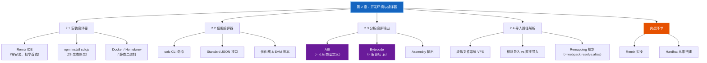
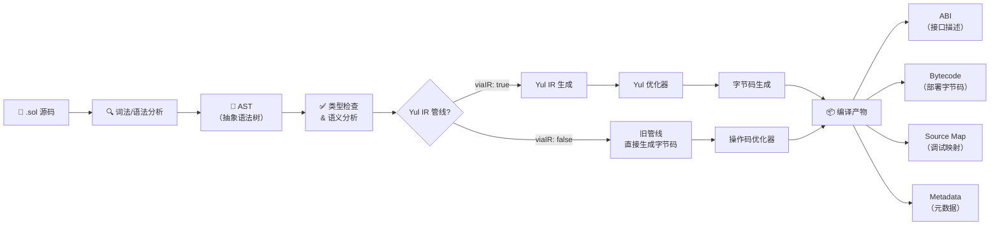
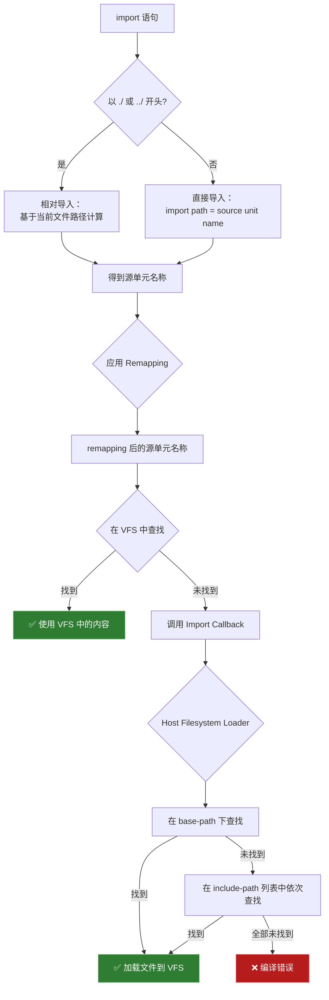
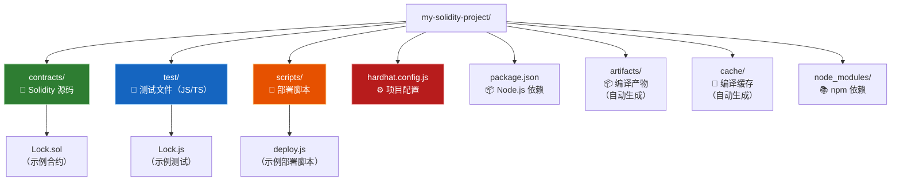

# 第 2 章 — 开发环境搭建与编译器（Development Environment & Compiler）

> **预计学习时间**：1 - 2 天
> **本章目标**：掌握 Solidity 编译器的安装方式、编译流程、编译输出解读，以及导入路径解析机制；使用 Hardhat 从零搭建完整开发环境
> **前置知识**：[第 1 章 — 区块链与智能合约基础](ch01-blockchain-smart-contracts.md)

> **JS/TS 读者建议**：本章是从 JS 世界迈入 Solidity 开发的关键桥梁——你会发现很多概念（npm 安装、编译器配置、模块解析）都有直接对应。带着"这和 Webpack/TypeScript 有什么异同？"的问题来读，学习效率最高。

---

## 目录

- [章节概述](#章节概述)
- [本章知识地图](#本章知识地图)
- [JS/TS 快速对照表](#jsts-快速对照表)
- [迁移陷阱（JS → Solidity）](#迁移陷阱js--solidity)
- [2.1 安装 Solidity 编译器](#21-安装-solidity-编译器)
  - [2.1.1 版本管理（Semantic Versioning）](#211-版本管理semantic-versioning)
  - [2.1.2 Remix IDE — 浏览器在线 IDE](#212-remix-ide--浏览器在线-ide)
  - [2.1.3 npm / Node.js 安装 solcjs](#213-npm--nodejs-安装-solcjs)
  - [2.1.4 Docker 安装](#214-docker-安装)
  - [2.1.5 Linux 包管理器安装](#215-linux-包管理器安装)
  - [2.1.6 macOS Homebrew 安装](#216-macos-homebrew-安装)
  - [2.1.7 静态二进制文件](#217-静态二进制文件)
  - [2.1.8 从源码编译](#218-从源码编译)
- [2.2 使用编译器](#22-使用编译器)
  - [2.2.1 命令行编译器 solc 的使用](#221-命令行编译器-solc-的使用)
  - [2.2.2 优化器设置](#222-优化器设置)
  - [2.2.3 EVM 版本选择](#223-evm-版本选择)
  - [2.2.4 Standard JSON 输入/输出接口](#224-standard-json-输入输出接口)
  - [2.2.5 编译管线流程图](#225-编译管线流程图)
- [2.3 分析编译输出](#23-分析编译输出)
  - [2.3.1 理解 ABI](#231-理解-abi)
  - [2.3.2 理解字节码（Bytecode）](#232-理解字节码bytecode)
  - [2.3.3 Assembly 输出分析](#233-assembly-输出分析)
  - [2.3.4 ethers.js 如何消费 ABI](#234-ethersjs-如何消费-abi)
- [2.4 导入路径解析](#24-导入路径解析)
  - [2.4.1 虚拟文件系统（VFS）](#241-虚拟文件系统vfs)
  - [2.4.2 导入类型：相对导入 vs 直接导入](#242-导入类型相对导入-vs-直接导入)
  - [2.4.3 Base Path 与 Include Path](#243-base-path-与-include-path)
  - [2.4.4 Import Remapping（路径重映射）](#244-import-remapping路径重映射)
  - [2.4.5 导入路径解析流程图](#245-导入路径解析流程图)
- [Remix 实操指南](#remix-实操指南)
- [Hardhat 项目从零搭建](#hardhat-项目从零搭建)
- [本章小结](#本章小结)
- [学习明细与练习任务](#学习明细与练习任务)
- [常见问题 FAQ](#常见问题-faq)

---

## 章节概述

本章覆盖 Solidity 开发环境搭建的方方面面，从编译器安装到项目工程化：

| 小节 | 内容 | 重要性 |
| --- | --- | --- |
| 2.1 安装编译器 | Solidity 编译器（solc/solcjs）的多种安装方式 | ★★★★☆ |
| 2.2 使用编译器 | solc CLI 用法、Standard JSON 接口、优化器配置 | ★★★★★ |
| 2.3 分析编译输出 | ABI 和字节码的含义与使用 | ★★★★★ |
| 2.4 导入路径解析 | 虚拟文件系统、import 规则、remapping 机制 | ★★★★☆ |
| Remix 实操 | 浏览器在线编译体验 | ★★★★☆ |
| Hardhat 搭建 | 完整的本地开发环境（JS 开发者首选） | ★★★★★ |

> **学习建议**：如果你想最快上手写代码，先看 [Remix 实操指南](#remix-实操指南) 和 [Hardhat 项目从零搭建](#hardhat-项目从零搭建)，再回来补充 2.1 - 2.4 的理论知识。如果你习惯先理解原理再动手，按顺序阅读即可。

---

## 本章知识地图



---

## JS/TS 快速对照表

| 你熟悉的 JS/TS 世界 | Solidity 世界 | 这一章你需要建立的直觉 |
| --- | --- | --- |
| `nvm` / `volta` 管 Node 版本 | `solc-select` / Hardhat 内置管理多版本 solc | Solidity 也需要精确管理编译器版本，`pragma` 锁定版本范围 |
| `npm init` / `pnpm init` | `npx hardhat init` / `forge init` | Hardhat（JS 生态）和 Foundry（Rust 生态）是两大主流框架 |
| `webpack` / `esbuild` / `tsc` | `solc` 编译器 | solc 将 `.sol` 编译为 ABI + Bytecode，类似 tsc 编译 `.ts` |
| `.d.ts` 类型定义文件 | **ABI**（Application Binary Interface） | ABI 描述合约的"接口形状"：函数签名、参数类型、返回值 |
| 打包后的 `.js` 文件 | **Bytecode**（字节码） | 字节码是部署到 EVM 上的实际可执行代码 |
| `package.json` | `hardhat.config.js` / `foundry.toml` | 项目配置：编译器版本、网络设置、优化选项 |
| `require()` / `import` 解析 | Solidity `import` + remapping | 类似 Node.js 模块解析 + webpack 的 `resolve.alias` |

---

## 迁移陷阱（JS → Solidity）

1. **把 `solcjs` 当成完整 `solc`**：通过 npm 安装的 `solcjs` 是 C++ solc 的 Emscripten 移植版，命令行选项**不兼容**原版 `solc`。Hardhat/Foundry 等工具底层管理的是完整 solc，不要在工具链之外单独依赖 `solcjs` 的 CLI。

2. **忽略编译器版本锁定**：JS 世界里版本不匹配最多 warning，Solidity 里 `pragma solidity ^0.8.0;` 是**硬约束**——编译器版本不满足直接报错拒绝编译。每次升级 solc 都可能引入 breaking change。

3. **以为 ABI 就是源码**：ABI 只是"接口描述"（类似 `.d.ts`），不包含实现逻辑。前端通过 ABI 调用合约，但看不到内部代码。逆向 bytecode 理论上可行但极其困难。

4. **用 JS 的直觉理解 import**：Solidity 的 import 不走 `node_modules` 解析算法！它使用**虚拟文件系统 + remapping**，路径解析规则完全不同。`import "@openzeppelin/..."` 能工作是因为 Hardhat/Foundry 帮你配置了 remapping。

5. **忽略优化器对 Gas 的影响**：JS 的 webpack 优化主要影响包体积，Solidity 的优化器直接影响**每次函数调用的真金白银（Gas 费）**。生产部署**必须**开启优化器。

---

## 2.1 安装 Solidity 编译器

### 2.1.1 版本管理（Semantic Versioning）

Solidity 遵循[语义化版本](https://semver.org)规范。当前主版本号为 0（即 `0.x.y`），这意味着：

- **补丁版本**（`0.x.y` → `0.x.z`，z > y）：不包含破坏性变更，向后兼容
- **次版本**（`0.x.y` → `0.(x+1).0`）：可能包含破坏性变更
- 使用 0.x 版本号表示语言仍在快速迭代中

**版本字符串的完整结构**：

```
0.8.28+commit.7893614a.Emscripten.clang
│  │  │       │              │       │
│  │  │       │              │       └─ 编译器
│  │  │       │              └─ 平台
│  │  │       └─ Git commit hash
│  │  └─ 补丁版本
│  └─ 次版本
└─ 主版本
```

Solidity 还提供**预发布版本**和**每日构建版本（nightly）**，方便开发者提前测试新特性。但这些版本不适合生产环境，部署合约时应始终使用最新的**正式发布版本**。

> **与 JS 的对比**：就像 Node.js 有 LTS 和 Current 版本一样，Solidity 也有稳定版和 nightly 之分。区别在于 Solidity 的次版本升级经常引入 breaking change（因为主版本还是 0），而 Node.js 的 LTS 非常稳定。所以 Solidity 合约源文件里的 `pragma solidity` 声明至关重要。

---

### 2.1.2 Remix IDE — 浏览器在线 IDE

**推荐给初学者和小型合约开发使用。**

[Remix IDE](https://remix.ethereum.org/) 是 Solidity 官方推荐的在线开发环境，无需安装任何软件。

**Remix 的特点**：

| 特性 | 说明 |
| --- | --- |
| 零安装 | 浏览器直接访问，类似 JS 的 CodeSandbox / StackBlitz |
| 内置编译器 | 支持切换任意 solc 版本，包括 nightly |
| 一键部署 | 内置 JavaScript VM，可在浏览器内模拟区块链 |
| 调试器 | 支持交易的逐步调试 |
| 插件生态 | 支持各种分析、安全审计插件 |
| 离线版 | 提供 [Remix Desktop](https://github.com/remix-project-org/remix-desktop/releases/) 桌面客户端 |

> **与 JS 的对比**：Remix 之于 Solidity，就像 CodeSandbox 之于 React——开箱即用、适合学习和原型开发。但大型项目最终还是需要本地开发环境（Hardhat/Foundry）。

---

### 2.1.3 npm / Node.js 安装 solcjs

对 JS 开发者来说，最熟悉的安装方式：

```bash
npm install -g solc
```

安装后，命令行可执行文件名为 `solcjs`（**不是** `solc`）。

**重要区别：`solcjs` vs `solc`**

| 对比项 | `solcjs`（npm 安装） | `solc`（原生编译器） |
| --- | --- | --- |
| 安装方式 | `npm install -g solc` | Docker / Homebrew / 静态二进制 |
| 底层实现 | C++ solc 通过 Emscripten 编译为 JS | 原生 C++ 编译 |
| 命令行选项 | **不兼容** solc 的选项格式 | 完整功能 |
| 用途 | 在 JS 项目中以库的形式调用（如 Remix） | 命令行编译、工具链集成 |
| 性能 | 较慢 | 快 |

```bash
# solcjs 基本用法
solcjs --version
solcjs --abi --bin contract.sol

# 注意：solcjs 的选项格式与 solc 不同！
# solc 用法：    solc --bin contract.sol
# solcjs 用法：  solcjs --bin contract.sol
# 看似相同，但很多高级选项不通用
```

> **实际开发建议**：如果你使用 Hardhat，它会自动管理 solc 版本的下载和调用，你通常不需要手动安装 `solcjs`。安装 `solcjs` 更多是用于学习理解编译过程，以及在纯 JS 环境中以库的形式使用编译器。

---

### 2.1.4 Docker 安装

Docker 镜像适合需要隔离环境或 CI/CD 流水线的场景：

```bash
# 拉取最新稳定版
docker run ghcr.io/argotorg/solc:stable --help

# 指定版本
docker run ghcr.io/argotorg/solc:0.8.23 --version
```

**编译本地文件**——通过挂载目录：

```bash
docker run \
    --volume "/path/to/project/:/sources/" \
    ghcr.io/argotorg/solc:stable \
        /sources/Contract.sol \
        --abi \
        --bin \
        --output-dir /sources/output/
```

**使用 Standard JSON 接口**：

```bash
docker run ghcr.io/argotorg/solc:stable --standard-json < input.json > output.json
```

**标签说明**：

| Docker 标签 | 含义 |
| --- | --- |
| `stable` | 最新正式发布版（推荐） |
| `nightly` | develop 分支的每日构建 |
| `0.8.23` | 指定版本号 |

---

### 2.1.5 Linux 包管理器安装

**推荐方式**：使用[静态二进制文件](#217-静态二进制文件)，适用于大多数发行版，无需额外安装步骤。

**Snap 包**（当前未维护，仅供参考）：

```bash
sudo snap install solc          # 最新稳定版
sudo snap install solc --edge   # 最新开发版
```

> snap 的 `solc` 使用严格隔离模式（strict confinement），只能访问 `/home` 和 `/media` 目录下的文件。

**Arch Linux（AUR）**：

- `solidity`：从源码编译
- `solidity-bin`：使用官方静态二进制

**Nix**：

- [`solc.nix`](https://github.com/hellwolf/solc.nix)：从源码编译

---

### 2.1.6 macOS Homebrew 安装

```bash
brew update
brew upgrade
brew tap ethereum/ethereum
brew install solidity
```

**安装特定版本**：

```bash
# 克隆 Homebrew formula 仓库
git clone https://github.com/ethereum/homebrew-ethereum.git
cd homebrew-ethereum
git checkout <指定版本的 commit hash>

# 安装
brew unlink solidity
brew install solidity.rb
```

---

### 2.1.7 静态二进制文件

Solidity 团队在 [`solc-bin`](https://github.com/argotorg/solc-bin/) 仓库维护了所有平台的静态构建版本，也镜像到 https://binaries.soliditylang.org 。

**优势**：

- 无需安装或解压（Windows 旧版本除外）
- 支持 HTTPS 直接下载，无需认证或频率限制
- 支持 CORS，浏览器工具可直接加载
- 高度向后兼容——文件一旦添加不会被删除或移动
- 提供 keccak256 和 sha256 哈希用于完整性验证

**`list.json` 示例**（`emscripten-wasm32/list.json`）：

```json
{
  "path": "solc-emscripten-wasm32-v0.7.4+commit.3f05b770.js",
  "version": "0.7.4",
  "build": "commit.3f05b770",
  "longVersion": "0.7.4+commit.3f05b770",
  "keccak256": "0x300330ecd127756b824aa13e843cb1f43c473cb22eaf3750d5fb9c99279af8c3",
  "sha256": "0x2b55ed5fec4d9625b6c7b3ab1abd2b7fb7dd2a9c68543bf0323db2c7e2d55af2",
  "urls": [
    "dweb:/ipfs/QmTLs5MuLEWXQkths41HiACoXDiH8zxyqBHGFDRSzVE5CS"
  ]
}
```

> **个人建议**：对于日常开发，使用 Hardhat/Foundry 自动管理 solc 版本是最省心的方式。静态二进制适合需要手动控制编译器版本的高级场景（如安全审计、CI/CD）。

---

### 2.1.8 从源码编译

如果你需要从源码编译 Solidity 编译器（通常不需要），以下是依赖清单：

**所有平台通用依赖**：

| 软件 | 版本要求 | 说明 |
| --- | --- | --- |
| CMake | 3.21.3+（Windows）/ 3.13+（其他） | 跨平台构建文件生成器 |
| Boost | 1.77+（Windows）/ 1.83+（其他） | C++ 库 |
| Git | — | 获取源码 |
| z3（可选） | 4.8.16+ | SMT 检查器 |

**最低 C++ 编译器版本**：

| 编译器 | 最低版本 |
| --- | --- |
| GCC | 13.3+ |
| Clang | 18.1.3+ |
| MSVC | 2019+ |

**编译步骤**（Linux / macOS）：

```bash
git clone --recursive https://github.com/argotorg/solidity.git
cd solidity

mkdir build
cd build
cmake .. && make
```

**Windows**：

```bash
mkdir build
cd build
cmake -G "Visual Studio 16 2019" ..
cmake --build . --config Release
```

> **何时需要从源码编译**？绝大多数开发者永远不需要。只有在你要修改编译器本身、使用特定 SMT 求解器配置、或为不支持的平台构建时才需要。

---

## 2.2 使用编译器

### 2.2.1 命令行编译器 solc 的使用

`solc` 是 Solidity 的命令行编译器。以下是常用命令：

**基本编译**：

```bash
# 输出二进制字节码
solc --bin sourceFile.sol

# 输出到单独文件
solc -o outputDirectory --bin --ast-compact-json --asm sourceFile.sol
```

**常用输出选项**：

| 选项 | 输出内容 | JS 类比 |
| --- | --- | --- |
| `--bin` | 合约字节码（hex 编码） | 打包后的 `.js` 文件 |
| `--abi` | ABI（JSON 格式） | `.d.ts` 类型定义 |
| `--asm` | EVM 汇编代码 | Source Map |
| `--ast-compact-json` | 抽象语法树（JSON） | Babel AST |
| `--metadata` | 合约元数据 | `package.json` 元信息 |
| `--gas` | Gas 估算 | 无直接对应 |

**组合使用**：

```bash
# 同时输出 ABI、字节码，并发送到指定目录
solc -o ./build --bin --abi MyContract.sol

# 查看帮助
solc --help
```

---

### 2.2.2 优化器设置

部署合约前应启用优化器：

```bash
# 启用优化器
solc --optimize --bin sourceFile.sol

# 设置优化运行次数
solc --optimize --optimize-runs=200 --bin sourceFile.sol
```

**`--optimize-runs` 参数的含义**：

| runs 值 | 优化策略 | 适用场景 |
| --- | --- | --- |
| 1 | 优先降低部署成本 | 一次性部署、很少被调用 |
| 200（默认） | 部署成本和调用成本的平衡点 | 大多数合约 |
| 10000+ | 优先降低运行时成本 | 高频调用的合约（如 DEX） |

`runs` 参数影响的具体方面：

- 函数调度路由中二分查找的规模
- 大数和字符串等常量的存储方式

> **与 JS 的对比**：webpack 的 `optimization.minimize` 主要减小包体积；Solidity 优化器直接影响每次合约调用的 Gas 费用。一个优化不当的合约，用户每次调用可能多花几美元的 Gas。

---

### 2.2.3 EVM 版本选择

编译时可以指定目标 EVM 版本，以避免使用特定版本不支持的特性：

```bash
solc --evm-version shanghai contract.sol
```

**主要 EVM 版本及引入的关键特性**：

| EVM 版本 | 关键变化 |
| --- | --- |
| `constantinople` | `create2`、`shl`/`shr`/`sar` 移位操作 |
| `istanbul` | `chainid`、`selfbalance` |
| `berlin` | `SLOAD` 等操作的 Gas 成本变化（冷/热访问） |
| `london` | `block.basefee`（EIP-1559） |
| `paris` | `block.prevrandao` 替代 `block.difficulty` |
| `shanghai` | `push0` 指令，减小代码体积 |
| `cancun` | blob 相关操作（EIP-4844）、`mcopy`、`tstore`/`tload` |
| `osaka`（默认） | `clz` 内置函数 |

> **重要警告**：为错误的 EVM 版本编译可能导致合约行为异常甚至失败。如果你运行私有链，请确保编译目标与链的 EVM 版本匹配。

---

### 2.2.4 Standard JSON 输入/输出接口

Standard JSON 接口是与 Solidity 编译器交互的**推荐方式**，尤其适合自动化工具和复杂配置场景。

> **与 JS 的对比**：就像 webpack 的 `webpack.config.js` 定义编译配置一样，Standard JSON 用一个 JSON 对象描述所有编译输入、配置和期望输出。

**输入 JSON 示例**：

```json
{
  "language": "Solidity",
  "sources": {
    "MyContract.sol": {
      "content": "// SPDX-License-Identifier: MIT\npragma solidity ^0.8.0;\ncontract MyContract {\n    uint256 public value;\n    function setValue(uint256 _value) public {\n        value = _value;\n    }\n}"
    }
  },
  "settings": {
    "optimizer": {
      "enabled": true,
      "runs": 200
    },
    "evmVersion": "shanghai",
    "outputSelection": {
      "*": {
        "*": ["abi", "evm.bytecode", "evm.bytecode.sourceMap"],
        "": ["ast"]
      }
    }
  }
}
```

**`settings` 关键字段说明**：

| 字段 | 作用 | 默认值 |
| --- | --- | --- |
| `optimizer.enabled` | 是否启用优化器 | `false` |
| `optimizer.runs` | 优化运行次数 | 200 |
| `evmVersion` | 目标 EVM 版本 | `osaka` |
| `remappings` | 路径重映射 | `[]` |
| `outputSelection` | 期望的输出类型 | — |
| `libraries` | 库地址（用于链接） | `{}` |
| `viaIR` | 是否使用 Yul IR 编译管线 | `false` |

**`outputSelection` 可选输出类型**：

| 输出类型 | 说明 |
| --- | --- |
| `abi` | 合约 ABI |
| `evm.bytecode.object` | 字节码 |
| `evm.bytecode.sourceMap` | 源码映射 |
| `evm.deployedBytecode` | 部署后字节码 |
| `evm.methodIdentifiers` | 函数哈希列表 |
| `evm.gasEstimates` | Gas 估算 |
| `metadata` | 合约元数据 |
| `ast` | 抽象语法树 |
| `storageLayout` | 存储布局 |
| `ir` / `irOptimized` | Yul IR（优化前/后） |

**使用方式**：

```bash
solc --standard-json < input.json > output.json
```

**输出 JSON 结构概览**：

```json
{
  "errors": [],
  "sources": {
    "MyContract.sol": {
      "id": 0,
      "ast": {}
    }
  },
  "contracts": {
    "MyContract.sol": {
      "MyContract": {
        "abi": [],
        "metadata": "...",
        "evm": {
          "bytecode": {
            "object": "6080604052...",
            "sourceMap": "..."
          },
          "deployedBytecode": {},
          "methodIdentifiers": {
            "setValue(uint256)": "55241077",
            "value()": "3fa4f245"
          },
          "gasEstimates": {}
        }
      }
    }
  }
}
```

**错误类型一览**：

| 错误类型 | 含义 |
| --- | --- |
| `JSONError` | JSON 输入格式不正确 |
| `ParserError` | 源码语法错误 |
| `TypeError` | 类型系统错误（无效转换、赋值等） |
| `DeclarationError` | 标识符冲突或未定义 |
| `SyntaxError` | 语法错误（如 `continue` 在循环外） |
| `InternalCompilerError` | 编译器内部 bug |

---

### 2.2.5 编译管线流程图



---

## 2.3 分析编译输出

### 2.3.1 理解 ABI

**ABI（Application Binary Interface）** 是合约的"接口描述"——它告诉外部世界这个合约有哪些函数、接受什么参数、返回什么值。

> **与 JS 的对比**：ABI 相当于 TypeScript 的 `.d.ts` 类型定义文件。`.d.ts` 描述了一个 JS 模块暴露的类型信息，ABI 描述了一个合约暴露的函数接口信息。

**示例合约**：

```solidity
// SPDX-License-Identifier: MIT
pragma solidity ^0.8.0;

contract SimpleStorage {
    uint256 private storedValue;

    event ValueChanged(uint256 indexed oldValue, uint256 indexed newValue);

    function set(uint256 _value) public {
        uint256 old = storedValue;
        storedValue = _value;
        emit ValueChanged(old, _value);
    }

    function get() public view returns (uint256) {
        return storedValue;
    }
}
```

**编译输出的 ABI**：

```json
[
  {
    "type": "function",
    "name": "set",
    "inputs": [
      {
        "name": "_value",
        "type": "uint256",
        "internalType": "uint256"
      }
    ],
    "outputs": [],
    "stateMutability": "nonpayable"
  },
  {
    "type": "function",
    "name": "get",
    "inputs": [],
    "outputs": [
      {
        "name": "",
        "type": "uint256",
        "internalType": "uint256"
      }
    ],
    "stateMutability": "view"
  },
  {
    "type": "event",
    "name": "ValueChanged",
    "inputs": [
      {
        "name": "oldValue",
        "type": "uint256",
        "indexed": true,
        "internalType": "uint256"
      },
      {
        "name": "newValue",
        "type": "uint256",
        "indexed": true,
        "internalType": "uint256"
      }
    ],
    "anonymous": false
  }
]
```

**ABI 各字段含义**：

| 字段 | 含义 | 示例 |
| --- | --- | --- |
| `type` | 条目类型 | `"function"` / `"event"` / `"constructor"` / `"fallback"` / `"receive"` |
| `name` | 函数/事件名称 | `"set"` |
| `inputs` | 参数列表 | `[{"name": "_value", "type": "uint256"}]` |
| `outputs` | 返回值列表 | `[{"name": "", "type": "uint256"}]` |
| `stateMutability` | 状态可变性 | `"pure"` / `"view"` / `"nonpayable"` / `"payable"` |
| `indexed`（事件参数） | 是否可用于日志过滤 | `true` / `false` |

**`stateMutability` 详解**：

| 值 | 含义 | JS 类比 |
| --- | --- | --- |
| `pure` | 不读不写链上状态 | 纯函数 `(a, b) => a + b` |
| `view` | 只读链上状态，不修改 | getter 方法 |
| `nonpayable` | 可修改状态，但不接收 ETH | 普通 setter 方法 |
| `payable` | 可修改状态且可接收 ETH | 包含支付逻辑的方法 |

---

### 2.3.2 理解字节码（Bytecode）

编译器输出的字节码是部署到 EVM 上的实际执行代码。

> **与 JS 的对比**：字节码就像 webpack 打包后的 `.js` 文件——源码经过编译、优化后的可执行形式。区别在于 JS 打包后人还能勉强阅读（uglify 除外），而 EVM 字节码对人类完全不可读。

**两种字节码**：

| 类型 | 何时使用 | 说明 |
| --- | --- | --- |
| **Creation bytecode** | 部署时 | 包含构造函数逻辑 + runtime bytecode，执行完构造函数后返回 runtime bytecode |
| **Runtime bytecode** | 部署后 | 存储在链上的代码，处理所有后续调用 |

**字节码示例**（十六进制）：

```
6080604052348015600e575f5ffd5b506101078061001c5f395ff3fe6080604052348015
600e575f5ffd5b50600436106030575f3560e01c806355241077146034578063fa4f2...
```

**库链接**：

如果合约使用了外部库（library），字节码中会包含形如 `__$53aea86b7d70b31448b230b20ae141a537$__` 的占位符，这是库地址的 keccak256 哈希前 34 个字符。部署前需要将这些占位符替换为实际的库合约地址。

```bash
# 在编译时指定库地址
solc --libraries "file.sol:Math=0x1234567890123456789012345678901234567890" \
     --bin contract.sol
```

---

### 2.3.3 Assembly 输出分析

使用 `--asm` 标志可以查看人类可读的 EVM 汇编输出：

```bash
solc --asm contract.sol         # 未优化汇编
solc --optimize --asm contract.sol  # 优化后汇编
```

**示例合约**：

```solidity
// SPDX-License-Identifier: GPL-3.0
pragma solidity >=0.5.0 <0.9.0;
contract C {
    function one() public pure returns (uint) {
        return 1;
    }
}
```

**汇编输出的关键结构**：

```
======= contract.sol:C =======
EVM assembly:
    /* 创建/构造函数代码 */
  mstore(0x40, 0x80)
  callvalue
  ...
  return
stop

sub_0: assembly {
    /* 运行时代码（部署后的代码） */
    mstore(0x40, 0x80)
    ...
    /* 函数调度 */
    shr(0xe0, calldataload(0x00))
    dup1
    0x901717d1           // function selector: one()
    eq
    tag_3
    jumpi
    ...
    /* one() 的实现 */
  tag_5:
    0x00                 // 返回值槽位
    0x01                 // 常量 1
    swap1
    pop
    swap1
    jump  // out

    auxdata: 0xa264697066735822...  // 元数据哈希
}
```

**关键观察点**：

- `sub_0` 是运行时代码（即 deployed bytecode 的汇编形式）
- 函数选择器（如 `0x901717d1`）是函数签名的 keccak256 前 4 字节
- `auxdata` 是合约元数据的哈希，附加在字节码末尾
- 汇编输出中的注释指向源码位置，方便调试

> 对比两段不同 Solidity 代码的优化后汇编（`diff` 它们的 `--optimize --asm` 输出），是验证"两段代码是否等价"的实用技巧。

---

### 2.3.4 ethers.js 如何消费 ABI

作为 JS 开发者，你最终会在前端通过 ethers.js（或 viem）使用 ABI 与合约交互：

```javascript
import { ethers } from "ethers";

// ABI 就是编译输出的那个 JSON 数组
const abi = [
  "function set(uint256 _value) public",
  "function get() public view returns (uint256)",
  "event ValueChanged(uint256 indexed oldValue, uint256 indexed newValue)"
];

const provider = new ethers.JsonRpcProvider("http://localhost:8545");
const signer = await provider.getSigner();

// 通过 ABI + 合约地址创建合约实例
const contract = new ethers.Contract(
  "0x合约地址...",
  abi,
  signer
);

// 调用 view 函数（不消耗 Gas，免费读取）
const value = await contract.get();
console.log("当前值:", value.toString());

// 调用状态修改函数（需要发送交易，消耗 Gas）
const tx = await contract.set(42);
await tx.wait(); // 等待交易确认

// 监听事件
contract.on("ValueChanged", (oldValue, newValue) => {
  console.log(`值从 ${oldValue} 变为 ${newValue}`);
});
```

> **核心理解**：ABI 是前端和合约之间的"通信协议"。编译器生成 ABI，ethers.js/viem 消费 ABI，你的 DApp 前端就能与链上合约交互了。

---

## 2.4 导入路径解析

### 2.4.1 虚拟文件系统（VFS）

Solidity 编译器内部维护一个**虚拟文件系统（Virtual Filesystem, VFS）**，每个源文件被分配一个唯一的**源单元名称（Source Unit Name）**。

> **与 JS 的对比**：类似于 webpack 的模块解析系统——webpack 内部也维护了一套"模块 ID → 模块内容"的映射，而不是直接操作物理文件系统。

**VFS 的工作机制**：

1. 编译器首先用输入文件初始化 VFS
2. `import` 语句引用的是**源单元名称**，而非物理路径
3. 如果 VFS 中没有找到对应文件，编译器调用**导入回调（Import Callback）**
4. 命令行编译器默认提供 **Host Filesystem Loader**，将源单元名称解释为本地文件路径
5. JavaScript 接口（如 Remix）可以提供自定义回调，支持 HTTP、IPFS 等协议

**不同输入方式下的 VFS 初始化**：

| 输入方式 | VFS 初始内容 |
| --- | --- |
| `solc contract.sol` | 文件路径经规范化后作为源单元名称 |
| Standard JSON | `sources` 字典的键直接作为源单元名称 |
| 标准输入 `echo '...' \| solc -` | 使用特殊名称 `<stdin>` |

---

### 2.4.2 导入类型：相对导入 vs 直接导入

Solidity 的 import 分为两种：

**直接导入（Direct Import）**——不以 `./` 或 `../` 开头：

```solidity
import "/project/lib/util.sol";          // 源单元名称: /project/lib/util.sol
import "lib/util.sol";                   // 源单元名称: lib/util.sol
import "@openzeppelin/address.sol";      // 源单元名称: @openzeppelin/address.sol
import "https://example.com/token.sol";  // 源单元名称: https://example.com/token.sol
```

**相对导入（Relative Import）**——以 `./` 或 `../` 开头：

```solidity
// 文件：/project/lib/math.sol
import "./util.sol" as util;     // 源单元名称: /project/lib/util.sol
import "../token.sol" as token;  // 源单元名称: /project/token.sol
```

**路径解析算法**（简化描述）：

1. 取当前文件的源单元名称
2. 移除最后一个路径段（文件名）
3. 逐段处理导入路径：`.` 跳过，`..` 回退一级，其他则追加

> **与 Node.js 的关键区别**：
>
> - `import "util.sol"` 在 Solidity 中是**直接导入**（绝对路径），在 Node.js 中 `require("util")` 会触发 `node_modules` 查找
> - Solidity 没有 `node_modules` 解析机制——`@openzeppelin/...` 能工作完全依赖 remapping 配置
> - 源单元名称只是标识符，即使看起来像路径也不会被自动规范化（`/a/b/../c` 和 `/a/c` 是不同的源单元名称）

---

### 2.4.3 Base Path 与 Include Path

`--base-path` 和 `--include-path` 控制 Host Filesystem Loader 在哪些目录中查找文件：

```bash
solc contract.sol \
    --base-path . \
    --include-path node_modules/ \
    --include-path /usr/local/lib/node_modules/
```

**查找顺序**：

1. 先在 base path 下查找
2. 如果未找到，依次在 include path 列表中查找

**安全限制**——编译器默认只允许访问以下位置的文件：

- 命令行指定的输入文件所在目录
- remapping 的目标目录
- base path 和 include path

其他目录需要通过 `--allow-paths` 显式授权：

```bash
solc contract.sol \
    --base-path=token/ \
    --include-path=/lib/ \
    --allow-paths=../utils/,/tmp/libraries
```

---

### 2.4.4 Import Remapping（路径重映射）

Import Remapping 是 Solidity 导入系统的核心机制，允许将导入路径重定向到不同位置。

> **与 JS 的对比**：Remapping 类似于 webpack 的 `resolve.alias` 或 TypeScript 的 `paths` 配置。

**语法**：`context:prefix=target`

| 组成部分 | 说明 |
| --- | --- |
| `context`（可选） | 限定 remapping 的作用范围——只对源单元名称以此开头的文件生效 |
| `prefix`（必填） | 匹配导入路径的前缀 |
| `target`（可选） | prefix 被替换为的值 |

**示例**：

```bash
# 将 github.com/ethereum/dapp-bin/ 重映射到本地目录
solc github.com/ethereum/dapp-bin/=dapp-bin/ --base-path /project source.sol
```

```solidity
// 源码中的导入
import "github.com/ethereum/dapp-bin/library/math.sol";
// 经过 remapping 后变为：dapp-bin/library/math.sol
```

**带上下文的 Remapping**（为不同模块映射到不同版本）：

```bash
solc module1:github.com/ethereum/dapp-bin/=dapp-bin/ \
     module2:github.com/ethereum/dapp-bin/=dapp-bin_old/ \
     --base-path /project \
     source.sol
```

**Remapping 详细规则**：

1. Remapping 只影响 `import` 路径到源单元名称的转换，不影响命令行指定的文件
2. context 和 prefix 匹配的是**源单元名称**，不是导入路径
3. 如果多个 remapping 匹配同一导入，选择 context 最长的；context 相同则选 prefix 最长的；都相同选最后指定的
4. 一次导入最多应用一个 remapping（不会链式应用）
5. prefix 不能为空，但 context 和 target 可选

**Hardhat 中的等价配置**（`hardhat.config.js`）：

```javascript
module.exports = {
  solidity: "0.8.24",
  paths: {
    sources: "./contracts",
    artifacts: "./artifacts"
  }
};
// Hardhat 自动将 node_modules 中的包映射为 remapping
// 所以 import "@openzeppelin/contracts/..." 开箱即用
```

**Foundry 中的等价配置**（`foundry.toml`）：

```toml
[profile.default]
src = "src"
out = "out"
libs = ["lib"]
remappings = [
    "@openzeppelin/=lib/openzeppelin-contracts/",
    "@chainlink/=lib/chainlink/"
]
```

---

### 2.4.5 导入路径解析流程图



> **与 Node.js `require()` 解析的对比**：
>
> | 步骤 | Node.js `require()` | Solidity `import` |
> | --- | --- | --- |
> | 1 | 检查核心模块 | 检查 VFS |
> | 2 | 相对路径直接加载 | 相对路径基于源单元名称计算 |
> | 3 | `node_modules` 逐级向上查找 | base-path → include-path 顺序查找 |
> | 4 | `package.json` 的 `main` 字段 | remapping 映射 |
> | 5 | — | `--allow-paths` 安全检查 |

---

## Remix 实操指南

以下是在 Remix IDE 中完成一次完整编译的步骤：

### 第 1 步：打开 Remix

访问 [https://remix.ethereum.org/](https://remix.ethereum.org/)

### 第 2 步：创建文件

1. 在左侧文件浏览器中，点击 `contracts/` 文件夹
2. 点击"新建文件"图标，命名为 `SimpleStorage.sol`
3. 输入以下代码：

```solidity
// SPDX-License-Identifier: MIT
pragma solidity ^0.8.20;

contract SimpleStorage {
    uint256 private storedValue;

    event ValueChanged(uint256 indexed oldValue, uint256 indexed newValue);

    function set(uint256 _value) public {
        uint256 old = storedValue;
        storedValue = _value;
        emit ValueChanged(old, _value);
    }

    function get() public view returns (uint256) {
        return storedValue;
    }
}
```

### 第 3 步：编译

1. 点击左侧边栏的 **Solidity Compiler** 图标（第二个图标）
2. 在 "COMPILER" 下拉框选择 `0.8.24` 或更高版本
3. 勾选 **Auto compile**（自动编译，保存时自动触发）
4. 点击 **Compile SimpleStorage.sol** 按钮
5. 编译成功后按钮变绿，出现绿色勾号

### 第 4 步：查看 ABI 和 Bytecode

1. 编译成功后，点击 **Compilation Details** 按钮
2. 在弹出面板中可以看到：
   - **ABI**：点击复制图标获取完整 ABI JSON
   - **BYTECODE**：包含 `object`（字节码）和 `opcodes`（操作码列表）
   - **RUNTIME BYTECODE**：部署后的字节码
   - **ASSEMBLY**：汇编输出

### 第 5 步：部署并交互（可选）

1. 点击左侧边栏的 **Deploy & Run Transactions** 图标（第三个图标）
2. 确保 "ENVIRONMENT" 选择 `Remix VM (Shanghai)`
3. 点击 **Deploy**
4. 在 "Deployed Contracts" 区域，展开合约
5. 输入参数调用 `set(42)`，然后调用 `get()` 查看结果

---

## Hardhat 项目从零搭建

对 JS 开发者来说，**Hardhat** 是最自然的选择——它完全基于 Node.js 生态，用 JavaScript/TypeScript 编写测试和部署脚本。

### 第 1 步：创建项目

```bash
mkdir my-solidity-project
cd my-solidity-project
npm init -y
npm install --save-dev hardhat
npx hardhat init
```

运行 `npx hardhat init` 后选择 **Create a JavaScript project**（或 TypeScript），按提示安装依赖。

### 第 2 步：理解项目结构



**与 JS 项目的对比**：

| Hardhat 项目 | 典型 JS 项目 | 作用 |
| --- | --- | --- |
| `contracts/` | `src/` | 源码目录 |
| `test/` | `test/` 或 `__tests__/` | 测试文件 |
| `scripts/` | `scripts/` | 工具脚本 |
| `hardhat.config.js` | `webpack.config.js` + `tsconfig.json` | 编译器配置 |
| `artifacts/` | `dist/` 或 `build/` | 编译产物 |
| `package.json` | `package.json` | 依赖管理 |

### 第 3 步：编写合约

创建 `contracts/SimpleStorage.sol`：

```solidity
// SPDX-License-Identifier: MIT
pragma solidity ^0.8.20;

contract SimpleStorage {
    uint256 private storedValue;
    address public owner;

    event ValueChanged(uint256 indexed oldValue, uint256 indexed newValue);

    constructor(uint256 _initialValue) {
        storedValue = _initialValue;
        owner = msg.sender;
    }

    function set(uint256 _value) public {
        uint256 old = storedValue;
        storedValue = _value;
        emit ValueChanged(old, _value);
    }

    function get() public view returns (uint256) {
        return storedValue;
    }
}
```

### 第 4 步：配置编译器

编辑 `hardhat.config.js`：

```javascript
require("@nomicfoundation/hardhat-toolbox");

/** @type import('hardhat/config').HardhatUserConfig */
module.exports = {
  solidity: {
    version: "0.8.24",
    settings: {
      optimizer: {
        enabled: true,
        runs: 200
      }
    }
  },
  paths: {
    sources: "./contracts",
    tests: "./test",
    cache: "./cache",
    artifacts: "./artifacts"
  }
};
```

### 第 5 步：编译

```bash
npx hardhat compile
```

编译成功后，`artifacts/` 目录会生成：

```
artifacts/
└── contracts/
    └── SimpleStorage.sol/
        ├── SimpleStorage.json       # 包含 ABI + Bytecode
        └── SimpleStorage.dbg.json   # 调试信息
```

查看 `SimpleStorage.json` 的内容，你会找到我们在 2.3 节学到的 ABI 和 bytecode。

### 第 6 步：编写测试

创建 `test/SimpleStorage.js`：

```javascript
const { expect } = require("chai");
const { ethers } = require("hardhat");

describe("SimpleStorage", function () {
  let simpleStorage;

  beforeEach(async function () {
    const SimpleStorage = await ethers.getContractFactory("SimpleStorage");
    simpleStorage = await SimpleStorage.deploy(0);
    await simpleStorage.waitForDeployment();
  });

  it("应该返回初始值 0", async function () {
    expect(await simpleStorage.get()).to.equal(0);
  });

  it("应该更新存储的值", async function () {
    await simpleStorage.set(42);
    expect(await simpleStorage.get()).to.equal(42);
  });

  it("应该触发 ValueChanged 事件", async function () {
    await expect(simpleStorage.set(100))
      .to.emit(simpleStorage, "ValueChanged")
      .withArgs(0, 100);
  });

  it("应该记录正确的 owner", async function () {
    const [owner] = await ethers.getSigners();
    expect(await simpleStorage.owner()).to.equal(owner.address);
  });
});
```

运行测试：

```bash
npx hardhat test
```

预期输出：

```
  SimpleStorage
    ✓ 应该返回初始值 0
    ✓ 应该更新存储的值
    ✓ 应该触发 ValueChanged 事件
    ✓ 应该记录正确的 owner

  4 passing (xxx ms)
```

### 第 7 步：部署到本地网络

创建 `scripts/deploy.js`：

```javascript
const { ethers } = require("hardhat");

async function main() {
  const initialValue = 0;
  const SimpleStorage = await ethers.getContractFactory("SimpleStorage");
  const simpleStorage = await SimpleStorage.deploy(initialValue);
  await simpleStorage.waitForDeployment();

  const address = await simpleStorage.getAddress();
  console.log(`SimpleStorage 已部署到: ${address}`);
  console.log(`初始值: ${await simpleStorage.get()}`);
}

main().catch((error) => {
  console.error(error);
  process.exitCode = 1;
});
```

**启动本地节点并部署**：

```bash
# 终端 1：启动本地 Hardhat 节点（内置以太坊节点）
npx hardhat node

# 终端 2：部署到本地节点
npx hardhat run scripts/deploy.js --network localhost
```

### Hardhat 常用命令速查

| 命令 | 作用 | 类比 |
| --- | --- | --- |
| `npx hardhat compile` | 编译合约 | `tsc` / `npm run build` |
| `npx hardhat test` | 运行测试 | `npm test` / `jest` |
| `npx hardhat node` | 启动本地以太坊节点 | `json-server` / 本地开发服务器 |
| `npx hardhat run scripts/deploy.js` | 运行部署脚本 | `node scripts/deploy.js` |
| `npx hardhat clean` | 清理编译缓存 | `rm -rf dist/` |
| `npx hardhat console` | 交互式控制台 | `node` REPL |

---

## 本章小结

本章你学会了：

- **安装 Solidity 编译器**的多种方式：Remix（零安装）、npm（solcjs）、Docker、Homebrew、静态二进制
- **使用 `solc` 命令行编译器**：基本编译命令、优化器设置、EVM 版本选择
- **Standard JSON 接口**：结构化的编译器输入/输出，自动化工具链的基础
- **理解编译输出**：ABI（接口描述 ≈ `.d.ts`）、Bytecode（执行代码 ≈ 打包后 `.js`）、Assembly（汇编 ≈ Source Map）
- **导入路径解析**：虚拟文件系统、直接导入 vs 相对导入、remapping 机制
- **Hardhat 项目搭建**：从 `npm init` 到编写合约、测试、部署的完整流程

**个人总结**：

对 JS 开发者来说，本章最核心的收获是建立"Solidity 编译器和 JS 打包工具的映射关系"——`solc` 就是你的 `webpack`/`tsc`，ABI 就是 `.d.ts`，Bytecode 就是打包后的 `.js`，remapping 就是 `resolve.alias`。有了这套心智模型，后续的学习会顺畅得多。

同时别忘了：Solidity 的编译不只是"把代码变成可执行文件"这么简单——优化器设置直接影响 Gas 费用（真金白银），EVM 版本选择影响可用特性，ABI 是前端与合约交互的唯一桥梁。这些都是 JS 世界里没有直接对应物的新概念，需要额外关注。

---

## 学习明细与练习任务

### 知识点掌握清单

完成本章学习后，逐项打勾确认：

#### 编译器安装
- [ ] 理解 Solidity 语义化版本的含义（0.x.y 的特殊规则）
- [ ] 能在 Remix IDE 中编译合约
- [ ] 能通过 npm 安装 `solcjs`，理解与原生 `solc` 的区别
- [ ] 知道至少 3 种安装 solc 的方式

#### 使用编译器
- [ ] 能使用 `solc --bin --abi` 编译合约
- [ ] 理解 `--optimize` 和 `--optimize-runs` 的作用
- [ ] 理解 Standard JSON 接口的输入/输出格式
- [ ] 能选择正确的 EVM 版本编译

#### 编译输出
- [ ] 能解释 ABI 中每个字段的含义
- [ ] 理解 ABI 的 `stateMutability`（pure/view/nonpayable/payable）
- [ ] 理解 creation bytecode 和 runtime bytecode 的区别
- [ ] 能用 ethers.js 通过 ABI 调用合约

#### 导入路径
- [ ] 理解虚拟文件系统（VFS）的概念
- [ ] 能区分相对导入和直接导入
- [ ] 理解 remapping 机制的语法和规则
- [ ] 知道 `--base-path`、`--include-path`、`--allow-paths` 的作用

#### 开发环境
- [ ] 能使用 Hardhat 创建、编译、测试、部署项目
- [ ] 理解 Hardhat 项目结构与 JS 项目的对应关系

---

### 练习任务（由易到难）

#### 任务 1：通过 npm 安装 solcjs（必做，约 15 分钟）

```bash
# 安装
npm install -g solc

# 验证
solcjs --version

# 创建一个简单合约 Hello.sol
# 编译它
solcjs --abi --bin Hello.sol
```

编写 `Hello.sol`：

```solidity
// SPDX-License-Identifier: MIT
pragma solidity ^0.8.20;

contract Hello {
    function greet() public pure returns (string memory) {
        return "Hello, Solidity!";
    }
}
```

观察生成的 `.abi` 和 `.bin` 文件内容。

---

#### 任务 2：在 Remix 中编译并查看 ABI/Bytecode（必做，约 20 分钟）

1. 打开 [Remix IDE](https://remix.ethereum.org/)
2. 创建 `SimpleStorage.sol`（使用本章示例代码）
3. 编译并查看 ABI 输出，理解每个字段
4. 查看 Bytecode 输出，对比 creation bytecode 和 runtime bytecode 的长度差异
5. 部署到 Remix VM，调用 `set()` 和 `get()` 函数

---

#### 任务 3：创建多文件项目（强烈推荐，约 30 分钟）

创建以下文件结构：

```
contracts/
├── interfaces/
│   └── IStorage.sol
├── libraries/
│   └── MathLib.sol
└── Storage.sol
```

`interfaces/IStorage.sol`：

```solidity
// SPDX-License-Identifier: MIT
pragma solidity ^0.8.20;

interface IStorage {
    function store(uint256 value) external;
    function retrieve() external view returns (uint256);
}
```

`libraries/MathLib.sol`：

```solidity
// SPDX-License-Identifier: MIT
pragma solidity ^0.8.20;

library MathLib {
    function double(uint256 x) internal pure returns (uint256) {
        return x * 2;
    }
}
```

`Storage.sol`：

```solidity
// SPDX-License-Identifier: MIT
pragma solidity ^0.8.20;

import "./interfaces/IStorage.sol";
import "./libraries/MathLib.sol";

contract Storage is IStorage {
    using MathLib for uint256;
    uint256 private _value;

    function store(uint256 value) external override {
        _value = value;
    }

    function retrieve() external view override returns (uint256) {
        return _value;
    }

    function retrieveDoubled() external view returns (uint256) {
        return _value.double();
    }
}
```

在 Remix 或 Hardhat 中编译，理解多文件 import 的工作方式。

---

#### 任务 4：搭建 Hardhat 项目（选做，约 45 分钟）

完整走一遍 [Hardhat 项目从零搭建](#hardhat-项目从零搭建) 中的所有步骤：

1. `npm init` → `npx hardhat init`
2. 编写 `SimpleStorage.sol`
3. 配置 `hardhat.config.js`（启用优化器）
4. `npx hardhat compile`
5. 编写测试并运行 `npx hardhat test`
6. 编写部署脚本并部署到本地节点

---

### 学习时间参考

| 任务 | 建议时间 |
| --- | --- |
| 阅读本章内容 | 45 - 60 分钟 |
| 任务 1（必做） | 15 分钟 |
| 任务 2（必做） | 20 分钟 |
| 任务 3（强烈推荐） | 30 分钟 |
| 任务 4（选做） | 45 分钟 |
| **合计** | **2.5 - 3.5 小时** |

---

## 常见问题 FAQ

**Q：应该用 Hardhat 还是 Foundry？**
A：两者各有优势。**Hardhat** 对 JS 开发者更友好——测试用 JavaScript/TypeScript 编写，生态丰富（插件、教程多），社区活跃。**Foundry** 用 Solidity 写测试，编译和测试速度极快，更受"硬核"智能合约开发者青睐。建议：如果你的背景是 JS，先用 Hardhat 入门，后续根据需要再尝试 Foundry。

---

**Q：`solcjs` 和 Hardhat 内部用的 solc 有什么关系？**
A：Hardhat 在编译时会自动下载指定版本的**原生 `solc` 编译器**（通过 `solc-bin` 仓库获取），而不是使用 `solcjs`。所以通过 Hardhat 编译的结果与原生 `solc` 完全一致。`solcjs` 的主要用途是在纯 JS 环境中（如 Remix IDE 的浏览器端）运行编译器。

---

**Q：为什么我的合约 `import "@openzeppelin/..."` 在 Hardhat 中能工作，但用 `solc` 命令行编译就失败？**
A：因为 Hardhat 在底层自动为 `node_modules` 中安装的包配置了 import remapping。直接使用 `solc` 命令行时，你需要手动指定 `--include-path node_modules/` 或配置 remapping：

```bash
solc @openzeppelin/=node_modules/@openzeppelin/ \
     --base-path . \
     contracts/MyContract.sol
```

---

**Q：优化器的 `runs` 参数应该设为多少？**
A：对大多数合约，默认值 **200** 是合理的平衡点。如果你的合约部署后会被频繁调用（如 DEX、Token 合约），可以设为 **1000 - 10000**。如果合约只部署一次很少被调用，设为 **1** 以降低部署成本。

---

**Q：什么是 `pragma solidity`？它和编译器安装有什么关系？**
A：`pragma solidity ^0.8.20;` 声明了合约兼容的编译器版本范围。`^0.8.20` 表示 `>=0.8.20 <0.9.0`。如果你安装的编译器版本不在这个范围内，编译会直接报错。这是 Solidity 的安全机制——防止用不兼容的编译器版本编译合约导致意外行为。

---

**Q：ABI 能用来做逆向工程吗？能看到合约源码吗？**
A：ABI 只描述函数接口（函数名、参数类型、返回值），**不包含**任何实现逻辑。它相当于 C 语言的头文件（`.h`）或 TypeScript 的类型定义（`.d.ts`）。要从链上获取合约源码，需要合约开发者主动在 Etherscan 等平台进行"源码验证（Verify & Publish）"。

---

**Q：`viaIR: true` 是什么？要不要开？**
A：这是 Solidity 编译器的新编译管线，通过 Yul 中间表示（IR）生成字节码，理论上能产生更优化的代码。但截至目前，它有时会使编译变慢，且某些边缘情况的行为可能不同。建议初学者**保持默认（false）**，等需要极致优化时再考虑开启。

---

**Q：编译很慢怎么办？**
A：几个常见加速方法：
- 使用 Hardhat 的增量编译（默认启用，只重新编译修改过的文件）
- 确保 `node_modules` 在 SSD 上
- 如果项目很大，考虑使用 Foundry（`forge build`，编译速度通常快 5-10 倍）
- 开发阶段不要在每次保存时都重新编译整个项目

---

**Q：`artifacts/` 目录要提交到 Git 吗？**
A：不需要。`artifacts/` 和 `cache/` 目录都是编译器自动生成的产物，应在 `.gitignore` 中排除（Hardhat 初始化时已默认配置）。它们随时可以通过 `npx hardhat compile` 重新生成。

---

> **下一步**：第 2 章完成！推荐进入第 3 章（Solidity 语言基础 — 合约结构与数据类型），用你搭建好的开发环境开始写真正的智能合约。

---

*文档基于：Solidity 官方文档（0.8.x 系列）*
*参考源码：installing-solidity.rst / using-the-compiler.rst / analysing-compilation-output.rst / path-resolution.rst*
*生成日期：2026-02-20*
