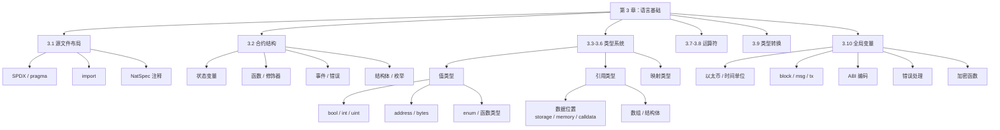
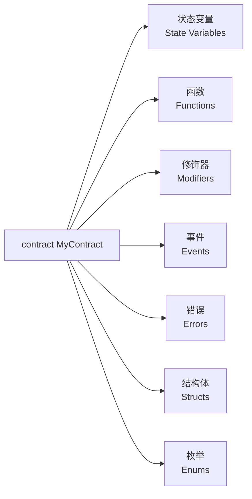
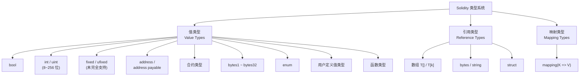
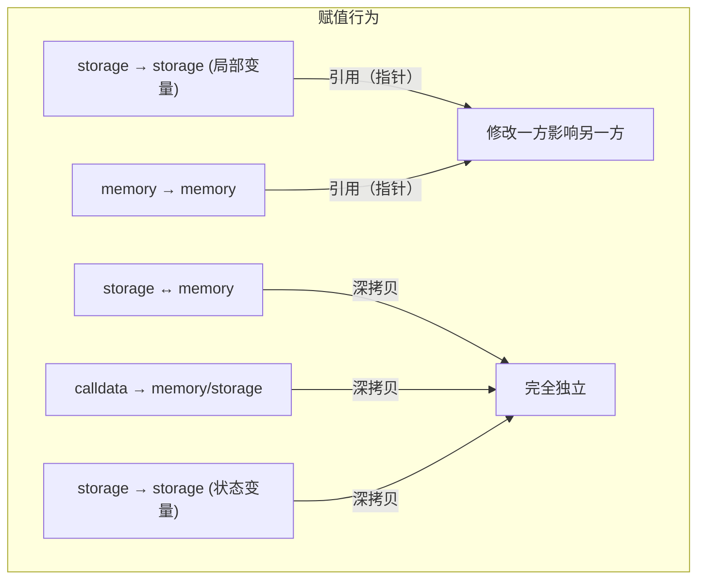

# 第 3 章 — Solidity 语言基础（Language Fundamentals）

> **对应文档**：`soliditydocs/layout-of-source-files.rst`、`soliditydocs/structure-of-a-contract.rst`、`soliditydocs/types.rst`、`soliditydocs/types/*.rst`、`soliditydocs/units-and-global-variables.rst`  
> **预计学习时间**：4 - 5 天  
> **前置知识**：ch01（开发环境搭建）、ch02（第一个合约）  
> **本章目标**：全面掌握 Solidity 源文件结构、合约组成元素、完整类型系统、运算符、全局变量与内置函数

> **JS/TS 读者建议**：本章是整个系列**篇幅最大、信息密度最高**的章节。建议按"3.1→3.2→3.3→3.4→3.5→3.6"顺序精读，3.7-3.10 可作为速查手册随用随查。

---

## 目录

- [章节概述](#章节概述)
- [知识地图](#知识地图)
- [JS/TS 快速对照](#jsts-快速对照)
- [迁移陷阱（JS → Solidity）](#迁移陷阱js--solidity)
- [3.1 源文件布局（Layout of Source Files）](#31-源文件布局layout-of-source-files)
  - [3.1.1 SPDX 许可证标识符](#311-spdx-许可证标识符)
  - [3.1.2 Pragma 版本声明](#312-pragma-版本声明)
  - [3.1.3 ABI Coder Pragma](#313-abi-coder-pragma)
  - [3.1.4 Experimental Pragma](#314-experimental-pragma)
  - [3.1.5 导入语句（Import）](#315-导入语句import)
  - [3.1.6 注释与 NatSpec](#316-注释与-natspec)
- [3.2 合约结构总览（Structure of a Contract）](#32-合约结构总览structure-of-a-contract)
  - [3.2.1 状态变量（State Variables）](#321-状态变量state-variables)
  - [3.2.2 函数与自由函数（Functions & Free Functions）](#322-函数与自由函数functions--free-functions)
  - [3.2.3 函数修饰器（Function Modifiers）](#323-函数修饰器function-modifiers)
  - [3.2.4 事件（Events）](#324-事件events)
  - [3.2.5 错误（Errors）](#325-错误errors)
  - [3.2.6 结构体（Struct Types）](#326-结构体struct-types)
  - [3.2.7 枚举（Enum Types）](#327-枚举enum-types)
- [3.3 类型系统总览](#33-类型系统总览)
- [3.4 值类型（Value Types）](#34-值类型value-types)
  - [3.4.1 布尔型（bool）](#341-布尔型bool)
  - [3.4.2 整数（int / uint）](#342-整数int--uint)
  - [3.4.3 定点数（Fixed Point Numbers）](#343-定点数fixed-point-numbers)
  - [3.4.4 地址类型（address）](#344-地址类型address)
  - [3.4.5 合约类型（Contract Types）](#345-合约类型contract-types)
  - [3.4.6 固定大小字节数组（bytes1 - bytes32）](#346-固定大小字节数组bytes1---bytes32)
  - [3.4.7 字面量类型（Literals）](#347-字面量类型literals)
  - [3.4.8 枚举类型（Enum）](#348-枚举类型enum)
  - [3.4.9 用户定义值类型（User Defined Value Types）](#349-用户定义值类型user-defined-value-types)
  - [3.4.10 函数类型（Function Types）](#3410-函数类型function-types)
  - [值类型默认值速查表](#值类型默认值速查表)
- [3.5 引用类型（Reference Types）](#35-引用类型reference-types)
  - [3.5.1 数据位置（Data Location）](#351-数据位置data-location)
  - [3.5.2 数组（Arrays）](#352-数组arrays)
  - [3.5.3 结构体（Structs）](#353-结构体structs)
- [3.6 映射类型（Mapping Types）](#36-映射类型mapping-types)
  - [3.6.1 映射声明与使用](#361-映射声明与使用)
  - [3.6.2 嵌套映射](#362-嵌套映射)
  - [3.6.3 可迭代映射模式](#363-可迭代映射模式)
- [3.7 运算符（Operators）](#37-运算符operators)
  - [3.7.1 算术运算符](#371-算术运算符)
  - [3.7.2 位运算符](#372-位运算符)
  - [3.7.3 比较运算符](#373-比较运算符)
  - [3.7.4 逻辑运算符](#374-逻辑运算符)
  - [3.7.5 三元运算符](#375-三元运算符)
  - [3.7.6 复合赋值与自增自减](#376-复合赋值与自增自减)
  - [3.7.7 delete 运算符](#377-delete-运算符)
- [3.8 运算符优先级](#38-运算符优先级)
- [3.9 类型转换（Type Conversions）](#39-类型转换type-conversions)
  - [3.9.1 隐式转换](#391-隐式转换)
  - [3.9.2 显式转换](#392-显式转换)
  - [3.9.3 字面量与基本类型之间的转换](#393-字面量与基本类型之间的转换)
- [3.10 单位与全局变量（Units & Global Variables）](#310-单位与全局变量units--global-variables)
  - [3.10.1 以太币单位](#3101-以太币单位)
  - [3.10.2 时间单位](#3102-时间单位)
  - [3.10.3 区块和交易属性](#3103-区块和交易属性)
  - [3.10.4 ABI 编码与解码函数](#3104-abi-编码与解码函数)
  - [3.10.5 错误处理函数](#3105-错误处理函数)
  - [3.10.6 数学和加密函数](#3106-数学和加密函数)
  - [3.10.7 address 类型成员](#3107-address-类型成员)
  - [3.10.8 合约相关](#3108-合约相关)
  - [3.10.9 保留关键字](#3109-保留关键字)
- [Remix 实操练习](#remix-实操练习)
- [本章小结](#本章小结)
- [练习任务](#练习任务)
- [常见问题 FAQ](#常见问题-faq)

---

## 章节概述

本章覆盖 Solidity 语言的所有基础要素——从源文件的第一行许可证声明，到类型系统中的每一种类型，再到运算符和全局变量。这是后续"函数""合约继承""设计模式"等章节的地基。

| 小节 | 内容 | 重要性 | 建议用时 |
| --- | --- | --- | --- |
| 3.1 源文件布局 | SPDX、pragma、import、注释 | ★★★★☆ | 2 h |
| 3.2 合约结构总览 | 状态变量、函数、修饰器、事件、错误、结构体、枚举 | ★★★★★ | 3 h |
| 3.3 类型系统总览 | 静态类型、无 null/undefined、默认值 | ★★★★☆ | 1 h |
| 3.4 值类型 | bool、int/uint、address、bytes1-32、enum、函数类型等 | ★★★★★ | 6 h |
| 3.5 引用类型 | 数据位置、数组、结构体 | ★★★★★ | 4 h |
| 3.6 映射类型 | mapping 声明、嵌套、可迭代模式 | ★★★★★ | 3 h |
| 3.7 运算符 | 算术、位、比较、逻辑、三元、delete | ★★★★☆ | 2 h |
| 3.8 运算符优先级 | 优先级表 | ★★★☆☆ | 0.5 h |
| 3.9 类型转换 | 隐式、显式、字面量转换 | ★★★★☆ | 2 h |
| 3.10 单位与全局变量 | wei/ether、时间、block/msg/tx、ABI 编码、错误处理、加密函数 | ★★★★★ | 4 h |

---

## 知识地图



---

## JS/TS 快速对照

| 你熟悉的 JS/TS | Solidity | 关键差异 |
| --- | --- | --- |
| `"use strict"` | `pragma solidity ^0.8.0;` | Solidity 用 pragma 锁定编译器版本 |
| `import { x } from "./mod"` | `import {x} from "./Mod.sol";` | 语法几乎一致，无 default export |
| JSDoc `/** @param */` | NatSpec `/// @param` | NatSpec 用于链上文档 |
| `class` | `contract` | 合约 ≈ 部署到链上的 class |
| 类属性 | 状态变量（state variable） | 存储在区块链上，修改需要 gas |
| 装饰器 `@auth` | `modifier onlyOwner` + `_;` | 占位符 `_;` 代表原函数体 |
| `EventEmitter.emit()` | `emit Transfer(...)` | 事件写入日志，前端可监听 |
| `throw new Error()` | `revert CustomError()` | 自定义 error 类型，gas 更省 |
| `number` (64 位浮点) | `uint256` (256 位无符号整数) | 无浮点！BigInt 最接近 |
| `undefined` / `null` | **不存在** | 所有变量有默认值（0 / false / address(0)） |
| `Map<K, V>` | `mapping(K => V)` | 不可遍历、无 `.size`、只能在 storage |
| 堆/栈自动管理 | `storage` / `memory` / `calldata` | 必须显式声明数据位置 |
| `JSON.stringify` | `abi.encode(...)` | 二进制 ABI 编码 |
| `delete obj.key` | `delete a` | Solidity delete 重置为默认值 |

---

## 迁移陷阱（JS → Solidity）

- **以为有浮点数**：Solidity 没有 `float` / `double`，`1 / 2 == 0`（整数除法向零取整）。需要金额精度时用 `uint256` 配合 18 位小数位。
- **忘记声明数据位置**：引用类型（数组、结构体）必须标注 `memory` / `storage` / `calldata`，否则编译报错。
- **忽视溢出**：0.8.0+ 默认 checked arithmetic（溢出会 revert），但 `unchecked { ... }` 块内仍可溢出。
- **误用 `tx.origin`**：JS 前端调 API 时习惯看 "发起者"，但合约中用 `tx.origin` 做鉴权有**钓鱼攻击风险**，应使用 `msg.sender`。
- **以为 `delete` 删除数据**：Solidity `delete` 只是重置为默认值（0 / false），不会从 mapping 中移除 key。
- **不理解 gas 成本**：每行代码都要花 gas。存 storage 远比 memory 贵，`string` 拼接远比 JS 昂贵。

---

## 3.1 源文件布局（Layout of Source Files）

一个 Solidity 源文件（`.sol`）可以包含：合约定义、import 指令、pragma 指令、using for 指令，以及文件级的 struct、enum、function、error 和常量定义。

### 3.1.1 SPDX 许可证标识符

每个源文件的**第一行**应声明 SPDX 许可证标识符。编译器会将该字符串嵌入字节码的元数据中。

```solidity
// SPDX-License-Identifier: MIT
```

常用选项：

| 标识符 | 含义 |
| --- | --- |
| `MIT` | MIT 许可证（开源、宽松） |
| `GPL-3.0` | GPL v3（开源、传染性） |
| `Apache-2.0` | Apache 2.0 |
| `UNLICENSED` | 不允许任何使用（私有代码） |
| `UNLICENSE` | 放弃所有权利（公共领域） |

> **JS 对比**：类似 `package.json` 中的 `"license": "MIT"` 字段。区别在于 Solidity 将许可证写在源代码注释里，而非配置文件中。

> **注意**：`UNLICENSED`（无使用许可）和 `UNLICENSE`（放弃所有权利）是完全不同的！

### 3.1.2 Pragma 版本声明

`pragma` 关键字用于启用特定编译器功能或检查。pragma 指令是**文件级**的——导入另一个文件时，该文件的 pragma **不会**自动应用到导入文件。

```solidity
pragma solidity ^0.8.20;    // >=0.8.20 且 <0.9.0
pragma solidity >=0.8.0 <0.9.0;  // 明确指定范围
pragma solidity 0.8.20;     // 只允许精确版本
```

版本约束语法与 npm 的 semver 完全一致：

| 语法 | 含义 | npm 等价 |
| --- | --- | --- |
| `^0.8.20` | >=0.8.20 且 <0.9.0 | `"^0.8.20"` |
| `>=0.8.0 <0.9.0` | 范围 | `">=0.8.0 <0.9.0"` |
| `0.8.20` | 精确版本 | `"0.8.20"` |

> **JS 对比**：类似 `package.json` 的 `engines.node` 或 `.nvmrc`，用 semver 语法限定版本。

> **重要**：pragma 不会改变编译器版本，只检查当前编译器版本是否匹配。

### 3.1.3 ABI Coder Pragma

```solidity
pragma abicoder v2;  // 0.8.0+ 默认启用，支持嵌套数组和结构体
pragma abicoder v1;  // 旧版编码器（已弃用）
```

ABI coder v2 支持编码/解码任意嵌套的数组和结构体。从 Solidity 0.8.0 起默认启用。v1 已弃用并计划移除。

### 3.1.4 Experimental Pragma

```solidity
pragma experimental SMTChecker;  // 启用 SMT 形式化验证（已弃用）
```

实验性 pragma 用于启用尚未稳定的编译器功能。目前 `ABIEncoderV2` 已正式化（通过 `pragma abicoder v2` 启用），`SMTChecker` 已弃用。

### 3.1.5 导入语句（Import）

Solidity 的 import 语法受 ES6 启发，但**不支持 default export**。

```solidity
// 1. 全局导入（不推荐，会污染命名空间）
import "filename.sol";

// 2. 命名空间导入
import * as Lib from "filename.sol";
// 等价写法：
import "filename.sol" as Lib;

// 3. 具名导入（推荐！）
import {symbol1 as alias, symbol2} from "filename.sol";
```

> **JS 对比**：

```javascript
// JS ES6
import * as Lib from "./lib.js";        // 命名空间导入 — 语法一致
import { foo, bar as baz } from "./lib"; // 具名导入 — 语法一致
import Lib from "./lib";                 // 默认导入 — Solidity 不支持！
```

**关键区别**：
- Solidity `import "filename"` 会导入**所有**全局符号到当前作用域（不同于 ES6 的 default export）
- Solidity 的 import 路径指向虚拟文件系统（VFS），由编译器或 Remix/Hardhat 等工具解析
- 推荐总是使用具名导入 `import {X} from "..."` 避免命名冲突

### 3.1.6 注释与 NatSpec

```solidity
// 单行注释

/*
 * 多行注释
 */

/// @notice 这是 NatSpec 单行文档注释
/// @param amount 转账金额
/// @return success 是否成功

/**
 * @notice NatSpec 多行文档注释
 * @dev 面向开发者的说明
 * @param to 接收地址
 */
```

**NatSpec**（Ethereum Natural Language Specification）是 Solidity 的文档注释标准，类似 JSDoc：

| NatSpec 标签 | JSDoc 等价 | 用途 |
| --- | --- | --- |
| `@title` | — | 合约标题 |
| `@author` | `@author` | 作者 |
| `@notice` | `@description` | 面向用户的说明 |
| `@dev` | — | 面向开发者的说明 |
| `@param` | `@param` | 参数说明 |
| `@return` | `@returns` | 返回值说明 |
| `@inheritdoc` | — | 继承父合约的文档 |
| `@custom:xxx` | `@xxx` | 自定义标签 |

> **JS 对比**：注释语法完全相同（`//`、`/* */`）。NatSpec 的 `///` 和 `/** */` 对应 JSDoc 的 `/** */`，但 NatSpec 可被编译器提取到 ABI 元数据中，供前端 DApp 和区块浏览器显示。

---

## 3.2 合约结构总览（Structure of a Contract）

Solidity 中的合约类似于面向对象语言中的**类（class）**。每个合约可以包含以下声明：



### 3.2.1 状态变量（State Variables）

状态变量是**永久存储在区块链 storage 中**的变量。修改它们需要消耗 gas。

```solidity
// SPDX-License-Identifier: MIT
pragma solidity ^0.8.20;

contract SimpleStorage {
    uint storedData;           // 状态变量，默认值 0
    string public name;        // public 自动生成 getter
    address public owner;
    bool public isActive = true;
}
```

> **JS 对比**：
> ```javascript
> class SimpleStorage {
>   storedData = 0;           // 实例属性 — 存在内存中
>   name = "";
>   owner = null;
>   isActive = true;
> }
> ```
> **核心区别**：JS 类的属性存在进程内存中，合约重启即消失。Solidity 状态变量存在区块链上，**除非合约被销毁否则永久存在**。

### 3.2.2 函数与自由函数（Functions & Free Functions）

```solidity
// SPDX-License-Identifier: MIT
pragma solidity ^0.8.20;

contract SimpleAuction {
    function bid() public payable {
        // 合约内函数
    }
}

// 自由函数：定义在合约外部
function helper(uint x) pure returns (uint) {
    return x * 2;
}
```

> **JS 对比**：
> ```javascript
> class SimpleAuction {
>   bid() { /* 类方法 */ }
> }
>
> function helper(x) { return x * 2; } // 模块级函数
> ```
> 合约内函数 ≈ 类方法，自由函数 ≈ 模块级函数。自由函数只能访问合约通过参数传入的数据，不能直接读写状态变量。

### 3.2.3 函数修饰器（Function Modifiers）

修饰器（modifier）允许以声明式方式修改函数行为。`_;` 占位符代表被修饰函数的函数体将在此处执行。

```solidity
// SPDX-License-Identifier: MIT
pragma solidity ^0.8.20;

contract Purchase {
    address public seller;

    constructor() {
        seller = msg.sender;
    }

    modifier onlySeller() {
        require(msg.sender == seller, "Only seller can call this.");
        _; // 原函数体在这里执行
    }

    function abort() public view onlySeller {
        // 只有 seller 可以调用
    }
}
```

> **JS 对比**：类似装饰器模式或高阶函数：
> ```javascript
> function onlySeller(fn) {
>   return function(...args) {
>     if (this.sender !== this.seller) throw new Error("Only seller");
>     return fn.apply(this, args);    // ← 相当于 _;
>   };
> }
> ```
> 但 Solidity modifier 是语言级别的支持，不是运行时的函数包装。修饰器不能重载（不能同名不同参数）。

### 3.2.4 事件（Events）

事件是 EVM 日志机制的便捷接口。它们被写入区块链日志（而非 storage），gas 成本远低于存储。

```solidity
// SPDX-License-Identifier: MIT
pragma solidity ^0.8.20;

event HighestBidIncreased(address bidder, uint amount);

contract SimpleAuction {
    function bid() public payable {
        // ...
        emit HighestBidIncreased(msg.sender, msg.value);
    }
}
```

> **JS 对比**：类似 `EventEmitter` / `CustomEvent`：
> ```javascript
> // Node.js
> emitter.emit("HighestBidIncreased", { bidder, amount });
>
> // 浏览器
> element.dispatchEvent(new CustomEvent("bid", { detail: { bidder, amount } }));
> ```
> **核心区别**：Solidity 事件写入区块链日志，前端通过 `contract.on("EventName", callback)` 监听。事件中标记 `indexed` 的参数可用于过滤查询。

### 3.2.5 错误（Errors）

自定义错误（Solidity 0.8.4+）比字符串 revert 更省 gas，因为错误名和参数被 ABI 编码。

```solidity
// SPDX-License-Identifier: MIT
pragma solidity ^0.8.20;

/// @notice 余额不足
/// @param requested 请求金额
/// @param available 可用余额
error NotEnoughFunds(uint requested, uint available);

contract Token {
    mapping(address => uint) balances;

    function transfer(address to, uint amount) public {
        uint balance = balances[msg.sender];
        if (balance < amount)
            revert NotEnoughFunds(amount, balance);
        balances[msg.sender] -= amount;
        balances[to] += amount;
    }
}
```

> **JS 对比**：类似自定义 Error class + throw：
> ```javascript
> class NotEnoughFunds extends Error {
>   constructor(requested, available) {
>     super(`Not enough funds: requested ${requested}, available ${available}`);
>   }
> }
> if (balance < amount) throw new NotEnoughFunds(amount, balance);
> ```
> **核心区别**：Solidity 的 `revert` 回滚所有状态变更，自定义 error 只存储签名 + 参数（4 字节选择器 + ABI 编码数据），比 `revert("string")` 节省约 50% gas。

### 3.2.6 结构体（Struct Types）

结构体是自定义的复合数据类型。

```solidity
// SPDX-License-Identifier: MIT
pragma solidity ^0.8.20;

contract Ballot {
    struct Voter {
        uint weight;
        bool voted;
        address delegate;
        uint vote;
    }

    mapping(address => Voter) public voters;
}
```

> **JS 对比**：类似 TypeScript 的 interface/type，但 struct 是**值的实际定义**而非类型约束：
> ```typescript
> interface Voter {
>   weight: number;
>   voted: boolean;
>   delegate: string;
>   vote: number;
> }
> ```

### 3.2.7 枚举（Enum Types）

枚举创建一组有限的命名常量。

```solidity
// SPDX-License-Identifier: MIT
pragma solidity ^0.8.20;

contract Purchase {
    enum State { Created, Locked, Inactive }  // 0, 1, 2

    State public state = State.Created;
}
```

> **JS 对比**：类似 TypeScript 的 enum：
> ```typescript
> enum State { Created, Locked, Inactive }  // 0, 1, 2
> ```
> **区别**：Solidity enum 最多 256 个成员（用 `uint8` 表示），必须至少有一个成员。

---

## 3.3 类型系统总览

Solidity 是**静态类型语言**：每个变量（包括状态变量和局部变量）的类型必须在编译时确定。



**三大核心差异（对比 JS）**：

1. **无 `undefined` / `null`**：所有变量在声明时自动获得默认值
2. **必须声明类型**：不能 `let x = 123`，必须 `uint256 x = 123`
3. **值类型 vs 引用类型**：行为与数据位置息息相关

**默认值速查**：

| 类型 | 默认值 | JS 类比 |
| --- | --- | --- |
| `bool` | `false` | `false` |
| `uint` / `int` | `0` | `0` |
| `address` | `0x0000...0000` (零地址) | `null` |
| `bytes1`~`bytes32` | `0x00...00` | — |
| `enum` | 第一个成员（值为 0） | — |
| `string` | `""` (空字符串) | `""` |
| `bytes` | 空 bytes（长度 0） | `new Uint8Array(0)` |
| 动态数组 `T[]` | 空数组（长度 0） | `[]` |
| `mapping` | 所有 key 映射到值类型的默认值 | `new Map()` |
| `struct` | 所有成员为各自默认值 | `{}` |

---

## 3.4 值类型（Value Types）

值类型的变量**总是按值传递**——作为函数参数或在赋值时都会被复制。值类型通常足够小，可以存储在栈上。

### 3.4.1 布尔型（bool）

```solidity
bool isActive = true;
bool isPaused = false;
```

支持的运算符：

| 运算符 | 含义 | 示例 |
| --- | --- | --- |
| `!` | 逻辑非 | `!true == false` |
| `&&` | 逻辑与（短路） | `a && b` |
| `\|\|` | 逻辑或（短路） | `a \|\| b` |
| `==` | 相等 | `a == b` |
| `!=` | 不等 | `a != b` |

短路求值规则与 JS 一致：`f(x) || g(y)` 中若 `f(x)` 为 `true`，则 `g(y)` 不执行。

> **JS 对比**：行为完全一致。但 Solidity 的 bool 不能与其他类型隐式转换——不存在"truthy/falsy"概念，`if (1)` 会编译报错。

```solidity
// Solidity — 编译错误！
// if (1) { ... }           // TypeError: 需要 bool
// if (address(0)) { ... }  // TypeError: 需要 bool

// 正确写法：
if (x != 0) { /* ... */ }
if (addr != address(0)) { /* ... */ }
```

### 3.4.2 整数（int / uint）

Solidity 提供 8 位到 256 位的有符号和无符号整数类型，步长为 8：

| 无符号 | 有符号 | 位宽 | 范围 |
| --- | --- | --- | --- |
| `uint8` | `int8` | 8 | 0~255 / -128~127 |
| `uint16` | `int16` | 16 | 0~65535 / -32768~32767 |
| `uint32` | `int32` | 32 | 0~4.29×10⁹ / ±2.15×10⁹ |
| `uint64` | `int64` | 64 | 0~1.84×10¹⁹ |
| `uint128` | `int128` | 128 | 0~3.40×10³⁸ |
| `uint256` | `int256` | 256 | 0~1.16×10⁷⁷ |

- `uint` 是 `uint256` 的别名
- `int` 是 `int256` 的别名

```solidity
// SPDX-License-Identifier: MIT
pragma solidity ^0.8.20;

contract IntegerDemo {
    uint8 public tiny = 255;       // 最大值
    uint256 public big = 1 ether;  // 1e18
    int256 public negative = -42;

    function getRange() public pure returns (uint256 minVal, uint256 maxVal) {
        minVal = type(uint256).min;  // 0
        maxVal = type(uint256).max;  // 2^256 - 1
    }

    function checkedAdd(uint8 a, uint8 b) public pure returns (uint8) {
        return a + b; // 溢出时自动 revert（0.8.0+ 默认行为）
    }

    function uncheckedAdd(uint8 a, uint8 b) public pure returns (uint8) {
        unchecked {
            return a + b; // 溢出时回绕：255 + 1 == 0
        }
    }
}
```

**算术运算符**：

| 运算符 | 含义 | 注意事项 |
| --- | --- | --- |
| `+` | 加 | 溢出时 revert（checked 模式） |
| `-` | 减 | 下溢时 revert |
| `*` | 乘 | 溢出时 revert |
| `/` | 除 | 向零取整，除以零触发 Panic |
| `%` | 取模 | 除以零触发 Panic |
| `**` | 幂运算 | 指数必须为无符号类型 |

> **JS 对比**：
> - JS `Number` 是 64 位 IEEE 754 浮点数，安全整数范围仅到 2⁵³-1
> - JS `BigInt` 最接近 Solidity 的 `uint256`，但二者不互通
> - Solidity `1 / 2 == 0`（整数除法），JS `1 / 2 === 0.5`（浮点除法）
> - Solidity `0**0 == 1`（EVM 定义），JS `0**0 === 1`（IEEE 定义，一致）

**整数除法的关键区别**：

```solidity
// Solidity
int256(-5) / int256(2)   // == -2（向零取整）
int256(-5) % int256(2)   // == -1（余数与被除数同号）
```

```javascript
// JavaScript
Math.trunc(-5 / 2)       // -2（类似行为）
-5 % 2                   // -1（一致）
```

### 3.4.3 定点数（Fixed Point Numbers）

```solidity
fixed128x18 price;   // 声明可以编译，但不能赋值或运算
ufixed price2;        // ufixed128x18 的别名
```

> **警告**：定点数（`fixed` / `ufixed`）在 Solidity 中**尚未完全支持**。可以声明但不能赋值或参与运算。实际项目中通常用 `uint256` 配合固定精度（如 18 位小数）来模拟。

### 3.4.4 地址类型（address）

地址是以太坊的核心概念，20 字节（160 位）。

```solidity
address addr = 0xdCad3a6d3569DF655070DEd06cb7A1b2Ccd1D3AF;
address payable wallet = payable(addr);
```

**两种地址类型**：

| 类型 | 大小 | 用途 | 额外成员 |
| --- | --- | --- | --- |
| `address` | 20 字节 | 通用地址 | `.balance` `.code` `.codehash` `.call` `.delegatecall` `.staticcall` |
| `address payable` | 20 字节 | 可接收 ETH 的地址 | 继承 address 所有成员 + `.transfer` `.send` |

**转换规则**：
- `address payable` → `address`：隐式转换（安全）
- `address` → `address payable`：需 `payable(addr)` 显式转换
- 合约 → `address`：`address(myContract)`
- `uint160` ↔ `address`：`address(uint160(x))` / `uint160(addr)`

**地址成员详解**：

```solidity
// SPDX-License-Identifier: MIT
pragma solidity ^0.8.20;

contract AddressDemo {
    function demo(address payable recipient) public payable {
        // 查询余额
        uint256 bal = recipient.balance;

        // 查询合约代码
        bytes memory code = recipient.code;
        bytes32 hash = recipient.codehash;

        // 转账（已弃用，建议用 call）
        // recipient.transfer(1 ether);
        // bool sent = recipient.send(1 ether);

        // 推荐：用 call 转账
        (bool success, ) = recipient.call{value: msg.value}("");
        require(success, "Transfer failed");

        // 带函数调用
        (bool ok, bytes memory data) = recipient.call(
            abi.encodeWithSignature("register(string)", "Alice")
        );

        // 控制 gas
        (bool ok2, ) = recipient.call{gas: 100000, value: 1 ether}(
            abi.encodeWithSignature("deposit()")
        );
    }
}
```

> **JS 对比**：
> ```javascript
> const addr = "0xdCad3a6d3569DF655070DEd06cb7A1b2Ccd1D3AF"; // 只是字符串
> const balance = await provider.getBalance(addr);              // 需要 RPC 调用
> ```
> JS 中地址只是普通字符串。Solidity 中 `address` 是一等类型，自带 `.balance` 等成员。

### 3.4.5 合约类型（Contract Types）

每个合约定义自己的类型。合约类型可以与 `address` 类型互相转换。

```solidity
// SPDX-License-Identifier: MIT
pragma solidity ^0.8.20;

interface IERC20 {
    function transfer(address to, uint amount) external returns (bool);
}

contract Wallet {
    function sendToken(IERC20 token, address to, uint amount) external {
        // token 的类型是 IERC20（合约类型）
        token.transfer(to, amount);

        // 获取合约地址
        address tokenAddr = address(token);
    }
}
```

合约类型的成员包括该合约所有 `external` 函数和 `public` 状态变量。合约不支持任何运算符。

### 3.4.6 固定大小字节数组（bytes1 - bytes32）

`bytes1`、`bytes2`、...、`bytes32` 是值类型，存储 1 到 32 字节的固定长度序列。

```solidity
bytes1  a = 0xff;        // 1 字节
bytes4  selector = 0x12345678;
bytes32 hash = keccak256("hello");
```

**运算符**：比较（`<=` `<` `==` `!=` `>=` `>`）、位运算（`&` `|` `^` `~`）、移位（`<<` `>>`）

**成员**：
- `.length`：返回固定长度（只读）
- 索引访问：`x[k]` 返回第 k 个字节（只读）

```solidity
bytes4 b = 0x12345678;
bytes1 first = b[0];  // 0x12
uint len = b.length;   // 4
```

> **注意**：`bytes1[]`（bytes1 的数组）和 `bytes`（动态字节数组）不同。`bytes1[]` 因为对齐填充每个元素浪费 31 字节空间，应优先使用 `bytes`。

> **JS 对比**：类似固定长度的 `Uint8Array`，但 Solidity 中是值类型（按值传递）。

### 3.4.7 字面量类型（Literals）

#### 地址字面量

通过 EIP-55 校验和检查的十六进制字面量自动被识别为 `address` 类型：

```solidity
address addr = 0xdCad3a6d3569DF655070DEd06cb7A1b2Ccd1D3AF;
```

不满足校验和的 39-41 位十六进制数会产生编译错误。

#### 有理数和整数字面量

```solidity
uint256 a = 123;         // 十进制
uint256 b = 123_456;     // 下划线分隔（纯装饰，提高可读性）
uint256 c = 0x2eff_abde; // 十六进制
uint256 d = 2e10;        // 科学记数法 = 20000000000

// 字面量表达式保留无限精度：
uint256 e = (2**800 + 1) - 2**800; // == 1（中间结果不溢出）
uint128 f = 1;
// uint128 g = 2.5 + f + 0.5; // 编译错误！混合字面量与非字面量时精度受限
```

> **JS 对比**：JS 也支持下划线分隔 `123_456` 和科学记数法 `2e10`。区别在于 Solidity 字面量表达式有任意精度，不会在中间步骤溢出。

#### 字符串字面量

```solidity
string memory s1 = "hello";
string memory s2 = 'world';         // 单引号也可以
string memory s3 = "foo" "bar";     // 自动拼接为 "foobar"
bytes32 raw = "stringliteral";      // 解释为原始字节
```

支持的转义字符：`\\`、`\'`、`\"`、`\n`、`\r`、`\t`、`\xNN`（十六进制）、`\uNNNN`（Unicode）。

#### Unicode 字面量

```solidity
string memory greeting = unicode"你好世界 😃";
```

Unicode 字面量用 `unicode` 前缀标记，可包含任意合法的 UTF-8 序列。

#### 十六进制字面量

```solidity
bytes memory data = hex"001122FF";
bytes memory data2 = hex"0011_22_FF";  // 下划线分隔
bytes memory data3 = hex"00112233" hex"44556677"; // 自动拼接
```

### 3.4.8 枚举类型（Enum）

```solidity
// SPDX-License-Identifier: MIT
pragma solidity ^0.8.20;

contract EnumDemo {
    enum ActionChoices { GoLeft, GoRight, GoStraight, SitStill }
    //                     0        1         2          3

    ActionChoices public choice; // 默认值 = GoLeft (0)
    ActionChoices constant DEFAULT = ActionChoices.GoStraight;

    function setChoice(ActionChoices c) public {
        choice = c;
    }

    function getDefault() public pure returns (uint) {
        return uint(DEFAULT); // 显式转换为 uint → 2
    }

    function getRange() public pure returns (ActionChoices, ActionChoices) {
        return (type(ActionChoices).min, type(ActionChoices).max);
        // GoLeft (0), SitStill (3)
    }
}
```

**规则**：
- 最少 1 个成员，最多 256 个成员
- 底层用 `uint8` 表示，从 0 开始编号
- 默认值是第一个成员
- 可在文件级或合约级定义
- 与整数类型之间需要显式转换

> **JS 对比**：
> ```typescript
> enum ActionChoices { GoLeft, GoRight, GoStraight, SitStill }
> console.log(ActionChoices.GoLeft); // 0 — 行为一致
> ```
> TypeScript enum 几乎一致。区别：Solidity enum 不支持字符串值，成员数限制 256。

### 3.4.9 用户定义值类型（User Defined Value Types）

为基本值类型创建零成本抽象，类似别名但类型检查更严格。

```solidity
// SPDX-License-Identifier: MIT
pragma solidity ^0.8.20;

type Price is uint256;
type Quantity is uint256;

contract Shop {
    function calculateTotal(Price p, Quantity q) public pure returns (uint256) {
        // Price 和 Quantity 虽然底层都是 uint256，但不能互相赋值
        // return p * q; // 编译错误！没有定义运算符

        // 必须用 wrap/unwrap 转换
        return Price.unwrap(p) * Quantity.unwrap(q);
    }

    function createPrice(uint256 raw) public pure returns (Price) {
        return Price.wrap(raw);
    }
}
```

> **JS 对比**：类似 TypeScript 的 branded types / opaque types：
> ```typescript
> type Price = number & { __brand: "Price" };
> type Quantity = number & { __brand: "Quantity" };
> ```
> Solidity 在编译级别强制类型安全——`Price` 和 `Quantity` 即使底层都是 `uint256` 也不能混用。

### 3.4.10 函数类型（Function Types）

函数也是一种类型，可以赋值给变量、作为参数传递和返回。

```solidity
// 声明语法
// function (<参数类型>) {internal|external} [pure|view|payable] [returns (<返回类型>)]
```

**内部函数类型**：只能在当前合约内调用（通过跳转到入口标签实现）。

**外部函数类型**：由地址 + 函数选择器组成，可以跨合约传递。

```solidity
// SPDX-License-Identifier: MIT
pragma solidity ^0.8.20;

library ArrayUtils {
    function map(
        uint[] memory self,
        function(uint) pure returns (uint) f  // 函数类型参数
    ) internal pure returns (uint[] memory r) {
        r = new uint[](self.length);
        for (uint i = 0; i < self.length; i++) {
            r[i] = f(self[i]);
        }
    }
}

contract Pyramid {
    using ArrayUtils for uint[];

    function pyramid(uint l) public pure returns (uint) {
        uint[] memory arr = new uint[](l);
        for (uint i = 0; i < l; i++) arr[i] = i;
        uint[] memory squared = arr.map(square);

        uint total = 0;
        for (uint i = 0; i < squared.length; i++) total += squared[i];
        return total;
    }

    function square(uint x) internal pure returns (uint) {
        return x * x;
    }
}
```

**外部函数类型成员**：
- `.address`：返回函数所在合约的地址
- `.selector`：返回 ABI 函数选择器（4 字节）

> **JS 对比**：类似 TypeScript 的函数类型签名：
> ```typescript
> type MathFn = (x: number) => number;
> function map(arr: number[], fn: MathFn): number[] { ... }
> ```
> 核心区别：Solidity 函数类型区分 `internal` 和 `external`，还附带 `pure`/`view`/`payable` 状态可变性标记。

### 值类型默认值速查表

| 类型 | 默认值 | 说明 |
| --- | --- | --- |
| `bool` | `false` | |
| `uint8` ~ `uint256` | `0` | |
| `int8` ~ `int256` | `0` | |
| `address` | `address(0)` | `0x0000000000000000000000000000000000000000` |
| `address payable` | `payable(address(0))` | |
| `bytes1` ~ `bytes32` | `0x00...00` | 全零 |
| `enum` | 第一个成员 | 对应整数值 `0` |
| 用户定义值类型 | 底层类型的默认值 | |
| 函数类型（internal） | 空函数指针（调用会 Panic） | |
| 函数类型（external） | 零地址 + 零选择器 | |

---

## 3.5 引用类型（Reference Types）

引用类型的值可以通过多个名称修改同一份数据。使用引用类型时**必须显式指定数据位置**。

### 3.5.1 数据位置（Data Location）

Solidity 有三种数据位置：

| 数据位置 | 持久性 | 可修改 | 典型用途 | gas 成本 |
| --- | --- | --- | --- | --- |
| `storage` | 永久（链上） | 是 | 状态变量 | **最贵** |
| `memory` | 临时（函数调用期间） | 是 | 函数内局部变量 | 中等 |
| `calldata` | 临时（函数调用期间） | **否** | external 函数参数 | **最便宜** |

```solidity
contract DataLocationDemo {
    uint[] public storageArray; // 状态变量 → 自动在 storage

    function process(
        uint[] calldata input,  // external 输入：calldata
        uint[] memory temp      // 临时数据：memory
    ) external {
        storageArray = input;   // calldata → storage：复制
        uint[] storage ref = storageArray; // storage → storage 局部变量：引用
        ref.push(42);           // 修改 ref 就是修改 storageArray
    }
}
```

**赋值行为矩阵**：



**详细赋值行为表**：

| 源 → 目标 | 行为 | 说明 |
| --- | --- | --- |
| `storage` → `storage` 局部变量 | **引用** | 修改局部变量即修改原数据 |
| `storage` → `memory` | **复制** | 完全独立的副本 |
| `memory` → `memory` | **引用** | 共享同一块内存 |
| `memory` → `storage` | **复制** | 数据写入区块链 |
| `calldata` → `memory` | **复制** | 从只读区域复制到可写区域 |
| `calldata` → `storage` | **复制** | 数据写入区块链 |
| `storage` → `storage` 状态变量 | **复制** | 包括赋值给结构体成员 |

> **JS 对比**：JS 中对象和数组总是按引用传递，没有"数据位置"的概念。Solidity 开发者必须时刻清楚数据在哪里、赋值时是复制还是引用——这是从 JS 迁移到 Solidity 的**最大思维转变**之一。

### 3.5.2 数组（Arrays）

#### 固定大小数组与动态数组

```solidity
uint[5] fixedArray;     // 固定大小：5 个元素
uint[] dynamicArray;    // 动态大小

uint[][5] fiveArrays;   // 5 个动态 uint 数组（注意方向！）
// 访问：fiveArrays[2][6] = 第3个数组的第7个元素
```

> **注意**：`uint[][5]` 是"5 个 `uint[]`"（Solidity 多维数组声明方向与 C 相反）。

#### bytes 和 string

`bytes` 和 `string` 是特殊数组类型：

| 类型 | 底层 | 可索引 | 可获取长度 | 用途 |
| --- | --- | --- | --- | --- |
| `bytes` | 紧密打包的字节序列 | 是 | 是 | 任意二进制数据 |
| `string` | UTF-8 编码的字节 | **否** | **否** | 文本 |
| `bytes1[]` | 带填充的字节数组 | 是 | 是 | 避免使用（浪费空间） |

```solidity
bytes memory data = hex"deadbeef";
uint len = data.length;    // 4
bytes1 b = data[0];        // 0xde

string memory s = "hello";
// uint sLen = s.length;   // 编译错误！string 不支持 .length
uint sLen = bytes(s).length; // 先转 bytes 再取长度：5

// 字符串比较（Solidity 没有内置 == 比较）
bool eq = keccak256(abi.encodePacked(s)) == keccak256(abi.encodePacked("hello"));

// 字符串拼接
string memory greeting = string.concat("Hello, ", "World!");
bytes memory combined = bytes.concat(bytes(s), hex"ff");
```

#### 数组成员

| 成员 | 适用范围 | 说明 |
| --- | --- | --- |
| `.length` | 所有数组 | 元素数量 |
| `.push()` | 动态 storage 数组、`bytes` | 追加零值元素，返回引用 |
| `.push(x)` | 动态 storage 数组、`bytes` | 追加指定元素 |
| `.pop()` | 动态 storage 数组、`bytes` | 删除末尾元素 |

> **注意**：`push` 和 `pop` **只能用于 storage 中的动态数组**。memory 数组创建后大小不可变。

```solidity
// SPDX-License-Identifier: MIT
pragma solidity ^0.8.20;

contract ArrayDemo {
    uint[] public numbers;

    function addNumber(uint n) public {
        numbers.push(n);
    }

    function removeLastNumber() public {
        numbers.pop();
    }

    function getLength() public view returns (uint) {
        return numbers.length;
    }

    function createMemoryArray(uint size) public pure returns (uint[] memory) {
        uint[] memory arr = new uint[](size);
        for (uint i = 0; i < size; i++) {
            arr[i] = i * 2;
        }
        // arr.push(1); // 编译错误！memory 数组不支持 push
        return arr;
    }
}
```

> **JS 对比**：
> ```javascript
> const arr = [];
> arr.push(1);     // Solidity: numbers.push(1)
> arr.pop();       // Solidity: numbers.pop()
> arr.length;      // Solidity: numbers.length
> arr.slice(1, 3); // Solidity: arr[1:3]（仅 calldata 数组）
> ```
> JS 数组是动态的、无类型限制。Solidity 数组需要声明元素类型，且 push/pop 只在 storage 中可用。

#### 数组切片

数组切片（Array Slices）只能用于 **calldata 数组**：

```solidity
function forward(bytes calldata payload) external {
    bytes4 sig = bytes4(payload[:4]);        // 前 4 字节
    bytes calldata data = payload[4:];       // 第 5 字节起
    // start 默认 0，end 默认数组长度
}
```

#### 悬空引用（Dangling References）

操作 storage 数组时需要注意悬空引用问题：

```solidity
contract DanglingRef {
    uint[][] s;

    function dangerous() public {
        uint[] storage ptr = s[s.length - 1]; // 指向最后一个数组
        s.pop();          // 删除最后一个元素
        ptr.push(0x42);   // 写入已不存在的位置！不会 revert 但行为未定义
        s.push();         // 新 push 的元素会包含 0x42（脏数据）
    }
}
```

> **警告**：任何涉及悬空引用的代码都应视为**未定义行为**。每条语句只赋值一次 storage，避免在同一语句中同时修改和读取数组。

### 3.5.3 结构体（Structs）

```solidity
// SPDX-License-Identifier: MIT
pragma solidity ^0.8.20;

struct Funder {
    address addr;
    uint amount;
}

contract CrowdFunding {
    struct Campaign {
        address payable beneficiary;
        uint fundingGoal;
        uint numFunders;
        uint amount;
        mapping(uint => Funder) funders;
    }

    uint numCampaigns;
    mapping(uint => Campaign) campaigns;

    function newCampaign(address payable beneficiary, uint goal)
        public returns (uint campaignID)
    {
        campaignID = numCampaigns++;
        Campaign storage c = campaigns[campaignID];
        c.beneficiary = beneficiary;
        c.fundingGoal = goal;
        // 含 mapping 的 struct 不能用构造器语法创建
    }

    function contribute(uint campaignID) public payable {
        Campaign storage c = campaigns[campaignID];
        c.funders[c.numFunders++] = Funder({
            addr: msg.sender,
            amount: msg.value
        });
        c.amount += msg.value;
    }
}
```

**规则**：
- 结构体可以在文件级或合约级定义
- 结构体可以包含映射和数组
- 结构体不能包含自身类型的成员（但可以是 mapping 的值类型或动态数组的元素类型）
- 含 mapping 的结构体不能在 memory 中创建

> **JS 对比**：
> ```typescript
> interface Campaign {
>   beneficiary: string;
>   fundingGoal: bigint;
>   funders: Map<number, { addr: string; amount: bigint }>;
> }
> ```
> TypeScript interface 仅做类型约束，Solidity struct 定义了真正的存储布局。

---

## 3.6 映射类型（Mapping Types）

### 3.6.1 映射声明与使用

```solidity
mapping(KeyType => ValueType) variableName;
// Solidity 0.8.18+ 支持命名映射：
mapping(address user => uint256 balance) public balances;
```

**键类型限制**：只能使用内置值类型、`bytes`、`string`、合约类型、枚举类型。不能用数组、结构体、映射作为键。

**值类型**：可以是任何类型，包括嵌套映射、数组、结构体。

```solidity
// SPDX-License-Identifier: MIT
pragma solidity ^0.8.20;

contract MappingExample {
    mapping(address => uint) public balances;

    function deposit() public payable {
        balances[msg.sender] += msg.value;
    }

    function getBalance(address user) public view returns (uint) {
        return balances[user]; // 不存在的 key 返回默认值 0
    }
}
```

**重要特性**：
- 所有可能的 key 都"虚拟地"存在，映射到值类型的默认值
- key 本身不被存储，只存储 `keccak256(key)` 哈希用于查找
- 没有 `.length`、没有 key 列表、不能遍历
- 只能在 `storage` 中使用
- 不能作为 public 函数的参数或返回值

> **JS 对比**：
> ```javascript
> const balances = new Map();
> balances.set(addr, amount);
> balances.get(addr);        // undefined if not found
> balances.size;              // Solidity: 不存在
> for (const [k, v] of balances) { ... } // Solidity: 不可能
> ```
> **核心区别**：JS 的 Map 可以遍历、获取大小、检查 key 是否存在。Solidity mapping 都不行。

### 3.6.2 嵌套映射

```solidity
// SPDX-License-Identifier: MIT
pragma solidity ^0.8.20;

contract ERC20Simplified {
    mapping(address => uint256) private _balances;
    mapping(address => mapping(address => uint256)) private _allowances;

    function allowance(address owner, address spender)
        public view returns (uint256)
    {
        return _allowances[owner][spender];
    }

    function approve(address spender, uint256 amount) public returns (bool) {
        _allowances[msg.sender][spender] = amount;
        return true;
    }
}
```

### 3.6.3 可迭代映射模式

由于 mapping 不可遍历，实际项目中经常用**数组 + mapping** 组合实现可迭代映射：

```solidity
// SPDX-License-Identifier: MIT
pragma solidity ^0.8.20;

struct IndexValue {
    uint keyIndex;
    uint value;
}

struct KeyFlag {
    uint key;
    bool deleted;
}

struct IterableMap {
    mapping(uint => IndexValue) data;
    KeyFlag[] keys;
    uint size;
}

library IterableMapping {
    function insert(IterableMap storage self, uint key, uint value)
        internal returns (bool replaced)
    {
        uint keyIndex = self.data[key].keyIndex;
        self.data[key].value = value;
        if (keyIndex > 0) return true;

        keyIndex = self.keys.length;
        self.keys.push();
        self.data[key].keyIndex = keyIndex + 1;
        self.keys[keyIndex].key = key;
        self.size++;
        return false;
    }

    function remove(IterableMap storage self, uint key)
        internal returns (bool success)
    {
        uint keyIndex = self.data[key].keyIndex;
        if (keyIndex == 0) return false;
        delete self.data[key];
        self.keys[keyIndex - 1].deleted = true;
        self.size--;
        return true;
    }

    function contains(IterableMap storage self, uint key)
        internal view returns (bool)
    {
        return self.data[key].keyIndex > 0;
    }

    function iterate(IterableMap storage self)
        internal view returns (uint[] memory allKeys, uint[] memory allValues)
    {
        allKeys = new uint[](self.size);
        allValues = new uint[](self.size);
        uint count = 0;
        for (uint i = 0; i < self.keys.length; i++) {
            if (!self.keys[i].deleted) {
                allKeys[count] = self.keys[i].key;
                allValues[count] = self.data[self.keys[i].key].value;
                count++;
            }
        }
    }
}

contract User {
    IterableMap data;
    using IterableMapping for IterableMap;

    function insert(uint k, uint v) public returns (uint) {
        data.insert(k, v);
        return data.size;
    }

    function sum() public view returns (uint s) {
        (uint[] memory keys, uint[] memory values) = data.iterate();
        for (uint i = 0; i < values.length; i++) {
            s += values[i];
        }
    }
}
```

> **JS 对比**：JS 的 `Map` 原生可遍历，不需要这种 workaround。在 Solidity 中要遍历 mapping 必须手动维护 key 列表——这是 gas 成本与功能之间的权衡。

---

## 3.7 运算符（Operators）

### 3.7.1 算术运算符

| 运算符 | 说明 | 示例 | 注意事项 |
| --- | --- | --- | --- |
| `+` | 加法 | `a + b` | 溢出 revert（checked） |
| `-` | 减法 | `a - b` | 下溢 revert |
| `-` | 取负（一元） | `-a` | 仅有符号类型 |
| `*` | 乘法 | `a * b` | 溢出 revert |
| `/` | 除法 | `a / b` | 向零取整，除零 Panic |
| `%` | 取模 | `a % b` | 除零 Panic |
| `**` | 幂 | `a ** b` | 指数必须无符号 |

```solidity
uint256 a = 10;
uint256 b = 3;
uint256 sum = a + b;    // 13
uint256 diff = a - b;   // 7
uint256 prod = a * b;   // 30
uint256 quot = a / b;   // 3（向零取整）
uint256 rem = a % b;    // 1
uint256 pow = a ** b;   // 1000
```

**运算类型规则**：如果两个操作数类型不同，编译器尝试将一方隐式转换为另一方的类型。转换规则：
1. 若右操作数可隐式转换为左操作数的类型 → 使用左操作数类型
2. 若左操作数可隐式转换为右操作数的类型 → 使用右操作数类型
3. 否则不允许

### 3.7.2 位运算符

| 运算符 | 说明 | 示例 |
| --- | --- | --- |
| `&` | 按位与 | `a & b` |
| `\|` | 按位或 | `a \| b` |
| `^` | 按位异或 | `a ^ b` |
| `~` | 按位取反 | `~a` |
| `<<` | 左移 | `a << n` |
| `>>` | 右移 | `a >> n` |

```solidity
uint8 a = 0xF0;  // 11110000
uint8 b = 0x0F;  // 00001111

uint8 andResult = a & b;  // 0x00 = 00000000
uint8 orResult  = a | b;  // 0xFF = 11111111
uint8 xorResult = a ^ b;  // 0xFF = 11111111
uint8 notResult = ~a;     // 0x0F = 00001111

uint8 shifted = 1 << 4;   // 16 = 00010000
```

> **注意**：移位运算的右操作数必须是无符号类型。移位结果的类型取决于左操作数类型。位运算作用于补码表示。

### 3.7.3 比较运算符

| 运算符 | 说明 | 返回类型 |
| --- | --- | --- |
| `<` | 小于 | `bool` |
| `<=` | 小于等于 | `bool` |
| `>` | 大于 | `bool` |
| `>=` | 大于等于 | `bool` |
| `==` | 等于 | `bool` |
| `!=` | 不等于 | `bool` |

适用于整数、地址、固定字节数组和枚举。

> **JS 对比**：Solidity 只有严格比较（类似 JS 的 `===`），没有 `==` 的隐式类型转换。

### 3.7.4 逻辑运算符

| 运算符 | 说明 | 短路 |
| --- | --- | --- |
| `&&` | 逻辑与 | 是 |
| `\|\|` | 逻辑或 | 是 |
| `!` | 逻辑非 | — |

仅适用于 `bool` 类型。短路规则与 JS 一致。

### 3.7.5 三元运算符

```solidity
uint max = a > b ? a : b;
```

> **JS 对比**：语法和行为一致。但有一个陷阱：
> ```solidity
> // 255 + (true ? 1 : 0) 会溢出！
> // 因为 (true ? 1 : 0) 的类型是 uint8，导致加法在 uint8 范围内计算
> ```
> 三元运算符的结果不是字面量类型，而是两个分支的公共类型。

### 3.7.6 复合赋值与自增自减

```solidity
uint a = 10;
a += 5;   // a = a + 5 → 15
a -= 3;   // a = a - 3 → 12
a *= 2;   // a = a * 2 → 24
a /= 4;   // a = a / 4 → 6
a %= 4;   // a = a % 4 → 2

a++;      // 后缀自增：表达式值为 a，然后 a = a + 1
++a;      // 前缀自增：a = a + 1，表达式值为新 a
a--;      // 后缀自减
--a;      // 前缀自减

// 位运算复合赋值
a |= 0x0F;
a &= 0xF0;
a ^= 0xFF;
a <<= 2;
a >>= 1;
```

### 3.7.7 delete 运算符

`delete` 将变量重置为其类型的**默认值**，不是"删除"。

```solidity
// SPDX-License-Identifier: MIT
pragma solidity ^0.8.20;

contract DeleteDemo {
    uint data = 42;
    uint[] dataArray;
    mapping(address => uint) balances;

    struct User {
        string name;
        uint age;
        mapping(uint => bool) flags;
    }
    mapping(address => User) users;

    function examples() public {
        // 整数：重置为 0
        delete data;          // data == 0

        // 数组：重置为长度 0 的空数组
        dataArray.push(1);
        dataArray.push(2);
        delete dataArray;     // dataArray.length == 0

        // 数组元素：重置单个元素
        dataArray.push(10);
        dataArray.push(20);
        delete dataArray[0];  // dataArray[0] == 0, length 不变

        // mapping 值：重置单个 key 对应的值
        balances[msg.sender] = 100;
        delete balances[msg.sender]; // balances[msg.sender] == 0

        // struct：重置所有非 mapping 成员
        // delete users[msg.sender];
        // — name 变 ""，age 变 0，mapping 不受影响
    }
}
```

> **JS 对比**：
> ```javascript
> delete obj.key;  // 删除属性，obj.key === undefined
> ```
> **核心区别**：
> - JS `delete` 移除对象属性（属性不再存在）
> - Solidity `delete` 重置为默认值（key 仍然"存在"，只是值变为 0/false/""）
> - Solidity `delete` 对 mapping 无效（整体），但可以 `delete mapping[key]`

---

## 3.8 运算符优先级

从高到低（1 = 最高优先级）：

| 优先级 | 描述 | 运算符 |
| --- | --- | --- |
| 1 | 后缀自增/减 | `++` `--` |
| 1 | new 表达式 | `new <typename>` |
| 1 | 数组下标 | `array[index]` |
| 1 | 成员访问 | `object.member` |
| 1 | 函数调用 | `func(args)` |
| 1 | 括号 | `(expr)` |
| 2 | 前缀自增/减 | `++` `--` |
| 2 | 一元负号 | `-` |
| 2 | delete | `delete` |
| 2 | 逻辑非 | `!` |
| 2 | 按位非 | `~` |
| 3 | 幂 | `**` |
| 4 | 乘、除、模 | `*` `/` `%` |
| 5 | 加、减 | `+` `-` |
| 6 | 位移 | `<<` `>>` |
| 7 | 按位与 | `&` |
| 8 | 按位异或 | `^` |
| 9 | 按位或 | `\|` |
| 10 | 不等比较 | `<` `>` `<=` `>=` |
| 11 | 相等比较 | `==` `!=` |
| 12 | 逻辑与 | `&&` |
| 13 | 逻辑或 | `\|\|` |
| 14 | 三元 / 赋值 | `? :` `=` `+=` `-=` `*=` `/=` `%=` `\|=` `&=` `^=` `<<=` `>>=` |
| 15 | 逗号 | `,` |

> **JS 对比**：优先级顺序与 JS 几乎一致，主要区别在于 Solidity 有 `delete` 和 `new` 作为运算符。

---

## 3.9 类型转换（Type Conversions）

### 3.9.1 隐式转换

编译器在赋值、参数传递、运算符操作时自动进行的安全转换。只有在语义合理且不丢失信息时才允许。

```solidity
uint8 a = 12;
uint16 b = a;      // OK：uint8 → uint16（扩展）
uint32 c = a + b;  // OK：结果自动提升为 uint16，再隐式转为 uint32

// int8 x = -1;
// uint256 y = x;  // 编译错误！int8 不能隐式转为 uint256（可能是负数）
```

**隐式转换规则**：
- `uint8` → `uint16` → ... → `uint256`：允许（位宽扩展）
- `int8` → `int16` → ... → `int256`：允许
- `int8` → `uint256`：**不允许**（负数无法表示）
- `address payable` → `address`：允许
- `address` → `address payable`：**不允许**（需显式 `payable()`）

### 3.9.2 显式转换

当编译器不允许隐式转换时，可以使用显式转换。可能导致意外行为。

```solidity
// 整数截断
uint32 a = 0x12345678;
uint16 b = uint16(a);    // b = 0x5678（高位被截断）

// 整数扩展
uint16 c = 0x1234;
uint32 d = uint32(c);    // d = 0x00001234（高位补零）

// 有符号 → 无符号
int y = -3;
uint x = uint(y);        // x = 0xFFFF...FFFD（二进制补码）

// bytes 截断（右截断，与整数相反！）
bytes2 e = 0x1234;
bytes1 f = bytes1(e);    // f = 0x12（保留左侧/高位字节）

// bytes 扩展（右补零）
bytes2 g = 0x1234;
bytes4 h = bytes4(g);    // h = 0x12340000

// 整数与 bytes 之间需要中间步骤
bytes2 i = 0x1234;
uint32 j = uint16(i);         // j = 0x00001234（整数语义：保留数值）
uint32 k = uint32(bytes4(i)); // k = 0x12340000（bytes 语义：保留位置）
```

**整数 vs bytes 截断方向**：

| 操作 | 截断方向 | 示例 |
| --- | --- | --- |
| 整数缩小 | 高位截断（保留低位） | `uint32(0x12345678)` → `uint16` = `0x5678` |
| bytes 缩小 | 低位截断（保留高位） | `bytes4(0x12345678)` → `bytes2` = `0x1234` |
| 整数扩大 | 左侧补零 | `uint16(0x1234)` → `uint32` = `0x00001234` |
| bytes 扩大 | 右侧补零 | `bytes2(0x1234)` → `bytes4` = `0x12340000` |

### 3.9.3 字面量与基本类型之间的转换

```solidity
// 整数字面量 — 只要不截断就可以隐式转换
uint8 a = 12;         // OK
uint32 b = 1234;      // OK
// uint16 c = 0x123456; // 错误！需要截断为 0x3456

// 十六进制字面量 → bytes：hex 位数必须精确匹配
// bytes2 d = 0x12;    // 错误！只有 1 字节
bytes2 e = 0x1234;    // OK：精确 2 字节
bytes4 f = 0;         // OK：零值特例

// 字符串字面量 → bytes：长度 <= bytes 大小
bytes2 g = "xy";      // OK：2 字符
// bytes2 h = "xyz";  // 错误！3 字符 > 2 字节

// 地址转换（0.8.0+）
// address a = uint160(someUint); // OK
// address a = uint8(1);          // 错误！只允许 uint160 和 bytes20
address payable p = payable(someAddr);
```

> **JS 对比**：JS 有隐式类型强制转换（type coercion）如 `"5" + 1 === "51"`。Solidity 的隐式转换规则远比 JS 严格——不允许任何可能丢失数据的隐式转换。这使得 Solidity 代码更安全但也更啰嗦。

---

## 3.10 单位与全局变量（Units & Global Variables）

### 3.10.1 以太币单位

| 单位 | 值（wei） | 说明 |
| --- | --- | --- |
| `wei` | 1 | 最小单位 |
| `gwei` | 10⁹ | gas 价格常用单位 |
| `ether` | 10¹⁸ | 用户界面常用单位 |

```solidity
assert(1 wei == 1);
assert(1 gwei == 1e9);
assert(1 ether == 1e18);

uint256 price = 0.5 ether;  // 500000000000000000 wei
uint256 gasPrice = 20 gwei; // 20000000000 wei
```

> **注意**：`finney` 和 `szabo` 在 0.7.0 中已被移除。

> **JS 对比**：ethers.js 中使用 `ethers.parseEther("0.5")` 进行单位转换。Solidity 中直接用字面量后缀。

### 3.10.2 时间单位

| 单位 | 等于 |
| --- | --- |
| `1 seconds` | `1` |
| `1 minutes` | `60 seconds` |
| `1 hours` | `60 minutes` = `3600` |
| `1 days` | `24 hours` = `86400` |
| `1 weeks` | `7 days` = `604800` |

```solidity
function isExpired(uint startTime, uint daysAfter) public view returns (bool) {
    return block.timestamp >= startTime + daysAfter * 1 days;
}

uint256 lockDuration = 30 days;
uint256 cooldown = 2 hours;
uint256 interval = 15 minutes;
```

> **注意**：`years` 在 0.5.0 中已被移除（因为闰年导致天数不固定）。时间后缀不能用在变量上，只能用在字面量上：`uint d = 5; d * 1 days` 而非 `d days`。

### 3.10.3 区块和交易属性

#### 完整参考表

| 属性/函数 | 类型 | 说明 |
| --- | --- | --- |
| `blockhash(uint blockNumber)` | `bytes32` | 给定区块的哈希（仅最近 256 个区块，否则返回零） |
| `blobhash(uint index)` | `bytes32` | 当前交易第 index 个 blob 的版本哈希（EIP-4844） |
| `block.basefee` | `uint` | 当前区块的基础费用（EIP-1559） |
| `block.blobbasefee` | `uint` | 当前区块的 blob 基础费用（EIP-4844） |
| `block.chainid` | `uint` | 当前链 ID |
| `block.coinbase` | `address payable` | 当前区块矿工/验证者地址 |
| `block.difficulty` | `uint` | 当前区块难度（Paris 后是 `prevrandao` 的弃用别名） |
| `block.gaslimit` | `uint` | 当前区块 gas 上限 |
| `block.number` | `uint` | 当前区块号 |
| `block.prevrandao` | `uint` | 信标链提供的随机数（Paris+） |
| `block.timestamp` | `uint` | 当前区块时间戳（Unix 秒） |
| `gasleft()` | `uint256` | 剩余 gas |
| `msg.data` | `bytes calldata` | 完整的 calldata |
| `msg.sender` | `address` | 消息发送者（当前调用的直接调用者） |
| `msg.sig` | `bytes4` | calldata 的前 4 字节（函数选择器） |
| `msg.value` | `uint` | 随消息发送的 wei 数量 |
| `tx.gasprice` | `uint` | 交易的 gas 价格 |
| `tx.origin` | `address` | 交易的原始发起者（完整调用链的起点） |

```solidity
// SPDX-License-Identifier: MIT
pragma solidity ^0.8.20;

contract BlockTxDemo {
    event Info(
        address sender,
        uint value,
        uint timestamp,
        uint blockNum,
        uint gasLeft
    );

    function getInfo() public payable {
        emit Info(
            msg.sender,        // 调用者地址
            msg.value,         // 发送的 ETH（wei）
            block.timestamp,   // 区块时间
            block.number,      // 区块高度
            gasleft()          // 剩余 gas
        );
    }

    function whoCalledMe() public view returns (
        address directCaller,
        address originalSender
    ) {
        directCaller = msg.sender;   // 直接调用者（可能是另一个合约）
        originalSender = tx.origin;  // 原始 EOA（不推荐用于鉴权！）
    }
}
```

> **安全警告**：`msg.sender` 和 `msg.value` 在每次 external 调用中都可能改变。`tx.origin` 是交易发起的 EOA 地址——**不要用 `tx.origin` 做身份验证**（容易被钓鱼合约利用）。

> **JS 对比**：
> ```javascript
> // ethers.js
> const block = await provider.getBlock("latest");
> block.timestamp;  // ≈ block.timestamp
> block.number;     // ≈ block.number
> // msg.sender 无直接对应，需要从签名恢复
> ```

### 3.10.4 ABI 编码与解码函数

| 函数 | 返回 | 说明 |
| --- | --- | --- |
| `abi.encode(...)` | `bytes memory` | ABI 编码（每个参数 32 字节对齐） |
| `abi.encodePacked(...)` | `bytes memory` | 紧密编码（无填充，**可能有歧义**） |
| `abi.encodeWithSelector(bytes4, ...)` | `bytes memory` | 在编码前插入 4 字节选择器 |
| `abi.encodeWithSignature(string, ...)` | `bytes memory` | 自动计算选择器 |
| `abi.encodeCall(fn, (...))` | `bytes memory` | 类型安全的编码（0.8.11+） |
| `abi.decode(bytes, (types))` | `(...)` | ABI 解码 |

```solidity
// SPDX-License-Identifier: MIT
pragma solidity ^0.8.20;

contract ABIDemo {
    function encodeExamples() public pure returns (bytes memory, bytes memory) {
        // abi.encode: 标准 ABI 编码，每个参数 32 字节
        bytes memory encoded = abi.encode(uint256(1), address(0x123), "hello");

        // abi.encodePacked: 紧密编码，无填充
        bytes memory packed = abi.encodePacked(uint8(1), uint16(2), "hello");

        return (encoded, packed);
    }

    function hashExample() public pure returns (bytes32) {
        // 常见用法：计算哈希
        return keccak256(abi.encodePacked("hello", "world"));
    }

    function decodeExample(bytes memory data) public pure returns (uint, address) {
        // 解码
        (uint a, address b) = abi.decode(data, (uint, address));
        return (a, b);
    }

    function callOtherContract(address target) public returns (bool) {
        // 构造调用数据
        bytes memory callData = abi.encodeWithSignature(
            "transfer(address,uint256)",
            msg.sender,
            100
        );
        (bool success, ) = target.call(callData);
        return success;
    }
}
```

> **JS 对比**：
> ```javascript
> // abi.encode ≈ ABI 编码
> const abiCoder = new ethers.AbiCoder();
> const encoded = abiCoder.encode(["uint256", "address"], [1, "0x123..."]);
>
> // abi.encodePacked ≈ ethers.solidityPacked
> const packed = ethers.solidityPacked(["uint8", "string"], [1, "hello"]);
>
> // abi.decode ≈ ABI 解码
> const decoded = abiCoder.decode(["uint256", "address"], encoded);
>
> // 整体概念类似 JSON.stringify / JSON.parse，但是二进制编码
> ```

> **注意**：`abi.encodePacked` 的紧密编码可能存在歧义（不同参数组合产生相同编码），不要直接用于哈希需要唯一性保证的场景。

### 3.10.5 错误处理函数

| 函数 | 用途 | 触发条件 | gas 退还 |
| --- | --- | --- | --- |
| `assert(bool)` | 内部错误检测 | 条件为 false → Panic(0x01) | 消耗所有剩余 gas |
| `require(bool)` | 输入/前置条件验证 | 条件为 false → revert | 退还剩余 gas |
| `require(bool, string)` | 带消息的验证 | 条件为 false → revert(message) | 退还剩余 gas |
| `revert()` | 无条件回退 | 总是触发 | 退还剩余 gas |
| `revert(string)` | 带消息的回退 | 总是触发 | 退还剩余 gas |
| `revert CustomError()` | 自定义错误回退 | 总是触发 | 退还剩余 gas |

```solidity
// SPDX-License-Identifier: MIT
pragma solidity ^0.8.20;

error InsufficientBalance(uint256 available, uint256 required);

contract ErrorHandlingDemo {
    mapping(address => uint256) balances;

    // require: 验证输入条件
    function transfer1(address to, uint256 amount) public {
        require(to != address(0), "Cannot transfer to zero address");
        require(balances[msg.sender] >= amount, "Insufficient balance");
        balances[msg.sender] -= amount;
        balances[to] += amount;
    }

    // revert + 自定义 error（推荐：最省 gas）
    function transfer2(address to, uint256 amount) public {
        if (to == address(0)) revert("Zero address");
        if (balances[msg.sender] < amount)
            revert InsufficientBalance(balances[msg.sender], amount);
        balances[msg.sender] -= amount;
        balances[to] += amount;
    }

    // assert: 检测不应发生的内部错误
    function internalCheck(uint256 x) public pure returns (uint256) {
        uint256 result = x * 2;
        assert(result / 2 == x); // 如果数学逻辑有误，这里会 Panic
        return result;
    }
}
```

> **JS 对比**：
> ```javascript
> console.assert(x > 0);                           // ≈ assert() — 不中断执行
> if (!condition) throw new Error("message");       // ≈ require(condition, "message")
> throw new InsufficientBalanceError(available, required); // ≈ revert CustomError()
> ```
> **核心区别**：JS 的 throw 不会自动回滚之前的操作。Solidity 的 revert 会**回滚整个交易中该调用帧内的所有状态变更**。

### 3.10.6 数学和加密函数

| 函数 | 返回类型 | 说明 |
| --- | --- | --- |
| `addmod(uint x, uint y, uint k)` | `uint` | `(x + y) % k`（加法不溢出） |
| `mulmod(uint x, uint y, uint k)` | `uint` | `(x * y) % k`（乘法不溢出） |
| `keccak256(bytes memory)` | `bytes32` | Keccak-256 哈希 |
| `sha256(bytes memory)` | `bytes32` | SHA-256 哈希 |
| `ripemd160(bytes memory)` | `bytes20` | RIPEMD-160 哈希 |
| `ecrecover(bytes32 hash, uint8 v, bytes32 r, bytes32 s)` | `address` | 从签名恢复地址（失败返回 0） |

```solidity
// SPDX-License-Identifier: MIT
pragma solidity ^0.8.20;

contract CryptoDemo {
    function hashExamples(string memory input) public pure returns (
        bytes32 keccakHash,
        bytes32 sha256Hash,
        bytes20 ripemdHash
    ) {
        keccakHash = keccak256(abi.encodePacked(input));
        sha256Hash = sha256(abi.encodePacked(input));
        ripemdHash = ripemd160(abi.encodePacked(input));
    }

    function modMathExamples() public pure returns (uint, uint) {
        uint a = addmod(10, 15, 12); // (10 + 15) % 12 = 1
        uint b = mulmod(3, 5, 7);    // (3 * 5) % 7 = 1
        return (a, b);
    }

    function verifySignature(
        bytes32 messageHash,
        uint8 v,
        bytes32 r,
        bytes32 s
    ) public pure returns (address) {
        address signer = ecrecover(messageHash, v, r, s);
        require(signer != address(0), "Invalid signature");
        return signer;
    }
}
```

> **JS 对比**：
> ```javascript
> // ethers.js
> ethers.keccak256(ethers.toUtf8Bytes("hello"));  // ≈ keccak256
> ethers.sha256(ethers.toUtf8Bytes("hello"));      // ≈ sha256
> ethers.recoverAddress(digest, signature);         // ≈ ecrecover
> ```

### 3.10.7 address 类型成员

| 成员 | 类型 | 说明 |
| --- | --- | --- |
| `<address>.balance` | `uint256` | 地址余额（wei） |
| `<address>.code` | `bytes memory` | 地址上的合约字节码 |
| `<address>.codehash` | `bytes32` | 代码的 Keccak-256 哈希 |
| `<address payable>.transfer(uint256)` | — | 发送 ETH，失败 revert（**已弃用**） |
| `<address payable>.send(uint256)` | `bool` | 发送 ETH，失败返回 false（**已弃用**） |
| `<address>.call(bytes memory)` | `(bool, bytes memory)` | 低级 CALL |
| `<address>.delegatecall(bytes memory)` | `(bool, bytes memory)` | 低级 DELEGATECALL |
| `<address>.staticcall(bytes memory)` | `(bool, bytes memory)` | 低级 STATICCALL |

```solidity
// SPDX-License-Identifier: MIT
pragma solidity ^0.8.20;

contract AddressMembersDemo {
    // 推荐的 ETH 转账方式
    function sendEther(address payable to) public payable {
        (bool success, ) = to.call{value: msg.value}("");
        require(success, "Transfer failed");
    }

    // 检查是否是合约地址
    function isContract(address addr) public view returns (bool) {
        return addr.code.length > 0;
    }

    // 获取余额
    function checkBalance(address addr) public view returns (uint256) {
        return addr.balance;
    }

    // delegatecall — 使用目标合约的代码但保持当前上下文
    function executeDelegatecall(address logic, bytes memory data)
        public returns (bytes memory)
    {
        (bool success, bytes memory result) = logic.delegatecall(data);
        require(success, "Delegatecall failed");
        return result;
    }
}
```

> **警告**：`transfer()` 和 `send()` 已弃用并计划移除。它们固定 2300 gas 的限制在 gas 成本变化后不再可靠。推荐使用 `call{value: amount}("")` 并检查返回值。

### 3.10.8 合约相关

| 表达式 | 类型 | 说明 |
| --- | --- | --- |
| `this` | 当前合约类型 | 当前合约实例，可显式转为 `address` |
| `super` | — | 继承链中的上一级合约 |
| `selfdestruct(address payable)` | — | 销毁合约并发送余额（**已弃用**，EIP-6780） |
| `type(C).name` | `string` | 合约名称 |
| `type(C).creationCode` | `bytes memory` | 创建时字节码 |
| `type(C).runtimeCode` | `bytes memory` | 运行时字节码 |
| `type(I).interfaceId` | `bytes4` | ERC-165 接口 ID |
| `type(T).min` | 取决于 T | 整数/枚举类型最小值 |
| `type(T).max` | 取决于 T | 整数/枚举类型最大值 |

```solidity
// SPDX-License-Identifier: MIT
pragma solidity ^0.8.20;

interface IERC165 {
    function supportsInterface(bytes4 interfaceId) external view returns (bool);
}

contract TypeInfoDemo is IERC165 {
    function getContractInfo() public view returns (
        address selfAddr,
        string memory name
    ) {
        selfAddr = address(this);
        name = type(TypeInfoDemo).name; // "TypeInfoDemo"
    }

    function getIntRange() public pure returns (uint256 uMin, uint256 uMax, int256 iMin, int256 iMax) {
        uMin = type(uint256).min;  // 0
        uMax = type(uint256).max;  // 2^256 - 1
        iMin = type(int256).min;   // -(2^255)
        iMax = type(int256).max;   // 2^255 - 1
    }

    function supportsInterface(bytes4 interfaceId) public pure override returns (bool) {
        return interfaceId == type(IERC165).interfaceId;
    }
}
```

### 3.10.9 保留关键字

以下关键字在 Solidity 中**保留**，未来可能成为语法的一部分：

```
after, alias, apply, auto, byte, case, copyof, default, define, final,
implements, in, inline, let, macro, match, mutable, null, of, partial,
promise, reference, relocatable, sealed, sizeof, static, supports,
switch, typedef, typeof, var
```

> **注意**：不要使用这些作为标识符名称，即使当前编译器不报错，未来版本可能会冲突。

---

## Remix 实操练习

以下练习建议在 [Remix IDE](https://remix.ethereum.org/) 中完成：

**练习 1：源文件布局**

1. 创建新文件 `Practice01.sol`
2. 添加 SPDX 许可证和 pragma
3. 创建一个空合约 `Practice01`
4. 添加 NatSpec 文档注释

**练习 2：类型探索**

1. 在合约中声明所有值类型的状态变量（bool、uint256、int8、address、bytes32、枚举）
2. 编写一个 `getDefaults()` 函数，不赋值直接返回所有变量的默认值
3. 在 Remix 中部署并验证默认值

**练习 3：数据位置**

1. 创建一个管理 `uint[]` 数组的合约
2. 编写使用 `storage` 引用修改数组的函数
3. 编写使用 `memory` 复制数组的函数
4. 观察两者行为的差异

**练习 4：全局变量**

1. 创建合约，在事件中记录 `msg.sender`、`msg.value`、`block.timestamp`、`block.number`
2. 编写使用 `keccak256` 哈希字符串的函数
3. 使用 `abi.encode` 和 `abi.decode` 编解码数据

---

## 本章小结

- **源文件布局**：每个 `.sol` 文件以 SPDX 许可证开头，用 `pragma` 锁定编译器版本，用 `import` 导入依赖
- **合约结构**：合约由状态变量、函数、修饰器、事件、错误、结构体、枚举组成
- **类型系统**：静态类型，无 null/undefined，所有变量有默认值
- **值类型**：bool、int/uint（8-256）、address/address payable、bytes1-32、enum、函数类型——总是按值复制
- **引用类型**：数组、结构体——必须声明数据位置（storage/memory/calldata），赋值行为取决于位置组合
- **映射类型**：`mapping(K => V)` 是链上的键值对存储，不可遍历，只能在 storage 中使用
- **运算符**：算术运算默认 checked（溢出 revert），`delete` 重置为默认值而非删除
- **类型转换**：隐式转换只在安全时发生，显式转换需要程序员负责数据安全
- **全局变量**：`block.*`、`msg.*`、`tx.*` 提供链上上下文；ABI 编码函数用于数据序列化；`keccak256` 是最常用的哈希函数

---

## 练习任务

### 任务 1：多类型存储合约

创建合约 `TypeVault`，包含以下功能：
- 状态变量覆盖：`bool`、`uint256`、`int256`、`address`、`bytes32`、自定义 `enum Status`
- `setAll(...)` 函数一次性设置所有变量
- `getAll()` 函数返回所有变量的当前值
- `resetAll()` 函数使用 `delete` 重置所有变量
- 部署后验证默认值，修改后验证新值，重置后验证回到默认值

### 任务 2：数组与映射操作合约

创建合约 `DataStore`，实现：
- `uint256[]` 动态数组的增删改查（push/pop/update/get）
- `mapping(address => uint256)` 的存取
- `mapping(address => uint256[])` 嵌套结构的操作
- 一个函数演示 storage 引用 vs memory 复制的行为差异

### 任务 3：简易银行合约

创建合约 `SimpleBank`，实现：
- `deposit()` — 接收 ETH，用 `msg.value` 记录到 `mapping(address => uint256) balances`
- `withdraw(uint256 amount)` — 提取 ETH，使用 `require` 检查余额，用 `call` 发送
- `getBalance()` — 查询调用者余额
- `getContractBalance()` — 查询合约总余额（`address(this).balance`）
- 事件 `Deposited(address indexed user, uint256 amount)` 和 `Withdrawn(address indexed user, uint256 amount)`
- 自定义错误 `InsufficientBalance(uint256 available, uint256 requested)`

### 任务 4：哈希与编码练习

创建合约 `HashUtils`，实现：
- `hash(string memory input)` — 返回 `keccak256` 哈希
- `hashPacked(string memory a, string memory b)` — 返回 `abi.encodePacked` 后的哈希
- `encodeAndDecode(uint256 x, address y)` — 编码后解码，验证数据一致
- `getBlockInfo()` — 返回当前 `block.number`、`block.timestamp`、`block.chainid`、`gasleft()`

---

## 常见问题 FAQ

**Q1：`uint` 和 `uint256` 有什么区别？**

没有区别。`uint` 是 `uint256` 的别名，`int` 是 `int256` 的别名。在正式项目中建议**显式写 `uint256`**，提高代码可读性。

**Q2：为什么有 `address` 和 `address payable` 两种类型？**

这是一种类型安全设计。`address payable` 表示"这个地址可以接收 ETH"，拥有 `.transfer()` 和 `.send()` 方法。普通 `address` 不允许直接转账。从 `address` 转为 `address payable` 需要显式调用 `payable(addr)`，这迫使开发者有意识地确认"我确实要向这个地址发 ETH"。

**Q3：`storage`、`memory`、`calldata` 什么时候用哪个？**

- **状态变量**：自动是 `storage`，不需要声明
- **external 函数的引用类型参数**：优先用 `calldata`（最省 gas、不可修改）
- **public/internal 函数的引用类型参数**：用 `memory`
- **函数内的临时变量**：用 `memory`
- **需要修改状态变量的局部引用**：用 `storage`

**Q4：为什么 Solidity 的 `delete` 不像 JS 的 `delete`？**

设计哲学不同。JS `delete obj.key` 移除属性，使其变为 `undefined`。但 Solidity 中不存在 `undefined`——所有存储槽始终有值。`delete` 的语义是"重置为该类型的默认值"（0、false、address(0) 等）。对于 mapping，`delete` 整个 mapping 是无效的（因为无法枚举所有 key），但可以 `delete mapping[key]` 重置单个键的值。

**Q5：`msg.sender` 和 `tx.origin` 有什么区别？为什么不要用 `tx.origin` 做权限控制？**

- `msg.sender`：当前函数调用的直接调用者。如果用户 A 调用合约 B，合约 B 再调用合约 C，在合约 C 中 `msg.sender` 是合约 B 的地址。
- `tx.origin`：交易的原始发起者（一定是 EOA）。上述例子中 `tx.origin` 始终是用户 A。

用 `tx.origin` 做权限控制的风险：恶意合约可以"代替"用户调用你的合约。用户 A 调用恶意合约 M，M 再调用你的合约 C——C 中 `tx.origin == A`（通过检查），但实际操作者是 M（钓鱼攻击）。

**Q6：`abi.encode` 和 `abi.encodePacked` 有什么区别？该用哪个？**

- `abi.encode`：标准 ABI 编码，每个参数占 32 字节（不足补零）。结果**无歧义**。
- `abi.encodePacked`：紧密编码，不填充。多个变长参数可能产生**编码碰撞**（不同输入相同编码）。

规则：与合约交互（调用函数、解码返回值）用 `abi.encode`。计算哈希时可以用 `abi.encodePacked`，但如果参数中有多个变长类型（string、bytes），应改用 `abi.encode` 避免碰撞。

**Q7：`assert` 和 `require` 该用哪个？**

- `require`：用于验证**外部输入和前置条件**（用户传入的参数、外部调用的返回值、权限检查）。失败时退还剩余 gas。
- `assert`：用于检测**不应该发生的内部错误**（数学不变量、逻辑断言）。失败表示代码有 bug。

从 Solidity 0.8.0+ 起，`assert` 失败也会退还剩余 gas（之前会消耗所有 gas），但语义上仍应区分使用。

**Q8：Solidity 中如何比较字符串？**

Solidity 没有内置的字符串比较运算符。通用做法是比较哈希：

```solidity
function isEqual(string memory a, string memory b) public pure returns (bool) {
    return keccak256(abi.encodePacked(a)) == keccak256(abi.encodePacked(b));
}
```

---

> **下一章**：[第 4 章 — 合约核心特性与控制流](ch04-contract-core-features.md)（if/else、for/while、函数定义、可见性、状态可变性）

---

<p align="center"><sub>Solidity 学习系列 · 面向 JavaScript/TypeScript 开发者 · 基于 Solidity 0.8.20+</sub></p>
