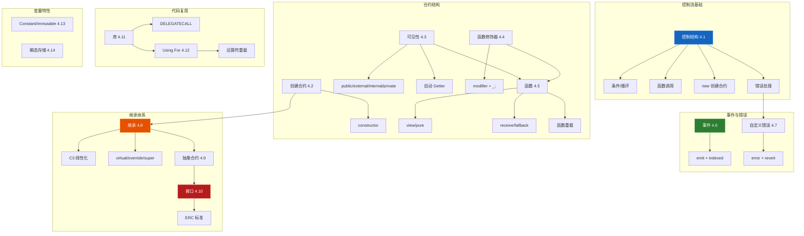
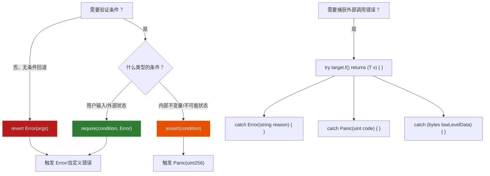
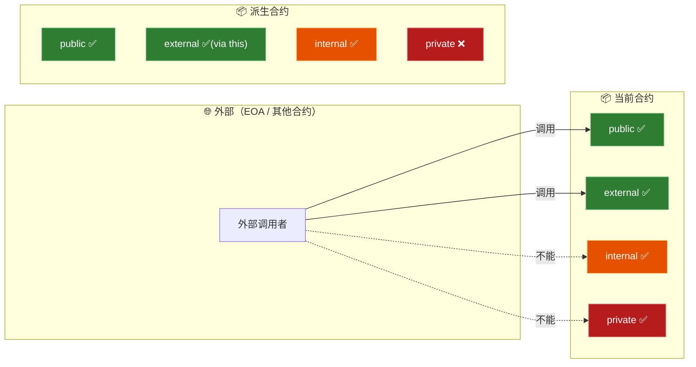
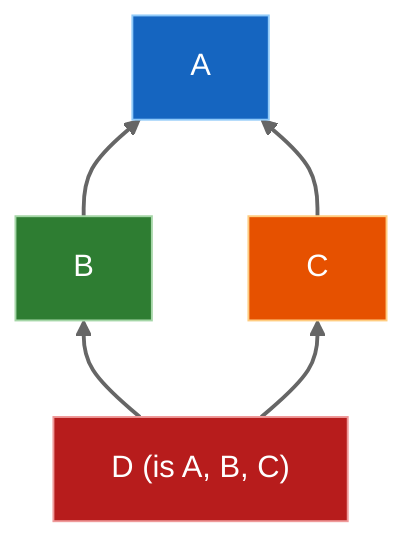
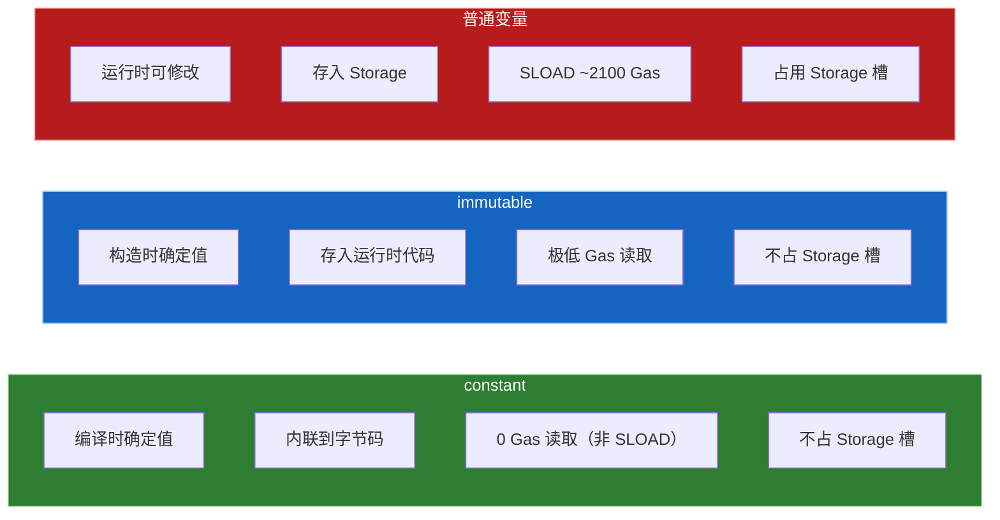

# 第 4 章 — 合约核心特性与控制流（Contract Features & Control Flow）

> **预计学习时间**：4 - 5 天
> **前置知识**：ch01（开发环境）、ch02（值类型与引用类型）、ch03（存储模型与数据位置）
> **本章目标**：深入掌握合约的控制结构、函数定义、可见性、继承体系、事件、错误处理等核心特性

> **JS/TS 读者建议**：本章涵盖了 Solidity 合约开发中最密集的知识点。建议先通读一遍目录，再按顺序逐节攻破。每节的 JS 对比会帮你快速建立直觉。

---

## 目录

- [章节概述](#章节概述)
- [知识地图](#知识地图)
- [JS/TS 快速对照](#jsts-快速对照)
- [迁移陷阱（JS → Solidity）](#迁移陷阱js--solidity)
- [4.1 控制结构](#41-控制结构)
- [4.2 创建合约](#42-创建合约)
- [4.3 可见性与 Getter](#43-可见性与-getter)
- [4.4 函数修饰器](#44-函数修饰器)
- [4.5 函数](#45-函数)
- [4.6 事件](#46-事件)
- [4.7 自定义错误](#47-自定义错误)
- [4.8 继承](#48-继承)
- [4.9 抽象合约](#49-抽象合约)
- [4.10 接口](#410-接口)
- [4.11 库](#411-库)
- [4.12 Using For 指令](#412-using-for-指令)
- [4.13 Constant 和 Immutable](#413-constant-和-immutable)
- [4.14 瞬态存储（Transient Storage）](#414-瞬态存储transient-storage)
- [4.15 综合实战：ERC-20 代币合约](#415-综合实战erc-20-代币合约)
- [4.16 速查表](#416-速查表)
- [Remix 实操指南](#remix-实操指南)
- [本章小结](#本章小结)
- [学习明细与练习任务](#学习明细与练习任务)
- [常见问题 FAQ](#常见问题-faq)

---

## 章节概述

本章是 Solidity 学习的核心篇章，覆盖了合约开发中最常用的特性：

| 小节 | 内容 | 重要性 |
|------|------|--------|
| 4.1 控制结构 | if/else/for/while、函数调用、new、解构、checked/unchecked、错误处理 | ★★★★★ |
| 4.2 创建合约 | 合约创建过程、constructor | ★★★★☆ |
| 4.3 可见性与 Getter | public/external/internal/private、自动 getter | ★★★★★ |
| 4.4 函数修饰器 | modifier 定义、`_;` 占位符、叠加使用 | ★★★★★ |
| 4.5 函数 | 参数、返回值、view/pure、receive/fallback、重载 | ★★★★★ |
| 4.6 事件 | event/emit、indexed、前端监听 | ★★★★★ |
| 4.7 自定义错误 | error 定义、Gas 节省、revert | ★★★★☆ |
| 4.8 继承 | is、多继承、C3 线性化、virtual/override/super | ★★★★★ |
| 4.9 抽象合约 | abstract contract | ★★★☆☆ |
| 4.10 接口 | interface、ERC 标准 | ★★★★★ |
| 4.11 库 | library、DELEGATECALL | ★★★☆☆ |
| 4.12 Using For | 为类型附加函数、运算符重载 | ★★★★☆ |
| 4.13 Constant/Immutable | 编译时常量 vs 部署时常量 | ★★★★☆ |
| 4.14 瞬态存储 | transient 关键字、交易级作用域 | ★★★☆☆ |
| 4.15 综合实战 | 完整 ERC-20 实现 | ★★★★★ |
| 4.16 速查表 | 运算符、ABI、地址成员、区块属性 | ★★★★★ |

---

## 知识地图



---

## JS/TS 快速对照

| JS/TS 概念 | Solidity 对应 | 关键差异 |
|---|---|---|
| `if/else/for/while` | 语法相同 | 无隐式类型转换（`if (1)` 不合法），循环需注意 Gas |
| `new Class()` | `new Contract()` | 链上创建新合约，消耗 Gas，返回合约地址 |
| `const [a, b] = [1, 2]` | `(uint a, uint b) = (1, 2)` | 用圆括号而非方括号 |
| `try/catch` | `try/catch` | 仅限外部调用和合约创建 |
| `let`/`const` 块级作用域 | C99 风格块级作用域 | 完全一致 |
| `class` constructor | `constructor` | 只能有一个，不支持重载 |
| `public`/`private`/`protected` | `public`/`external`/`internal`/`private` | 多了 `external`（仅外部调用）和 `internal`（含派生合约） |
| Express 中间件 | `modifier` | `_;` 标记函数体插入位置 |
| 函数返回对象/数组 | 原生多返回值 | `returns (uint, bool, string)` |
| EventEmitter `.on()` | `event` + `emit` | 事件写入区块链日志，前端通过 RPC 监听 |
| `class CustomError extends Error` | `error Name(params)` | 仅 4 字节选择器，极省 Gas |
| `class B extends A` | `contract B is A` | 支持多继承，C3 线性化 |
| `abstract class` | `abstract contract` | 含未实现函数的合约 |
| TypeScript `interface` | `interface` | 更严格：不能有实现、状态变量、构造函数 |
| lodash 纯函数模块 | `library` | 无状态、DELEGATECALL 执行 |
| `Array.prototype.xxx = ...` | `using Lib for Type` | 为类型附加成员函数，更安全可控 |
| `const` + 编译内联 | `constant` | 编译时确定，内联到字节码 |
| `readonly` 属性 | `immutable` | 仅构造函数中可赋值，部署后不可变 |
| — | `transient` | 交易结束自动清零的廉价存储 |

---

## 迁移陷阱（JS → Solidity）

- **循环无界 = 合约冻死**：JS 的 `while(true)` 只会卡住页面，Solidity 的无界循环会耗尽 Gas，交易失败且 Gas 不退。始终确保循环有上界。
- **`if (1)` 不合法**：Solidity 没有隐式布尔转换，必须写 `if (x != 0)`。
- **`try/catch` 只能包外部调用**：不能像 JS 那样包住任意代码块，只能包住 `this.f()`、`c.f()` 或 `new Contract()`。
- **`private` ≠ 隐私**：链上所有数据对全世界可读，`private` 只是 Solidity 编译器层面的访问控制。
- **函数必须声明可见性**：忘写 `public`/`external` 会导致编译错误（不像 JS 默认 public）。
- **多继承顺序反直觉**：`is Base, Derived` 必须从"最基础"到"最派生"排列，写反会编译失败。
- **`super` 不是指父类**：在多继承中 `super` 调用的是 C3 线性化序列中的下一个合约，不一定是你期望的直接父合约。
- **modifier 中的 `_;` 很重要**：忘写 `_;` 意味着原函数体永远不执行。
- **事件不能在合约中读取**：`emit` 的事件数据进日志，合约自身无法读取（与 JS EventEmitter 不同）。

---

## 4.1 控制结构

> 对应文档：`soliditydocs/control-structures.rst`

### 4.1.1 条件与循环

Solidity 支持与 JS 相同的控制流语句：`if`、`else`、`while`、`do`、`for`、`break`、`continue`、`return`。

```solidity
// SPDX-License-Identifier: MIT
pragma solidity ^0.8.20;

contract ControlFlow {
    // if/else — 与 JS 语法一致
    function max(uint a, uint b) public pure returns (uint) {
        if (a >= b) {
            return a;
        } else {
            return b;
        }
    }

    // for 循环 — 注意 Gas！
    function sum(uint n) public pure returns (uint total) {
        for (uint i = 0; i < n; i++) {
            total += i;
        }
    }

    // while 循环
    function countDown(uint n) public pure returns (uint steps) {
        while (n > 0) {
            n--;
            steps++;
        }
    }
}
```

**JS 对比**：

```javascript
// JS — 隐式转换允许 if (1)
if (1) { console.log("truthy"); }  // 合法

// Solidity — 必须用布尔值
// if (1) { ... }  // 编译错误！
if (x != 0) { ... }  // 正确
```

> **Gas 警告**：每次循环迭代都消耗 Gas。如果 `n` 由用户传入且没有上界检查，攻击者可以传入极大值导致交易 Out-of-Gas。始终添加合理的上界限制。

### 4.1.2 函数调用 — 内部 vs 外部

Solidity 有两种函数调用方式，它们在 EVM 层面完全不同：

```solidity
// SPDX-License-Identifier: MIT
pragma solidity ^0.8.20;

contract FunctionCalls {
    uint public value;

    // internal 函数 — 通过 JUMP 调用，不创建新的消息上下文
    function _helper(uint x) internal pure returns (uint) {
        return x * 2;
    }

    // 内部调用：直接调用，共享 memory，高效
    function internalCall() public pure returns (uint) {
        return _helper(5); // JUMP，不拷贝 memory
    }

    // 外部调用：通过 this 调用，创建新的消息上下文
    function externalCall() public view returns (uint) {
        return this.value(); // 消息调用，有额外 Gas 开销
    }
}

contract Caller {
    // 调用外部合约
    function callOther(FunctionCalls target) external view returns (uint) {
        return target.value(); // 消息调用，参数会被拷贝到 memory
    }

    // 可以附带 ETH 和 Gas 限制
    function callWithValue(address payable target) external payable {
        // 使用 {value: ..., gas: ...} 选项
        (bool ok,) = target.call{value: msg.value}("");
        require(ok, "Transfer failed");
    }
}
```

**JS 对比**：

```javascript
// JS — 内部调用就是普通函数调用
function helper(x) { return x * 2; }
function main() { return helper(5); }

// 外部调用类似 HTTP 请求 — 有网络开销、需要序列化
await fetch("https://api.example.com/value");
```

| 特性 | 内部调用 | 外部调用 |
|------|----------|----------|
| EVM 指令 | JUMP | CALL/DELEGATECALL |
| Gas 开销 | 低 | 高（最少 2600 Gas） |
| Memory | 共享 | 拷贝 |
| msg.sender | 不变 | 变为调用者合约 |
| 可发送 ETH | 否 | 是（payable） |

### 4.1.3 使用 `new` 创建合约

```solidity
// SPDX-License-Identifier: MIT
pragma solidity ^0.8.20;

contract Child {
    uint public x;
    constructor(uint _x) payable {
        x = _x;
    }
}

contract Factory {
    Child[] public children;

    // 基本创建 — 类似 JS 的 new
    function createChild(uint val) public {
        Child child = new Child(val);
        children.push(child);
    }

    // 附带 ETH 创建
    function createChildWithEther(uint val) public payable {
        Child child = new Child{value: msg.value}(val);
        children.push(child);
    }

    // CREATE2 — 确定性地址，可预测合约地址
    function createChildSalted(uint val, bytes32 salt) public {
        Child child = new Child{salt: salt}(val);
        children.push(child);
    }
}
```

**JS 对比**：

```javascript
// JS — new 创建内存中的对象
const child = new Child(42);

// Solidity — new 在区块链上创建新合约
// 1. 部署合约代码到链上
// 2. 执行 constructor
// 3. 返回合约地址
// 4. 消耗大量 Gas
```

**CREATE vs CREATE2**：

| 特性 | CREATE（默认） | CREATE2（`salt`） |
|------|--------------|-----------------|
| 地址计算 | `hash(sender, nonce)` | `hash(0xff, sender, salt, bytecodeHash)` |
| 地址可预测 | 否（依赖 nonce） | 是 |
| 用途 | 常规部署 | 工厂模式、CounterfactualInstantiation |

### 4.1.4 表达式求值顺序

Solidity 中表达式的子表达式求值顺序是**未定义**的（与 JS 不同）。只保证：
- 语句按顺序执行
- 布尔短路运算 `&&` / `||` 正常工作

```solidity
// 危险！a() 和 b() 的执行顺序不确定
uint result = a() + b();

// 安全：拆分为独立语句
uint valA = a();
uint valB = b();
uint result = valA + valB;
```

### 4.1.5 赋值与解构

```solidity
// SPDX-License-Identifier: MIT
pragma solidity ^0.8.20;

contract Destructuring {
    function getValues() public pure returns (uint, bool, uint) {
        return (7, true, 2);
    }

    function demo() public pure {
        // 解构赋值 — 类似 JS 的 const [a, , b] = [7, true, 2]
        (uint x, , uint y) = getValues();

        // 交换变量值 — 无需临时变量
        (x, y) = (y, x);

        // 跳过不需要的返回值
        (, bool flag, ) = getValues();
    }
}
```

**JS 对比**：

```javascript
// JS 解构
const [x, , y] = getValues();  // 方括号
[x, y] = [y, x];               // 交换

// Solidity 解构
(uint x, , uint y) = getValues();  // 圆括号
(x, y) = (y, x);                   // 交换
```

### 4.1.6 作用域与声明（C99 规则）

Solidity 0.5.0 起采用 C99 作用域规则（与 JS 的 `let`/`const` 块级作用域一致）：

```solidity
contract Scoping {
    function f() public pure returns (uint) {
        uint x = 1;
        {
            uint y = 2;     // y 在此块内有效
            x = x + y;
        }
        // y 在此处不可访问 — 编译错误
        // return x + y;

        // 不同块内可以同名变量
        {
            uint y = 10;
            x = x + y;
        }
        return x; // 13
    }
}
```

> **历史注意**：0.5.0 之前 Solidity 采用类似 JS `var` 的函数级作用域。现在已经完全是块级作用域。

### 4.1.7 Checked 与 Unchecked 算术

Solidity 0.8.0 起，所有算术运算**默认检查溢出**（不同于 JS 的 `Number` 会变成 `Infinity`）：

```solidity
// SPDX-License-Identifier: MIT
pragma solidity ^0.8.20;

contract Arithmetic {
    // 默认 checked — 溢出会 revert
    function checkedAdd(uint8 a, uint8 b) public pure returns (uint8) {
        return a + b; // 如果 a + b > 255，交易 revert
    }

    // unchecked 块 — 关闭溢出检查，节省 Gas
    function uncheckedAdd(uint8 a, uint8 b) public pure returns (uint8) {
        unchecked {
            return a + b; // 如果 a + b > 255，回绕到 0
        }
    }

    // 典型用法：计数器递增（不可能溢出 uint256 的场景）
    function increment(uint256 i) public pure returns (uint256) {
        unchecked { return i + 1; } // 节省 ~120 Gas
    }
}
```

**JS 对比**：

```javascript
// JS — Number 没有溢出概念
255 + 1;           // → 256（正常）
Number.MAX_SAFE_INTEGER + 1; // → 丢失精度（静默错误！）

// BigInt — 永不溢出
255n + 1n;         // → 256n

// Solidity — 默认行为更安全
// uint8(255) + 1 → revert!（明确报错）
```

### 4.1.8 错误处理：assert / require / revert / try-catch

Solidity 的错误处理与 JS 有本质区别：错误会**回退整个调用的状态变更**。

```solidity
// SPDX-License-Identifier: MIT
pragma solidity ^0.8.20;

error InsufficientBalance(uint available, uint required);

contract ErrorHandling {
    mapping(address => uint) public balances;

    // require — 验证输入/外部条件（最常用）
    function withdraw(uint amount) public {
        require(amount <= balances[msg.sender], "Insufficient balance");
        balances[msg.sender] -= amount;
    }

    // require 配合自定义错误（更省 Gas）
    function withdrawV2(uint amount) public {
        require(
            amount <= balances[msg.sender],
            InsufficientBalance(balances[msg.sender], amount)
        );
        balances[msg.sender] -= amount;
    }

    // revert — 无条件回退（搭配 if 使用）
    function withdrawV3(uint amount) public {
        if (amount > balances[msg.sender]) {
            revert InsufficientBalance(balances[msg.sender], amount);
        }
        balances[msg.sender] -= amount;
    }

    // assert — 仅用于内部不变量检查（不应在正常流程触发）
    function internalCheck(uint a, uint b) public pure returns (uint) {
        uint result = a + b;
        assert(result >= a); // 0.8+ 默认 checked，这里是冗余示范
        return result;
    }
}
```

**错误处理决策树**：



| 函数 | 用途 | 触发的错误类型 | Gas 退还 |
|------|------|--------------|---------|
| `require(condition)` | 验证输入/条件 | `Error(string)` 或自定义错误 | 退还剩余 Gas |
| `assert(condition)` | 不变量检查 | `Panic(uint256)` | 退还剩余 Gas（0.8+） |
| `revert(...)` | 无条件回退 | `Error(string)` 或自定义错误 | 退还剩余 Gas |

**try/catch — 仅限外部调用**：

```solidity
interface IOracle {
    function getPrice() external returns (uint);
}

contract Consumer {
    IOracle oracle;
    uint public lastPrice;

    function fetchPrice() public {
        try oracle.getPrice() returns (uint price) {
            lastPrice = price;
        } catch Error(string memory reason) {
            // require/revert("string") 触发
        } catch Panic(uint errorCode) {
            // assert 失败、溢出等触发
        } catch (bytes memory lowLevelData) {
            // 其他所有错误
        }
    }
}
```

**JS 对比**：

```javascript
// JS — try/catch 可包住任意代码
try {
  doAnything();
} catch (e) {
  console.error(e.message);
}

// Solidity — try/catch 仅限外部调用！
// try internalFunc() { }  // 编译错误！
try externalContract.func() returns (uint v) { }
catch Error(string memory reason) { }
```

---

## 4.2 创建合约

> 对应文档：`soliditydocs/contracts/creating-contracts.rst`

### 4.2.1 合约创建过程

合约可以通过两种方式创建：
1. **外部创建** — 通过以太坊交易（Remix 部署、ethers.js 部署）
2. **内部创建** — 通过 `new` 关键字在合约中创建

### 4.2.2 Constructor 构造函数

```solidity
// SPDX-License-Identifier: MIT
pragma solidity ^0.8.20;

contract Token {
    string public name;
    address public owner;

    // constructor — 仅在合约创建时执行一次
    constructor(string memory _name) {
        name = _name;
        owner = msg.sender; // msg.sender 是部署者
    }
}

contract TokenCreator {
    function create(string memory tokenName) public returns (Token) {
        // 通过 new 创建新合约
        Token token = new Token(tokenName);
        return token;
    }
}
```

**构造函数关键点**：

| 特性 | 说明 |
|------|------|
| 数量限制 | 最多一个，不支持重载 |
| 可见性 | 0.7.0 起不需要指定（之前需要 `public` 或 `internal`） |
| 部署后 | 构造函数代码不包含在部署的合约中 |
| 继承 | 派生合约必须提供基合约构造函数的参数 |

**JS 对比**：

```javascript
// JS — constructor 可被多次调用
class Token {
    constructor(name) {
        this.name = name;
        this.owner = /* no msg.sender concept */;
    }
}

// Solidity — constructor 仅执行一次，部署后不可再调用
// 且有 msg.sender 提供部署者地址
```

---

## 4.3 可见性与 Getter

> 对应文档：`soliditydocs/contracts/visibility-and-getters.rst`

### 4.3.1 状态变量可见性

```solidity
// SPDX-License-Identifier: MIT
pragma solidity ^0.8.20;

contract Visibility {
    uint public publicVar = 1;     // 自动生成 getter 函数
    uint internal internalVar = 2; // 当前合约 + 派生合约（默认）
    uint private privateVar = 3;   // 仅当前合约

    // 注意：状态变量没有 external 可见性
}
```

### 4.3.2 函数可见性

```solidity
contract FunctionVisibility {
    // public — 内外部均可调用
    function pubFunc() public pure returns (string memory) {
        return "anyone can call me";
    }

    // external — 仅外部可调用（Gas 更优：calldata 直接读取）
    function extFunc() external pure returns (string memory) {
        return "only external calls";
    }

    // internal — 当前合约 + 派生合约
    function intFunc() internal pure returns (string memory) {
        return "internal only";
    }

    // private — 仅当前合约
    function privFunc() private pure returns (string memory) {
        return "this contract only";
    }

    function demo() public view {
        pubFunc();          // ✅ 内部调用
        // extFunc();       // ❌ 不能内部调用 external
        this.extFunc();     // ✅ 通过 this 作为外部调用
        intFunc();          // ✅
        privFunc();         // ✅
    }
}

contract Child is FunctionVisibility {
    function childDemo() public view {
        pubFunc();          // ✅ 继承
        this.extFunc();     // ✅ 外部调用
        intFunc();          // ✅ 继承
        // privFunc();      // ❌ private 不可继承
    }
}
```

**可见性作用域 Mermaid 图**：



| 可见性 | 合约内部 | 派生合约 | 外部调用 | 适用于 |
|--------|---------|---------|---------|--------|
| `public` | ✅ | ✅ | ✅ | 函数 + 状态变量 |
| `external` | ❌（需 `this.`） | ❌（需 `this.`） | ✅ | 仅函数 |
| `internal` | ✅ | ✅ | ❌ | 函数 + 状态变量（默认） |
| `private` | ✅ | ❌ | ❌ | 函数 + 状态变量 |

### 4.3.3 自动 Getter 函数

`public` 状态变量会自动生成 getter 函数：

```solidity
contract AutoGetter {
    uint public data = 42;
    // 编译器自动生成：
    // function data() external view returns (uint) { return data; }

    mapping(address => uint) public balances;
    // 编译器自动生成：
    // function balances(address account) external view returns (uint) {
    //     return balances[account];
    // }

    uint[] public arr;
    // 编译器自动生成（仅能访问单个元素）：
    // function arr(uint index) external view returns (uint) {
    //     return arr[index];
    // }

    // 如需返回整个数组，需手动写函数
    function getArr() public view returns (uint[] memory) {
        return arr;
    }
}
```

---

## 4.4 函数修饰器

> 对应文档：`soliditydocs/contracts/function-modifiers.rst`

### 4.4.1 Modifier 定义与 `_;` 占位符

`modifier` 是 Solidity 独特的声明式前/后置逻辑，`_;` 标记原函数体插入的位置：

```solidity
// SPDX-License-Identifier: MIT
pragma solidity ^0.8.20;

contract Owned {
    address public owner;

    constructor() {
        owner = msg.sender;
    }

    // 定义 modifier — _;  是函数体的占位符
    modifier onlyOwner() {
        require(msg.sender == owner, "Not owner");
        _; // ← 原函数体在这里执行
    }

    // 使用 modifier — 函数调用前自动执行 onlyOwner 检查
    function setOwner(address newOwner) public onlyOwner {
        owner = newOwner;
    }
}
```

**执行流程**（以 `setOwner` 为例）：

```
调用 setOwner(0xABC)
  → 进入 onlyOwner modifier
    → require(msg.sender == owner)  // 前置检查
    → _;                             // 执行 setOwner 函数体
      → owner = newOwner;
    → modifier 中 _; 后面的代码      // 后置逻辑（如果有）
```

### 4.4.2 带参数的 Modifier

```solidity
contract Auction {
    uint public startTime;

    modifier onlyAfter(uint time) {
        require(block.timestamp >= time, "Too early");
        _;
    }

    modifier costs(uint price) {
        require(msg.value >= price, "Not enough ETH");
        _;
    }

    function bid() public payable onlyAfter(startTime) costs(1 ether) {
        // 只有在 startTime 之后且发送了至少 1 ETH 才能执行
    }
}
```

### 4.4.3 Modifier 叠加

多个 modifier 从左到右依次执行：

```solidity
contract MultiModifier {
    bool public locked;
    address public owner;

    modifier onlyOwner() {
        require(msg.sender == owner, "Not owner");
        _;
    }

    modifier noReentrancy() {
        require(!locked, "Reentrancy!");
        locked = true;
        _;
        locked = false; // 后置逻辑：解锁
    }

    // modifier 按顺序执行：先 onlyOwner，再 noReentrancy
    function withdraw() public onlyOwner noReentrancy {
        // 函数体
        (bool ok,) = msg.sender.call{value: address(this).balance}("");
        require(ok);
    }
}
```

### 4.4.4 与 Express 中间件对比

**JS Express 中间件**：

```javascript
// Express 中间件 — 串行管道
function authMiddleware(req, res, next) {
    if (!req.user) return res.status(401).send("Unauthorized");
    next(); // ← 类似 Solidity 的 _;
}

function logMiddleware(req, res, next) {
    console.log(`${req.method} ${req.path}`);
    next();
}

// 叠加中间件
app.post("/withdraw", authMiddleware, logMiddleware, (req, res) => {
    // 处理逻辑
});
```

```solidity
// Solidity modifier — 同样是串行管道
modifier onlyOwner() {
    require(msg.sender == owner, "Not owner");
    _;  // ← 类似 Express 的 next()
}

modifier logged() {
    emit FunctionCalled(msg.sender);
    _;
}

function withdraw() public onlyOwner logged {
    // 处理逻辑
}
```

| 特性 | Express 中间件 | Solidity Modifier |
|------|---------------|-------------------|
| 前置逻辑 | `next()` 之前的代码 | `_;` 之前的代码 |
| 后置逻辑 | 用 `res.on('finish')` | `_;` 之后的代码 |
| 链式调用 | `app.use(a, b, c)` | `function f() a b c { }` |
| 参数传递 | `req`/`res` 对象 | 通过 modifier 参数 |
| 短路终止 | 不调用 `next()` | 不包含 `_;` 或 `require` 失败 |

---

## 4.5 函数

> 对应文档：`soliditydocs/contracts/functions.rst`

### 4.5.1 函数参数与返回变量

```solidity
// SPDX-License-Identifier: MIT
pragma solidity ^0.8.20;

contract Functions {
    // 基本参数和返回值
    function add(uint a, uint b) public pure returns (uint) {
        return a + b;
    }

    // 命名返回变量 — 自动初始化为零值，可隐式返回
    function arithmetic(uint a, uint b)
        public pure
        returns (uint sum, uint product)
    {
        sum = a + b;       // 赋值给命名返回变量
        product = a * b;   // 无需 return 语句
    }

    // 多返回值 + 显式 return
    function multiReturn(uint x)
        public pure
        returns (uint doubled, bool isEven, string memory label)
    {
        return (x * 2, x % 2 == 0, "result");
    }

    // 具名参数调用
    function transfer(address to, uint amount) public pure returns (bool) {
        // ...
        return true;
    }

    function demo() public {
        // 可以打乱参数顺序
        transfer({amount: 100, to: address(0x1)});
    }
}
```

**JS 对比**：

```javascript
// JS — 只能返回一个值（需要包装）
function arithmetic(a, b) {
    return { sum: a + b, product: a * b };
}
const { sum, product } = arithmetic(3, 4);

// Solidity — 原生多返回值
function arithmetic(uint a, uint b) returns (uint sum, uint product) { ... }
(uint s, uint p) = arithmetic(3, 4);
```

### 4.5.2 View 函数与 Pure 函数

```solidity
contract StateMutability {
    uint public counter;

    // 普通函数 — 可读可写状态
    function increment() public {
        counter++;
    }

    // view — 只读状态，不修改
    function getCounter() public view returns (uint) {
        return counter;          // ✅ 可以读
        // counter++;            // ❌ 不能写
    }

    // pure — 不读也不写状态
    function add(uint a, uint b) public pure returns (uint) {
        return a + b;            // ✅ 纯计算
        // return counter + a;   // ❌ 不能读状态
    }
}
```

| 函数类型 | 可读状态？ | 可写状态？ | Gas 消耗（外部调用） | JS 类比 |
|---------|----------|----------|-----------------|--------|
| 普通函数 | ✅ | ✅ | 需要交易 Gas | 普通方法 |
| `view` | ✅ | ❌ | 本地调用免费 | getter |
| `pure` | ❌ | ❌ | 本地调用免费 | 纯函数 `(a, b) => a + b` |

### 4.5.3 Receive Ether 函数

```solidity
contract Wallet {
    event Received(address from, uint amount);

    // receive — 接收纯 ETH 转账（calldata 为空时触发）
    receive() external payable {
        emit Received(msg.sender, msg.value);
    }
}
```

**关键限制**：
- 没有 `function` 关键字
- 必须 `external payable`
- 不能有参数和返回值
- 通过 `.send()` 或 `.transfer()` 调用时只有 2300 Gas

### 4.5.4 Fallback 函数

```solidity
contract Proxy {
    event FallbackCalled(bytes data);

    // fallback — 调用不存在的函数时触发
    fallback(bytes calldata input) external payable returns (bytes memory) {
        emit FallbackCalled(input);
        // 可以用来实现代理模式
        return "";
    }

    receive() external payable {}
}
```

**调用路由决策**：

```
msg.data 为空？
├── 是 → receive() 存在？
│   ├── 是 → 调用 receive()
│   └── 否 → fallback() 存在且 payable？
│       ├── 是 → 调用 fallback()
│       └── 否 → revert
└── 否 → 匹配到函数签名？
    ├── 是 → 调用对应函数
    └── 否 → fallback() 存在？
        ├── 是 → 调用 fallback()
        └── 否 → revert
```

**JS 对比**：

```javascript
// JS Proxy — 拦截所有属性访问
const handler = {
    get(target, prop) {
        return `Property ${prop} doesn't exist`;
    }
};
const proxy = new Proxy({}, handler);
proxy.anything; // → "Property anything doesn't exist"

// Solidity fallback — 拦截所有不存在的函数调用
// fallback() external { /* 处理 */ }
```

### 4.5.5 函数重载

```solidity
contract Overloading {
    function process(uint x) public pure returns (string memory) {
        return "uint version";
    }

    function process(string memory s) public pure returns (string memory) {
        return "string version";
    }

    // 注意：不同 Solidity 类型但相同 ABI 类型会冲突
    // function process(address a) public { }  // address 和 contract 类型在 ABI 中相同
}
```

### 4.5.6 函数选择器

每个函数在 ABI 中由其签名的 Keccak-256 哈希前 4 字节标识：

```solidity
contract Selector {
    function transfer(address to, uint amount) external {}

    function getSelector() public pure returns (bytes4) {
        // "transfer(address,uint256)" 的 keccak256 前 4 字节
        return this.transfer.selector;
        // 等价于 bytes4(keccak256("transfer(address,uint256)"))
    }
}
```

---

## 4.6 事件

> 对应文档：`soliditydocs/contracts/events.rst`

### 4.6.1 事件声明与触发

```solidity
// SPDX-License-Identifier: MIT
pragma solidity ^0.8.20;

contract EventDemo {
    // 事件声明 — indexed 参数可被过滤（最多 3 个）
    event Transfer(
        address indexed from,
        address indexed to,
        uint256 value
    );

    event Approval(
        address indexed owner,
        address indexed spender,
        uint256 value
    );

    mapping(address => uint256) public balances;

    function transfer(address to, uint256 amount) public {
        require(balances[msg.sender] >= amount, "Insufficient");
        balances[msg.sender] -= amount;
        balances[to] += amount;

        // emit 触发事件 — 写入交易日志
        emit Transfer(msg.sender, to, amount);
    }
}
```

**事件存储结构**：

| 部分 | 内容 | indexed 参数？ |
|------|------|---------------|
| topic[0] | 事件签名哈希（`keccak256("Transfer(address,address,uint256)")`） | — |
| topic[1-3] | indexed 参数值（引用类型存 keccak256 哈希） | ✅ |
| data | 非 indexed 参数（ABI 编码） | ❌ |

### 4.6.2 Anonymous 事件

```solidity
// anonymous 事件 — 不存储签名哈希到 topic[0]
event AnonymousEvent(uint value) anonymous;
// 优势：可用 4 个 indexed 参数（而非 3 个），部署和调用更便宜
// 劣势：不能按事件名过滤
```

### 4.6.3 ethers.js 前端监听事件

```javascript
import { ethers } from "ethers";

const provider = new ethers.JsonRpcProvider("http://localhost:8545");
const contract = new ethers.Contract(contractAddress, abi, provider);

// 监听 Transfer 事件
contract.on("Transfer", (from, to, value, event) => {
    console.log(`Transfer: ${from} → ${to}, amount: ${ethers.formatEther(value)}`);
});

// 按 indexed 参数过滤 — 只监听发给特定地址的转账
const filter = contract.filters.Transfer(null, "0xRecipientAddress");
contract.on(filter, (from, to, value) => {
    console.log(`Received: ${ethers.formatEther(value)} from ${from}`);
});

// 查询历史事件
const events = await contract.queryFilter("Transfer", fromBlock, toBlock);
events.forEach(e => {
    console.log(`Block ${e.blockNumber}: ${e.args.from} → ${e.args.to}`);
});
```

**JS 对比**：

```javascript
// Node.js EventEmitter — 内存中的事件
const emitter = new EventEmitter();
emitter.on("transfer", (from, to, amount) => { ... });
emitter.emit("transfer", "Alice", "Bob", 100);

// Solidity Event — 写入区块链永久日志
// 合约内不能读取自己的事件
// 通过 ethers.js/web3.js 的 RPC 在链下监听
```

---

## 4.7 自定义错误

> 对应文档：`soliditydocs/contracts/errors.rst`

### 4.7.1 定义与使用

```solidity
// SPDX-License-Identifier: MIT
pragma solidity ^0.8.20;

// 可以在合约外定义（文件级）
error Unauthorized();
error InsufficientBalance(uint256 available, uint256 required);
error TransferFailed(address to, uint256 amount);

contract Vault {
    address public owner;
    mapping(address => uint256) public balances;

    constructor() { owner = msg.sender; }

    function withdraw(uint256 amount) public {
        if (msg.sender != owner) {
            revert Unauthorized(); // 仅 4 字节，极省 Gas
        }
        if (amount > balances[msg.sender]) {
            revert InsufficientBalance(balances[msg.sender], amount);
        }
        // ...
    }

    // 也可以搭配 require 使用
    function withdrawV2(uint256 amount) public {
        require(msg.sender == owner, Unauthorized());
        require(amount <= balances[msg.sender],
            InsufficientBalance(balances[msg.sender], amount));
        // ...
    }
}
```

### 4.7.2 Gas 对比

```solidity
contract GasComparison {
    error Unauthorized();

    // 字符串消息 — 存储完整字符串，Gas 较高
    function withString() public pure {
        revert("Only owner can call this function"); // ~185 字节
    }

    // 自定义错误 — 仅 4 字节选择器 + 参数编码
    function withError() public pure {
        revert Unauthorized(); // 仅 4 字节
    }
}
```

| 方式 | ABI 编码大小 | 部署 Gas | 运行 Gas |
|------|------------|---------|---------|
| `revert("long message")` | 4 + 32 + 32 + N 字节 | 高 | 高 |
| `revert Unauthorized()` | 4 字节 | 低 | 低 |
| `revert InsufficientBalance(a, b)` | 4 + 64 字节 | 低 | 中 |

### 4.7.3 error.selector

```solidity
error InsufficientBalance(uint256 available, uint256 required);

contract SelectorDemo {
    function getSelector() public pure returns (bytes4) {
        return InsufficientBalance.selector;
        // = bytes4(keccak256("InsufficientBalance(uint256,uint256)"))
    }
}
```

**JS 对比**：

```javascript
// JS — 自定义错误类
class InsufficientBalance extends Error {
    constructor(available, required) {
        super(`Insufficient: have ${available}, need ${required}`);
        this.available = available;
        this.required = required;
    }
}
throw new InsufficientBalance(50, 100);
// 缺点：整个字符串和堆栈信息都要传递

// Solidity — 自定义错误
// revert InsufficientBalance(50, 100);
// 仅传递 4 字节选择器 + 编码参数，Gas 友好
```

---

## 4.8 继承

> 对应文档：`soliditydocs/contracts/inheritance.rst`

### 4.8.1 基本继承

```solidity
// SPDX-License-Identifier: MIT
pragma solidity ^0.8.20;

contract Ownable {
    address public owner;

    constructor() {
        owner = msg.sender;
    }

    function getOwner() public view virtual returns (address) {
        return owner;
    }
}

// 使用 is 继承
contract Token is Ownable {
    string public name;

    constructor(string memory _name) {
        name = _name;
        // owner 已经通过 Ownable 的 constructor 设置
    }

    // override 重写父合约的 virtual 函数
    function getOwner() public view override returns (address) {
        return owner; // 可以添加额外逻辑
    }
}
```

### 4.8.2 多继承与 C3 线性化

Solidity 使用 C3 线性化算法解决多继承的菱形问题。关键规则：**从"最基础"到"最派生"排列**。

```solidity
contract A {
    function name() public pure virtual returns (string memory) {
        return "A";
    }
}

contract B is A {
    function name() public pure virtual override returns (string memory) {
        return "B";
    }
}

contract C is A {
    function name() public pure virtual override returns (string memory) {
        return "C";
    }
}

// ✅ 正确：从最基础到最派生
contract D is A, B, C {
    function name() public pure override(A, B, C) returns (string memory) {
        return "D";
    }
}

// ❌ 错误：会导致线性化失败
// contract E is C, A {} // 编译错误！A 是 C 的父类
```

**C3 线性化 Mermaid 图**：



**线性化结果**：`D → C → B → A`

`super` 调用链：`D.name()` → `super` → `C.name()` → `super` → `B.name()` → `super` → `A.name()`

### 4.8.3 virtual / override

```solidity
contract Base {
    // virtual — 允许子合约重写
    function greet() public pure virtual returns (string memory) {
        return "Hello from Base";
    }

    // 不加 virtual — 子合约不能重写
    function version() public pure returns (uint) {
        return 1;
    }
}

contract Child is Base {
    // override — 重写父合约的 virtual 函数
    function greet() public pure override returns (string memory) {
        return "Hello from Child";
    }

    // 同时 virtual + override — 允许进一步继承重写
    // function greet() public pure virtual override returns (string memory) { ... }
}
```

### 4.8.4 super 关键字

```solidity
contract A {
    event Log(string);
    function foo() public virtual { emit Log("A.foo"); }
}

contract B is A {
    function foo() public virtual override {
        emit Log("B.foo");
        super.foo(); // 调用 C3 线性化的下一个，不一定是 A
    }
}

contract C is A {
    function foo() public virtual override {
        emit Log("C.foo");
        super.foo();
    }
}

// 线性化：D → C → B → A
contract D is B, C {
    function foo() public override(B, C) {
        emit Log("D.foo");
        super.foo(); // → C.foo → B.foo → A.foo
    }
}
// D.foo() 触发事件顺序：D.foo → C.foo → B.foo → A.foo
```

### 4.8.5 状态变量遮蔽（禁止）

```solidity
contract Parent {
    uint public x = 1;
}

// ❌ 编译错误！不允许状态变量遮蔽
// contract Child is Parent {
//     uint public x = 2; // Error: overriding state variable
// }
```

### 4.8.6 构造函数参数传递

```solidity
contract Base {
    uint public x;
    constructor(uint _x) { x = _x; }
}

// 方式一：继承列表中直接传参（适合常量）
contract Derived1 is Base(42) {
    constructor() {}
}

// 方式二：通过派生合约构造函数传参（适合动态值）
contract Derived2 is Base {
    constructor(uint val) Base(val * 2) {}
}
```

**JS 对比**：

```javascript
// JS — 原型链单继承，mixin 模拟多继承
class B extends A {
    constructor() { super(); } // 必须调用 super()
}
// 没有 C3 线性化，没有 virtual/override

// Solidity — 真正的多继承 + C3 线性化
// contract D is A, B, C { } // 明确的继承顺序
```

---

## 4.9 抽象合约

> 对应文档：`soliditydocs/contracts/abstract-contracts.rst`

```solidity
// SPDX-License-Identifier: MIT
pragma solidity ^0.8.20;

// abstract — 包含未实现函数，不能被直接部署
abstract contract Animal {
    string public species;

    constructor(string memory _species) {
        species = _species;
    }

    // 未实现的函数 — 必须被子合约实现
    function speak() public pure virtual returns (string memory);

    // 已实现的函数 — 子合约可以直接使用或重写
    function isAnimal() public pure returns (bool) {
        return true;
    }
}

contract Dog is Animal("Dog") {
    // 必须实现所有未实现的函数
    function speak() public pure override returns (string memory) {
        return "Woof!";
    }
}

contract Cat is Animal("Cat") {
    function speak() public pure override returns (string memory) {
        return "Meow!";
    }
}

// ❌ 不能直接部署 abstract 合约
// Animal a = new Animal("?"); // 编译错误
```

**TS 对比**：

```typescript
// TypeScript abstract class — 非常相似
abstract class Animal {
    species: string;
    constructor(species: string) { this.species = species; }
    abstract speak(): string;  // 子类必须实现
    isAnimal(): boolean { return true; }
}

class Dog extends Animal {
    constructor() { super("Dog"); }
    speak(): string { return "Woof!"; }
}
```

| 特性 | TS `abstract class` | Solidity `abstract contract` |
|------|---------------------|------------------------------|
| 不能直接实例化 | ✅ | ✅ |
| 可包含已实现的方法 | ✅ | ✅ |
| 可包含状态 | ✅ | ✅ |
| 多继承 | ❌ | ✅ |
| 子类必须实现所有抽象方法 | ✅ | ✅（否则子类也必须是 abstract） |

---

## 4.10 接口

> 对应文档：`soliditydocs/contracts/interfaces.rst`

### 4.10.1 接口定义与限制

```solidity
// SPDX-License-Identifier: MIT
pragma solidity ^0.8.20;

interface IERC20 {
    // 所有函数必须是 external
    function totalSupply() external view returns (uint256);
    function balanceOf(address account) external view returns (uint256);
    function transfer(address to, uint256 amount) external returns (bool);
    function allowance(address owner, address spender) external view returns (uint256);
    function approve(address spender, uint256 amount) external returns (bool);
    function transferFrom(address from, address to, uint256 amount) external returns (bool);

    // 可以声明事件
    event Transfer(address indexed from, address indexed to, uint256 value);
    event Approval(address indexed owner, address indexed spender, uint256 value);

    // 可以声明自定义错误
    error InsufficientBalance(uint256 available, uint256 required);

    // 可以声明 enum 和 struct
    enum Status { Active, Paused }
    struct TokenInfo { string name; uint8 decimals; }
}
```

**接口限制**：

| 不能有 | 说明 |
|--------|------|
| 函数实现 | 所有函数必须没有函数体 |
| 状态变量 | 不能声明任何存储变量 |
| 构造函数 | 接口不能有 constructor |
| 修饰器 | 不能声明 modifier |
| 非 external 函数 | 所有函数必须是 external |

**可以有**：事件、错误、enum、struct、继承其他接口

### 4.10.2 ERC 标准接口

ERC（Ethereum Request for Comments）是以太坊社区定义的标准接口：

| 标准 | 用途 | 关键函数 |
|------|------|---------|
| ERC-20 | 同质化代币 | `transfer`, `approve`, `transferFrom` |
| ERC-721 | 非同质化代币（NFT） | `ownerOf`, `safeTransferFrom` |
| ERC-1155 | 多代币标准 | `safeTransferFrom`, `balanceOfBatch` |
| ERC-165 | 接口检测 | `supportsInterface` |

```solidity
// 通过接口与未知合约交互
contract TokenUser {
    function getBalance(address tokenAddress, address account) external view returns (uint) {
        // 将地址转为接口类型
        IERC20 token = IERC20(tokenAddress);
        return token.balanceOf(account);
    }
}
```

---

## 4.11 库

> 对应文档：`soliditydocs/contracts/libraries.rst`

### 4.11.1 库的定义

```solidity
// SPDX-License-Identifier: MIT
pragma solidity ^0.8.20;

library SafeMath {
    function add(uint a, uint b) internal pure returns (uint) {
        uint c = a + b;
        require(c >= a, "overflow");
        return c;
    }

    function sub(uint a, uint b) internal pure returns (uint) {
        require(b <= a, "underflow");
        return a - b;
    }
}

library ArrayUtils {
    function find(uint[] storage arr, uint value) internal view returns (uint) {
        for (uint i = 0; i < arr.length; i++) {
            if (arr[i] == value) return i;
        }
        return type(uint).max;
    }

    function remove(uint[] storage arr, uint index) internal {
        require(index < arr.length, "out of bounds");
        arr[index] = arr[arr.length - 1];
        arr.pop();
    }
}
```

### 4.11.2 库的限制与特性

| 特性 | 说明 |
|------|------|
| 无状态变量 | 库不能有存储变量 |
| 不能继承/被继承 | 独立的代码单元 |
| 不能接收 ETH | 没有 receive/fallback |
| 不能被销毁 | 无 selfdestruct |
| internal 函数 | 编译时内联到调用合约 |
| public/external 函数 | 通过 DELEGATECALL 调用 |

### 4.11.3 调用保护

库的 public/external 函数有内置的调用保护机制：如果通过 CALL（而非 DELEGATECALL）调用非 view/pure 的库函数，交易会 revert。

**JS 对比**：

```javascript
// JS — lodash 这样的工具库
import _ from "lodash";
_.chunk([1,2,3,4], 2); // [[1,2], [3,4]]

// Solidity — library 就是链上的工具库
// internal 函数编译时内联（零额外 Gas）
// external 函数通过 DELEGATECALL（在调用者上下文执行）
```

---

## 4.12 Using For 指令

> 对应文档：`soliditydocs/contracts/using-for.rst`

### 4.12.1 为类型附加成员函数

```solidity
// SPDX-License-Identifier: MIT
pragma solidity ^0.8.20;

library MathLib {
    function double(uint self) internal pure returns (uint) {
        return self * 2;
    }

    function square(uint self) internal pure returns (uint) {
        return self * self;
    }

    function isEven(uint self) internal pure returns (bool) {
        return self % 2 == 0;
    }
}

contract UsingForDemo {
    // 将 MathLib 的所有函数附加到 uint 类型
    using MathLib for uint;

    function demo() public pure returns (uint, uint, bool) {
        uint x = 5;
        // 现在 uint 类型有了 double/square/isEven 方法！
        return (x.double(), x.square(), x.isEven());
        // 等价于 MathLib.double(5), MathLib.square(5), MathLib.isEven(5)
    }
}
```

### 4.12.2 具名绑定

```solidity
// 只绑定特定函数
using {MathLib.double, MathLib.square} for uint;
// 不会附加 isEven
```

### 4.12.3 全局绑定

```solidity
// 在文件级别声明 global — 所有导入此文件的合约都会获得这些方法
using {MathLib.double, MathLib.square} for uint global;
```

### 4.12.4 运算符重载

```solidity
type Price is uint128;

using {add as +, eq as ==} for Price global;

function add(Price a, Price b) pure returns (Price) {
    return Price.wrap(Price.unwrap(a) + Price.unwrap(b));
}

function eq(Price a, Price b) pure returns (bool) {
    return Price.unwrap(a) == Price.unwrap(b);
}

contract Shop {
    function total(Price a, Price b) public pure returns (Price) {
        return a + b; // 使用自定义 + 运算符
    }
}
```

**JS 对比**：

```javascript
// JS — 扩展原型链（不推荐但可行）
Array.prototype.sum = function() {
    return this.reduce((a, b) => a + b, 0);
};
[1, 2, 3].sum(); // → 6

// Solidity — using for（安全且可控）
// using MathLib for uint;
// uint(5).double(); // → 10
// 优势：作用域明确，不污染全局
```

---

## 4.13 Constant 和 Immutable

> 对应文档：`soliditydocs/contracts/constant-state-variables.rst`

```solidity
// SPDX-License-Identifier: MIT
pragma solidity ^0.8.21;

uint constant FILE_LEVEL_CONST = 42; // 文件级 constant

contract Constants {
    // constant — 编译时确定，内联到字节码
    uint public constant MAX_SUPPLY = 1_000_000;
    string public constant NAME = "MyToken";
    bytes32 public constant HASH = keccak256("MyToken");

    // immutable — 构造时确定，部署后不可变
    address public immutable owner;
    uint public immutable deployTime;
    uint public immutable chainId;

    // 普通状态变量 — 可随时修改
    uint public mutableValue;

    constructor() {
        owner = msg.sender;
        deployTime = block.timestamp;
        chainId = block.chainid;
        // immutable 只能在构造函数中赋值
    }

    function setMutable(uint v) public {
        mutableValue = v;  // ✅ 普通变量可修改

        // owner = address(0);   // ❌ immutable 部署后不能修改
        // MAX_SUPPLY = 0;       // ❌ constant 不能修改
    }
}
```

**Constant / Immutable / 普通变量对比**：



| 特性 | `constant` | `immutable` | 普通状态变量 |
|------|-----------|-------------|------------|
| 赋值时机 | 编译时 | 构造函数中 | 任意时刻 |
| 可否修改 | ❌ | ❌（部署后） | ✅ |
| 存储位置 | 字节码内联 | 运行时代码 | Storage 槽 |
| 读取 Gas | ~3（PUSH） | ~3（PUSH） | ~2100（SLOAD） |
| 支持类型 | 值类型 + string | 值类型 | 所有类型 |
| 可用表达式 | 编译时常量表达式 | 可用 `msg.sender`、`block.timestamp` 等 | 无限制 |

**JS 对比**：

```javascript
// constant ≈ C 语言的 #define，编译时替换
#define MAX_SUPPLY 1000000

// immutable ≈ JS 的 const（构造后不可变）
class Token {
    constructor() {
        this.owner = msg.sender; // 构造后不可修改
        Object.freeze(this);
    }
}

// 普通变量 ≈ JS 的 let
let mutableValue = 0;
mutableValue = 42; // 可修改
```

---

## 4.14 瞬态存储（Transient Storage）

> 对应文档：`soliditydocs/contracts/transient-storage.rst`
> 需要 EVM 版本：Cancun 或更新

### 4.14.1 概念

`transient` 是一种新的数据位置，变量在交易结束后自动清零，Gas 远低于持久 Storage：

```solidity
// SPDX-License-Identifier: MIT
pragma solidity ^0.8.28;

contract ReentrancyGuard {
    // transient — 交易结束后自动清零
    bool transient locked;

    modifier nonReentrant() {
        require(!locked, "Reentrancy");
        locked = true;
        _;
        locked = false;
    }

    function withdraw() public nonReentrant {
        (bool ok,) = msg.sender.call{value: address(this).balance}("");
        require(ok);
    }
}
```

### 4.14.2 Gas 对比

| 操作 | Storage（SSTORE/SLOAD） | Transient（TSTORE/TLOAD） |
|------|----------------------|--------------------------|
| 首次写入 | 20,000 Gas | 100 Gas |
| 再次写入 | 2,900 Gas | 100 Gas |
| 读取 | 2,100 Gas | 100 Gas |
| 交易后 | 持久保存 | 自动清零 |

### 4.14.3 使用注意事项

```solidity
contract TransientCaveats {
    uint transient multiplier;

    function setMultiplier(uint mul) external {
        multiplier = mul;
    }

    function multiply(uint value) external view returns (uint) {
        return value * multiplier;
    }

    // ⚠️ 可组合性问题：
    // 同一交易内：setMultiplier(10) → multiply(5) = 50 ✅
    // 跨交易：setMultiplier(10)（交易1） → multiply(5)（交易2） = 0 ❌
    // transient 数据在交易结束后清零！
}
```

**最佳实践**：
- 适合用于重入锁、交易级临时缓存
- 始终在调用结束时清理 transient 变量
- 不要用 transient 替代需要跨交易持久化的 storage

---

## 4.15 综合实战：ERC-20 代币合约

结合 interface + inheritance + event + modifier + error，实现一个完整的 ERC-20 代币：

```solidity
// SPDX-License-Identifier: MIT
pragma solidity ^0.8.20;

// ============ 接口定义 ============
interface IERC20 {
    function totalSupply() external view returns (uint256);
    function balanceOf(address account) external view returns (uint256);
    function transfer(address to, uint256 amount) external returns (bool);
    function allowance(address owner, address spender) external view returns (uint256);
    function approve(address spender, uint256 amount) external returns (bool);
    function transferFrom(address from, address to, uint256 amount) external returns (bool);

    event Transfer(address indexed from, address indexed to, uint256 value);
    event Approval(address indexed owner, address indexed spender, uint256 value);
}

// ============ 自定义错误 ============
error ERC20InsufficientBalance(address sender, uint256 balance, uint256 needed);
error ERC20InsufficientAllowance(address spender, uint256 allowance, uint256 needed);
error ERC20InvalidReceiver(address receiver);
error ERC20InvalidApprover(address approver);
error ERC20InvalidSpender(address spender);

// ============ 访问控制基合约 ============
abstract contract Ownable {
    address private _owner;

    event OwnershipTransferred(address indexed previousOwner, address indexed newOwner);
    error OwnableUnauthorized(address account);

    constructor() {
        _owner = msg.sender;
        emit OwnershipTransferred(address(0), msg.sender);
    }

    modifier onlyOwner() {
        if (msg.sender != _owner) revert OwnableUnauthorized(msg.sender);
        _;
    }

    function owner() public view returns (address) {
        return _owner;
    }

    function transferOwnership(address newOwner) public onlyOwner {
        require(newOwner != address(0), "Zero address");
        emit OwnershipTransferred(_owner, newOwner);
        _owner = newOwner;
    }
}

// ============ ERC-20 基础实现 ============
abstract contract ERC20 is IERC20 {
    string private _name;
    string private _symbol;
    uint8 private immutable _decimals;
    uint256 private _totalSupply;

    mapping(address => uint256) private _balances;
    mapping(address => mapping(address => uint256)) private _allowances;

    constructor(string memory name_, string memory symbol_, uint8 decimals_) {
        _name = name_;
        _symbol = symbol_;
        _decimals = decimals_;
    }

    function name() public view returns (string memory) { return _name; }
    function symbol() public view returns (string memory) { return _symbol; }
    function decimals() public view returns (uint8) { return _decimals; }
    function totalSupply() public view override returns (uint256) { return _totalSupply; }
    function balanceOf(address account) public view override returns (uint256) { return _balances[account]; }

    function transfer(address to, uint256 amount) public override returns (bool) {
        _transfer(msg.sender, to, amount);
        return true;
    }

    function allowance(address tokenOwner, address spender) public view override returns (uint256) {
        return _allowances[tokenOwner][spender];
    }

    function approve(address spender, uint256 amount) public override returns (bool) {
        _approve(msg.sender, spender, amount);
        return true;
    }

    function transferFrom(address from, address to, uint256 amount) public override returns (bool) {
        _spendAllowance(from, msg.sender, amount);
        _transfer(from, to, amount);
        return true;
    }

    function _transfer(address from, address to, uint256 amount) internal {
        if (to == address(0)) revert ERC20InvalidReceiver(address(0));

        uint256 fromBalance = _balances[from];
        if (fromBalance < amount) {
            revert ERC20InsufficientBalance(from, fromBalance, amount);
        }

        unchecked {
            _balances[from] = fromBalance - amount;
            _balances[to] += amount;
        }

        emit Transfer(from, to, amount);
    }

    function _approve(address tokenOwner, address spender, uint256 amount) internal {
        if (tokenOwner == address(0)) revert ERC20InvalidApprover(address(0));
        if (spender == address(0)) revert ERC20InvalidSpender(address(0));

        _allowances[tokenOwner][spender] = amount;
        emit Approval(tokenOwner, spender, amount);
    }

    function _spendAllowance(address tokenOwner, address spender, uint256 amount) internal {
        uint256 currentAllowance = _allowances[tokenOwner][spender];
        if (currentAllowance != type(uint256).max) {
            if (currentAllowance < amount) {
                revert ERC20InsufficientAllowance(spender, currentAllowance, amount);
            }
            unchecked {
                _allowances[tokenOwner][spender] = currentAllowance - amount;
            }
        }
    }

    function _mint(address account, uint256 amount) internal {
        if (account == address(0)) revert ERC20InvalidReceiver(address(0));
        _totalSupply += amount;
        unchecked {
            _balances[account] += amount;
        }
        emit Transfer(address(0), account, amount);
    }

    function _burn(address account, uint256 amount) internal {
        uint256 accountBalance = _balances[account];
        if (accountBalance < amount) {
            revert ERC20InsufficientBalance(account, accountBalance, amount);
        }
        unchecked {
            _balances[account] = accountBalance - amount;
            _totalSupply -= amount;
        }
        emit Transfer(account, address(0), amount);
    }
}

// ============ 最终代币合约 ============
contract MyToken is ERC20, Ownable {
    uint256 public constant MAX_SUPPLY = 1_000_000 * 10**18;

    constructor() ERC20("MyToken", "MTK", 18) {
        _mint(msg.sender, 100_000 * 10**18);
    }

    function mint(address to, uint256 amount) public onlyOwner {
        require(totalSupply() + amount <= MAX_SUPPLY, "Exceeds max supply");
        _mint(to, amount);
    }

    function burn(uint256 amount) public {
        _burn(msg.sender, amount);
    }
}
```

**这个实现用到的本章知识点**：

| 知识点 | 使用位置 |
|--------|---------|
| `interface` | `IERC20` 定义标准接口 |
| `abstract contract` | `ERC20` 基础实现、`Ownable` 访问控制 |
| 多继承 `is` | `MyToken is ERC20, Ownable` |
| `event` + `emit` | `Transfer`、`Approval`、`OwnershipTransferred` |
| `modifier` | `onlyOwner` |
| 自定义 `error` | `ERC20InsufficientBalance` 等 |
| `immutable` | `_decimals` |
| `constant` | `MAX_SUPPLY` |
| `virtual` / `override` | 接口函数的实现 |
| `unchecked` | 已验证安全的算术运算 |
| `view` / `pure` | getter 函数 |

---

## 4.16 速查表

### 运算符优先级

| 优先级 | 运算符 | 说明 |
|--------|--------|------|
| 1（最高） | `()` `[]` `.` | 调用、索引、成员访问 |
| 2 | `!` `~` `++` `--` `delete` `type()` | 一元运算 |
| 3 | `**` | 幂运算（右结合） |
| 4 | `*` `/` `%` | 乘除取模 |
| 5 | `+` `-` | 加减 |
| 6 | `<<` `>>` | 位移 |
| 7 | `&` | 位与 |
| 8 | `^` | 位异或 |
| 9 | `\|` | 位或 |
| 10 | `<` `>` `<=` `>=` | 比较 |
| 11 | `==` `!=` | 等于/不等于 |
| 12 | `&&` | 逻辑与 |
| 13 | `\|\|` | 逻辑或 |
| 14 | `? :` | 三元运算 |
| 15 | `=` `+=` `-=` 等 | 赋值 |
| 16（最低） | `,` | 逗号 |

### ABI 编码/解码函数

| 函数 | 说明 |
|------|------|
| `abi.encode(...)` | ABI 编码，每个参数补齐 32 字节 |
| `abi.encodePacked(...)` | 紧凑编码，不补齐（省 Gas，但可能碰撞） |
| `abi.encodeWithSelector(bytes4, ...)` | 带函数选择器编码 |
| `abi.encodeWithSignature(string, ...)` | 带签名字符串编码 |
| `abi.encodeCall(fn, (...))` | 类型安全的编码（0.8.11+） |
| `abi.decode(bytes, (types))` | 解码 |

### address 成员

| 成员 | 说明 |
|------|------|
| `addr.balance` | 地址的 ETH 余额（wei） |
| `addr.code` | 地址的合约字节码 |
| `addr.codehash` | 字节码的 keccak256 哈希 |
| `addr.call(bytes)` | 低级 CALL 调用 |
| `addr.delegatecall(bytes)` | 低级 DELEGATECALL |
| `addr.staticcall(bytes)` | 低级 STATICCALL（只读） |
| `payable(addr).transfer(uint)` | 发送 ETH（失败 revert，2300 Gas 限制）【已弃用】 |
| `payable(addr).send(uint)` | 发送 ETH（失败返回 false，2300 Gas 限制）【已弃用】 |

### 区块和交易属性

| 全局变量 | 类型 | 说明 |
|---------|------|------|
| `block.basefee` | `uint` | 当前区块基础费用 |
| `block.blobbasefee` | `uint` | blob 基础费用 |
| `block.chainid` | `uint` | 链 ID |
| `block.coinbase` | `address payable` | 出块者/验证者地址 |
| `block.gaslimit` | `uint` | 区块 Gas 上限 |
| `block.number` | `uint` | 区块号 |
| `block.prevrandao` | `uint` | 前一个区块的随机数 |
| `block.timestamp` | `uint` | 区块时间戳（秒） |
| `gasleft()` | `uint256` | 剩余 Gas |
| `msg.data` | `bytes calldata` | 完整的 calldata |
| `msg.sender` | `address` | 消息发送者 |
| `msg.sig` | `bytes4` | 函数选择器 |
| `msg.value` | `uint` | 发送的 ETH（wei） |
| `tx.gasprice` | `uint` | 交易 Gas 价格 |
| `tx.origin` | `address` | 交易发起者（EOA） |

### 函数可见性速查

| 说明符 | 状态变量 | 函数 | 内部访问 | 子合约 | 外部访问 |
|--------|---------|------|---------|--------|---------|
| `public` | ✅ | ✅ | ✅ | ✅ | ✅ |
| `external` | ❌ | ✅ | ❌ | ❌ | ✅ |
| `internal` | ✅（默认） | ✅ | ✅ | ✅ | ❌ |
| `private` | ✅ | ✅ | ✅ | ❌ | ❌ |

### 状态可变性速查

| 修饰符 | 读取状态 | 修改状态 | 接收 ETH |
|--------|---------|---------|---------|
| （无） | ✅ | ✅ | ❌（需 `payable`） |
| `view` | ✅ | ❌ | ❌ |
| `pure` | ❌ | ❌ | ❌ |
| `payable` | ✅ | ✅ | ✅ |

### 数学和加密函数

| 函数 | 说明 |
|------|------|
| `keccak256(bytes)` | Keccak-256 哈希 |
| `sha256(bytes)` | SHA-256 哈希 |
| `ripemd160(bytes)` | RIPEMD-160 哈希 |
| `ecrecover(hash, v, r, s)` | 从签名恢复地址 |
| `addmod(a, b, m)` | `(a + b) % m`（任意精度） |
| `mulmod(a, b, m)` | `(a * b) % m`（任意精度） |

### 合约相关

| 表达式 | 说明 |
|--------|------|
| `this` | 当前合约实例（`address` 类型） |
| `address(this).balance` | 合约 ETH 余额 |
| `type(C).name` | 合约名称 |
| `type(C).creationCode` | 创建字节码 |
| `type(C).runtimeCode` | 运行时字节码 |
| `type(I).interfaceId` | 接口的 ERC-165 ID |
| `type(uint256).max` | 类型最大值 |
| `type(uint256).min` | 类型最小值 |

---

## Remix 实操指南

### 实操 1：控制流与错误处理

1. 打开 [Remix IDE](https://remix.ethereum.org)
2. 创建 `ControlFlow.sol`，粘贴 4.1 节的代码
3. 编译并部署 `ErrorHandling` 合约
4. 测试 `withdraw()` — 余额不足时观察 revert 和错误信息
5. 在 Remix Console 中观察 decoded output 的 error 数据

### 实操 2：可见性与修饰器

1. 创建 `Visibility.sol`，部署 `FunctionVisibility` 和 `Child`
2. 尝试从外部调用 `internal` 和 `private` 函数 — 观察编译错误
3. 创建带 `onlyOwner` 修饰器的合约，用不同账户调用测试

### 实操 3：事件监听

1. 部署 `EventDemo` 合约
2. 调用 `transfer()`，在 Remix Console 的 logs 中查看 event
3. 展开 event 查看 indexed 和 non-indexed 参数的区别

### 实操 4：继承链

1. 创建 4.8 节的 A → B → C → D 继承链
2. 部署 D，调用 `foo()` 观察 event 触发顺序
3. 验证 C3 线性化结果

### 实操 5：完整 ERC-20

1. 部署 `MyToken` 合约
2. 检查 `name()`、`symbol()`、`decimals()`、`totalSupply()`
3. 用账户 A 调用 `transfer()` 给账户 B
4. 用账户 A 调用 `approve()` 授权账户 C
5. 用账户 C 调用 `transferFrom()` 从 A 转给 B
6. 检查所有余额和 event 日志

---

## 本章小结

本章覆盖了 Solidity 合约开发的核心知识：

1. **控制结构**：与 JS 语法相似，但需注意 Gas 消耗、无隐式布尔转换、`try/catch` 仅限外部调用
2. **合约创建**：`constructor` 仅执行一次，`new` 可在合约中创建新合约，CREATE2 可预测地址
3. **可见性**：四种可见性级别决定了函数和变量的访问范围，`private` 不等于链上隐私
4. **修饰器**：`_;` 占位符实现声明式前后置逻辑，类似 Express 中间件
5. **函数**：原生多返回值、`view`/`pure` 声明状态可变性、`receive`/`fallback` 处理 ETH 接收
6. **事件**：链上日志系统，`indexed` 参数可被过滤，通过 ethers.js 在前端监听
7. **自定义错误**：比字符串消息省 Gas，4 字节选择器 + ABI 编码参数
8. **继承**：支持多继承，C3 线性化确定调用顺序，`virtual`/`override` 控制重写
9. **抽象合约与接口**：模板方法模式和标准定义（如 ERC-20/721）
10. **库与 Using For**：安全的代码复用和类型扩展
11. **Constant/Immutable**：编译时和部署时常量，显著降低 Gas
12. **瞬态存储**：交易级临时存储，适合重入锁等场景

> **下一章预告**：第 5 章将深入单元表达式、类型转换和 ABI 编码，为智能合约的安全性打下基础。

---

## 学习明细与练习任务

### 练习 1：访问控制合约

编写一个 `MultiSigWallet` 合约：
- 使用 `modifier` 实现 `onlyOwner` 和 `onlySigner` 权限控制
- 使用 `event` 记录每次提交、确认和执行操作
- 使用自定义 `error` 处理错误

### 练习 2：ERC-20 代币扩展

在本章的 `MyToken` 基础上添加：
- `pause()` / `unpause()` 功能（使用 modifier 实现）
- `mint()` 限制最大供应量
- `burn()` 允许任何持有者销毁自己的代币
- 完整的事件记录

### 练习 3：继承链练习

创建以下继承结构：
```
Animal (abstract) → Mammal → Dog
Animal (abstract) → Bird → Eagle
```
- `Animal` 定义 `speak()` 和 `move()` 作为 virtual 函数
- 每个子合约 override 这些函数
- 使用 `super` 调用父合约逻辑

### 练习 4：Library + Using For

创建一个 `StringUtils` 库：
- `toUpper(string)` — 将小写字母转大写
- `length(string)` — 返回 UTF-8 字节长度
- 使用 `using StringUtils for string` 附加到 string 类型
- 在合约中以 `myStr.length()` 方式调用

### 练习 5：事件日志分析

1. 部署一个带 Transfer 事件的合约
2. 执行多笔转账
3. 使用 ethers.js 脚本查询过滤特定地址的 Transfer 事件
4. 输出格式化的转账记录

---

## 常见问题 FAQ

### Q1：`external` 和 `public` 函数有什么区别？什么时候用哪个？

`external` 函数只能从外部调用（其他合约或交易），不能在合约内部直接调用（需通过 `this.f()`）。优势是参数直接从 calldata 读取，不需要拷贝到 memory，所以处理大数组时 Gas 更低。

**经验法则**：如果函数只会被外部调用（如 API 接口），用 `external`；如果内部也需要调用，用 `public`。

### Q2：为什么 `private` 变量仍然能被链外读取？

以太坊是公开账本，所有存储数据对节点完全透明。`private` 只阻止其他合约的**代码访问**，任何人都可以通过 `eth_getStorageAt` RPC 直接读取 storage slot 的原始数据。**永远不要在合约中存储明文密码或私钥。**

### Q3：`require` 和 `revert` 用哪个更好？

两者功能等价：`require(condition, error)` 等于 `if (!condition) revert error`。选择标准：
- 简单条件检查 → `require`（更简洁）
- 复杂条件逻辑（多个分支） → `if + revert`（更灵活）
- 两种都推荐使用自定义错误而非字符串消息（省 Gas）

### Q4：modifier 中 `_;` 可以放在任意位置吗？

是的。`_;` 可以放在开头（后置逻辑）、中间、结尾（前置逻辑），甚至出现多次（函数体执行多次）。但最常见的模式是：前置检查 → `_;`（前置守卫）或 前置检查 → `_;` → 后置清理（如重入锁）。

### Q5：C3 线性化看不懂怎么办？

实际开发中很少需要手动计算线性化。记住两条规则：
1. `is` 后面的合约从左到右是"最基础"到"最派生"
2. `super` 调用的是线性化序列中的**下一个**合约，而非直接父合约

用 Remix 部署多继承合约，通过 event 观察实际调用顺序是最直观的学习方式。

### Q6：`view` 函数真的免费吗？

通过 RPC 本地调用（`eth_call`）时免费，因为不创建交易。但如果 `view` 函数被一个需要交易的函数**内部调用**，它的 Gas 会计入整个交易。例如：

```solidity
function getAndSet() public {
    uint v = getCounter(); // view 函数，但在交易中调用仍消耗 Gas
    counter = v + 1;
}
```

### Q7：event 的 indexed 参数最多 3 个，够用吗？

对大多数场景足够。如果需要按更多字段过滤，有两种方案：
1. 将多个字段打包成一个 `bytes32` 的 keccak256 哈希作为 indexed 参数
2. 在链下建立索引数据库（如 The Graph 子图），对 event data 部分做全文检索

### Q8：什么时候用 `constant` vs `immutable`？

- 如果值在写代码时就已知（如数学常数、最大值、固定字符串） → `constant`
- 如果值需要在部署时才能确定（如 `msg.sender`、`block.chainid`、构造函数参数） → `immutable`
- 如果值需要运行时修改 → 普通状态变量

---

> **导航**：[← 第 3 章 语言基础](ch03-language-basics.md) | [第 5 章 实战示例 →](ch05-practical-examples.md)

---

<p align="center"><em>本章内容基于 Solidity 官方文档 v0.8.28+，结合 JS/TS 开发者视角编写。</em></p>
