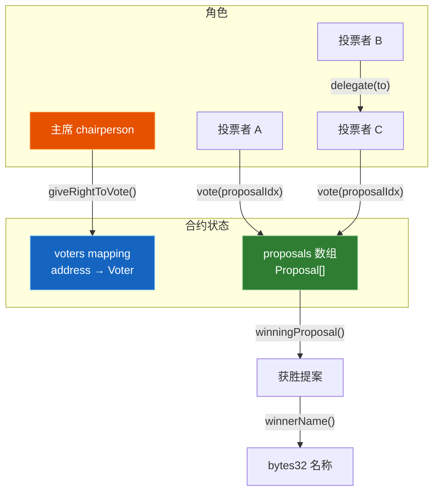
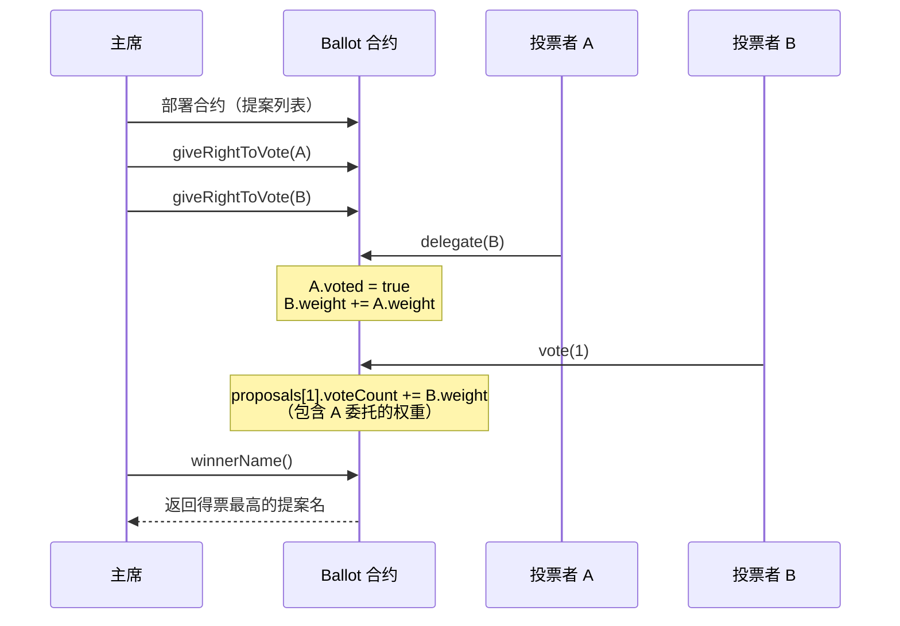
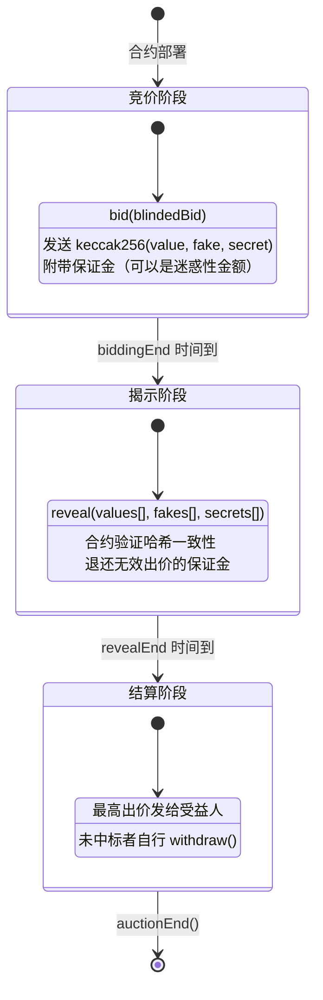
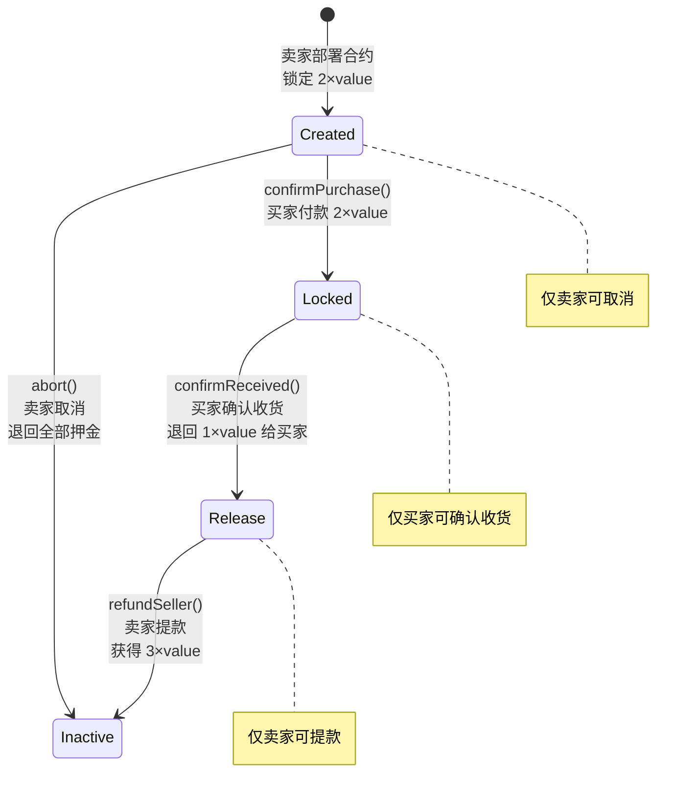
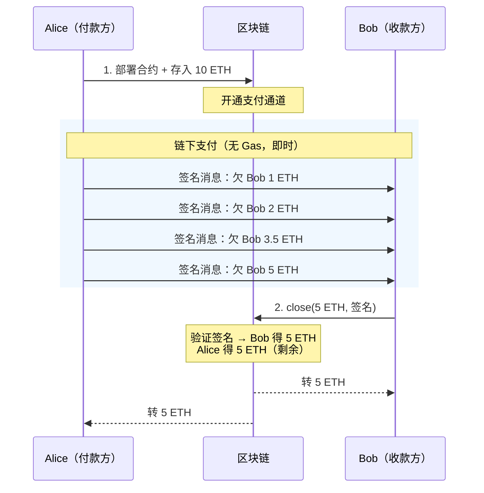

# 第 5 章 — 实战示例精讲（Solidity by Example）

> **预计学习时间**：3 - 4 天
> **前置知识**：ch01（区块链与智能合约基础）、ch02（开发环境与编译器）、ch03（语言基础）、ch04（合约核心特性）
> **本章目标**：通过官方经典示例掌握合约设计模式，理解投票、拍卖、支付通道等真实业务场景的链上实现

> **JS/TS 读者建议**：本章是前四章知识的综合应用。每个示例都是一个完整的"全栈"业务合约，建议先理解业务流程（你在 JS 中怎么做），再看链上实现的差异与约束。

---

## 目录

- [章节概述](#章节概述)
- [知识地图](#知识地图)
- [JS/TS 快速对照](#jsts-快速对照)
- [迁移陷阱（JS → Solidity）](#迁移陷阱js--solidity)
- [5.0 示例总览](#50-示例总览)
- [5.1 投票合约（Voting）](#51-投票合约voting)
- [5.2 盲拍合约（Blind Auction）](#52-盲拍合约blind-auction)
- [5.3 安全远程购买（Safe Remote Purchase）](#53-安全远程购买safe-remote-purchase)
- [5.4 微支付通道（Micropayment Channel）](#54-微支付通道micropayment-channel)
- [5.5 模块化合约（Modular Contracts）](#55-模块化合约modular-contracts)
- [设计模式总结](#设计模式总结)
- [Remix 实操指南](#remix-实操指南)
- [本章小结](#本章小结)
- [学习明细与练习任务](#学习明细与练习任务)
- [常见问题 FAQ](#常见问题-faq)

---

## 章节概述

本章通过 Solidity 官方文档的五个经典示例，讲解智能合约在真实业务场景中的设计与实现：

| 小节 | 内容 | 核心模式 | 重要性 |
|------|------|----------|--------|
| 5.0 示例总览 | 五大示例概览与知识点地图 | — | ★★★☆☆ |
| 5.1 投票合约 | 委托投票、权限管理、计票 | 角色访问控制、委托模式 | ★★★★★ |
| 5.2 盲拍合约 | 公开拍卖 + 盲拍、时间控制 | Commit-Reveal、提款模式 | ★★★★★ |
| 5.3 安全远程购买 | 双倍押金、状态流转 | 状态机模式、托管机制 | ★★★★☆ |
| 5.4 微支付通道 | 链下签名、链上验证 | 签名验证、支付通道 | ★★★★★ |
| 5.5 模块化合约 | library 分离逻辑、代码复用 | 模块化设计、关注点分离 | ★★★★☆ |

---

## 知识地图

```mermaid
graph TB
    subgraph 示例合约
        V[投票合约 5.1]
        A[盲拍合约 5.2]
        P[安全远程购买 5.3]
        M[微支付通道 5.4]
        MOD[模块化合约 5.5]
    end

    subgraph 设计模式
        P1[角色访问控制]
        P2[状态机模式]
        P3[提款模式]
        P4["Commit-Reveal 模式"]
        P5[签名验证]
        P6[模块化设计]
    end

    subgraph 核心知识点
        K1[struct / mapping]
        K2[modifier / require]
        K3[enum 状态]
        K4[payable / msg.value]
        K5[block.timestamp]
        K6[keccak256 / ecrecover]
        K7[library / using for]
        K8[event / emit]
    end

    V --> P1
    V --> K1
    V --> K2

    A --> P3
    A --> P4
    A --> K4
    A --> K5

    P --> P2
    P --> K3
    P --> K4

    M --> P5
    M --> K6
    M --> K4

    MOD --> P6
    MOD --> K7

    V --> K8
    A --> K8
    P --> K8

    style V fill:#1565c0,stroke:#90caf9,color:#fff
    style A fill:#e65100,stroke:#ffcc80,color:#fff
    style P fill:#2e7d32,stroke:#a5d6a7,color:#fff
    style M fill:#b71c1c,stroke:#ef9a9a,color:#fff
    style MOD fill:#6a1b9a,stroke:#ce93d8,color:#fff
```



---

## JS/TS 快速对照

| JS/TS 概念 | Solidity 示例中的对应 | 关键差异 |
|---|---|---|
| REST API 权限中间件 | `require(msg.sender == chairperson)` | 权限检查在链上执行，不可绕过 |
| 数据库状态字段 `status` | `enum State { Created, Locked, Release, Inactive }` | 状态转换不可逆，写入区块链永久存储 |
| 定时任务 `setTimeout` | `block.timestamp` + `modifier onlyBefore(time)` | 没有自动触发器，需要外部交易驱动 |
| `crypto.createHash('sha256')` | `keccak256(abi.encodePacked(...))` | 以太坊用 Keccak-256，非标准 SHA-3 |
| JWT / session 验证签名 | `ecrecover(hash, v, r, s)` | 直接在 EVM 中恢复签名者地址 |
| EventEmitter / WebSocket | `event` + `emit` | 事件写入链上日志，合约自身无法读取 |
| `npm` 模块化导入 | `library` + `using ... for` | 无状态的链上代码库，通过 DELEGATECALL 执行 |
| `Promise.all` 批量处理 | 逐笔交易 + 循环 | 每笔操作都是独立交易，无原生并发 |
| PayPal / Stripe 支付 | `payable` + `msg.value` + 提款模式 | 没有中间商，合约本身就是托管账户 |
| `localStorage.setItem` | 状态变量 `mapping(address => uint)` | 写入成本极高（~20,000 Gas / 32字节） |

---

## 迁移陷阱（JS → Solidity）

- **没有定时器也没有 cron**：JS 中 `setTimeout` 或定时任务可以自动触发逻辑，但 Solidity 合约**不能自己执行**。拍卖结束、通道超时等都需要外部账户发送交易来触发。想自动化？需要 Chainlink Automation 或自建 Keeper 服务。
- **"先置零再转账"不是多此一举**：JS 中不存在重入攻击，但 Solidity 的 `call{value}` 会将执行权交给对方合约。必须在转账**之前**清零余额（Checks-Effects-Interactions 模式），否则对方可以递归回调窃取资金。
- **链上没有秘密**：JS 后端的私有变量外部无法访问，但以太坊上**所有存储数据**任何人都能读取。盲拍中的出价必须先用哈希隐藏（Commit），之后再明文揭示（Reveal）。
- **状态回滚是全有或全无**：JS 中可以 `try/catch` 局部处理错误并继续，但 Solidity 交易失败会回滚**所有状态变更**（Gas 除外）。设计状态流转时必须考虑原子性。
- **Gas 是硬性约束**：JS 循环遍历 10 万条记录只是慢一点，但 Solidity 循环超过 Gas 上限直接失败。投票合约中委托链的 `while` 循环如果太长，交易会 revert。

---

## 5.0 示例总览

> 对应文档：`soliditydocs/solidity-by-example.rst`

Solidity 官方提供了五个由浅入深的经典示例，覆盖了合约开发中最核心的设计模式：

| 示例 | 业务场景 | 核心知识点 | 涉及设计模式 | 难度 |
|------|----------|-----------|-------------|------|
| **Voting（投票）** | 链上投票与委托 | struct、mapping、modifier、循环 | 角色访问控制、委托 | ★★★☆☆ |
| **Simple Auction（公开拍卖）** | 竞价拍卖 | payable、block.timestamp、event | 提款模式、时间控制 | ★★★☆☆ |
| **Blind Auction（盲拍）** | 密封出价拍卖 | keccak256、modifier、多阶段 | Commit-Reveal、提款模式 | ★★★★☆ |
| **Safe Remote Purchase（安全远程购买）** | 远程交易托管 | enum、payable、状态转换 | 状态机、双倍押金 | ★★★★☆ |
| **Micropayment Channel（微支付通道）** | 链下高频支付 | ecrecover、签名、assembly | 支付通道、签名验证 | ★★★★★ |
| **Modular Contracts（模块化合约）** | 代码组织与复用 | library、using for | 关注点分离 | ★★★☆☆ |

**知识依赖关系**：

```
Voting（基础） → Simple Auction（+payable/时间） → Blind Auction（+密码学）
                                                          ↓
Safe Remote Purchase（状态机） ← ← ← ← ← ← ← ← ← ← ← ←
                                                          ↓
Micropayment Channel（签名 + 链下）  →  Modular Contracts（代码组织）
```

---

## 5.1 投票合约（Voting）

> 对应文档：`soliditydocs/examples/voting.rst`

### 5.1.1 业务背景

投票合约实现了一个**委托投票**系统：
- 合约创建者（主席）为每个地址分配投票权
- 投票者可以自己投票，也可以将投票权**委托**给信任的人
- 投票结束后，合约自动计算获胜提案

> **JS 类比**：这类似于一个投票 REST API 的后端逻辑——用户注册、投票、委托、计票——但所有状态存储在区块链上，规则由代码强制执行，任何人都无法篡改。

### 5.1.2 完整合约代码

```solidity
// SPDX-License-Identifier: GPL-3.0
pragma solidity >=0.7.0 <0.9.0;
/// @title Voting with delegation.
contract Ballot {
    // 投票者结构体
    struct Voter {
        uint weight; // 权重（通过委托积累）
        bool voted;  // 是否已投票
        address delegate; // 委托目标地址
        uint vote;   // 投票的提案索引
    }

    // 提案结构体
    struct Proposal {
        bytes32 name;   // 提案名称（最多 32 字节）
        uint voteCount; // 累积票数
    }

    address public chairperson;

    // 每个地址对应一个 Voter 结构体
    mapping(address => Voter) public voters;

    // 提案数组
    Proposal[] public proposals;

    /// 创建一个新的投票合约，传入提案名称列表
    constructor(bytes32[] memory proposalNames) {
        chairperson = msg.sender;
        voters[chairperson].weight = 1;

        for (uint i = 0; i < proposalNames.length; i++) {
            proposals.push(Proposal({
                name: proposalNames[i],
                voteCount: 0
            }));
        }
    }

    // 授予投票权 — 仅主席可调用
    function giveRightToVote(address voter) external {
        require(
            msg.sender == chairperson,
            "Only chairperson can give right to vote."
        );
        require(
            !voters[voter].voted,
            "The voter already voted."
        );
        require(voters[voter].weight == 0);
        voters[voter].weight = 1;
    }

    /// 将你的投票权委托给另一个投票者
    function delegate(address to) external {
        Voter storage sender = voters[msg.sender];
        require(sender.weight != 0, "You have no right to vote");
        require(!sender.voted, "You already voted.");

        require(to != msg.sender, "Self-delegation is disallowed.");

        // 沿委托链向前查找最终委托人
        // 警告：如果链太长，会因 Gas 耗尽而失败
        while (voters[to].delegate != address(0)) {
            to = voters[to].delegate;

            // 发现委托环路，禁止
            require(to != msg.sender, "Found loop in delegation.");
        }

        Voter storage delegate_ = voters[to];

        // 不能委托给没有投票权的地址
        require(delegate_.weight >= 1);

        sender.voted = true;
        sender.delegate = to;

        if (delegate_.voted) {
            // 如果委托人已投票，直接加到对应提案票数
            proposals[delegate_.vote].voteCount += sender.weight;
        } else {
            // 否则增加委托人的权重
            delegate_.weight += sender.weight;
        }
    }

    /// 投票给指定提案
    function vote(uint proposal) external {
        Voter storage sender = voters[msg.sender];
        require(sender.weight != 0, "Has no right to vote");
        require(!sender.voted, "Already voted.");
        sender.voted = true;
        sender.vote = proposal;

        // 如果 proposal 超出数组范围，自动 revert
        proposals[proposal].voteCount += sender.weight;
    }

    /// 计算获胜提案的索引
    function winningProposal() public view
            returns (uint winningProposal_)
    {
        uint winningVoteCount = 0;
        for (uint p = 0; p < proposals.length; p++) {
            if (proposals[p].voteCount > winningVoteCount) {
                winningVoteCount = proposals[p].voteCount;
                winningProposal_ = p;
            }
        }
    }

    // 返回获胜提案的名称
    function winnerName() external view
            returns (bytes32 winnerName_)
    {
        winnerName_ = proposals[winningProposal()].name;
    }
}
```

### 5.1.3 架构分析



### 5.1.4 投票流程详解



### 5.1.5 关键函数解析

**`giveRightToVote` — 权限授予**

```solidity
function giveRightToVote(address voter) external {
    require(msg.sender == chairperson, "Only chairperson can give right to vote.");
    require(!voters[voter].voted, "The voter already voted.");
    require(voters[voter].weight == 0);
    voters[voter].weight = 1;
}
```

三重 `require` 构成防御层：
1. **身份验证**：只有主席能授权（角色访问控制）
2. **状态校验**：已投过票的人不能再获授权
3. **幂等保护**：weight 为 0 才赋权，防止重复授权

> **JS 对比**：JS 后端用 JWT 中间件检查角色，这里用 `msg.sender` 直接比对地址。区别是 Solidity 的检查无法绕过——没有 SQL 注入，没有伪造 token。

**`delegate` — 委托投票**

委托函数是本合约最复杂的部分，它需要处理：
- **委托链追踪**：A 委托给 B，B 已经委托给 C → A 的票最终给 C
- **环路检测**：A → B → C → A 会造成无限循环
- **已投票处理**：如果最终委托人已投票，票数直接加到对应提案

> **Gas 风险**：`while` 循环沿委托链遍历。如果恶意构造超长委托链，会耗尽 Gas。生产环境应设置最大委托深度。

**`winningProposal` — 计票**

遍历所有提案找最高票。注意 `view` 函数不消耗 Gas（通过 RPC 调用时）。局限是当多个提案票数相同时，只返回索引最小的那个。

### 5.1.6 ethers.js 前端交互示例

```javascript
import { ethers } from "ethers";

const provider = new ethers.BrowserProvider(window.ethereum);
const signer = await provider.getSigner();

const ballotAddress = "0x...";
const ballotABI = [/* ABI JSON */];
const ballot = new ethers.Contract(ballotAddress, ballotABI, signer);

// 主席授权投票
await ballot.giveRightToVote("0xVoterAddress");

// 投票者投给第 0 号提案
await ballot.vote(0);

// 查询获胜者（view 函数，免 Gas）
const winner = await ballot.winnerName();
console.log("获胜提案:", ethers.decodeBytes32String(winner));

// 委托给另一个地址
await ballot.delegate("0xTrustedAddress");
```

### 5.1.7 设计模式提炼

| 模式 | 在投票合约中的体现 |
|------|------------------|
| **角色访问控制** | `require(msg.sender == chairperson)` 限制敏感操作 |
| **委托模式** | 投票权可转让，权重自动累加 |
| **数据结构设计** | `struct Voter` 封装状态，`mapping` 提供 O(1) 查找 |
| **Gas 优化** | `storage` 引用避免拷贝，`external` 减少参数拷贝开销 |

### 5.1.8 可改进之处

官方文档指出的改进方向：
- 批量授权：当前需要逐个调用 `giveRightToVote`，大量投票者时 Gas 成本高
- 平票处理：多个提案得票相同时，`winningProposal()` 无法正确处理
- 投票截止：缺少时间限制，建议加入 `block.timestamp` 截止检查

---

## 5.2 盲拍合约（Blind Auction）

> 对应文档：`soliditydocs/examples/blind-auction.rst`

本节包含两个合约：**简单公开拍卖**（基础）和**盲拍**（进阶），展示了从透明到加密的拍卖演进。

### 5.2.1 简单公开拍卖（Simple Auction）

#### 业务逻辑

- 在竞价期内，任何人发送 ETH 出价
- 出价更高时，前一个最高出价者的 ETH 进入待提款队列
- 竞价期结束后，手动调用结算函数，将最高出价发给受益人

#### 完整合约代码

```solidity
// SPDX-License-Identifier: GPL-3.0
pragma solidity ^0.8.4;
contract SimpleAuction {
    address payable public beneficiary;
    uint public auctionEndTime;

    address public highestBidder;
    uint public highestBid;

    // 待提款余额 — 提款模式的核心
    mapping(address => uint) pendingReturns;

    bool ended;

    event HighestBidIncreased(address bidder, uint amount);
    event AuctionEnded(address winner, uint amount);

    /// 拍卖已结束
    error AuctionAlreadyEnded();
    /// 已有更高或相等的出价
    error BidNotHighEnough(uint highestBid);
    /// 拍卖尚未结束
    error AuctionNotYetEnded();
    /// auctionEnd 已被调用
    error AuctionEndAlreadyCalled();

    constructor(
        uint biddingTime,
        address payable beneficiaryAddress
    ) {
        beneficiary = beneficiaryAddress;
        auctionEndTime = block.timestamp + biddingTime;
    }

    /// 出价 — 附带 ETH
    function bid() external payable {
        if (block.timestamp > auctionEndTime)
            revert AuctionAlreadyEnded();

        if (msg.value <= highestBid)
            revert BidNotHighEnough(highestBid);

        if (highestBid != 0) {
            // 不直接退款！使用提款模式防止重入攻击
            pendingReturns[highestBidder] += highestBid;
        }
        highestBidder = msg.sender;
        highestBid = msg.value;
        emit HighestBidIncreased(msg.sender, msg.value);
    }

    /// 提款 — 被超越的出价者自行提取退款
    function withdraw() external returns (bool) {
        uint amount = pendingReturns[msg.sender];
        if (amount > 0) {
            // 先置零再转账 — 防止重入！
            pendingReturns[msg.sender] = 0;

            (bool success, ) = payable(msg.sender).call{value: amount}("");
            if (!success) {
                pendingReturns[msg.sender] = amount;
                return false;
            }
        }
        return true;
    }

    /// 结束拍卖，将最高出价发给受益人
    function auctionEnd() external {
        // 1. 检查条件（Checks）
        if (block.timestamp < auctionEndTime)
            revert AuctionNotYetEnded();
        if (ended)
            revert AuctionEndAlreadyCalled();

        // 2. 修改状态（Effects）
        ended = true;
        emit AuctionEnded(highestBidder, highestBid);

        // 3. 外部交互（Interactions）
        (bool success, ) = beneficiary.call{value: highestBid}("");
        require(success);
    }
}
```

#### Checks-Effects-Interactions 模式

`auctionEnd` 函数完美展示了 Solidity 的黄金安全模式：

```
1. Checks       → 验证条件（时间、状态）
2. Effects      → 修改合约状态（ended = true）
3. Interactions → 外部调用（转账给 beneficiary）
```

> **为什么顺序重要？** 如果先转账再置 `ended = true`，恶意合约可以在 `receive()` 中再次调用 `auctionEnd()`，重复提取资金。

#### 提款模式详解

为什么不在 `bid()` 中直接把旧出价退给上一个出价者？

```solidity
// ❌ 危险的推送支付（Push Payment）
function bid() external payable {
    // ... 验证 ...
    payable(highestBidder).call{value: highestBid}(""); // 如果这里失败或恶意回调？
    highestBidder = msg.sender;
}

// ✅ 安全的拉取支付（Pull Payment / 提款模式）
function bid() external payable {
    // ... 验证 ...
    pendingReturns[highestBidder] += highestBid; // 只记账
    highestBidder = msg.sender;
}
// 退款由原出价者自己提取
function withdraw() external { /* ... */ }
```

### 5.2.2 盲拍合约（Blind Auction）

#### Commit-Reveal 模式原理

在透明的区块链上实现"密封出价"看似矛盾，但密码学提供了解决方案：



**Commit 阶段**：出价者不发送真实金额，而是发送 `keccak256(abi.encodePacked(value, fake, secret))` 的哈希值。由于哈希不可逆，其他人无法知道真实出价。

**Reveal 阶段**：出价者公开原始参数（value, fake, secret），合约重新计算哈希并与之前提交的比对。匹配则出价有效。

**`fake` 参数的作用**：允许出价者发送"假出价"来迷惑竞争对手。设置 `fake = true` 的出价在揭示后会退回保证金。

#### 完整合约代码

```solidity
// SPDX-License-Identifier: GPL-3.0
pragma solidity ^0.8.4;
contract BlindAuction {
    struct Bid {
        bytes32 blindedBid;
        uint deposit;
    }

    address payable public beneficiary;
    uint public biddingEnd;
    uint public revealEnd;
    bool public ended;

    mapping(address => Bid[]) public bids;

    address public highestBidder;
    uint public highestBid;

    mapping(address => uint) pendingReturns;

    event AuctionEnded(address winner, uint highestBid);

    /// 调用过早，请在 `time` 之后重试
    error TooEarly(uint time);
    /// 调用过晚，不能在 `time` 之后调用
    error TooLate(uint time);
    /// auctionEnd 已被调用
    error AuctionEndAlreadyCalled();

    // modifier 实现时间控制
    modifier onlyBefore(uint time) {
        if (block.timestamp >= time) revert TooLate(time);
        _;
    }
    modifier onlyAfter(uint time) {
        if (block.timestamp <= time) revert TooEarly(time);
        _;
    }

    constructor(
        uint biddingTime,
        uint revealTime,
        address payable beneficiaryAddress
    ) {
        beneficiary = beneficiaryAddress;
        biddingEnd = block.timestamp + biddingTime;
        revealEnd = biddingEnd + revealTime;
    }

    /// 提交盲出价
    /// blindedBid = keccak256(abi.encodePacked(value, fake, secret))
    function bid(bytes32 blindedBid)
        external
        payable
        onlyBefore(biddingEnd)
    {
        bids[msg.sender].push(Bid({
            blindedBid: blindedBid,
            deposit: msg.value
        }));
    }

    /// 揭示盲出价 — 退还正确盲化的无效出价和非最高出价的保证金
    function reveal(
        uint[] calldata values,
        bool[] calldata fakes,
        bytes32[] calldata secrets
    )
        external
        onlyAfter(biddingEnd)
        onlyBefore(revealEnd)
    {
        uint length = bids[msg.sender].length;
        require(values.length == length);
        require(fakes.length == length);
        require(secrets.length == length);

        uint refund;
        for (uint i = 0; i < length; i++) {
            Bid storage bidToCheck = bids[msg.sender][i];
            (uint value, bool fake, bytes32 secret) =
                    (values[i], fakes[i], secrets[i]);
            if (bidToCheck.blindedBid != keccak256(abi.encodePacked(value, fake, secret))) {
                // 哈希不匹配 → 未正确揭示 → 不退保证金
                continue;
            }
            refund += bidToCheck.deposit;
            if (!fake && bidToCheck.deposit >= value) {
                if (placeBid(msg.sender, value))
                    refund -= value;
            }
            // 防止重复揭示同一出价
            bidToCheck.blindedBid = bytes32(0);
        }
        (bool success, ) = payable(msg.sender).call{value: refund}("");
        require(success);
    }

    /// 提款
    function withdraw() external {
        uint amount = pendingReturns[msg.sender];
        if (amount > 0) {
            pendingReturns[msg.sender] = 0;

            (bool success, ) = payable(msg.sender).call{value: amount}("");
            require(success);
        }
    }

    /// 结束拍卖
    function auctionEnd()
        external
        onlyAfter(revealEnd)
    {
        if (ended) revert AuctionEndAlreadyCalled();
        emit AuctionEnded(highestBidder, highestBid);
        ended = true;
        (bool success, ) = beneficiary.call{value: highestBid}("");
        require(success);
    }

    // 内部函数：尝试放置出价
    function placeBid(address bidder, uint value) internal
            returns (bool success)
    {
        if (value <= highestBid) {
            return false;
        }
        if (highestBidder != address(0)) {
            pendingReturns[highestBidder] += highestBid;
        }
        highestBid = value;
        highestBidder = bidder;
        return true;
    }
}
```

#### 时间控制机制

盲拍合约用 `modifier` 实现精确的阶段控制：

```
部署                biddingEnd              revealEnd
 |←——— 竞价阶段 ———→|←——— 揭示阶段 ———→|←——— 结算 ———→
 |    bid() 可调用    |  reveal() 可调用  |  auctionEnd()
 |  onlyBefore(bEnd)  | onlyAfter(bEnd)  | onlyAfter(rEnd)
                       | onlyBefore(rEnd) |
```

```solidity
modifier onlyBefore(uint time) {
    if (block.timestamp >= time) revert TooLate(time);
    _;
}
modifier onlyAfter(uint time) {
    if (block.timestamp <= time) revert TooEarly(time);
    _;
}
```

> **注意**：`block.timestamp` 可以被矿工在小范围内操纵（约 15 秒），不适合做高精度时间控制。但对于以分钟/小时为单位的拍卖阶段足够安全。

#### `keccak256` 哈希详解

```solidity
keccak256(abi.encodePacked(value, fake, secret))
```

- `abi.encodePacked`：将参数紧密拼接为字节序列（无填充）
- `keccak256`：以太坊原生哈希函数，输出 32 字节（256 位）
- **单向性**：已知哈希值无法反推出 value、fake、secret
- **抗碰撞**：不同输入产生相同哈希的概率可以忽略不计

> **JS 对比**：相当于 `crypto.createHash('sha3-256').update(Buffer.concat([...args])).digest()`，但以太坊使用的是 Keccak-256（与 NIST SHA-3 略有不同）。

---

## 5.3 安全远程购买（Safe Remote Purchase）

> 对应文档：`soliditydocs/examples/safe-remote.rst`

### 5.3.1 业务背景

远程购物的核心问题：买家怕付款后收不到货，卖家怕发货后收不到钱。传统方案依赖第三方（淘宝、PayPal），而这个合约用**双倍押金**机制让双方互相约束——如果任一方违约，自己锁定的押金也会损失。

### 5.3.2 双倍押金机制

| 参与方 | 锁定金额 | 完成交易后获得 | 经济逻辑 |
|--------|---------|---------------|---------|
| **卖家** | 2× 商品价值 | 3× 商品价值（押金 + 商品款） | 不发货就亏一倍押金 |
| **买家** | 2× 商品价值 | 1× 商品价值（退回多存的押金） | 不确认收货就亏一倍押金 |

### 5.3.3 状态机模式



### 5.3.4 完整合约代码

```solidity
// SPDX-License-Identifier: GPL-3.0
pragma solidity ^0.8.4;
contract Purchase {
    uint public value;
    address payable public seller;
    address payable public buyer;

    enum State { Created, Locked, Release, Inactive }
    State public state;

    modifier condition(bool condition_) {
        require(condition_);
        _;
    }

    /// 仅买家可调用
    error OnlyBuyer();
    /// 仅卖家可调用
    error OnlySeller();
    /// 当前状态不允许此操作
    error InvalidState();
    /// 提供的值必须是偶数
    error ValueNotEven();

    modifier onlyBuyer() {
        if (msg.sender != buyer)
            revert OnlyBuyer();
        _;
    }

    modifier onlySeller() {
        if (msg.sender != seller)
            revert OnlySeller();
        _;
    }

    modifier inState(State state_) {
        if (state != state_)
            revert InvalidState();
        _;
    }

    event Aborted();
    event PurchaseConfirmed();
    event ItemReceived();
    event SellerRefunded();

    // 卖家部署，msg.value 必须是偶数（因为 value = msg.value / 2）
    constructor() payable {
        seller = payable(msg.sender);
        value = msg.value / 2;
        if ((2 * value) != msg.value)
            revert ValueNotEven();
    }

    /// 取消购买 — 仅卖家在 Created 状态可调用
    function abort()
        external
        onlySeller
        inState(State.Created)
    {
        emit Aborted();
        state = State.Inactive;
        (bool success, ) = seller.call{value: address(this).balance}("");
        require(success);
    }

    /// 买家确认购买 — 必须发送 2×value 的 ETH
    function confirmPurchase()
        external
        inState(State.Created)
        condition(msg.value == (2 * value))
        payable
    {
        emit PurchaseConfirmed();
        buyer = payable(msg.sender);
        state = State.Locked;
    }

    /// 买家确认收货 — 退回 1×value 给买家
    function confirmReceived()
        external
        onlyBuyer
        inState(State.Locked)
    {
        emit ItemReceived();
        state = State.Release;

        (bool success, ) = buyer.call{value: value}("");
        require(success);
    }

    /// 卖家提款 — 获得 3×value
    function refundSeller()
        external
        onlySeller
        inState(State.Release)
    {
        emit SellerRefunded();
        state = State.Inactive;

        (bool success, ) = seller.call{value: 3 * value}("");
        require(success);
    }
}
```

### 5.3.5 关键设计解析

**`enum` 驱动的状态机**

```solidity
enum State { Created, Locked, Release, Inactive }

modifier inState(State state_) {
    if (state != state_)
        revert InvalidState();
    _;
}
```

每个函数通过 `inState` modifier 限制只能在特定状态下调用，保证了状态转换的严格单向性。`enum` 在 EVM 中存储为 `uint8`（0, 1, 2, 3），Gas 高效。

> **JS 对比**：JS 中通常用字符串 `status: "created"` 或常量枚举 `const State = { CREATED: 0 }`。Solidity 的 `enum` 是编译器层面的类型安全——传入不存在的状态值会直接 revert。

**modifier 叠加**

```solidity
function abort()
    external        // 可见性
    onlySeller      // 权限检查
    inState(State.Created)  // 状态检查
{ ... }
```

三个 modifier 按从左到右的顺序执行，形成一个检查链：外部调用 → 是卖家吗 → 状态对吗 → 执行函数体。相当于 Express 中间件链。

**资金流转**

```
部署时：  卖家存入 2×value → 合约余额 = 2×value
购买时：  买家存入 2×value → 合约余额 = 4×value
确认收货：买家取回 1×value → 合约余额 = 3×value
卖家提款：卖家取回 3×value → 合约余额 = 0
```

### 5.3.6 ethers.js 前端交互

```javascript
import { ethers } from "ethers";

const provider = new ethers.BrowserProvider(window.ethereum);
const signer = await provider.getSigner();

// 卖家部署合约 — 商品价值 1 ETH，锁定 2 ETH
const factory = new ethers.ContractFactory(abi, bytecode, signer);
const purchase = await factory.deploy({
  value: ethers.parseEther("2.0") // 2×value
});
await purchase.waitForDeployment();

// 买家确认购买 — 也需要发送 2 ETH
const buyerContract = purchase.connect(buyerSigner);
await buyerContract.confirmPurchase({
  value: ethers.parseEther("2.0")
});

// 买家确认收货
await buyerContract.confirmReceived();

// 卖家提款
await purchase.refundSeller();

// 监听事件
purchase.on("PurchaseConfirmed", () => {
  console.log("买家已确认购买！");
});
```

---

## 5.4 微支付通道（Micropayment Channel）

> 对应文档：`soliditydocs/examples/micropayment.rst`

### 5.4.1 支付通道原理

支付通道允许两方进行**多次微额支付**，但只需要**两笔链上交易**（开通和关闭）。中间的每次支付都在链下通过签名消息完成，无需 Gas，无需等待确认。



**关键设计**：每条签名消息包含的是**累计总额**而非单次金额。Bob 自然会选择金额最大的消息来关闭通道。

> **JS 对比**：类似于 WebSocket 长连接中的批量结算——客户端持续消费，服务端定期结算。区别是支付通道的"凭证"是密码学签名，无法伪造。

### 5.4.2 签名与验证的完整流程

```
Alice 端（链下）                     合约端（链上）
─────────────────                   ────────────────
1. 构造消息                          4. 收到签名和金额
   hash = keccak256(                    重建相同的哈希
     contractAddress, amount)           hash = keccak256(this, amount)
                                     
2. 签名消息                          5. 添加以太坊签名前缀
   signature = sign(                    prefixed = keccak256(
     "\x19Ethereum Signed                "\x19Ethereum Signed
      Message:\n32" + hash)               Message:\n32" + hash)
                                     
3. 把 (amount, signature)            6. 用 ecrecover 恢复签名者
   发给 Bob                             signer = ecrecover(
                                          prefixed, v, r, s)
                                     
                                     7. 验证 signer == sender
```

### 5.4.3 ReceiverPays 合约 — 签名支付基础

```solidity
// SPDX-License-Identifier: GPL-3.0
pragma solidity >=0.7.0 <0.9.0;

contract Owned {
    address payable owner;
    constructor() {
        owner = payable(msg.sender);
    }
}

contract Freezable is Owned {
    bool private _frozen = false;

    modifier notFrozen() {
        require(!_frozen, "Inactive Contract.");
        _;
    }

    function freeze() internal {
        if (msg.sender == owner)
            _frozen = true;
    }
}

contract ReceiverPays is Freezable {
    mapping(uint256 => bool) usedNonces;

    constructor() payable {}

    function claimPayment(uint256 amount, uint256 nonce, bytes memory signature)
        external
        notFrozen
    {
        require(!usedNonces[nonce]);
        usedNonces[nonce] = true;

        // 重建链下签名的消息
        bytes32 message = prefixed(keccak256(abi.encodePacked(msg.sender, amount, nonce, this)));
        require(recoverSigner(message, signature) == owner);
        (bool success, ) = payable(msg.sender).call{value: amount}("");
        require(success);
    }

    /// 冻结合约并回收剩余资金
    function shutdown()
        external
        notFrozen
    {
        require(msg.sender == owner);
        freeze();
        (bool success, ) = payable(msg.sender).call{value: address(this).balance}("");
        require(success);
    }

    /// 签名拆分 — 使用内联汇编从 65 字节签名中提取 v, r, s
    function splitSignature(bytes memory sig)
        internal
        pure
        returns (uint8 v, bytes32 r, bytes32 s)
    {
        require(sig.length == 65);

        assembly {
            r := mload(add(sig, 32))
            s := mload(add(sig, 64))
            v := byte(0, mload(add(sig, 96)))
        }

        return (v, r, s);
    }

    function recoverSigner(bytes32 message, bytes memory sig)
        internal
        pure
        returns (address)
    {
        (uint8 v, bytes32 r, bytes32 s) = splitSignature(sig);
        return ecrecover(message, v, r, s);
    }

    /// 添加以太坊签名前缀，模拟 eth_sign 行为
    function prefixed(bytes32 hash) internal pure returns (bytes32) {
        return keccak256(abi.encodePacked("\x19Ethereum Signed Message:\n32", hash));
    }
}
```

#### 防重放攻击

签名消息中包含 `nonce` 和合约地址 `this` 两层防护：
- **nonce**：同一个签名只能使用一次（`usedNonces[nonce] = true`）
- **合约地址**：防止旧合约的签名在新部署的合约上被重用

> **JS 对比**：类似于 API 请求中的 request-id 防重放 + JWT 中的 `aud` 字段限定受众。

### 5.4.4 SimplePaymentChannel 合约 — 完整支付通道

```solidity
// SPDX-License-Identifier: GPL-3.0
pragma solidity >=0.7.0 <0.9.0;

contract Frozeable {
    bool private _frozen = false;

    modifier notFrozen() {
        require(!_frozen, "Inactive Contract.");
        _;
    }

    function freeze() internal {
        _frozen = true;
    }
}

contract SimplePaymentChannel is Frozeable {
    address payable public sender;    // 付款方
    address payable public recipient; // 收款方
    uint256 public expiration;        // 超时时间

    constructor (address payable recipientAddress, uint256 duration)
        payable
    {
        sender = payable(msg.sender);
        recipient = recipientAddress;
        expiration = block.timestamp + duration;
    }

    /// 收款方关闭通道 — 提交签名和金额
    function close(uint256 amount, bytes memory signature)
        external
        notFrozen
    {
        require(msg.sender == recipient);
        require(isValidSignature(amount, signature));

        (bool success, ) = recipient.call{value: amount}("");
        require(success);
        freeze();
        (success, ) = sender.call{value: address(this).balance}("");
        require(success);
    }

    /// 付款方可以延长超时
    function extend(uint256 newExpiration)
        external
        notFrozen
    {
        require(msg.sender == sender);
        require(newExpiration > expiration);

        expiration = newExpiration;
    }

    /// 超时后付款方可以回收全部资金
    function claimTimeout()
        external
        notFrozen
    {
        require(block.timestamp >= expiration);
        freeze();
        (bool success, ) = sender.call{value: address(this).balance}("");
        require(success);
    }

    function isValidSignature(uint256 amount, bytes memory signature)
        internal
        view
        returns (bool)
    {
        bytes32 message = prefixed(keccak256(abi.encodePacked(this, amount)));
        return recoverSigner(message, signature) == sender;
    }

    function splitSignature(bytes memory sig)
        internal
        pure
        returns (uint8 v, bytes32 r, bytes32 s)
    {
        require(sig.length == 65);

        assembly {
            r := mload(add(sig, 32))
            s := mload(add(sig, 64))
            v := byte(0, mload(add(sig, 96)))
        }
        return (v, r, s);
    }

    function recoverSigner(bytes32 message, bytes memory sig)
        internal
        pure
        returns (address)
    {
        (uint8 v, bytes32 r, bytes32 s) = splitSignature(sig);
        return ecrecover(message, v, r, s);
    }

    function prefixed(bytes32 hash) internal pure returns (bytes32) {
        return keccak256(abi.encodePacked("\x19Ethereum Signed Message:\n32", hash));
    }
}
```

### 5.4.5 `ecrecover` 与签名机制详解

ECDSA 签名由三部分组成：

| 参数 | 含义 | 大小 |
|------|------|------|
| `r` | 签名的 X 坐标 | 32 字节 |
| `s` | 签名的标量值 | 32 字节 |
| `v` | 恢复标识符 | 1 字节（27 或 28） |

`ecrecover(hash, v, r, s)` 是 EVM 预编译合约（地址 0x01），从签名和消息哈希中恢复出签名者的以太坊地址。

**`splitSignature` 为什么用 assembly？**

web3/ethers 返回的签名是 65 字节的拼接格式 `r + s + v`。Solidity 没有原生的字节切片语法，用 `mload` 内联汇编直接从内存偏移位置读取各分量，比用循环拷贝高效得多。

```solidity
assembly {
    r := mload(add(sig, 32))   // 跳过前 32 字节的长度前缀
    s := mload(add(sig, 64))   // 第 33-64 字节
    v := byte(0, mload(add(sig, 96)))  // 第 65 字节
}
```

**`"\x19Ethereum Signed Message:\n32"` 前缀**

以太坊签名标准（EIP-191）要求在消息前添加此前缀，防止签名被误用为交易签名。`\x19` 确保前缀字节不是有效的 RLP 编码开头。

### 5.4.6 ethers.js 签名示例

```javascript
import { ethers } from "ethers";

const provider = new ethers.BrowserProvider(window.ethereum);
const signer = await provider.getSigner();

// 1. Alice 构造并签名支付消息
async function signPayment(contractAddress, amount) {
  // 与合约中的 keccak256(abi.encodePacked(this, amount)) 一致
  const messageHash = ethers.solidityPackedKeccak256(
    ["address", "uint256"],
    [contractAddress, amount]
  );

  // ethers.js 的 signMessage 会自动添加 "\x19Ethereum Signed Message:\n32" 前缀
  const signature = await signer.signMessage(ethers.getBytes(messageHash));
  return signature;
}

// 2. Alice 链下发送签名给 Bob
const channelAddress = "0x...";
const amount = ethers.parseEther("1.5");
const signature = await signPayment(channelAddress, amount);
// 通过任意通信方式把 { amount, signature } 发给 Bob

// 3. Bob 关闭通道
const channel = new ethers.Contract(channelAddress, channelABI, bobSigner);
await channel.close(amount, signature);
```

```javascript
// Bob 端：链下验证签名（可选，在关闭通道前确认签名有效）
function verifyPayment(contractAddress, amount, signature, expectedSigner) {
  const messageHash = ethers.solidityPackedKeccak256(
    ["address", "uint256"],
    [contractAddress, amount]
  );
  const recoveredAddress = ethers.verifyMessage(
    ethers.getBytes(messageHash),
    signature
  );
  return recoveredAddress.toLowerCase() === expectedSigner.toLowerCase();
}
```

---

## 5.5 模块化合约（Modular Contracts）

> 对应文档：`soliditydocs/examples/modular.rst`

### 5.5.1 模块化设计原则

模块化方法通过**关注点分离**来降低合约复杂度：

- 每个模块的行为可以**独立验证**
- 模块间的交互限定在明确的接口上
- 降低代码审计和安全审查的难度

> **JS 对比**：就像把一个巨大的 `index.js` 拆分为 `utils/`, `services/`, `models/` 一样。Solidity 的 `library` 是链上的纯函数模块，无状态、可复用。

### 5.5.2 完整示例 — 使用 Library 管理余额

```solidity
// SPDX-License-Identifier: GPL-3.0
pragma solidity >=0.5.0 <0.9.0;

library Balances {
    function move(mapping(address => uint256) storage balances, address from, address to, uint amount) internal {
        require(balances[from] >= amount);
        require(balances[to] + amount >= balances[to]);
        balances[from] -= amount;
        balances[to] += amount;
    }
}

contract Token {
    mapping(address => uint256) balances;
    using Balances for *;
    mapping(address => mapping(address => uint256)) allowed;

    event Transfer(address from, address to, uint amount);
    event Approval(address owner, address spender, uint amount);

    function transfer(address to, uint amount) external returns (bool success) {
        balances.move(msg.sender, to, amount);
        emit Transfer(msg.sender, to, amount);
        return true;
    }

    function transferFrom(address from, address to, uint amount) external returns (bool success) {
        require(allowed[from][msg.sender] >= amount);
        allowed[from][msg.sender] -= amount;
        balances.move(from, to, amount);
        emit Transfer(from, to, amount);
        return true;
    }

    function approve(address spender, uint tokens) external returns (bool success) {
        require(allowed[msg.sender][spender] == 0, "");
        allowed[msg.sender][spender] = tokens;
        emit Approval(msg.sender, spender, tokens);
        return true;
    }

    function balanceOf(address tokenOwner) external view returns (uint balance) {
        return balances[tokenOwner];
    }
}
```

### 5.5.3 模块化的优势分析

| 方面 | 单体合约 | 模块化合约 |
|------|---------|-----------|
| **可验证性** | 需要理解整体才能验证局部 | `Balances.move` 可独立验证 |
| **不变量维护** | 余额逻辑散落各处 | 余额变更集中在 library 中 |
| **复用性** | 逻辑耦合在特定合约中 | library 可被任意合约复用 |
| **审计成本** | 审计人员需审查全部代码 | 可先审查独立模块再审查组合 |

**`Balances` library 的不变量**：
- 永远不会产生负余额（`require(balances[from] >= amount)`）
- 永远不会溢出（`require(balances[to] + amount >= balances[to])`）
- 所有余额的总和在合约生命周期内保持不变（`move` 只做内部转移）

> **注意**：在 Solidity 0.8+ 中，算术运算默认有溢出检查，所以第二个 `require` 在 0.8 以上版本实际上是冗余的。但保留它展示了防御性编程的思想。

### 5.5.4 `using ... for` 的工作方式

```solidity
using Balances for *;
```

这使得所有类型都可以作为第一个参数调用 `Balances` 的函数。实际效果：

```solidity
// 两种调用方式等价
Balances.move(balances, msg.sender, to, amount);
balances.move(msg.sender, to, amount); // using for 语法糖
```

`balances` 作为第一个参数 `mapping(address => uint256) storage balances` 自动传入。

---

## 设计模式总结

### 模式 1：访问控制（Access Control）

**核心思想**：限制谁可以调用特定函数。

```solidity
// 简单版 — 单角色
modifier onlyOwner() {
    require(msg.sender == owner, "Not owner");
    _;
}

// 投票合约版 — 主席权限
require(msg.sender == chairperson, "Only chairperson");

// 购买合约版 — 多角色 modifier
modifier onlyBuyer() {
    if (msg.sender != buyer) revert OnlyBuyer();
    _;
}
modifier onlySeller() {
    if (msg.sender != seller) revert OnlySeller();
    _;
}
```

**适用场景**：任何需要区分管理员 / 普通用户 / 特定角色的合约。生产环境推荐 OpenZeppelin 的 `AccessControl`。

### 模式 2：状态机（State Machine）

**核心思想**：用 `enum` 定义状态，用 `modifier` 限制状态转换。

```solidity
enum State { Created, Locked, Release, Inactive }
State public state;

modifier inState(State state_) {
    if (state != state_) revert InvalidState();
    _;
}

// 每个函数限定在特定状态
function confirmPurchase() external inState(State.Created) payable { ... }
function confirmReceived() external inState(State.Locked) { ... }
```

**适用场景**：有明确生命周期的合约（订单流程、众筹阶段、游戏回合）。

### 模式 3：提款模式（Withdrawal Pattern）

**核心思想**：不主动推送资金，让接收方自行提取。

```solidity
mapping(address => uint) pendingReturns;

// 记账（不转账）
pendingReturns[previousBidder] += previousBid;

// 接收方自行提取
function withdraw() external {
    uint amount = pendingReturns[msg.sender];
    if (amount > 0) {
        pendingReturns[msg.sender] = 0;  // 先置零
        (bool success, ) = payable(msg.sender).call{value: amount}("");
        if (!success) {
            pendingReturns[msg.sender] = amount;
        }
    }
}
```

**为什么不直接 send/transfer？**
- `transfer` 只提供 2300 Gas，某些合约的 `receive()` 可能不够用
- 直接推送可能被恶意合约的 `receive()` 回调利用
- 提款模式把"发起提款"的 Gas 成本转移给接收方

### 模式 4：Commit-Reveal

**核心思想**：先提交哈希隐藏数据，再公开原始数据验证。

```solidity
// Commit 阶段
mapping(address => bytes32) commits;
function commit(bytes32 hashedValue) external {
    commits[msg.sender] = hashedValue;
}

// Reveal 阶段
function reveal(uint value, bytes32 secret) external {
    require(commits[msg.sender] == keccak256(abi.encodePacked(value, secret)));
    // 现在 value 是可信的
}
```

**适用场景**：任何需要在透明区块链上实现"密封提交"的场景——盲拍、链上投票、随机数生成。

### 四大模式速查

| 模式 | 关键代码 | 示例合约 | 防御的威胁 |
|------|---------|---------|-----------|
| 访问控制 | `require(msg.sender == role)` | Voting, Purchase | 未授权操作 |
| 状态机 | `enum` + `inState` modifier | Purchase | 非法状态转换 |
| 提款模式 | `pendingReturns` + `withdraw()` | SimpleAuction, BlindAuction | 重入攻击、推送失败 |
| Commit-Reveal | `keccak256` + 两阶段 | BlindAuction | 信息抢跑（front-running） |

---

## Remix 实操指南

### 步骤 1：投票合约部署与测试

1. 打开 [Remix IDE](https://remix.ethereum.org)，新建 `Ballot.sol`，粘贴投票合约代码
2. 编译时选择 Solidity 版本 ≥ 0.7.0
3. 部署参数需要 `bytes32[]` 格式。使用以下格式传入提案名：
   ```
   ["0x4f7074696f6e310000000000000000000000000000000000000000000000000000",
    "0x4f7074696f6e320000000000000000000000000000000000000000000000000000"]
   ```
   （分别是 "Option1" 和 "Option2" 的 bytes32 编码）
4. 用 Account 1 部署（自动成为 chairperson）
5. 切换到 Account 2，调用 `giveRightToVote(Account2_Address)`
6. 用 Account 2 调用 `vote(0)` 投给第一个提案
7. 调用 `winnerName()` 查看结果

### 步骤 2：拍卖合约测试

1. 部署 `SimpleAuction`，参数 `biddingTime = 300`（5分钟），`beneficiary` 填入一个地址
2. 用不同账户调用 `bid()`，每次在 VALUE 栏填入 ETH 金额
3. 出价更低时观察 revert 错误信息
4. 等待 5 分钟后调用 `auctionEnd()`
5. 被超过的出价者调用 `withdraw()` 取回退款

### 步骤 3：安全购买合约测试

1. 用 Account 1 部署 `Purchase`，VALUE 填入偶数金额（如 4 ETH）
2. 切换 Account 2 作为买家，调用 `confirmPurchase()`，VALUE 填入 4 ETH
3. 用 Account 2 调用 `confirmReceived()`，观察 Account 2 收到 2 ETH
4. 切回 Account 1 调用 `refundSeller()`，观察 Account 1 收到 6 ETH

### 步骤 4：观察事件日志

在 Remix 控制台中，每次交易后展开 `logs` 可以看到 `emit` 的事件。点击事件可以查看 `indexed` 参数和 data 部分的详细解码。

---

## 本章小结

| 你学到了 | 关键收获 |
|---------|---------|
| **投票合约** | 角色权限管理、委托模式、struct + mapping 数据设计 |
| **拍卖合约** | 提款模式防重入、Checks-Effects-Interactions、Commit-Reveal 密码学模式 |
| **安全购买** | enum 状态机驱动合约生命周期、双倍押金博弈论、modifier 叠加 |
| **支付通道** | 链下签名 + 链上验证、ecrecover 签名恢复、内联汇编 |
| **模块化合约** | library 实现关注点分离、using for 语法糖、不变量维护 |

**核心认知升级**：

1. 智能合约不只是"能跑的代码"，它是**经济博弈的规则引擎**。双倍押金、提款模式、Commit-Reveal 都是用代码实现的博弈机制。
2. **安全是第一优先级**。每个示例都展示了防御性编程：先检查再修改再交互、用提款模式替代直接转账、用时间锁防止僵局。
3. **链上 ≠ 链下**。支付通道展示了 L2 扩容的雏形思想：把高频操作放到链下，只在需要结算时上链。

---

## 学习明细与练习任务

### 练习 1：改进投票合约

在原始投票合约基础上添加：
- `block.timestamp` 截止时间（部署时传入投票持续时间）
- 批量授权函数 `giveRightToVoteBatch(address[] calldata voters)`
- 平票检测：当多个提案得票相同时返回所有获胜提案
- 完整的事件记录（`VoteRightGranted`、`VoteCast`、`VoteDelegated`）

### 练习 2：实现订单状态机

创建一个电商订单合约，状态流程：
```
Created → Paid → Shipped → Confirmed → Completed
                                  ↘ Disputed → Resolved
```
- 买家创建订单并付款
- 卖家标记发货
- 买家确认收货或发起争议
- 使用 `enum` + `modifier` 实现严格状态流转
- 添加超时机制（卖家 7 天不发货自动退款）

### 练习 3：实现简单的 Commit-Reveal 猜数字游戏

两个玩家各猜一个 1-100 的数字：
1. Commit 阶段：双方提交 `keccak256(number, secret)` + 押注金额
2. Reveal 阶段：双方公开数字和 secret
3. 数字之和为奇数则玩家 A 赢，偶数则玩家 B 赢
4. 超时未 reveal 的一方判负

### 练习 4：用 ethers.js 前端调用部署的合约

1. 部署投票合约到 Remix 本地虚拟机
2. 使用 ethers.js 脚本：
   - 连接到本地节点
   - 调用 `giveRightToVote` 为多个地址授权
   - 执行投票和委托操作
   - 查询并输出获胜提案名称
3. 监听合约事件并格式化输出

---

## 常见问题 FAQ

### Q1：投票合约中 `bytes32 name` 为什么不用 `string`？

`bytes32` 是固定长度类型，存储在单个 storage slot 中（32 字节），读写 Gas 成本固定且低廉。而 `string` 是动态类型，需要额外的长度前缀和可能多个 storage slot，Gas 成本更高。对于不超过 32 字节的短名称（如提案代号），`bytes32` 是更经济的选择。ethers.js 中用 `ethers.encodeBytes32String("Option1")` 和 `ethers.decodeBytes32String(bytes32Value)` 进行转换。

### Q2：提款模式中，如果 `call` 失败了怎么办？

如果 `call{value: amount}("")` 返回 `success = false`，合约会恢复 `pendingReturns` 的余额，让用户可以再次尝试。失败的常见原因：接收方合约的 `receive()` 函数中有异常、接收方是一个没有 `receive()` 的合约。普通的外部账户（EOA）接收 ETH 不会失败。

### Q3：盲拍中为什么需要 `fake` 参数？

`fake` 参数允许出价者提交"假出价"来混淆竞争对手。其他参与者可以看到有人发送了大量 ETH 作为保证金，但无法判断这是真实出价还是假出价（因为哈希隐藏了 `fake` 的值）。这增强了盲拍的隐私保护——即使保证金金额可见，真实出价意图仍然不可知。

### Q4：支付通道为什么消息中用"累计总额"而非"单次金额"？

使用累计总额意味着只需要最新的一条签名消息就能结算。如果用单次金额，Bob 需要提交所有中间消息并逐一验证，Gas 成本随支付次数线性增长。累计总额模式下，无论进行了多少次链下支付，关闭通道时只需要一笔交易。Bob 自然会选择金额最大的消息——那就是他应得的总额。

### Q5：`ecrecover` 返回 `address(0)` 是怎么回事？

当签名无效（被篡改、参数错误、v 值不是 27 或 28）时，`ecrecover` 会返回 `address(0)` 而不是 revert。因此合约中必须检查恢复出的地址不是零地址，或者直接与期望的签名者地址比较。在生产环境中，推荐使用 OpenZeppelin 的 `ECDSA.recover()`，它包含了完整的输入验证。

### Q6：为什么安全购买合约要求 `msg.value` 是偶数？

因为商品价值 `value` 通过 `msg.value / 2` 计算。Solidity 整数除法会向下取整（截断），如果 `msg.value` 是奇数，`value * 2 != msg.value`，会导致合约中的金额计算不一致。合约通过 `if ((2 * value) != msg.value) revert ValueNotEven()` 显式检查这一点，拒绝奇数金额的部署。

### Q7：`splitSignature` 中的 assembly 是否安全？

官方文档注明这段内联汇编是简化版本。它假定签名长度恰好是 65 字节（已通过 `require(sig.length == 65)` 检查），且不验证 `v` 值的范围和 `s` 值是否在有效范围内。生产环境强烈建议使用 OpenZeppelin 的 [ECDSA 库](https://github.com/OpenZeppelin/openzeppelin-contracts/blob/master/contracts/utils/cryptography/ECDSA.sol)，它包含了所有必要的安全检查。

### Q8：这些示例合约可以直接用于生产环境吗？

**不建议**。这些是教学示例，展示了正确的设计模式，但缺少生产环境所需的：
- 完善的事件日志（便于前端和索引服务监听）
- 全面的边界条件处理
- Gas 优化（如使用 `calldata` 替代 `memory`）
- 紧急暂停机制（如 OpenZeppelin 的 `Pausable`）
- 升级能力（如代理模式）
- 完整的测试覆盖和安全审计

生产项目应基于 OpenZeppelin 等经过审计的库来构建。

---

> **导航**：[← 第 4 章 合约核心特性](ch04-contract-core-features.md) | [第 6 章 安全与最佳实践 →](ch06-security-style-best-practices.md)

---

<p align="center"><em>本章内容基于 Solidity 官方文档 v0.8.28+，结合 JS/TS 开发者视角编写。</em></p>
