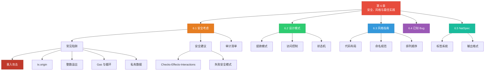
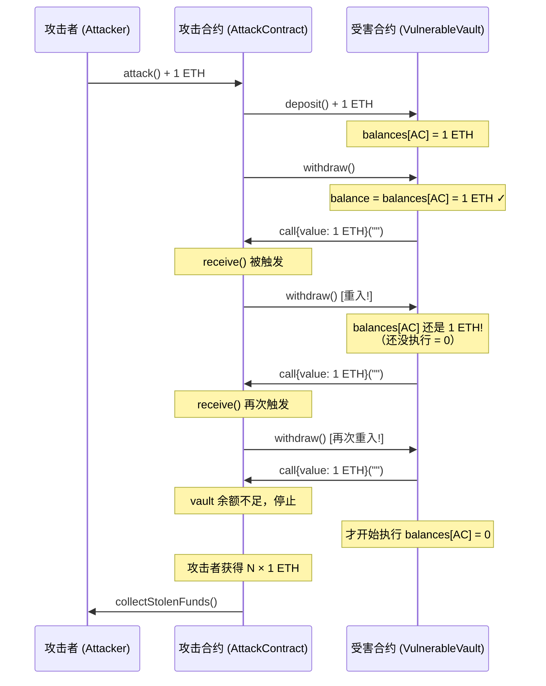
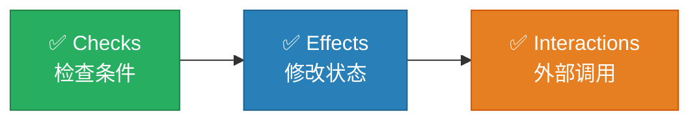
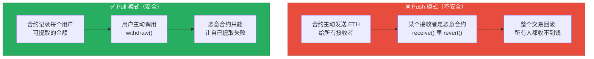
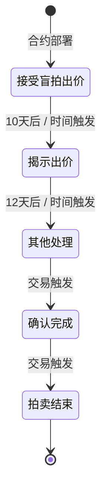
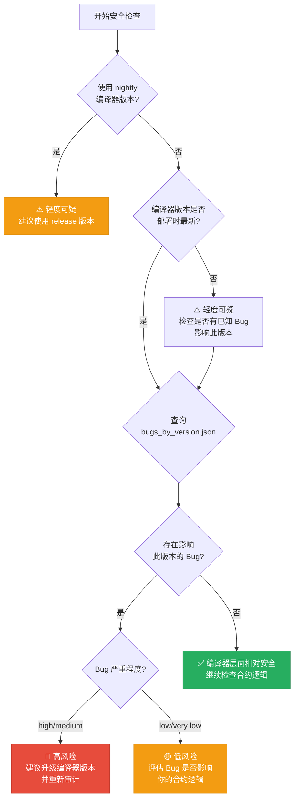

# 第 6 章 — 安全、风格与最佳实践（Security, Style & Best Practices）

> **预计学习时间**：3 - 4 天
> **前置知识**：ch01 - ch05（基础语法、类型系统、函数、控制流、合约结构、继承、接口、库、ABI 编解码等）
> **本章目标**：掌握智能合约安全要点、常见设计模式、编码规范、已知编译器 Bug 和 NatSpec 文档注释

> **JS/TS 读者建议**：本章是"从能写合约到能写出安全、可维护合约"的关键跨越。安全问题在传统 Web 开发中可能只导致数据泄露，但在区块链世界中**直接等于资金损失且不可撤回**。请务必认真阅读每一个攻击场景。

---

## 目录

- [章节概述](#章节概述)
- [知识地图](#知识地图)
- [JS/TS 快速对照](#jsts-快速对照)
- [迁移陷阱（JS → Solidity）](#迁移陷阱js--solidity)
- [6.1 安全考虑（Security Considerations）](#61-安全考虑security-considerations)
  - [6.1.1 常见陷阱（Pitfalls）](#611-常见陷阱pitfalls)
  - [6.1.2 安全建议（Recommendations）](#612-安全建议recommendations)
  - [安全审计检查清单](#安全审计检查清单)
  - [真实世界安全事件](#真实世界安全事件)
- [6.2 常见设计模式（Common Patterns）](#62-常见设计模式common-patterns)
  - [6.2.1 提款模式（Withdrawal Pattern）](#621-提款模式withdrawal-pattern)
  - [6.2.2 访问控制（Restricting Access）](#622-访问控制restricting-access)
  - [6.2.3 状态机模式（State Machine）](#623-状态机模式state-machine)
- [6.3 代码风格指南（Style Guide）](#63-代码风格指南style-guide)
  - [6.3.1 代码布局](#631-代码布局)
  - [6.3.2 布局顺序](#632-布局顺序)
  - [6.3.3 命名规范](#633-命名规范)
  - [6.3.4 修饰器顺序](#634-修饰器顺序)
  - [风格速查单页表](#风格速查单页表)
- [6.4 已知 Bug（Known Bugs）](#64-已知-bugknown-bugs)
- [6.5 NatSpec 文档注释（NatSpec Format）](#65-natspec-文档注释natspec-format)
  - [6.5.1 NatSpec 标签](#651-natspec-标签)
  - [6.5.2 动态表达式](#652-动态表达式)
  - [6.5.3 继承规则](#653-继承规则)
  - [6.5.4 文档输出格式](#654-文档输出格式)
  - [NatSpec vs JSDoc 对比](#natspec-vs-jsdoc-对比)
- [Remix 实操指南](#remix-实操指南)
- [本章小结](#本章小结)
- [学习明细与练习任务](#学习明细与练习任务)
- [常见问题 FAQ](#常见问题-faq)

---

## 章节概述

本章覆盖从"能写合约"到"能写出安全、规范、可维护的合约"所需的全部核心知识：

| 小节 | 内容 | 重要性 |
|------|------|--------|
| 6.1 安全考虑 | 常见攻击向量、防御模式、安全建议 | ★★★★★ |
| 6.2 常见设计模式 | 提款模式、访问控制、状态机 | ★★★★★ |
| 6.3 代码风格指南 | 缩进、命名、布局、函数排列等规范 | ★★★★☆ |
| 6.4 已知 Bug | 编译器已知 Bug 列表及查询方式 | ★★★☆☆ |
| 6.5 NatSpec 文档注释 | 合约文档注释标准格式 | ★★★★☆ |

> **重要提示**：6.1 安全考虑是本章的核心重点。智能合约一旦部署即不可修改（除非使用可升级代理模式），漏洞被利用意味着真金白银的永久损失。请务必理解每个攻击场景并手动复现。

---

## 知识地图



---

## JS/TS 快速对照

| 你熟悉的 JS/TS 世界 | Solidity 世界 | 本章你需要建立的直觉 |
|----------------------|---------------|----------------------|
| XSS / CSRF / SQL 注入 | 重入攻击 / tx.origin / 整数溢出 | 安全漏洞 = 资金被盗，不可回滚 |
| `try-catch` 异常处理 | `require` + Checks-Effects-Interactions | 先检查、再修改状态、最后外部调用 |
| ESLint / Prettier | Solhint / 官方 Style Guide | 4 空格缩进，120 字符行宽 |
| JSDoc (`@param`, `@returns`) | NatSpec (`@param`, `@return`, `@notice`) | 标签几乎一致，但语义不同 |
| npm audit | Slither / MythX / 安全审计 | 智能合约需要专业审计工具 |
| RBAC / JWT 鉴权 | `onlyOwner` modifier + `msg.sender` | 永远不要用 `tx.origin` |
| `process.env.SECRET` | 链上无秘密，`private` 只是 ABI 不可见 | 所有链上数据对所有人公开 |
| 推送通知（Push） | 提款模式（Pull） | 让用户主动提取资金，不要主动推送 |

---

## 迁移陷阱（JS → Solidity）

- **以为 `private` 等于安全**：JS 中 `#privateField` 确实无法从外部访问；Solidity 的 `private` 仅阻止其他合约通过 ABI 访问，任何人都能通过读取链上存储槽获取 `private` 变量的值。
- **习惯性 Push 发送**：JS 后端主动推送数据给客户端是常见模式；Solidity 中主动向大量地址发送 ETH 会引入重入和 DoS 风险，应使用 Pull（提款）模式。
- **忽视 Gas 成本**：JS 中 `for` 循环遍历大数组最多卡一下浏览器；Solidity 中无界循环可能超出区块 Gas 上限，导致函数永远无法执行。
- **把 `tx.origin` 当 `req.user`**：JS 中从 JWT 或 session 取用户身份很安全；Solidity 中 `tx.origin` 返回的是交易发起者而非直接调用者，极易被中间合约劫持。
- **不写 NatSpec**：JS 中不写 JSDoc 最多代码难读；Solidity 中不写 NatSpec 会导致用户在钱包签名时看不到函数说明，增加信任成本。

---

## 6.1 安全考虑（Security Considerations）

> 对应文档：`soliditydocs/security-considerations.rst`

虽然构建按预期工作的软件相对容易，但要确保没有人能以**未预料到**的方式使用它却难得多。在 Solidity 中这一点尤为重要，因为智能合约可以处理代币甚至更有价值的资产。此外，每次智能合约的执行都是公开的，源代码通常也是可用的。

### 6.1.1 常见陷阱（Pitfalls）

#### 私有信息与随机数（Private Information & Randomness）

**核心规则**：智能合约中使用的一切信息都是公开可见的，包括标记为 `private` 的局部变量和状态变量。

```solidity
// SPDX-License-Identifier: MIT
pragma solidity ^0.8.20;

contract UnsafeSecret {
    // ❌ 这个变量虽然标记为 private，但任何人都能通过
    // eth_getStorageAt 读取 slot 0 的值
    uint256 private secretNumber = 42;

    // ❌ 不要用链上数据生成随机数
    // 矿工/验证者可以操纵 block.timestamp、block.prevrandao 等
    function unsafeRandom() public view returns (uint256) {
        return uint256(keccak256(abi.encodePacked(
            block.timestamp,
            block.prevrandao,
            msg.sender
        )));
    }
}
```

**JS 对比**：

```javascript
// JS 中：private 字段确实无法从外部访问
class Vault {
  #secret = "my-password";  // 真正的私有
}

// Solidity 中：private 只是 ABI 级别的隐藏
// 相当于你把密码写在 public GitHub repo 里，只是没加 index
```

**安全建议**：
- 永远不要在链上存储敏感信息（密码、私钥等）
- 需要随机数时使用 Chainlink VRF 等链下预言机方案
- 如需保密数据参与逻辑，使用 commit-reveal 方案（先提交哈希，后揭示原文）

---

#### 重入攻击（Reentrancy）— 最重要的安全漏洞

> **这是本章最关键的内容。2016 年 The DAO 事件因重入攻击导致 6000 万美元被盗，直接引发了以太坊硬分叉。**

**攻击原理**：合约 A 与合约 B 交互（尤其是转账 ETH）时，控制权会转移给 B。B 可以在 A 完成状态更新之前回调 A 的函数，导致重复执行。

##### 有漏洞的合约

```solidity
// SPDX-License-Identifier: MIT
pragma solidity ^0.8.20;

// ⚠️ 此合约包含重入漏洞 — 仅供学习，切勿在生产中使用
contract VulnerableVault {
    mapping(address => uint256) public balances;

    function deposit() public payable {
        balances[msg.sender] += msg.value;
    }

    function withdraw() public {
        uint256 balance = balances[msg.sender];
        require(balance > 0, "No balance");

        // ❌ 漏洞所在：先发送 ETH（外部调用），再更新状态
        (bool success, ) = msg.sender.call{value: balance}("");
        require(success, "Transfer failed");

        // 这行代码在攻击者回调时还未执行，balances 仍然是旧值
        balances[msg.sender] = 0;
    }

    function getBalance() public view returns (uint256) {
        return address(this).balance;
    }
}
```

##### 攻击合约

```solidity
// SPDX-License-Identifier: MIT
pragma solidity ^0.8.20;

interface IVulnerableVault {
    function deposit() external payable;
    function withdraw() external;
    function getBalance() external view returns (uint256);
}

contract ReentrancyAttacker {
    IVulnerableVault public vault;
    address public owner;
    uint256 public attackCount;

    constructor(address _vault) {
        vault = IVulnerableVault(_vault);
        owner = msg.sender;
    }

    function attack() external payable {
        require(msg.value >= 1 ether, "Need at least 1 ETH");

        // 第 1 步：存入 1 ETH 建立余额
        vault.deposit{value: 1 ether}();

        // 第 2 步：触发提款，开始重入循环
        vault.withdraw();
    }

    // 第 3 步：接收 ETH 时自动触发，反复调用 withdraw
    receive() external payable {
        if (address(vault).balance >= 1 ether) {
            attackCount++;
            vault.withdraw();  // 重入！balances 还没清零
        }
    }

    function collectStolenFunds() external {
        require(msg.sender == owner, "Not owner");
        (bool success, ) = owner.call{value: address(this).balance}("");
        require(success);
    }
}
```

##### 重入攻击时序图



##### 修复版本：Checks-Effects-Interactions 模式

```solidity
// SPDX-License-Identifier: MIT
pragma solidity ^0.8.20;

contract SecureVault {
    mapping(address => uint256) public balances;

    function deposit() public payable {
        balances[msg.sender] += msg.value;
    }

    function withdraw() public {
        uint256 balance = balances[msg.sender];

        // ✅ Check：先检查条件
        require(balance > 0, "No balance");

        // ✅ Effect：立即更新状态（在外部调用之前！）
        balances[msg.sender] = 0;

        // ✅ Interact：最后才做外部调用
        (bool success, ) = payable(msg.sender).call{value: balance}("");
        require(success, "Transfer failed");
    }

    function getBalance() public view returns (uint256) {
        return address(this).balance;
    }
}
```

##### 进阶防御：重入锁（Reentrancy Guard）

```solidity
// SPDX-License-Identifier: MIT
pragma solidity ^0.8.20;

abstract contract ReentrancyGuard {
    uint256 private constant NOT_ENTERED = 1;
    uint256 private constant ENTERED = 2;
    uint256 private _status;

    constructor() {
        _status = NOT_ENTERED;
    }

    modifier nonReentrant() {
        require(_status != ENTERED, "ReentrancyGuard: reentrant call");
        _status = ENTERED;
        _;
        _status = NOT_ENTERED;
    }
}

contract SecureVaultWithGuard is ReentrancyGuard {
    mapping(address => uint256) public balances;

    function deposit() public payable {
        balances[msg.sender] += msg.value;
    }

    function withdraw() public nonReentrant {
        uint256 balance = balances[msg.sender];
        require(balance > 0, "No balance");

        balances[msg.sender] = 0;

        (bool success, ) = payable(msg.sender).call{value: balance}("");
        require(success, "Transfer failed");
    }
}
```

> **最佳实践**：同时使用 Checks-Effects-Interactions 模式**和**重入锁（如 OpenZeppelin 的 `ReentrancyGuard`），形成双重防御。

---

#### Gas 限制与循环（Gas Limit and Loops）

没有固定迭代次数的循环（例如依赖存储值的循环）必须谨慎使用。由于区块 Gas 上限的存在，交易只能消耗一定数量的 Gas。如果循环迭代次数增长超过区块 Gas 上限，合约可能会在某个状态下永久卡死。

```solidity
// SPDX-License-Identifier: MIT
pragma solidity ^0.8.20;

contract GasTrap {
    address[] public recipients;

    function addRecipient(address r) public {
        recipients.push(r);
    }

    // ❌ 危险：当 recipients 数组足够大时，此函数将永远无法执行
    function distributeAll() public payable {
        uint256 share = msg.value / recipients.length;
        for (uint256 i = 0; i < recipients.length; i++) {
            (bool success, ) = recipients[i].call{value: share}("");
            require(success);  // 任何一个失败都会回滚全部
        }
    }

    // ✅ 安全替代：分批处理 + 提款模式
    mapping(address => uint256) public pendingWithdrawals;

    function allocateShares() public payable {
        uint256 share = msg.value / recipients.length;
        for (uint256 i = 0; i < recipients.length; i++) {
            pendingWithdrawals[recipients[i]] += share;
        }
    }

    function withdraw() public {
        uint256 amount = pendingWithdrawals[msg.sender];
        pendingWithdrawals[msg.sender] = 0;
        (bool success, ) = payable(msg.sender).call{value: amount}("");
        require(success);
    }
}
```

**JS 对比**：

```javascript
// JS：大数组遍历最多卡浏览器几秒
users.forEach(u => sendEmail(u));  // 慢但不会失败

// Solidity：超出 Gas 上限 → 交易失败 → 状态回滚 → Gas 费照扣
```

---

#### 发送和接收 Ether（Sending and Receiving Ether）

Solidity 提供三种发送 ETH 的方式，各有特点：

| 方式 | Gas 限制 | 返回值 | 失败行为 | 推荐度 |
|------|----------|--------|----------|--------|
| `addr.transfer(amount)` | 2300 gas | 无（失败自动 revert） | 自动回滚 | ⚠️ 不推荐 |
| `addr.send(amount)` | 2300 gas | `bool` | 返回 `false` | ⚠️ 不推荐 |
| `addr.call{value: amount}("")` | 全部剩余 gas | `(bool, bytes)` | 返回 `false` | ✅ 推荐 |

```solidity
// SPDX-License-Identifier: MIT
pragma solidity ^0.8.20;

contract EtherSender {
    // ⚠️ transfer：2300 gas 限制，接收方合约如果 receive/fallback
    // 消耗超过 2300 gas 就会失败。未来 EVM 升级可能改变 gas 成本。
    function sendViaTransfer(address payable to) public payable {
        to.transfer(msg.value);
    }

    // ⚠️ send：同样 2300 gas 限制，需要手动检查返回值
    function sendViaSend(address payable to) public payable {
        bool success = to.send(msg.value);
        require(success, "Send failed");
    }

    // ✅ call：推荐方式，转发全部可用 gas
    // 搭配 Checks-Effects-Interactions 模式和提款模式使用
    function sendViaCall(address payable to) public payable {
        (bool success, ) = to.call{value: msg.value}("");
        require(success, "Call failed");
    }
}
```

**重要注意事项**：
- 任何合约或外部账户都无法阻止别人向其发送 ETH（可以通过 `selfdestruct` 或挖矿强制发送）
- 如果合约没有 `receive` 和 `fallback` 函数，普通转账会被拒绝
- `transfer` 和 `send` 的 2300 gas 限制在未来硬分叉中可能改变，不要依赖这个数值
- **最佳实践**：使用 `call` + 提款模式（Withdrawal Pattern，见 6.2.1）

---

#### 调用栈深度（Call Stack Depth）

外部函数调用可能因为超过最大调用栈大小限制（1024）而失败。在这种情况下，Solidity 会抛出异常。

```solidity
// 恶意攻击者可能在与你的合约交互之前将调用栈推到接近 1024
// 不过自从 Tangerine Whistle 硬分叉后，63/64 规则使得调用栈深度攻击实际上不可行
```

> **补充**：自 [EIP-150（Tangerine Whistle）](https://eips.ethereum.org/EIPS/eip-150) 后，外部调用只会传递当前可用 gas 的 63/64，使得调用栈深度攻击在实践中已不可行。但 `.send()` 和底层 `.call()` 在调用栈耗尽时不会抛出异常，而是返回 `false`。

---

#### 授权代理（Authorized Proxies）

如果合约可以作为代理（即可以用用户提供的数据调用任意合约），那么用户实际上可以假冒代理合约的身份。即使你有其他保护措施，最好将合约系统构建为代理不拥有任何权限（甚至对自身也没有）。

```solidity
// SPDX-License-Identifier: MIT
pragma solidity ^0.8.20;

contract ProxyWithMoreFunctionality {
    PermissionlessProxy proxy;

    function callOther(address addr, bytes memory payload)
        public
        returns (bool, bytes memory)
    {
        return proxy.callOther(addr, payload);
    }
}

// 无权限代理：没有任何特权，只做转发
contract PermissionlessProxy {
    function callOther(address addr, bytes memory payload)
        public
        returns (bool, bytes memory)
    {
        return addr.call(payload);
    }
}
```

---

#### tx.origin 陷阱 — 永远不要用于鉴权

`tx.origin` 返回发起交易的原始外部账户地址，而 `msg.sender` 返回直接调用者地址。当存在中间合约时，两者不同。

##### 有漏洞的钱包合约

```solidity
// SPDX-License-Identifier: MIT
pragma solidity ^0.8.20;

// ⚠️ 此合约包含 tx.origin 漏洞 — 切勿使用
contract TxUserWallet {
    address public owner;

    constructor() {
        owner = msg.sender;
    }

    function transferTo(address payable dest, uint256 amount) public {
        // ❌ 这里使用了 tx.origin 而不是 msg.sender
        require(tx.origin == owner, "Not owner");
        dest.transfer(amount);
    }
}
```

##### 攻击合约

```solidity
// SPDX-License-Identifier: MIT
pragma solidity ^0.8.20;

interface ITxUserWallet {
    function transferTo(address payable dest, uint256 amount) external;
}

contract TxAttackWallet {
    address payable public attacker;

    constructor() {
        attacker = payable(msg.sender);
    }

    // 当 owner 被诱骗向此合约发送 ETH 时
    receive() external payable {
        // tx.origin 仍然是 owner 的地址！
        // msg.sender 是此攻击合约地址（但 TxUserWallet 检查的是 tx.origin）
        ITxUserWallet(msg.sender).transferTo(attacker, msg.sender.balance);
    }
}
```

**攻击流程**：

```
受害者 (EOA, tx.origin = owner)
  └─> 向攻击合约发送少量 ETH
        └─> 攻击合约 receive() 触发
              └─> 调用 TxUserWallet.transferTo(attacker, all_balance)
                    └─> require(tx.origin == owner) ✅ 通过！（tx.origin 是受害者）
                          └─> 全部资金被转给攻击者
```

**修复**：始终使用 `msg.sender` 进行鉴权。

```solidity
require(msg.sender == owner, "Not owner");  // ✅ 安全
```

---

#### 整数溢出/下溢（Integer Overflow / Underflow）

Solidity 的整数类型有固定大小，不能表示任意大的数。

```solidity
// 0.8.0 之前：溢出会静默发生，不会报错！
uint8 x = 255;
uint8 y = 1;
// x + y = 0（溢出回绕），这是 2016-2020 年间大量安全事故的根源

// 0.8.0 及之后：默认开启溢出检查
uint8 x = 255;
uint8 y = 1;
// x + y → revert（自动 panic）✅

// 如果你确实需要回绕行为（如某些哈希运算），使用 unchecked
unchecked {
    uint8 z = x + y;  // z = 0，不会 revert
}
```

**关键点**：
- Solidity `>=0.8.0` 默认开启算术溢出检查，溢出会自动 revert
- `unchecked { ... }` 块内禁用检查，溢出静默回绕
- 即使在 checked 模式下，也不要假设完全安全——overflow revert 可能导致合约卡在某个状态
- 使用 `require` 限制输入范围是更好的防御方式

---

#### 映射清理（Clearing Mappings）

Solidity 的 `mapping` 不会跟踪哪些 key 被赋过非零值。因此，如果 `mapping` 是动态数组或 struct 的成员，删除或 pop 这些容器时，`mapping` 中的数据不会被清除。

```solidity
// SPDX-License-Identifier: MIT
pragma solidity ^0.8.20;

contract MappingCleanupIssue {
    mapping(uint256 => uint256)[] public array;

    function allocate(uint256 newMaps) public {
        for (uint256 i = 0; i < newMaps; i++)
            array.push();
    }

    function writeMap(uint256 map, uint256 key, uint256 value) public {
        array[map][key] = value;
    }

    function readMap(uint256 map, uint256 key) public view returns (uint256) {
        return array[map][key];
    }

    function eraseMaps() public {
        delete array;  // ⚠️ array 长度清零，但 mapping 数据仍在存储中！
    }
}

// 调用序列演示：
// 1. allocate(10)
// 2. writeMap(4, 128, 256)  → array[4][128] = 256
// 3. readMap(4, 128)        → 返回 256
// 4. eraseMaps()            → array.length = 0，但存储数据还在
// 5. allocate(5)
// 6. readMap(4, 128)        → 仍然返回 256！幽灵数据
```

**安全建议**：如果需要完全清除 mapping，使用可迭代映射库（iterable mapping），记录所有写入的 key 以便逐个删除。

---

### 6.1.2 安全建议（Recommendations）

#### 1. 严肃对待编译器警告

如果编译器警告你某些事情，你应该修改代码。即使你不认为某个特定警告有安全影响，它下面可能隐藏着另一个问题。始终使用最新版本的编译器以获得最新的警告。

#### 2. 限制合约中的 Ether 数量

限制智能合约中可以存储的 Ether（或其他代币）数量。如果源代码、编译器或平台有 bug，这些资金可能丢失。如果你想限制损失，就限制金额。

#### 3. 保持合约小而模块化

保持合约小巧且易于理解。将不相关的功能拆分到其他合约或库中。代码质量的一般建议当然适用：限制局部变量数量、函数长度等。

#### 4. 使用 Checks-Effects-Interactions 模式

这是防止重入攻击的核心模式：



**三步法则**：
1. **Checks**（检查）：验证所有前置条件（参数合法性、余额充足、调用者权限等）
2. **Effects**（效果）：修改当前合约的所有状态变量
3. **Interactions**（交互）：与其他合约的所有交互放在最后

```solidity
function withdraw(uint256 amount) public {
    // 1. Checks
    require(balances[msg.sender] >= amount, "Insufficient balance");
    require(amount > 0, "Amount must be positive");

    // 2. Effects
    balances[msg.sender] -= amount;
    totalSupply -= amount;
    emit Withdrawal(msg.sender, amount);

    // 3. Interactions
    (bool success, ) = payable(msg.sender).call{value: amount}("");
    require(success, "Transfer failed");
}
```

#### 5. 包含失败安全模式（Fail-Safe Mode）

在合约中加入自检功能，例如"是否有 Ether 泄漏？"、"代币总和是否等于合约余额？"等。如果自检失败，合约自动切换到"安全模式"——禁用大部分功能，将控制权交给受信任的第三方，或者简单地变成一个"退款"合约。

#### 6. 请求同行评审与安全审计

越多人检查代码，越多问题会被发现。代码审查还有助于验证你的代码是否易于理解——这是优秀智能合约的重要标准。

---

### 安全审计检查清单

以下是部署合约前应逐一核查的安全清单：

**基础安全**

- [ ] 所有外部调用都遵循 Checks-Effects-Interactions 模式
- [ ] 关键函数使用了 `ReentrancyGuard`（`nonReentrant` 修饰器）
- [ ] 没有使用 `tx.origin` 进行权限验证
- [ ] 所有 `msg.value` 检查都在函数入口处完成
- [ ] 使用 Solidity `>=0.8.0`（默认溢出检查）
- [ ] `unchecked` 块仅用于可证明安全的算术运算

**权限与访问控制**

- [ ] 敏感函数有适当的访问控制修饰器（`onlyOwner` 等）
- [ ] 合约所有权可以安全转移（两步转移模式更佳）
- [ ] 没有遗留的测试函数或后门函数
- [ ] `selfdestruct` 仅在必要时使用，且有严格权限限制

**资金安全**

- [ ] ETH 发送使用 `call` 而非 `transfer` / `send`
- [ ] 使用 Pull（提款）模式而非 Push（推送）模式
- [ ] 合约能正确处理接收到的 ETH（有 `receive` 或 `fallback`）
- [ ] 没有因循环过大导致的 Gas DoS 风险

**数据与逻辑**

- [ ] 没有在链上存储敏感信息（密码、私钥等）
- [ ] 没有依赖链上数据生成随机数
- [ ] `delete` struct 时注意内部 mapping 不会被清除
- [ ] 所有除法运算检查了除零情况
- [ ] 数组和循环有合理的上限

**代码质量**

- [ ] 编译器零警告
- [ ] 使用最新稳定版 Solidity 编译器
- [ ] 所有 public/external 函数都有 NatSpec 注释
- [ ] 代码通过了 Slither / MythX 等自动化安全分析工具
- [ ] 已完成至少一次同行代码审查
- [ ] 关键合约已通过专业安全审计

---

### 真实世界安全事件

#### The DAO 攻击（2016年6月）

**事件概要**：The DAO 是以太坊上最早的去中心化自治组织之一，管理着约 1.5 亿美元的 ETH。攻击者利用重入漏洞，在 `splitDAO` 函数中反复提取资金，最终窃取约 6000 万美元的 ETH。

**漏洞根因**：`splitDAO` 函数先向用户发送 ETH（外部调用），再更新用户余额（状态修改）——违反了 Checks-Effects-Interactions 模式。

**后果**：以太坊社区进行了硬分叉（Hard Fork），将被盗资金退回。这次分叉导致了以太坊（ETH）和以太坊经典（ETC）的分裂，至今两条链仍然并行运行。

**教训**：
- 重入攻击不是理论问题，它曾经改变了整个区块链的历史
- Checks-Effects-Interactions 不是建议，是必须
- 再多的资金和声誉也无法弥补一行代码的疏忽

---

## 6.2 常见设计模式（Common Patterns）

> 对应文档：`soliditydocs/common-patterns.rst`

### 6.2.1 提款模式（Withdrawal Pattern）

**核心思想**：不要主动向用户推送（Push）资金，让用户主动拉取（Pull）资金。

**为什么不直接 `transfer`？**



**Pull 模式（安全）**：

```solidity
// SPDX-License-Identifier: MIT
pragma solidity ^0.8.20;

contract WithdrawalContract {
    address public richest;
    uint256 public mostSent;
    mapping(address => uint256) public pendingWithdrawals;

    error NotEnoughEther();

    constructor() payable {
        richest = msg.sender;
        mostSent = msg.value;
    }

    function becomeRichest() public payable {
        if (msg.value <= mostSent) revert NotEnoughEther();
        // 不直接发送 ETH，而是记录待提取金额
        pendingWithdrawals[richest] += msg.value;
        richest = msg.sender;
        mostSent = msg.value;
    }

    function withdraw() public {
        uint256 amount = pendingWithdrawals[msg.sender];
        pendingWithdrawals[msg.sender] = 0;  // CEI：先更新状态
        (bool success, ) = payable(msg.sender).call{value: amount}("");
        require(success, "Withdrawal failed");
    }
}
```

**Push 模式（不安全）**：

```solidity
// SPDX-License-Identifier: MIT
pragma solidity ^0.8.20;

// ⚠️ 不推荐：攻击者可以让 richest 指向一个 receive() revert 的合约
// 导致 becomeRichest 永远无法执行 → 合约永久卡死
contract SendContract {
    address payable public richest;
    uint256 public mostSent;

    error NotEnoughEther();

    constructor() payable {
        richest = payable(msg.sender);
        mostSent = msg.value;
    }

    function becomeRichest() public payable {
        if (msg.value <= mostSent) revert NotEnoughEther();
        // ❌ 直接发送：如果 richest 是恶意合约，这行会一直失败
        (bool success, ) = richest.call{value: msg.value}("");
        require(success);
        richest = payable(msg.sender);
        mostSent = msg.value;
    }
}
```

---

### 6.2.2 访问控制（Restricting Access）

使用 function modifier 实现权限控制是 Solidity 中最常见的设计模式之一。

```solidity
// SPDX-License-Identifier: MIT
pragma solidity ^0.8.20;

contract AccessRestriction {
    address public owner = msg.sender;
    uint256 public creationTime = block.timestamp;

    error Unauthorized();
    error TooEarly();
    error NotEnoughEther();

    // 只有特定地址可以调用
    modifier onlyBy(address account) {
        if (msg.sender != account)
            revert Unauthorized();
        _;
    }

    // 只有在特定时间之后才能调用
    modifier onlyAfter(uint256 time) {
        if (block.timestamp < time)
            revert TooEarly();
        _;
    }

    // 需要支付特定费用
    modifier costs(uint256 amount) {
        if (msg.value < amount)
            revert NotEnoughEther();
        _;
        // 退还多余的 ETH
        if (msg.value > amount) {
            (bool success, ) = payable(msg.sender).call{
                value: msg.value - amount
            }("");
            require(success);
        }
    }

    function changeOwner(address newOwner)
        public
        onlyBy(owner)
    {
        owner = newOwner;
    }

    function disown()
        public
        onlyBy(owner)
        onlyAfter(creationTime + 6 weeks)
    {
        delete owner;
    }

    function forceOwnerChange(address newOwner)
        public
        payable
        costs(200 ether)
    {
        owner = newOwner;
    }
}
```

**常用 modifier 模式总结**：

| Modifier | 用途 | 示例 |
|----------|------|------|
| `onlyOwner` | 仅合约拥有者可调用 | 管理功能 |
| `onlyBy(addr)` | 仅指定地址可调用 | 多角色系统 |
| `onlyAfter(time)` | 时间锁 | 延迟执行 |
| `onlyBefore(time)` | 截止时间限制 | 众筹结束 |
| `costs(amount)` | 最低付款要求 | 付费功能 |
| `nonReentrant` | 防重入 | 资金操作 |

---

### 6.2.3 状态机模式（State Machine）

合约经常需要在不同阶段间转换，每个阶段有不同的行为和可调用函数。



```solidity
// SPDX-License-Identifier: MIT
pragma solidity ^0.8.20;

contract StateMachine {
    enum Stages {
        AcceptingBlindedBids,
        RevealBids,
        AnotherStage,
        AreWeDoneYet,
        Finished
    }

    error FunctionInvalidAtThisStage();

    Stages public stage = Stages.AcceptingBlindedBids;
    uint256 public creationTime = block.timestamp;

    // 检查当前阶段是否允许调用
    modifier atStage(Stages stage_) {
        if (stage != stage_)
            revert FunctionInvalidAtThisStage();
        _;
    }

    function nextStage() internal {
        stage = Stages(uint256(stage) + 1);
    }

    // 基于时间的自动阶段转换
    // 重要：此 modifier 必须放在 atStage 之前！
    modifier timedTransitions() {
        if (
            stage == Stages.AcceptingBlindedBids &&
            block.timestamp >= creationTime + 10 days
        )
            nextStage();
        if (
            stage == Stages.RevealBids &&
            block.timestamp >= creationTime + 12 days
        )
            nextStage();
        _;
    }

    // 函数执行完毕后自动进入下一阶段
    modifier transitionNext() {
        _;
        nextStage();
    }

    // modifier 顺序很重要：先做时间转换检查，再检查当前阶段
    function bid()
        public
        payable
        timedTransitions
        atStage(Stages.AcceptingBlindedBids)
    {
        // 出价逻辑
    }

    function reveal()
        public
        timedTransitions
        atStage(Stages.RevealBids)
    {
        // 揭示出价逻辑
    }

    function g()
        public
        timedTransitions
        atStage(Stages.AnotherStage)
        transitionNext
    {
        // 处理逻辑，执行完自动转到下一阶段
    }

    function h()
        public
        timedTransitions
        atStage(Stages.AreWeDoneYet)
        transitionNext
    {
        // 确认逻辑
    }

    function i()
        public
        timedTransitions
        atStage(Stages.Finished)
    {
        // 最终结算
    }
}
```

> **Modifier 顺序很重要**：`timedTransitions` 必须在 `atStage` 之前，这样时间触发的自动转换会先生效，再检查阶段条件。

---

## 6.3 代码风格指南（Style Guide）

> 对应文档：`soliditydocs/style-guide.rst`

Solidity 官方风格指南参考了 Python 的 PEP 8，目标不是"唯一正确的写法"，而是**一致性**。

> 项目内一致性 > 模块内一致性 > 与本指南一致性。但最重要的是：**知道什么时候可以不遵循它**。

### 6.3.1 代码布局

| 规则 | Solidity | JS/TS（对比） |
|------|----------|--------------|
| 缩进 | **4 个空格** | 通常 2 空格 |
| 最大行宽 | **120 字符** | 通常 80-100 字符 |
| 字符串 | **双引号** `"foo"` | 单引号 `'foo'` 居多 |
| 空行：顶层声明间 | **2 个空行** | 通常 1 个空行 |
| 空行：合约内函数间 | **1 个空行** | 1 个空行 |
| 编码 | UTF-8 / ASCII | UTF-8 |

**函数排列顺序**：

```solidity
contract MyContract {
    // 1. constructor
    constructor() { }

    // 2. receive（如果需要）
    receive() external payable { }

    // 3. fallback（如果需要）
    fallback() external { }

    // 4. external 函数
    function externalFn() external { }
    function externalViewFn() external view returns (uint256) { }
    function externalPureFn() external pure returns (uint256) { }

    // 5. public 函数
    function publicFn() public { }

    // 6. internal 函数
    function _internalFn() internal { }

    // 7. private 函数
    function _privateFn() private { }
}
```

> **同一可见性组内**，`view` 和 `pure` 函数放在最后。

**换行规则**（长函数声明）：

```solidity
// ✅ 正确：每个参数独占一行
function thisFunctionHasLotsOfArguments(
    address a,
    address b,
    address c,
    address d
)
    public
    onlyOwner
    returns (address)
{
    doSomething();
}

// ❌ 错误：参数挤在一行
function thisFunctionHasLotsOfArguments(address a, address b,
    address c, address d) public {
    doSomething();
}
```

---

### 6.3.2 布局顺序

**文件级别**（从上到下）：

```
1. Pragma 声明
2. Import 语句
3. Event 定义（如果在文件级别）
4. Error 定义（如果在文件级别）
5. Interface
6. Library
7. Contract
```

**合约内部**（从上到下）：

```
1. Type 声明（using ... for ...、enum、struct）
2. State variables（状态变量）
3. Events（事件）
4. Errors（自定义错误）
5. Modifiers（修饰器）
6. Functions（函数）
```

**完整示例**：

```solidity
// SPDX-License-Identifier: MIT
pragma solidity ^0.8.20;

import "@openzeppelin/contracts/access/Ownable.sol";

interface IMyInterface {
    function getValue() external view returns (uint256);
}

library MathLib {
    function add(uint256 a, uint256 b) internal pure returns (uint256) {
        return a + b;
    }
}

contract MyContract is Ownable {
    // 1. Type declarations
    using MathLib for uint256;

    enum Status { Active, Paused, Closed }

    struct UserInfo {
        uint256 balance;
        bool isActive;
    }

    // 2. State variables
    uint256 public totalSupply;
    mapping(address => UserInfo) public users;

    // 3. Events
    event Deposited(address indexed user, uint256 amount);
    event StatusChanged(Status newStatus);

    // 4. Errors
    error InsufficientBalance(uint256 requested, uint256 available);

    // 5. Modifiers
    modifier whenActive() {
        // ...
        _;
    }

    // 6. Functions (按可见性排列)
    constructor() Ownable(msg.sender) { }

    receive() external payable { }

    function deposit() external payable whenActive { }
    function getBalance() external view returns (uint256) { }
    function _validateUser(address user) internal view { }
    function _calculateFee(uint256 amount) private pure returns (uint256) { }
}
```

---

### 6.3.3 命名规范

| 元素 | 命名风格 | 示例 |
|------|----------|------|
| Contract | PascalCase | `SimpleToken`, `SmartBank` |
| Library | PascalCase | `SafeMath`, `Address` |
| Interface | PascalCase（通常以 `I` 开头） | `IERC20`, `IVault` |
| Struct | PascalCase | `UserInfo`, `Position` |
| Enum | PascalCase | `Status`, `TokenType` |
| Event | PascalCase | `Transfer`, `Approval` |
| Error | PascalCase | `InsufficientBalance` |
| Function | camelCase | `getBalance`, `transferTo` |
| Function argument | camelCase | `initialSupply`, `newOwner` |
| Local / State variable | camelCase | `totalSupply`, `isActive` |
| Constant | UPPER_CASE | `MAX_SUPPLY`, `TOKEN_NAME` |
| Modifier | camelCase | `onlyOwner`, `whenNotPaused` |
| Internal/Private 函数/变量 | `_camelCase`（前导下划线） | `_transfer`, `_balances` |

> **避免使用**：单字母 `l`（易与数字 1 混淆）、`O`（易与数字 0 混淆）、`I`（易与数字 1 混淆）。

---

### 6.3.4 修饰器顺序

函数声明中的修饰器顺序：

```
Visibility → Mutability → Virtual → Override → Custom Modifiers
```

```solidity
// ✅ 正确顺序
function balance(uint256 from)
    public          // 1. Visibility
    view            // 2. Mutability
    override        // 3. Override
    returns (uint256)
{
    return balanceOf[from];
}

function increment(uint256 x)
    public          // 1. Visibility
    pure            // 2. Mutability
    onlyOwner       // 3. Custom Modifier
    returns (uint256)
{
    return x + 1;
}

// ❌ 错误顺序
function increment(uint256 x)
    onlyOwner       // Custom 不应在 Visibility 之前
    public
    pure
    returns (uint256)
{
    return x + 1;
}
```

---

### 风格速查单页表

```
┌─────────────────────────────────────────────────────────────────┐
│                  Solidity 风格速查（One-Page Cheat Sheet）        │
├─────────────────────────────────────────────────────────────────┤
│                                                                 │
│  缩进: 4 空格 (不用 Tab)          行宽上限: 120 字符              │
│  字符串: 双引号 "hello"            编码: UTF-8                    │
│                                                                 │
│  ─── 文件布局顺序 ───                                            │
│  Pragma → Import → Interface → Library → Contract               │
│                                                                 │
│  ─── 合约内部顺序 ───                                            │
│  Type → State Vars → Events → Errors → Modifiers → Functions    │
│                                                                 │
│  ─── 函数排列 ───                                                │
│  constructor → receive → fallback                                │
│  → external → public → internal → private                       │
│  （同组内 view/pure 放最后）                                       │
│                                                                 │
│  ─── 修饰器顺序 ───                                              │
│  Visibility → Mutability → Virtual → Override → Custom           │
│                                                                 │
│  ─── 命名规范 ───                                                │
│  PascalCase : Contract, Struct, Event, Error, Enum, Interface   │
│  camelCase  : function, variable, modifier, argument            │
│  UPPER_CASE : constant, immutable                                │
│  _camelCase : internal/private function & variable              │
│                                                                 │
│  ─── 空行规则 ───                                                │
│  顶层声明之间: 2 个空行                                           │
│  合约内函数之间: 1 个空行                                          │
│                                                                 │
│  ─── 花括号 ───                                                  │
│  开花括号与声明同行: contract Foo {                                │
│  闭花括号独占一行并与声明对齐                                       │
│                                                                 │
└─────────────────────────────────────────────────────────────────┘
```

---

## 6.4 已知 Bug（Known Bugs）

> 对应文档：`soliditydocs/bugs.rst`

Solidity 编译器维护了一份公开的已知安全相关 Bug 列表，托管在 GitHub 仓库中。

### Bug 列表结构

Bug 列表是一个 JSON 数组，每个条目包含以下字段：

| 字段 | 说明 |
|------|------|
| `uid` | 唯一标识符，格式 `SOL-<year>-<number>` |
| `name` | Bug 名称 |
| `summary` | 简要描述 |
| `description` | 详细描述 |
| `link` | 更多信息的 URL（可选） |
| `introduced` | 首次引入 Bug 的编译器版本（可选） |
| `fixed` | 首次修复 Bug 的编译器版本 |
| `publish` | Bug 公开披露的日期（可选） |
| `severity` | 严重程度：`very low` / `low` / `medium` / `high` |
| `conditions` | 触发条件（如是否需要开启优化器、特定 EVM 版本等） |
| `check` | 检测 Bug 的正则表达式或 AST 查询 |

### 如何查询特定版本的 Bug

Solidity 提供两个数据文件：

| 文件 | 用途 | URL |
|------|------|-----|
| `bugs.json` | 所有已知 Bug 列表 | `github.com/ethereum/solidity/blob/develop/docs/bugs.json` |
| `bugs_by_version.json` | 按编译器版本索引的 Bug | `github.com/ethereum/solidity/blob/develop/docs/bugs_by_version.json` |

**使用建议**：
- 合约源码验证工具应根据编译器版本查阅此列表
- 使用 nightly 编译器版本编译的合约值得怀疑（Bug 列表不跟踪 nightly）
- 如果合约使用的编译器版本在部署时已有更新版本修复了已知 Bug，也值得怀疑

**查询示例**（使用 `bugs_by_version.json`）：

```javascript
// 假设你需要检查 Solidity 0.8.17 的已知 Bug
const bugs = require('./bugs_by_version.json');
const version = '0.8.17';

if (bugs[version]) {
    console.log(`Solidity ${version} 的已知 Bug:`);
    bugs[version].bugs.forEach(bug => {
        console.log(`- [${bug.severity}] ${bug.name}: ${bug.summary}`);
    });
} else {
    console.log(`未找到 ${version} 的 Bug 记录`);
}
```

### 安全审计决策树



---

## 6.5 NatSpec 文档注释（NatSpec Format）

> 对应文档：`soliditydocs/natspec-format.rst`

NatSpec（Ethereum Natural Language Specification Format）是 Solidity 的标准文档注释格式。它有两个核心用途：
1. **面向终端用户**：钱包在用户签名交易时展示函数说明
2. **面向开发者**：生成 API 文档

### 6.5.1 NatSpec 标签

使用 `///` 或 `/** ... */` 格式书写，放在函数/合约/事件声明的正上方。

| 标签 | 说明 | 适用于 |
|------|------|--------|
| `@title` | 合约/接口的标题 | contract, library, interface, struct, enum |
| `@author` | 作者名 | contract, library, interface, struct, enum |
| `@notice` | 面向终端用户的说明 | contract, function, event, error, struct, enum |
| `@dev` | 面向开发者的详细说明 | contract, function, event, error, struct, enum |
| `@param` | 参数说明（后跟参数名） | function, event, error |
| `@return` | 返回值说明 | function, public state variable |
| `@inheritdoc` | 从基类函数继承文档（后跟合约名） | function, public state variable |
| `@custom:...` | 自定义标签（应用自定义语义） | 所有位置 |

> **注意**：编译器仅解析 `external` 和 `public` 函数的 NatSpec 标签。你可以在 `internal` / `private` 函数中使用类似注释，但不会被解析。

**完整示例**：

```solidity
// SPDX-License-Identifier: MIT
pragma solidity ^0.8.20;

/// @title 一个简单的树木模拟器
/// @author Larry A. Gardner
/// @notice 此合约仅用于最基础的模拟
/// @dev 所有函数调用目前都没有副作用
/// @custom:experimental 这是一个实验性合约
contract Tree {
    /// @notice 计算树木年龄（年），向上取整
    /// @dev Alexandr N. Tetearing 算法可以提高精度
    /// @param rings 来自年轮学样本的年轮数
    /// @return 年龄（年），部分年份向上取整
    /// @return 树的名称
    function age(uint256 rings)
        external
        virtual
        pure
        returns (uint256, string memory)
    {
        return (rings + 1, "tree");
    }

    /// @notice 返回树木的叶子数量
    /// @dev 仅返回固定数字
    function leaves() external virtual pure returns (uint256) {
        return 2;
    }
}

contract KumquatTree is Tree {
    function age(uint256 rings)
        external
        override
        pure
        returns (uint256, string memory)
    {
        return (rings + 2, "Kumquat");
    }

    /// @inheritdoc Tree
    function leaves()
        external
        override(Tree)
        pure
        returns (uint256)
    {
        return 3;
    }
}
```

---

### 6.5.2 动态表达式

NatSpec 支持在注释中引用函数参数，客户端软件在显示时会将参数名替换为实际值：

```solidity
/// @notice 此函数将 `a` 乘以 7
function multiply(uint256 a) external pure returns (uint256) {
    return a * 7;
}

// 当用户调用 multiply(10) 时，钱包可能显示：
// "此函数将 10 乘以 7"
```

---

### 6.5.3 继承规则

没有 NatSpec 的函数会自动继承基类函数的文档。以下情况除外：
1. 派生函数的参数名与基类不同
2. 存在多个基类函数（钻石继承冲突）
3. 有显式的 `@inheritdoc` 标签指定从哪个合约继承

```solidity
interface IERC20 {
    /// @notice 从调用者账户转移 `amount` 代币到 `to`
    /// @param to 接收地址
    /// @param amount 转移数量
    /// @return 是否成功
    function transfer(address to, uint256 amount) external returns (bool);
}

contract MyToken is IERC20 {
    // 如果不写 NatSpec，自动继承 IERC20.transfer 的文档
    function transfer(address to, uint256 amount) external override returns (bool) {
        // ...
        return true;
    }
}
```

---

### 6.5.4 文档输出格式

使用 `solc --userdoc --devdoc` 生成两种 JSON 文档：

**用户文档（User Documentation）** — 面向终端用户：

```json
{
    "version": 1,
    "kind": "user",
    "methods": {
        "age(uint256)": {
            "notice": "计算树木年龄（年），向上取整"
        },
        "leaves()": {
            "notice": "返回树木的叶子数量"
        }
    },
    "notice": "此合约仅用于最基础的模拟"
}
```

**开发者文档（Developer Documentation）** — 面向开发者：

```json
{
    "version": 1,
    "kind": "dev",
    "author": "Larry A. Gardner",
    "details": "所有函数调用目前都没有副作用",
    "custom:experimental": "这是一个实验性合约",
    "methods": {
        "age(uint256)": {
            "details": "Alexandr N. Tetearing 算法可以提高精度",
            "params": {
                "rings": "来自年轮学样本的年轮数"
            },
            "returns": {
                "_0": "年龄（年），部分年份向上取整",
                "_1": "树的名称"
            }
        }
    },
    "title": "一个简单的树木模拟器"
}
```

---

### NatSpec vs JSDoc 对比

| 特性 | NatSpec (Solidity) | JSDoc (JavaScript) |
|------|--------------------|--------------------|
| **注释语法** | `///` 或 `/** */` | `/** */` |
| **标题** | `@title` | 无直接等价（用 `@module` 或 `@class`） |
| **作者** | `@author` | `@author` |
| **用户说明** | `@notice` | 无等价（JSDoc 不区分用户/开发者） |
| **开发者说明** | `@dev` | `@description` 或正文 |
| **参数** | `@param name 说明` | `@param {type} name 说明` |
| **返回值** | `@return 说明` | `@returns {type} 说明` |
| **继承** | `@inheritdoc ContractName` | `@inheritdoc` / `@extends` |
| **自定义** | `@custom:xxx` | `@xxx`（自定义标签） |
| **类型标注** | 不需要（编译器已知） | 需要 `{type}` |
| **动态表达式** | `` `paramName` `` 运行时替换 | 不支持 |
| **输出格式** | JSON（user doc + dev doc） | HTML |

**完整对比示例**：

```solidity
// Solidity NatSpec
/// @title ERC20 代币合约
/// @author Alice
/// @notice 标准 ERC20 代币实现
/// @dev 遵循 EIP-20 规范
contract MyToken {
    /// @notice 将 `amount` 个代币从调用者转给 `to`
    /// @dev 内部使用 _transfer 实现
    /// @param to 接收者地址
    /// @param amount 转移数量
    /// @return success 是否转移成功
    function transfer(address to, uint256 amount)
        external
        returns (bool success)
    {
        // ...
    }
}
```

```javascript
// JavaScript JSDoc
/**
 * ERC20 代币合约
 * @module MyToken
 * @author Alice
 * @description 标准 ERC20 代币实现，遵循 EIP-20 规范
 */
class MyToken {
    /**
     * 将代币从调用者转给接收者
     * @param {string} to - 接收者地址
     * @param {number} amount - 转移数量
     * @returns {boolean} 是否转移成功
     */
    transfer(to, amount) {
        // ...
    }
}
```

---

## Remix 实操指南

### 实验 1：复现重入攻击（约 30 分钟）

1. **部署 VulnerableVault**：在 Remix 中创建 `VulnerableVault.sol`，复制 6.1.1 中有漏洞的合约代码
2. **部署 ReentrancyAttacker**：创建攻击合约，构造函数传入 VulnerableVault 地址
3. **准备资金**：用多个测试账户向 VulnerableVault 存入 ETH（如 10 个账户各存 1 ETH）
4. **发动攻击**：调用 `ReentrancyAttacker.attack()`，附带 1 ETH
5. **观察结果**：检查 VulnerableVault 余额和 ReentrancyAttacker 余额

### 实验 2：验证修复效果（约 15 分钟）

1. **部署 SecureVault**：复制修复版合约代码
2. **重复攻击**：用同样的攻击合约尝试攻击 SecureVault
3. **观察结果**：攻击应该失败（revert 或只能提取自己的份额）

### 实验 3：状态机流转（约 20 分钟）

1. **部署 StateMachine**：观察初始 stage
2. **尝试在错误阶段调用函数**：应收到 `FunctionInvalidAtThisStage` 错误
3. **推进时间**（Remix 可手动设置 block timestamp）：观察自动阶段转换

### 实验 4：NatSpec 生成（约 10 分钟）

1. 在 Remix 中编写带完整 NatSpec 的合约
2. 编译后查看 "Compilation Details" → "DEVDOC" 和 "USERDOC" 输出

---

## 本章小结

本章覆盖了从安全到规范的五大核心领域：

**安全考虑（6.1）**：重入攻击是最严重的安全威胁，The DAO 事件已经证明了其破坏力。Checks-Effects-Interactions 模式是第一道防线，ReentrancyGuard 是第二道。此外还需警惕 tx.origin 陷阱、整数溢出、Gas DoS、私有数据泄露等。

**设计模式（6.2）**：提款模式（Pull over Push）避免了 DoS 和重入风险；访问控制通过 modifier 实现清晰的权限管理；状态机模式为合约生命周期提供了结构化管理。

**风格指南（6.3）**：4 空格缩进、120 字符行宽、PascalCase 合约名、camelCase 函数名、UPPER_CASE 常量名。修饰器顺序：Visibility → Mutability → Virtual → Override → Custom。

**已知 Bug（6.4）**：Solidity 编译器维护公开的 Bug 列表，部署前应检查编译器版本是否存在已知安全 Bug。

**NatSpec（6.5）**：标准化的文档注释格式，同时服务终端用户和开发者，与 JSDoc 高度相似但有关键差异。

---

## 学习明细与练习任务

### 练习任务 1：复现并修复重入攻击（必做，约 60 分钟）

1. 在 Remix 中部署有漏洞的 `VulnerableVault`
2. 部署攻击合约 `ReentrancyAttacker`
3. 用多个账户向 VulnerableVault 存入 ETH
4. 执行攻击，验证资金被盗
5. 修复 VulnerableVault（使用 Checks-Effects-Interactions 模式 + ReentrancyGuard）
6. 验证修复后攻击失败

**验收标准**：能清楚解释重入攻击的每一步流程，以及修复方案为什么有效。

---

### 练习任务 2：实现带角色管理的合约（必做，约 45 分钟）

实现一个多角色访问控制合约：

```solidity
contract RoleBasedAccess {
    // 三个角色：Owner、Admin、User
    // Owner 可以添加/移除 Admin
    // Admin 可以添加/移除 User
    // User 可以执行特定操作
    // 每个操作都有对应的 modifier 保护
}
```

**验收标准**：至少 3 个 modifier、角色的增删查改功能齐全、有事件日志。

---

### 练习任务 3：使用 NatSpec 为合约编写完整文档（必做，约 30 分钟）

选择你之前章节写过的任意一个合约，为所有 `public` / `external` 函数添加完整的 NatSpec 注释，包含：
- 合约级别的 `@title`、`@author`、`@notice`、`@dev`
- 每个函数的 `@notice`、`@dev`、`@param`、`@return`

**验收标准**：`solc --userdoc --devdoc` 输出完整的 JSON 文档。

---

### 练习任务 4：对照风格指南重构旧代码（推荐，约 30 分钟）

选择你之前写过的合约代码，按照 6.3 的风格指南逐项检查并重构：
- [ ] 缩进是否为 4 空格
- [ ] 函数排列是否按照 constructor → receive → fallback → external → public → internal → private
- [ ] 合约内部元素是否按照 Type → State vars → Events → Errors → Modifiers → Functions
- [ ] 命名是否遵循约定（PascalCase / camelCase / UPPER_CASE）
- [ ] 修饰器顺序是否为 Visibility → Mutability → Virtual → Override → Custom

**验收标准**：代码完全符合官方风格指南。

---

## 常见问题 FAQ

**Q1：重入攻击只发生在转账 ETH 时吗？**
A：不是。重入攻击可以发生在任何外部函数调用中，不仅限于 ETH 转账。调用其他合约的任何函数都可能触发回调。此外，还需要考虑跨合约重入——被调用的合约可能修改你依赖的另一个合约的状态。

---

**Q2：Solidity 0.8.0 之后还需要 SafeMath 吗？**
A：一般不需要。Solidity `>=0.8.0` 默认对所有算术运算进行溢出检查，溢出会自动 revert。SafeMath 在 0.8.0+ 中是多余的，反而增加 gas 消耗。但如果你需要在 `unchecked` 块内做安全运算，可以自行实现检查逻辑。

---

**Q3：`transfer`、`send`、`call` 应该用哪个？**
A：推荐使用 `call`。`transfer` 和 `send` 都有 2300 gas 的固定限制，这个限制在未来的 EVM 升级中可能被改变（例如 EIP-1884 已经改变了某些操作码的 gas 成本）。`call` 转发所有可用 gas，配合 Checks-Effects-Interactions 模式使用是最安全的选择。

---

**Q4：为什么 Solidity 用 4 空格缩进而不是 JS 的 2 空格？**
A：这是 Solidity 官方风格指南的规定，参考了 Python 的 PEP 8。最重要的不是具体用几个空格，而是**项目内保持一致**。如果你的团队项目已经在用 2 空格，保持一致比强制切换更重要。

---

**Q5：NatSpec 注释必须写吗？会影响 Gas 吗？**
A：NatSpec 注释不会写入区块链，不会增加部署或运行的 gas 成本。编译器会将其提取为单独的 JSON 元数据。虽然不是强制要求，但强烈建议为所有 public 接口编写 NatSpec——它会在用户通过钱包与合约交互时显示给用户。

---

**Q6：如何检查我的编译器版本是否有已知 Bug？**
A：访问 Solidity GitHub 仓库的 `docs/bugs_by_version.json` 文件，找到你使用的版本号，查看该版本关联的所有已知 Bug 及其严重程度。也可以使用 Slither 等自动化工具扫描。

---

**Q7：`private` 变量在链上真的能被读取吗？怎么读？**
A：是的。以太坊的状态存储是公开的。任何人都可以通过 `eth_getStorageAt` RPC 调用读取合约的任意存储槽。`private` 关键字只是阻止其他合约通过 ABI 调用访问该变量，不阻止直接读取存储。

```javascript
// 使用 ethers.js 读取合约 slot 0 的值
const value = await provider.getStorage(contractAddress, 0);
```

---

**Q8：`@inheritdoc` 和不写 NatSpec 有什么区别？**
A：如果不写 NatSpec，编译器会自动从基类继承（前提是参数名一致且没有多重继承冲突）。`@inheritdoc` 是显式指定从哪个基类合约继承文档，解决多重继承时的歧义，同时允许你用其他标签补充额外信息。

---

> **下一步**：第 6 章完成！至此你已经掌握了编写安全、规范、可维护的 Solidity 合约所需的核心知识。建议在继续学习高级主题之前，回顾之前章节写过的所有合约代码，用本章的安全检查清单和风格指南逐一审查。

---

*文档基于：Solidity 官方文档（security-considerations.rst, common-patterns.rst, style-guide.rst, bugs.rst, natspec-format.rst）*
*生成日期：2026-02-20*
