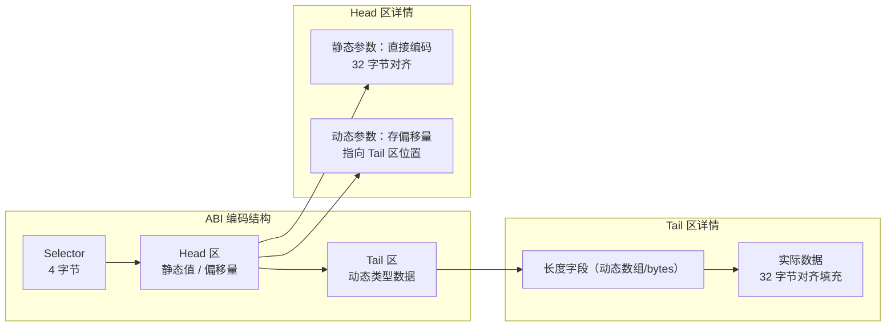
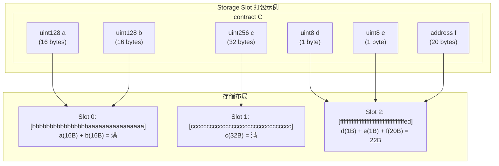
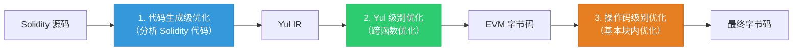

# 第 7 章 — 进阶与底层原理（Advanced Topics & Internals）

> **预计学习时间**：5 - 6 天
> **前置知识**：ch01 - ch06（基础语法、类型系统、合约结构、继承、ABI、安全模式等）
> **本章目标**：掌握 EVM 底层机制、内联汇编、Yul 中间语言、ABI 编码规范、存储/内存/Calldata 布局、优化器、形式化验证等高级话题

> **JS/TS 读者建议**：本章是整个系列中技术深度最高的一章。如果你在前端世界中从未直接操作过内存或理解过编译器内部原理，这里的内容会让你看到"高级语言"的外衣之下 EVM 如何运转。这种理解对 Gas 优化、安全审计和调试底层 Bug 至关重要。

---

## 目录

- [章节概述](#章节概述)
- [知识地图](#知识地图)
- [JS/TS 快速对照](#jsts-快速对照)
- [迁移陷阱（JS → Solidity 底层）](#迁移陷阱js--solidity-底层)
- [7.1 内联汇编（Inline Assembly）](#71-内联汇编inline-assembly)
  - [7.1.1 为什么需要汇编](#711-为什么需要汇编)
  - [7.1.2 assembly 块语法](#712-assembly-块语法)
  - [7.1.3 访问外部变量、函数和库](#713-访问外部变量函数和库)
  - [7.1.4 应避免的事项](#714-应避免的事项)
  - [7.1.5 内存管理](#715-内存管理)
  - [7.1.6 内存安全](#716-内存安全)
- [7.2 Yul 中间语言](#72-yul-中间语言)
  - [7.2.1 设计动机](#721-设计动机)
  - [7.2.2 简单示例](#722-简单示例)
  - [7.2.3 独立使用 Yul](#723-独立使用-yul)
  - [7.2.4 语法详解](#724-语法详解)
  - [7.2.5 EVM 方言与操作码表](#725-evm-方言与操作码表)
  - [7.2.6 Yul 对象](#726-yul-对象)
  - [7.2.7 Yul 优化器](#727-yul-优化器)
  - [7.2.8 完整 ERC-20 Yul 示例](#728-完整-erc-20-yul-示例)
- [7.3 ABI 编码规范](#73-abi-编码规范)
  - [7.3.1 基本设计](#731-基本设计)
  - [7.3.2 函数选择器](#732-函数选择器function-selector)
  - [7.3.3 参数编码](#733-参数编码)
  - [7.3.4 类型系统](#734-类型系统)
  - [7.3.5 编码的形式化规范](#735-编码的形式化规范)
  - [7.3.6 事件编码](#736-事件编码)
  - [7.3.7 错误编码](#737-错误编码)
  - [7.3.8 JSON ABI 格式](#738-json-abi-格式)
  - [7.3.9 严格编码模式](#739-严格编码模式)
  - [7.3.10 非标准紧凑编码](#7310-非标准紧凑编码packed-mode)
- [7.4 Solidity 语法规范](#74-solidity-语法规范)
- [7.5 存储中的数据布局](#75-存储中的数据布局)
  - [7.5.1 槽位排列规则](#751-槽位排列规则)
  - [7.5.2 映射和动态数组](#752-映射和动态数组)
  - [7.5.3 bytes 和 string 的存储](#753-bytes-和-string-的存储)
  - [7.5.4 JSON 存储布局输出](#754-json-存储布局输出)
- [7.6 内存中的数据布局](#76-内存中的数据布局)
- [7.7 Calldata 中的数据布局](#77-calldata-中的数据布局)
- [7.8 变量清理](#78-变量清理)
- [7.9 源码映射](#79-源码映射)
- [7.10 优化器](#710-优化器)
  - [7.10.1 优化器概述](#7101-优化器概述)
  - [7.10.2 操作码级别的优化](#7102-操作码级别的优化)
  - [7.10.3 Yul 级别的优化](#7103-yul-级别的优化)
  - [7.10.4 runs 参数的含义](#7104-runs-参数的含义)
- [7.11 合约元数据](#711-合约元数据)
- [7.12 SMT 形式化验证](#712-smt-形式化验证)
- [7.13 IR 管线的破坏性变更](#713-ir-管线的破坏性变更)
- [Remix 实操指南](#remix-实操指南)
- [本章小结](#本章小结)
- [学习明细与练习任务](#学习明细与练习任务)
- [常见问题 FAQ](#常见问题-faq)

---

## 章节概述

本章深入 Solidity 和 EVM 的底层机制，覆盖从内联汇编到形式化验证的全部高级话题：

| 小节 | 内容 | 重要性 |
|------|------|--------|
| 7.1 内联汇编 | assembly 块、变量访问、内存管理、内存安全 | ★★★★★ |
| 7.2 Yul 中间语言 | 语法、EVM 操作码、Yul 对象、ERC-20 示例 | ★★★★★ |
| 7.3 ABI 编码规范 | 函数选择器、参数编码、事件/错误编码、Packed 模式 | ★★★★★ |
| 7.4 语法规范 | ANTLR4 语法文件（了解即可） | ★★☆☆☆ |
| 7.5 存储布局 | 槽位排列、映射/数组定位公式、紧凑打包 | ★★★★★ |
| 7.6 内存布局 | 保留槽位、自由内存指针、与 Storage 的差异 | ★★★★☆ |
| 7.7 Calldata 布局 | ABI 编码格式在 calldata 中的体现 | ★★★☆☆ |
| 7.8 变量清理 | 高位清零规则与时机 | ★★★☆☆ |
| 7.9 源码映射 | s:l:f:j:m 格式、调试工具集成 | ★★★☆☆ |
| 7.10 优化器 | 操作码级别、Yul 级别、runs 参数权衡 | ★★★★☆ |
| 7.11 合约元数据 | 元数据 JSON、CBOR 字节码哈希 | ★★★☆☆ |
| 7.12 SMT 形式化验证 | SMTChecker、验证目标、反例 | ★★★★☆ |
| 7.13 IR 管线变更 | via-IR 语义差异 | ★★★☆☆ |

> **重要提示**：7.1-7.3 和 7.5 是本章核心重点。理解存储布局和 ABI 编码对安全审计和 Gas 优化至关重要。内联汇编和 Yul 是进入 EVM 底层开发的必备技能。

---

## 知识地图

```mermaid
graph TB
    CH7["第 7 章<br/>进阶与底层原理"]

    CH7 --> ASM["7.1 内联汇编"]
    CH7 --> YUL["7.2 Yul 语言"]
    CH7 --> ABI["7.3 ABI 编码"]
    CH7 --> GRAM["7.4 语法规范"]
    CH7 --> LAYOUT["7.5-7.7 数据布局"]
    CH7 --> INTERNAL["7.8-7.10 编译器内部"]
    CH7 --> META["7.11 元数据"]
    CH7 --> VERIFY["7.12 形式化验证"]
    CH7 --> IR["7.13 IR 变更"]

    ASM --> GAS_OPT["Gas 优化"]
    ASM --> LOW_OP["底层操作"]
    ASM --> MEM_SAFE["内存安全"]

    YUL --> SYNTAX["语法: if/switch/for/function"]
    YUL --> OPCODES["EVM 操作码表"]
    YUL --> YUL_OBJ["Yul 对象"]
    YUL --> ERC20_YUL["ERC-20 Yul 示例"]

    ABI --> SELECTOR["函数选择器<br/>keccak256 前 4 字节"]
    ABI --> ENCODING["参数编码<br/>静态/动态类型"]
    ABI --> PACKED["紧凑编码<br/>abi.encodePacked"]

    LAYOUT --> STORAGE["存储布局<br/>256-bit 槽位"]
    LAYOUT --> MEMORY["内存布局<br/>0x40 自由指针"]
    LAYOUT --> CALLDATA["Calldata 布局"]

    INTERNAL --> CLEANUP["变量清理"]
    INTERNAL --> SRCMAP["源码映射"]
    INTERNAL --> OPT["优化器"]

    OPT --> OPC_OPT["操作码级别"]
    OPT --> YUL_OPT["Yul 级别"]
    OPT --> RUNS["runs 参数"]

    style CH7 fill:#8e44ad,stroke:#6c3483,color:#fff
    style ASM fill:#e74c3c,stroke:#c0392b,color:#fff
    style YUL fill:#e67e22,stroke:#d35400,color:#fff
    style ABI fill:#2ecc71,stroke:#27ae60,color:#fff
    style LAYOUT fill:#3498db,stroke:#2980b9,color:#fff
    style VERIFY fill:#1abc9c,stroke:#16a085,color:#fff
    style IR fill:#f39c12,stroke:#d68910,color:#fff
```



---

## JS/TS 快速对照

| 你熟悉的 JS/TS 世界 | Solidity / EVM 世界 | 本章你需要建立的直觉 |
|----------------------|---------------------|----------------------|
| 无法直接操作内存/寄存器 | `assembly { mload(0x40) }` 直接操作 EVM 内存 | 汇编绕过安全检查，威力大但风险高 |
| WebAssembly (Wasm) | Yul 中间语言 | 两者都是高级语言与底层字节码之间的 IR |
| `JSON.stringify` / `JSON.parse` | ABI 编码 / ABI 解码 | ABI 是 EVM 世界的序列化标准 |
| `Buffer.alloc()` / `ArrayBuffer` | 存储槽 `sload(slot)` / 内存 `mload(ptr)` | EVM 有三个独立数据区：Storage、Memory、Calldata |
| V8 JIT 优化 / Webpack tree-shaking | Solidity 优化器（操作码 + Yul 级别） | runs 参数平衡部署成本和运行时 Gas |
| TypeScript 编译 / Source Map | Solidity Source Mapping `s:l:f:j:m` | 调试工具依赖源码映射定位原始代码行 |
| `package.json` + lockfile | 合约元数据 JSON + CBOR 字节码哈希 | 元数据用于合约验证和可复现编译 |
| ESLint 规则 / 单元测试 | SMTChecker 形式化验证 | 数学证明比测试更强——覆盖所有可能的输入 |
| `ethers.js` `interface.encodeFunctionData()` | `abi.encode()` / `abi.encodePacked()` | 前端库封装了 ABI 编码，底层原理本章详解 |

---

## 迁移陷阱（JS → Solidity 底层）

| 陷阱 | 说明 | 应对方式 |
|------|------|----------|
| "汇编很危险" | 内联汇编绕过 Solidity 的类型检查和安全机制 | 仅在确实需要时使用，标注 `memory-safe` |
| "内存免费" | JS 有 GC 自动回收；Solidity 内存只分配不释放，且按字节计费 Gas | 了解 `0x40` 自由内存指针，避免无谓分配 |
| "变量就是值" | 在汇编中，< 256 位类型的高位可能有"脏数据" | 使用前手动清理：`and(x, 0xff)` |
| "存储像对象属性" | Storage 是 256-bit 槽位数组，小变量会打包到同一个槽 | 理解打包规则，优化变量声明顺序节省 Gas |
| "ABI 编码很简单" | 动态类型引入偏移量和嵌套编码，需要精确理解 | 手动计算并用 `abi.encode` 验证 |
| "优化器越强越好" | 高 runs 值增加部署成本，低 runs 值增加运行时成本 | 根据合约使用频率选择合适的 runs |

---

## 7.1 内联汇编（Inline Assembly）

### 7.1.1 为什么需要汇编

Solidity 的 `assembly { ... }` 块让你直接访问 EVM 底层操作。虽然 Solidity 已经是相当底层的语言，但有三个场景仍然需要汇编：

**场景 1：Gas 优化**

优化器有时无法消除数组边界检查等冗余操作。汇编可以跳过这些检查：

```solidity
// Solidity 版本——包含边界检查
function sumSolidity(uint[] memory data) public pure returns (uint sum) {
    for (uint i = 0; i < data.length; ++i)
        sum += data[i];
}

// 汇编版本——手动跳过边界检查，更省 Gas
function sumAsm(uint[] memory data) public pure returns (uint sum) {
    assembly {
        let len := mload(data)
        let dataElementLocation := add(data, 0x20)
        for
            { let end := add(dataElementLocation, mul(len, 0x20)) }
            lt(dataElementLocation, end)
            { dataElementLocation := add(dataElementLocation, 0x20) }
        {
            sum := add(sum, mload(dataElementLocation))
        }
    }
}
```

**场景 2：突破语言限制**

某些 EVM 操作在 Solidity 中没有直接对应语法，如 `extcodecopy`：

```solidity
library GetCode {
    function at(address addr) public view returns (bytes memory code) {
        assembly {
            let size := extcodesize(addr)
            code := mload(0x40)
            mstore(0x40, add(code, and(add(add(size, 0x20), 0x1f), not(0x1f))))
            mstore(code, size)
            extcodecopy(addr, add(code, 0x20), 0, size)
        }
    }
}
```

**场景 3：底层操作**

直接读写 storage 槽、构造特殊的 `returndata`、操作 transient storage 等。

> **警告**：内联汇编绕过了 Solidity 的类型安全和多项安全检查。只有在确定需要且有信心使用时才应采用。

### 7.1.2 assembly 块语法

内联汇编使用 `assembly { ... }` 标记，内部代码是 Yul 语言：

```solidity
function f(uint x) public returns (uint r) {
    assembly {
        r := mul(x, 7)
    }
}
```

不同的 `assembly` 块之间不共享命名空间——无法调用其他块中定义的 Yul 函数或访问其变量。

### 7.1.3 访问外部变量、函数和库

**值类型变量**：直接读写。

```solidity
uint x = 42;
assembly {
    let y := add(x, 1) // 读取 x
    x := 100           // 写入 x
}
```

**内存引用**：变量求值得到的是**内存地址**，不是值本身。

**外部函数指针**：可通过 `x.address` 和 `x.selector` 访问。

**Storage 变量**：必须使用 `.slot` 和 `.offset`，不能直接用变量名。

```solidity
contract C {
    uint b;
    function f(uint x) public returns (uint r) {
        assembly {
            r := mul(x, sload(b.slot))
        }
    }
}
```

**动态 calldata 数组**：使用 `x.offset`（字节偏移量）和 `x.length`（元素数量）。

> **注意**：访问 < 256 位的类型时，高位可能包含脏数据。使用前请手动清理：
> `assembly { x := and(x, 0xffffffff) }`

### 7.1.4 应避免的事项

内联汇编看起来像高级代码，但底层极为原始：
- 函数调用、循环、if/switch 只是简单的重写规则
- 汇编器只做功能式操作码重排、栈高度计算和局部变量回收
- 不要假设任何 Solidity 层面的安全保证在汇编中依然有效

### 7.1.5 内存管理

Solidity 的内存管理遵循以下模型：

```
┌──────────────────────────────────────────────────┐
│ 0x00 - 0x3f │ Scratch Space（临时空间，64 字节）  │
├──────────────────────────────────────────────────┤
│ 0x40 - 0x5f │ Free Memory Pointer（自由内存指针） │
├──────────────────────────────────────────────────┤
│ 0x60 - 0x7f │ Zero Slot（零槽，永远为 0）        │
├──────────────────────────────────────────────────┤
│ 0x80 +      │ 可分配内存区域                      │
└──────────────────────────────────────────────────┘
```

**关键规则**：
- **自由内存指针 `0x40`**：指向下一个可用内存位置。分配内存时读取此值并更新
- **零槽 `0x60`**：用作动态内存数组的初始值，**永远不应写入**
- **Scratch Space `0x00-0x3f`**：可在语句之间用于短期分配
- **内存永不释放**：没有内置机制回收已分配内存

分配内存的标准模式：

```yul
function allocate(length) -> pos {
    pos := mload(0x40)
    mstore(0x40, add(pos, length))
}
```

内存数组的元素始终占据 32 字节的整数倍（`bytes1[]` 也如此，但 `bytes` 和 `string` 除外）。动态数组的第一个槽存储长度。

### 7.1.6 内存安全

如果内联汇编包含内存操作，默认会**全局禁用**将栈变量移至内存和其他内存优化。可以使用 `memory-safe` 注解声明汇编块遵守内存模型：

```solidity
assembly ("memory-safe") {
    let p := mload(0x40)
    returndatacopy(p, 0, returndatasize())
    revert(p, returndatasize())
}
```

**内存安全汇编只可访问以下区域**：
1. 自己通过 `allocate` 模式分配的内存
2. Solidity 分配的内存（如引用的内存数组范围内）
3. 0x00 - 0x3f 的 Scratch Space
4. 汇编块开始时自由内存指针之后的临时内存

> **警告**：如果声明了 `memory-safe` 但违反了内存规则，将导致不正确和未定义的行为。

---

## 7.2 Yul 中间语言

### 7.2.1 设计动机

Yul（曾称 JULIA / IULIA）是可编译到不同后端字节码的中间语言。设计目标：

1. **可读性**：即使是编译器生成的代码也应可读
2. **控制流清晰**：便于手动审查、形式化验证和优化
3. **翻译直接**：从 Yul 到字节码的翻译尽可能简单
4. **全程序优化**：适合整体优化

Yul 提供 `for` 循环、`if`/`switch` 语句和函数调用等高级构造，不提供显式的 `SWAP`、`DUP`、`JUMP` 等操作——前两者混淆数据流，后者混淆控制流。

当前唯一的 Yul 方言是 EVM 方言，使用 EVM 操作码作为内置函数，唯一类型为 `u256`。

### 7.2.2 简单示例

**幂运算（递归）**：

```yul
{
    function power(base, exponent) -> result
    {
        switch exponent
        case 0 { result := 1 }
        case 1 { result := base }
        default
        {
            result := power(mul(base, base), div(exponent, 2))
            switch mod(exponent, 2)
                case 1 { result := mul(base, result) }
        }
    }
}
```

**幂运算（for 循环）**：

```yul
{
    function power(base, exponent) -> result
    {
        result := 1
        for { let i := 0 } lt(i, exponent) { i := add(i, 1) }
        {
            result := mul(result, base)
        }
    }
}
```

### 7.2.3 独立使用 Yul

Yul 可以独立使用（不嵌入 Solidity），通过命令行 `--strict-assembly` 或 Standard JSON 接口：

```bash
solc --strict-assembly --optimize --optimize-runs 200 input.yul
```

Standard JSON 格式：

```json
{
    "language": "Yul",
    "sources": { "input.yul": { "content": "{ sstore(0, 1) }" } },
    "settings": {
        "outputSelection": { "*": { "*": ["*"], "": ["*"] } },
        "optimizer": { "enabled": true, "details": { "yul": true } }
    }
}
```

### 7.2.4 语法详解

**语句类型**：

| 语法元素 | 示例 | 说明 |
|----------|------|------|
| 字面量 | `0x123`, `42`, `"abc"` | 整数、十六进制、字符串（≤ 32 字节） |
| 内置函数调用 | `add(1, mload(0))` | 直接映射到 EVM 操作码 |
| 变量声明 | `let x := 7` / `let x` | 未赋值则初始化为 0 |
| 赋值 | `x := add(y, 3)` | 使用 `:=` 而非 `=` |
| 块 | `{ let x := 3 { let y := add(x, 1) } }` | 局部变量作用域 |
| if 语句 | `if lt(a, b) { sstore(0, 1) }` | **没有 else**！ |
| switch 语句 | `switch mload(0) case 0 { revert() } default { ... }` | 无穿透（fall-through） |
| for 循环 | `for { let i := 0 } lt(i, 10) { i := add(i, 1) } { ... }` | init 中声明的变量在所有部分可见 |
| 函数定义 | `function f(a, b) -> c { c := add(a, b) }` | 返回值通过赋值给返回变量 |
| leave | `leave` | 退出当前函数，类似 return 但不带值 |

**Yul 形式化语法（BNF）**：

```
Block          = '{' Statement* '}'
Statement      = Block | FunctionDefinition | VariableDeclaration |
                 Assignment | If | Expression | Switch | ForLoop |
                 BreakContinue | Leave
FunctionDef    = 'function' Identifier '(' TypedIdList? ')' ('->' TypedIdList)? Block
VariableDecl   = 'let' TypedIdList (':=' Expression)?
Assignment     = IdentifierList ':=' Expression
If             = 'if' Expression Block
Switch         = 'switch' Expression (Case+ Default? | Default)
ForLoop        = 'for' Block Expression Block Block
Leave          = 'leave'
```

**与 JS 的关键区别**：
- 没有 `else` 关键字——用 `switch` 替代
- 没有 `while`——用 `for {} condition {} { body }` 模拟
- 所有值都是 256 位整数，没有其他类型
- `break` / `continue` 只能在 for 循环体内使用

### 7.2.5 EVM 方言与操作码表

EVM 方言以 EVM 操作码为内置函数。以下按功能分类的完整操作码参考表：

#### 算术运算

| 操作码 | 返回值 | 版本 | 说明 |
|--------|--------|------|------|
| `add(x, y)` | 是 | F | x + y |
| `sub(x, y)` | 是 | F | x - y |
| `mul(x, y)` | 是 | F | x * y |
| `div(x, y)` | 是 | F | x / y（y==0 时返回 0） |
| `sdiv(x, y)` | 是 | F | 有符号除法 |
| `mod(x, y)` | 是 | F | x % y（y==0 时返回 0） |
| `smod(x, y)` | 是 | F | 有符号取模 |
| `exp(x, y)` | 是 | F | x 的 y 次方 |
| `addmod(x, y, m)` | 是 | F | (x + y) % m，任意精度 |
| `mulmod(x, y, m)` | 是 | F | (x * y) % m，任意精度 |
| `signextend(i, x)` | 是 | F | 从第 (i*8+7) 位进行符号扩展 |

#### 比较与位运算

| 操作码 | 返回值 | 版本 | 说明 |
|--------|--------|------|------|
| `lt(x, y)` | 是 | F | x < y 返回 1，否则 0 |
| `gt(x, y)` | 是 | F | x > y 返回 1，否则 0 |
| `slt(x, y)` | 是 | F | 有符号 x < y |
| `sgt(x, y)` | 是 | F | 有符号 x > y |
| `eq(x, y)` | 是 | F | x == y 返回 1，否则 0 |
| `iszero(x)` | 是 | F | x == 0 返回 1，否则 0 |
| `not(x)` | 是 | F | 按位取反 |
| `and(x, y)` | 是 | F | 按位与 |
| `or(x, y)` | 是 | F | 按位或 |
| `xor(x, y)` | 是 | F | 按位异或 |
| `byte(n, x)` | 是 | F | x 的第 n 个字节（最高有效字节为第 0 个） |
| `shl(x, y)` | 是 | C | y 逻辑左移 x 位 |
| `shr(x, y)` | 是 | C | y 逻辑右移 x 位 |
| `sar(x, y)` | 是 | C | y 算术右移 x 位 |

#### 内存操作

| 操作码 | 返回值 | 版本 | 说明 |
|--------|--------|------|------|
| `mload(p)` | 是 | F | mem[p...(p+32)) |
| `mstore(p, v)` | - | F | mem[p...(p+32)) := v |
| `mstore8(p, v)` | - | F | mem[p] := v & 0xff |
| `mcopy(t, f, s)` | - | N | 从内存 f 复制 s 字节到 t |
| `msize()` | 是 | F | 已访问的最大内存索引 |

#### 存储操作

| 操作码 | 返回值 | 版本 | 说明 |
|--------|--------|------|------|
| `sload(p)` | 是 | F | storage[p] |
| `sstore(p, v)` | - | F | storage[p] := v |
| `tload(p)` | 是 | N | transientStorage[p] |
| `tstore(p, v)` | - | N | transientStorage[p] := v |

#### 控制流

| 操作码 | 返回值 | 版本 | 说明 |
|--------|--------|------|------|
| `stop()` | - | F | 停止执行，等同 return(0, 0) |
| `return(p, s)` | - | F | 结束执行，返回 mem[p...(p+s)) |
| `revert(p, s)` | - | B | 结束执行，回滚状态，返回数据 |
| `invalid()` | - | F | 以无效指令结束执行 |
| `selfdestruct(a)` | - | F | 销毁合约并发送资金到 a（已弃用） |

#### 环境信息

| 操作码 | 返回值 | 版本 | 说明 |
|--------|--------|------|------|
| `address()` | 是 | F | 当前合约地址 |
| `balance(a)` | 是 | F | 地址 a 的 wei 余额 |
| `selfbalance()` | 是 | I | 等同 balance(address())，更便宜 |
| `caller()` | 是 | F | 调用者地址（不含 delegatecall） |
| `callvalue()` | 是 | F | 随调用发送的 wei 数量 |
| `calldataload(p)` | 是 | F | 从位置 p 开始的 32 字节 calldata |
| `calldatasize()` | 是 | F | calldata 大小（字节） |
| `calldatacopy(t, f, s)` | - | F | 复制 s 字节 calldata 到内存 |
| `codesize()` | 是 | F | 当前合约代码大小 |
| `codecopy(t, f, s)` | - | F | 复制 s 字节代码到内存 |
| `extcodesize(a)` | 是 | F | 地址 a 的代码大小 |
| `extcodehash(a)` | 是 | C | 地址 a 的代码哈希 |
| `returndatasize()` | 是 | B | 上次返回数据的大小 |
| `returndatacopy(t, f, s)` | - | B | 复制返回数据到内存 |
| `gas()` | 是 | F | 剩余可用 Gas |

#### 区块链信息

| 操作码 | 返回值 | 版本 | 说明 |
|--------|--------|------|------|
| `origin()` | 是 | F | 交易发起者 |
| `gasprice()` | 是 | F | 交易 Gas 价格 |
| `blockhash(b)` | 是 | F | 区块 b 的哈希（仅最近 256 个） |
| `coinbase()` | 是 | F | 当前区块矿工地址 |
| `timestamp()` | 是 | F | 当前区块时间戳 |
| `number()` | 是 | F | 当前区块号 |
| `prevrandao()` | 是 | P | 信标链提供的随机数 |
| `gaslimit()` | 是 | F | 当前区块 Gas 限制 |
| `chainid()` | 是 | I | 链 ID |
| `basefee()` | 是 | L | 当前区块基础费 |
| `blobbasefee()` | 是 | N | 当前区块 blob 基础费 |
| `blobhash(i)` | 是 | N | 交易第 i 个 blob 的版本化哈希 |

#### 外部调用

| 操作码 | 返回值 | 版本 | 说明 |
|--------|--------|------|------|
| `call(g, a, v, in, insize, out, outsize)` | 是 | F | 调用合约 a |
| `delegatecall(g, a, in, insize, out, outsize)` | 是 | H | 委托调用 |
| `staticcall(g, a, in, insize, out, outsize)` | 是 | B | 静态调用（不允许修改状态） |
| `create(v, p, n)` | 是 | F | 创建新合约 |
| `create2(v, p, n, s)` | 是 | C | 确定性创建新合约 |

#### 日志

| 操作码 | 返回值 | 版本 | 说明 |
|--------|--------|------|------|
| `log0(p, s)` | - | F | 记录日志（0 个 topic） |
| `log1(p, s, t1)` | - | F | 记录日志（1 个 topic） |
| `log2(p, s, t1, t2)` | - | F | 记录日志（2 个 topic） |
| `log3(p, s, t1, t2, t3)` | - | F | 记录日志（3 个 topic） |
| `log4(p, s, t1, t2, t3, t4)` | - | F | 记录日志（4 个 topic） |

#### 杂项

| 操作码 | 返回值 | 版本 | 说明 |
|--------|--------|------|------|
| `keccak256(p, n)` | 是 | F | keccak(mem[p...(p+n))) |
| `pop(x)` | - | F | 丢弃值 x |

> **版本标识**：F = Frontier, H = Homestead, B = Byzantium, C = Constantinople, I = Istanbul, L = London, P = Paris, N = Cancun

### 7.2.6 Yul 对象

Yul 对象用于组织代码和数据部分，是部署合约的标准结构：

```yul
object "Contract1" {
    // 构造器代码
    code {
        function allocate(size) -> ptr {
            ptr := mload(0x40)
            if iszero(ptr) { ptr := 0x60 }
            mstore(0x40, add(ptr, size))
        }

        // 部署运行时代码
        let size := datasize("Contract1_deployed")
        let offset := allocate(size)
        datacopy(offset, dataoffset("Contract1_deployed"), size)
        return(offset, size)
    }

    object "Contract1_deployed" {
        // 运行时代码
        code {
            mstore(0, "Hello, World!")
            return(0, 0x20)
        }
    }

    data "Table2" hex"4123"
}
```

**对象语法**：

```
Object = 'object' StringLiteral '{' Code (Object | Data)* '}'
Code   = 'code' Block
Data   = 'data' StringLiteral (HexLiteral | StringLiteral)
```

**特殊内置函数**：
- `datasize("name")`：返回命名对象/数据的大小
- `dataoffset("name")`：返回命名对象/数据的偏移量
- `datacopy(t, f, l)`：复制数据到内存（EVM 中等同 `codecopy`）

### 7.2.7 Yul 优化器

Yul 优化器在 Yul 代码上操作，输入/输出/中间状态都是 Yul 代码，便于调试和验证。

独立模式下激活优化器：

```bash
solc --strict-assembly --optimize --optimize-runs 200
```

在 Solidity 模式下，Yul 优化器随常规优化器一起激活。

### 7.2.8 完整 ERC-20 Yul 示例

以下是用纯 Yul 实现的完整 ERC-20 合约（精简版关键片段）：

```yul
object "Token" {
    code {
        sstore(0, caller())
        datacopy(0, dataoffset("runtime"), datasize("runtime"))
        return(0, datasize("runtime"))
    }
    object "runtime" {
        code {
            require(iszero(callvalue()))

            // 函数调度器——根据 selector 路由
            switch selector()
            case 0x70a08231 /* "balanceOf(address)" */ {
                returnUint(balanceOf(decodeAsAddress(0)))
            }
            case 0x18160ddd /* "totalSupply()" */ {
                returnUint(totalSupply())
            }
            case 0xa9059cbb /* "transfer(address,uint256)" */ {
                transfer(decodeAsAddress(0), decodeAsUint(1))
                returnTrue()
            }
            case 0x095ea7b3 /* "approve(address,uint256)" */ {
                approve(decodeAsAddress(0), decodeAsUint(1))
                returnTrue()
            }
            default { revert(0, 0) }

            // ---- 函数选择器提取 ----
            function selector() -> s {
                s := div(calldataload(0),
                    0x100000000000000000000000000000000000000000000000000000000)
            }

            // ---- calldata 解码 ----
            function decodeAsAddress(offset) -> v {
                v := decodeAsUint(offset)
                if iszero(iszero(and(v,
                    not(0xffffffffffffffffffffffffffffffffffffffff)))) {
                    revert(0, 0)
                }
            }
            function decodeAsUint(offset) -> v {
                let pos := add(4, mul(offset, 0x20))
                if lt(calldatasize(), add(pos, 0x20)) { revert(0, 0) }
                v := calldataload(pos)
            }

            // ---- 核心逻辑 ----
            function transfer(to, amount) {
                executeTransfer(caller(), to, amount)
            }
            function executeTransfer(from, to, amount) {
                revertIfZeroAddress(to)
                deductFromBalance(from, amount)
                addToBalance(to, amount)
                emitTransfer(from, to, amount)
            }

            // ---- 存储布局 ----
            function ownerPos() -> p { p := 0 }
            function totalSupplyPos() -> p { p := 1 }
            function accountToStorageOffset(account) -> offset {
                offset := add(0x1000, account)
            }

            // ---- 事件 ----
            function emitTransfer(from, to, amount) {
                let signatureHash :=
                    0xddf252ad1be2c89b69c2b068fc378daa952ba7f163c4a11628f55a4df523b3ef
                mstore(0, amount)
                log3(0, 0x20, signatureHash, from, to)
            }

            // ---- 工具 ----
            function require(condition) {
                if iszero(condition) { revert(0, 0) }
            }
            function returnUint(v) {
                mstore(0, v)
                return(0, 0x20)
            }
            function returnTrue() { returnUint(1) }
            function safeAdd(a, b) -> r {
                r := add(a, b)
                if or(lt(r, a), lt(r, b)) { revert(0, 0) }
            }
            function revertIfZeroAddress(addr) { require(addr) }

            // ... 其他函数省略
        }
    }
}
```

**关键学习点**：
1. `selector()` 手动提取函数选择器：`calldataload(0)` 右移 224 位
2. `switch` 做函数调度，对应 Solidity 编译器生成的 dispatcher
3. 存储布局完全手动定义：owner 在 slot 0，totalSupply 在 slot 1
4. 事件通过 `log3` 手动发出，topic[0] 是事件签名的 keccak256 哈希

---

## 7.3 ABI 编码规范

### 7.3.1 基本设计

合约应用二进制接口（ABI）是以太坊生态中与合约交互的标准方式。关键特征：
- 编码**不是自描述的**——需要知道模式（schema）才能解码
- 假设接口函数是强类型、编译时已知且静态的
- 所有参数填充到 **32 字节**的倍数

### 7.3.2 函数选择器（Function Selector）

calldata 的前 **4 字节**是函数选择器——函数签名的 Keccak-256 哈希的前 4 字节。

**手动计算示例**：

```solidity
// 函数签名（canonical form，无空格）
// transfer(address,uint256)

bytes4 selector = bytes4(keccak256("transfer(address,uint256)"));
// = 0xa9059cbb
```

**签名规则**：
- 使用标准名称：`uint` → `uint256`，`int` → `int256`
- 不包含参数名、空格、data location 说明符
- 返回类型**不参与**签名计算
- 示例：`baz(uint32,bool)` → `0xcdcd77c0`

**完整编码示例**：调用 `baz(69, true)`

```
0xcdcd77c0                                                         ← selector
0000000000000000000000000000000000000000000000000000000000000045     ← uint32(69)
0000000000000000000000000000000000000000000000000000000000000001     ← bool(true)
```

总共 68 字节 = 4（selector）+ 32 + 32。

### 7.3.3 参数编码

ABI 区分**静态类型**和**动态类型**：

**动态类型**（编码时需要偏移量指针）：
- `bytes`、`string`
- `T[]`（动态数组）
- `T[k]`（如果 T 是动态类型）
- `(T1,...,Tk)`（如果任何 Ti 是动态类型）

**静态类型**：其他所有类型。

**编码规则**：
- 静态类型就地（in-place）编码
- 动态类型在当前块之后单独分配位置，头部存放偏移量

**动态类型编码示例**：调用 `sam("dave", true, [1,2,3])`

```
0xa5643bf2                                                         ← selector
0000000000000000000000000000000000000000000000000000000000000060     ← bytes 参数的偏移量 (0x60 = 96)
0000000000000000000000000000000000000000000000000000000000000001     ← bool true
00000000000000000000000000000000000000000000000000000000000000a0     ← uint[] 参数的偏移量 (0xa0 = 160)
0000000000000000000000000000000000000000000000000000000000000004     ← bytes 长度 = 4
6461766500000000000000000000000000000000000000000000000000000000     ← "dave" (右补零到 32 字节)
0000000000000000000000000000000000000000000000000000000000000003     ← uint[] 长度 = 3
0000000000000000000000000000000000000000000000000000000000000001     ← 1
0000000000000000000000000000000000000000000000000000000000000002     ← 2
0000000000000000000000000000000000000000000000000000000000000003     ← 3
```

ABI 编码结构示意图：



### 7.3.4 类型系统

**基本类型映射**：

| Solidity 类型 | ABI 类型 | 编码方式 |
|---------------|----------|----------|
| `uint<M>` (8-256, 步长 8) | `uint<M>` | 大端序，左补零到 32 字节 |
| `int<M>` | `int<M>` | 大端序二补码，符号扩展到 32 字节 |
| `address` | `address` | 等同 `uint160` |
| `bool` | `bool` | 等同 `uint8`，值为 0 或 1 |
| `bytes<M>` (1-32) | `bytes<M>` | 右补零到 32 字节 |
| `address payable` | `address` | |
| `contract` | `address` | |
| `enum` | `uint8` | |
| `struct` | `tuple` | |

### 7.3.5 编码的形式化规范

编码设计的两个关键属性：

1. **访问深度**：访问嵌套值 `a_i[k][l][r]` 最多需要 4 次读取（与嵌套深度成正比）
2. **可重定位**：变量的数据不与其他数据交叉，只使用相对地址

形式化定义：

- `enc((X(1), ..., X(k))) = head(X(1)) ... head(X(k)) tail(X(1)) ... tail(X(k))`
- 静态类型 Ti：`head(X(i)) = enc(X(i))`，`tail(X(i)) = ""`
- 动态类型 Ti：`head(X(i))` = 偏移量，`tail(X(i)) = enc(X(i))`

### 7.3.6 事件编码

事件使用 `log` 操作码，最多 4 个 topic：

- `topics[0]`：事件签名的 keccak256 哈希（`anonymous` 事件除外）
- `topics[1-3]`：`indexed` 参数（值类型直接存储；复杂类型存 keccak256 哈希）
- `data`：非 indexed 参数的 ABI 编码

```solidity
event Transfer(address indexed from, address indexed to, uint256 value);
// topics[0] = keccak256("Transfer(address,address,uint256)")
// topics[1] = from
// topics[2] = to
// data = abi.encode(value)
```

> **注意**：indexed 的动态类型（string、bytes、数组、结构体）存储的是数据的 keccak256 哈希，原始值不可从链上恢复。

### 7.3.7 错误编码

错误的编码方式与函数调用相同——4 字节选择器 + 参数编码：

```solidity
error InsufficientBalance(uint256 available, uint256 required);
// selector = bytes4(keccak256("InsufficientBalance(uint256,uint256)"))
// = 0xcf479181

// revert InsufficientBalance(0, 100) 编码为:
// 0xcf479181 + uint256(0) + uint256(100)
```

错误选择器 `0x00000000` 和 `0xffffffff` 被保留用于未来用途。

### 7.3.8 JSON ABI 格式

JSON ABI 是合约接口的机器可读表示：

```json
[
    {
        "type": "function",
        "name": "transfer",
        "inputs": [
            { "name": "_to", "type": "address" },
            { "name": "_value", "type": "uint256" }
        ],
        "outputs": [
            { "name": "success", "type": "bool" }
        ],
        "stateMutability": "nonpayable"
    },
    {
        "type": "event",
        "name": "Transfer",
        "inputs": [
            { "name": "from", "type": "address", "indexed": true },
            { "name": "to", "type": "address", "indexed": true },
            { "name": "value", "type": "uint256", "indexed": false }
        ],
        "anonymous": false
    },
    {
        "type": "error",
        "name": "InsufficientBalance",
        "inputs": [
            { "name": "available", "type": "uint256" },
            { "name": "required", "type": "uint256" }
        ]
    }
]
```

**`stateMutability` 取值**：`pure`、`view`、`nonpayable`、`payable`。

**struct 编码为 tuple**：

```json
{
    "name": "s",
    "type": "tuple",
    "components": [
        { "name": "a", "type": "uint256" },
        { "name": "b", "type": "uint256[]" }
    ]
}
```

### 7.3.9 严格编码模式

严格编码要求偏移量尽可能小，数据区域无间隙、无重叠。Solidity 编码器始终以严格模式输出；解码器目前不强制严格模式。

### 7.3.10 非标准紧凑编码（Packed Mode）

`abi.encodePacked()` 使用非标准的紧凑模式：

| 规则 | 说明 |
|------|------|
| 短于 32 字节的类型 | **直接拼接**，无填充、无符号扩展 |
| 动态类型 | 就地编码，**不包含长度字段** |
| 数组元素 | 有填充，但仍就地编码 |
| 不支持 | struct 和嵌套数组 |

```solidity
abi.encodePacked(int16(-1), bytes1(0x42), uint16(0x03), "Hello, world!")
// = 0xffff42000348656c6c6f2c20776f726c6421
//   ^^^^                                 int16(-1)
//       ^^                               bytes1(0x42)
//         ^^^^                           uint16(0x03)
//             ^^^^^^^^^^^^^^^^^^^^^^^^^^ "Hello, world!" 无长度字段
```

> **安全警告**：`keccak256(abi.encodePacked(a, b))` 中如果 a 和 b 都是动态类型，容易构造哈希碰撞。例如 `abi.encodePacked("a", "bc") == abi.encodePacked("ab", "c")`。除非有充分理由，优先使用 `abi.encode`。

---

## 7.4 Solidity 语法规范

Solidity 的完整语法使用 **ANTLR4** 定义：

- `SolidityLexer.g4`——词法规则（Token 定义）
- `SolidityParser.g4`——语法规则（AST 结构）

这些文件可在 Solidity 源码仓库的 `docs/grammar/` 目录找到，主要用于构建语法分析工具、IDE 插件等。对于日常开发了解即可。

---

## 7.5 存储中的数据布局

### 7.5.1 槽位排列规则

合约的状态变量存储在 **256-bit（32 字节）的槽位**中，从 slot 0 开始连续排列。

**核心打包规则**：

1. 第一个变量存储在 slot 的**低位对齐**
2. 值类型仅使用其所需的字节数
3. 如果当前槽剩余空间不够，则放到下一个槽
4. struct 和数组数据**总是开启新槽**
5. struct/数组之后的变量**也开启新槽**

**存储槽打包示意图**：



**继承顺序**：使用 C3 线性化，从最基础的合约开始。不同合约的变量如果符合规则，可以共享存储槽。

> **Gas 优化提示**：声明变量时应按大小排列，让小变量可以打包到同一个槽。例如：`uint128, uint128, uint256` 只用 2 个槽，而 `uint128, uint256, uint128` 需要 3 个槽。

### 7.5.2 映射和动态数组

由于大小不可预知，映射和动态数组不能"嵌入"在其他变量之间。它们在基本布局中只占据 **1 个完整的 32 字节槽**（记为 slot p），实际数据存储在通过 keccak256 计算的位置。

**动态数组**：
- slot p 存储**数组长度**
- 元素从 `keccak256(p)` 开始连续排列
- 元素 `x[i]` 的位置 = `keccak256(p) + i`（对于 uint256 类型）

**映射**：
- slot p **留空**（不存储任何值）
- 键 k 对应的值位置 = `keccak256(h(k) . p)`（`.` 表示拼接）
- `h(k)`：值类型——补零到 32 字节；string/bytes——未补零的原始数据

**嵌套映射示例**：`data[4][9].c` 的位置计算

```solidity
contract C {
    struct S { uint16 a; uint16 b; uint256 c; }
    uint x;                             // slot 0
    mapping(uint => mapping(uint => S)) data; // slot 1
}

// data[4] → keccak256(uint256(4) . uint256(1))
// data[4][9] → keccak256(uint256(9) . keccak256(uint256(4) . uint256(1)))
// data[4][9].c → 上述值 + 1（因为 a 和 b 打包在偏移 0 的槽中，c 在下一个槽）
```

### 7.5.3 bytes 和 string 的存储

`bytes` 和 `string` 编码相同：

- **短值（≤ 31 字节）**：数据存储在高位字节，最低字节存储 `length * 2`
- **长值（≥ 32 字节）**：主槽 p 存储 `length * 2 + 1`，数据存储在 `keccak256(p)`

通过检查最低位可以区分：0 = 短数组，1 = 长数组。

### 7.5.4 JSON 存储布局输出

可通过 Standard JSON 接口请求存储布局：

```json
{
    "storage": [
        {
            "astId": 2,
            "contract": "fileA:A",
            "label": "x",
            "offset": 0,
            "slot": "0",
            "type": "t_uint256"
        }
    ],
    "types": {
        "t_uint256": {
            "encoding": "inplace",
            "label": "uint256",
            "numberOfBytes": "32"
        }
    }
}
```

**encoding 字段取值**：`inplace`（连续存储）、`mapping`（keccak256 哈希）、`dynamic_array`（keccak256 哈希）、`bytes`（短/长两种模式）。

使用 Foundry 命令检查：

```bash
forge inspect MyContract storage-layout
```

---

## 7.6 内存中的数据布局

Solidity 保留 4 个 32 字节的内存区域（0x00 - 0x7f）：

| 地址范围 | 用途 | 说明 |
|----------|------|------|
| `0x00 - 0x3f` | Scratch Space | 临时哈希计算空间（64 字节） |
| `0x40 - 0x5f` | Free Memory Pointer | 指向下一个可用内存位置，初始值 = `0x80` |
| `0x60 - 0x7f` | Zero Slot | 动态内存数组的初始值，**永远不应写入** |
| `0x80 +` | 可分配区域 | 实际内存分配从这里开始 |

**与 Storage 的关键差异**：

| 特性 | Storage | Memory |
|------|---------|--------|
| 元素大小 | 紧凑打包（如 `uint8[4]` 占 1 slot = 32B） | 每个元素占 32B（`uint8[4]` 占 128B） |
| struct 打包 | 成员紧凑排列 | 每个成员占 32B |
| 持久性 | 永久存储在区块链 | 函数执行完毕即消失 |
| 成本 | `sstore` 5000-20000 Gas | `mstore` 3 Gas + 内存扩展费用 |
| 释放 | 可 `delete` | 不释放，无 GC |

示例对比：

```solidity
uint8[4] a;
// Storage: 占 1 个 slot (32 字节)
// Memory:  占 4 × 32 = 128 字节

struct S { uint a; uint b; uint8 c; uint8 d; }
// Storage: 3 个 slot (a=32B, b=32B, c+d=32B packed)
// Memory:  4 × 32 = 128 字节 (每个成员独占 32B)
```

---

## 7.7 Calldata 中的数据布局

Calldata 的格式遵循 ABI 规范（见 7.3 节），参数填充到 32 字节的倍数。

**关键点**：
- 外部函数调用的输入数据按 ABI 编码格式排列
- 构造器的参数直接附加在合约代码末尾（也是 ABI 编码）
- 内部函数调用使用**不同的约定**（非 ABI 格式），由编译器内部处理
- calldata 是只读的，不可修改

---

## 7.8 变量清理

EVM 中所有值存储在 256 位的字中。当类型位宽小于 256 位时，高位可能存在"脏数据"。

**清理规则**：

| 类型 | 合法值 | 无效值处理 |
|------|--------|------------|
| `enum` (n 个成员) | 0 到 n-1 | 抛出异常 |
| `bool` | 0 或 1 | 设为 1 |
| 有符号整数 | 高位 = 符号位 | `signextend` 到正确值 |
| 无符号整数 | 高位为零 | 屏蔽高位为零 |

**清理时机**：
- 写入内存之前（内存内容可能用于计算哈希或作为消息数据）
- 写入存储之前
- 比较操作之前
- calldata 加载到栈上时

**不清理的情况**：
- 通过内联汇编访问的变量（编译器不保证清理）
- 紧接操作不受脏位影响时（如 `JUMPI` 只检查非零）

```
示例：uint8 的无效值清理
0101...1101 0010 1010   → 无效值
0000...0000 0010 1010   → 清理后（高位清零）

示例：int8 的负数清理
0010...1010 1111 1111   → 无效值
1111...1111 1111 1111   → 清理后（符号扩展）
```

---

## 7.9 源码映射

编译器生成从字节码到源码位置的映射，格式为分号分隔的列表：

```
s:l:f:j:m
```

| 字段 | 含义 |
|------|------|
| `s` | 源码起始字节偏移 |
| `l` | 源码范围长度（字节） |
| `f` | 源文件索引 |
| `j` | 跳转类型：`i`（进入函数）、`o`（离开函数）、`-`（常规跳转） |
| `m` | 修饰器深度（进入 `_` 时加 1，离开时减 1） |

**压缩规则**：
- 空字段使用前一个元素的值
- 缺少的 `:` 后面的所有字段都视为空

```
1:2:1;1:9:1;2:1:2;2:1:2;2:1:2   完整格式
1:2:1;:9;2:1:2;;                  压缩格式（等价）
```

**用途**：
- Remix、Hardhat 等调试工具用源码映射在调试时高亮当前执行的源码行
- 静态分析工具用于定位报告位置
- 错误堆栈跟踪还原

---

## 7.10 优化器

### 7.10.1 优化器概述

Solidity 编译器在三个层面执行优化（按执行顺序）：



使用 `--optimize` 标志激活优化器。

### 7.10.2 操作码级别的优化

在 `JUMP` 和 `JUMPDEST` 处将指令序列分割为基本块，在块内进行：

- **公共子表达式消除**（CSE）：`constant + constant = sum_of_constants`，`X * 1 = X`
- **内存/存储跟踪**：编译时计算 keccak256 值
- **简单内联**：将小函数内联到调用点
- **死代码消除**：删除不可达的基本块

### 7.10.3 Yul 级别的优化

Yul 优化器更强大，能跨函数调用分析。核心组件（按缩写）：

| 缩写 | 全名 | 作用 |
|------|------|------|
| `a` | SSATransform | 转为 SSA 形式 |
| `c` | CommonSubexpressionEliminator | 消除公共子表达式 |
| `s` | ExpressionSimplifier | 简化表达式（如 X+0→X） |
| `r` | UnusedAssignEliminator | 消除无用赋值 |
| `i` | FullInliner | 函数内联 |
| `u` | UnusedPruner | 删除未使用的函数/变量 |
| `S` | UnusedStoreEliminator | 消除冗余 sstore/mstore |
| `L` | LoadResolver | 用已知值替换 sload/mload |
| `M` | LoopInvariantCodeMotion | 循环不变量外提 |
| `D` | DeadCodeEliminator | 删除不可达代码 |

自定义优化序列：

```bash
solc --optimize --ir-optimized --yul-optimizations 'dhfoD[xarrscLMcCTU]uljmul:fDnTOcmu'
```

`[...]` 中的步骤会循环执行直到代码不再变化（最多 12 轮）。

### 7.10.4 runs 参数的含义

`--optimize-runs` 参数指定部署后合约代码的**预期执行次数**：

| runs 值 | 效果 | 适用场景 |
|---------|------|----------|
| 1 | 短代码，高运行时成本 | 很少被调用的合约 |
| 200（默认） | 平衡 | 一般用途 |
| 10000+ | 长代码，低运行时成本 | 高频调用的合约（如 DEX 路由器） |
| 2³²-1（最大） | 极致运行时优化 | 极高频调用 |

> **常见误解**：`runs` 参数不是"优化器迭代次数"。优化器始终运行到无法继续优化为止。`runs` 只影响部署成本 vs 运行时成本的权衡决策。

---

## 7.11 合约元数据

编译器自动生成一个 JSON 元数据文件，包含：

**1. 交互信息**：ABI 和 NatSpec 文档
**2. 复现信息**：编译器版本、编译设置、源文件

**元数据 JSON 格式**（简化）：

```json
{
    "compiler": { "version": "0.8.2+commit.661d1103" },
    "language": "Solidity",
    "output": {
        "abi": [/* ... */],
        "devdoc": { /* @dev 注释 */ },
        "userdoc": { /* @notice 注释 */ }
    },
    "settings": {
        "compilationTarget": { "myFile.sol": "MyContract" },
        "optimizer": { "enabled": true, "runs": 200 }
    },
    "sources": {
        "myFile.sol": {
            "keccak256": "0x123...",
            "urls": ["dweb:/ipfs/QmN..."]
        }
    },
    "version": 1
}
```

**字节码中的元数据哈希**：

编译器默认将元数据文件的 IPFS 哈希（CID v0）以 **CBOR** 编码附加在运行时字节码末尾。字节码最后 2 个字节表示 CBOR 编码数据的长度。

```
<合约字节码> <CBOR 编码的元数据哈希> <2 字节长度>
```

CBOR 编码内容：

```json
{
    "ipfs": "<metadata hash>",
    "solc": "<compiler version>"
}
```

**用途**：
- **合约验证**：从链上字节码提取 IPFS 哈希 → 获取元数据文件 → 获取源码和编译设置 → 重新编译并比较字节码
- **自动接口生成**：钱包从元数据获取 ABI 自动生成交互界面
- **NatSpec 显示**：钱包在用户签名交易时展示人类可读的说明

> 使用 `--no-cbor-metadata` 跳过附加元数据哈希。

---

## 7.12 SMT 形式化验证

### SMTChecker 简介

SMTChecker 是 Solidity 编译器内置的形式化验证工具，基于 SMT（可满足性模理论）和 Horn 子句求解。它将 `require` 视为假设，尝试证明 `assert` 中的条件始终为真。

### 验证目标

| 目标 | 关键字 | 说明 |
|------|--------|------|
| 断言失败 | `assert` | assert 条件可能为假 |
| 算术溢出 | `overflow` | 加/乘等运算可能上溢 |
| 算术下溢 | `underflow` | 减法等可能下溢 |
| 除零 | `divByZero` | 除法/取模的除数可能为零 |
| 数组越界 | `outOfBounds` | 数组索引可能超出范围 |
| 弹出空数组 | `popEmptyArray` | pop 空数组 |
| 转账余额不足 | `balance` | 合约余额不足以完成转账 |
| 不可达代码 | `constantCondition` | 条件总是 true/false |

Solidity >= 0.8.7 默认检查除 underflow/overflow 外的所有目标。

### 使用方式

**命令行**：

```bash
solc --model-checker-engine all \
     --model-checker-targets "assert,overflow" \
     MyContract.sol
```

**Standard JSON**：

```json
{
    "settings": {
        "modelChecker": {
            "engine": "all",
            "targets": ["assert", "overflow"]
        }
    }
}
```

### 两个引擎

| 引擎 | 特点 | 优势 |
|------|------|------|
| **BMC**（有界模型检查） | 单函数分析，忽略跨交易行为和循环 | 快速，适合发现局部 Bug |
| **CHC**（约束 Horn 子句） | 建模合约的完整生命周期（无限次交易） | 更强大，能证明跨交易不变量 |

### 反例（Counterexamples）

当 SMTChecker 发现违规时，会给出反例和交易跟踪：

```
Warning: CHC: Overflow (resulting value larger than 2**256 - 1) happens here.
Counterexample:
x = 1, y = 115792089237316195423570985008687907853269984665640564039457584007913129639935

Transaction trace:
Overflow.constructor(1, 115792089237316195423570985008687907853269984665640564039457584007913129639935)
Overflow.stateAdd()
    Overflow.add(1, 115792089237316195423570985008687907853269984665640564039457584007913129639935)
```

### 抽象与近似

SMTChecker 对某些特性使用抽象：
- `assembly` 块被抽象（可能产生误报）
- `ecrecover` 等加密函数建模为不可解释函数（UF）
- 外部调用假设为未知代码（即使源码可用）

> **核心原则**：如果 SMTChecker 报告安全，则确实安全（假设无 Bug）。如果报告违规，可能是真正的 Bug 也可能是误报。

---

## 7.13 IR 管线的破坏性变更

Solidity 支持两种字节码生成方式：
1. **旧管线**：直接从 Solidity → EVM 操作码
2. **新管线（via-IR）**：Solidity → Yul IR → EVM 操作码

使用 `--via-ir` 或 `{"viaIR": true}` 启用新管线。

**关键语义差异**：

| 行为 | 旧管线 | 新管线（via-IR） |
|------|--------|-----------------|
| 状态变量初始化顺序 | 先初始化所有变量，再运行所有构造器 | 逐合约交替初始化变量和运行构造器 |
| struct delete | 仅清零成员占用的字节，padding 不动 | 整个存储槽清零（包括 padding） |
| modifier 中 `_` 多次执行 | 参数/返回值在栈上共享，值会累积 | 每次 `_` 执行都得到初始参数值，返回值重置为零 |
| 表达式求值顺序 | 未指定 | 尝试按源码顺序（不保证） |
| 内部函数指针 | 使用代码偏移量 / tag | 使用内部 ID + switch 派发表 |
| 变量清理时机 | 在操作可能被脏位影响之前 | 在可能产生脏位的操作之后 |
| 自由内存指针上限 | 无硬性限制 | `type(uint64).max`，超出则 revert |

**示例：modifier 行为差异**

```solidity
contract C {
    function f(uint a) public pure mod() returns (uint r) {
        r = a++;
    }
    modifier mod() { _; _; }
}

// f(0):
// 旧管线: 返回 1（第二次 _ 执行时 a 已经是 1）
// 新管线: 返回 0（每次 _ 执行都重新获得初始参数）
```

---

## Remix 实操指南

### 实操 1：内联汇编读写 Storage

```solidity
// SPDX-License-Identifier: MIT
pragma solidity ^0.8.20;

contract StorageAssembly {
    uint256 private value;

    function writeSlot(uint256 slot, uint256 val) external {
        assembly {
            sstore(slot, val)
        }
    }

    function readSlot(uint256 slot) external view returns (uint256 result) {
        assembly {
            result := sload(slot)
        }
    }

    function writeValue(uint256 val) external {
        assembly {
            sstore(value.slot, val)
        }
    }

    function readValue() external view returns (uint256 result) {
        assembly {
            result := sload(value.slot)
        }
    }
}
```

**步骤**：
1. 在 Remix 中部署合约
2. 调用 `writeValue(42)`，然后 `readValue()` 验证返回 42
3. 调用 `readSlot(0)` 验证与 `readValue` 返回值一致
4. 尝试 `writeSlot(1, 999)` 写入 slot 1，再用 `readSlot(1)` 验证

### 实操 2：手动计算函数选择器

```solidity
// SPDX-License-Identifier: MIT
pragma solidity ^0.8.20;

contract SelectorDemo {
    function getSelector(string calldata signature) external pure returns (bytes4) {
        return bytes4(keccak256(bytes(signature)));
    }

    function transfer(address to, uint256 amount) external pure returns (bool) {
        return true;
    }
}
```

**步骤**：
1. 调用 `getSelector("transfer(address,uint256)")`
2. 验证返回 `0xa9059cbb`
3. 在 Remix 的 Debug 面板查看调用 `transfer` 时 calldata 的前 4 字节

### 实操 3：查看存储布局

```solidity
// SPDX-License-Identifier: MIT
pragma solidity ^0.8.20;

contract LayoutDemo {
    uint128 public a = 1;
    uint128 public b = 2;
    uint256 public c = 3;
    uint8 public d = 4;
    address public e = address(0x1234);

    function readSlotRaw(uint256 slot) external view returns (bytes32) {
        bytes32 result;
        assembly {
            result := sload(slot)
        }
        return result;
    }
}
```

**步骤**：
1. 部署后调用 `readSlotRaw(0)` ——应该看到 a 和 b 打包在同一个槽
2. `readSlotRaw(1)` 看到 c 的值
3. `readSlotRaw(2)` 看到 d 和 e 打包在同一个槽

---

## 本章小结

| 知识点 | 核心要点 |
|--------|----------|
| 内联汇编 | `assembly { ... }` 使用 Yul 语言，可直接访问 EVM 操作码；标注 `memory-safe` 以启用优化 |
| Yul 语言 | let/if/switch/for/function 语法；EVM 操作码作为内置函数；Yul 对象用于合约部署 |
| ABI 编码 | 函数选择器 = keccak256 前 4 字节；静态类型就地编码，动态类型使用偏移量；`encodePacked` 无填充 |
| 存储布局 | 256-bit 槽位，小类型紧凑打包；mapping → `keccak256(key . slot)`；动态数组 → `keccak256(slot)` |
| 内存布局 | 0x00-0x3f scratch space，0x40 自由内存指针，0x60 零槽，0x80 起可分配 |
| 变量清理 | 无符号高位清零，有符号 signextend；写存储/内存前、比较前执行清理 |
| 优化器 | 三层优化：代码生成级→ Yul 级→操作码级；runs 参数权衡部署 vs 运行时成本 |
| 元数据 | JSON 格式含 ABI/源码/编译设置；CBOR 编码的 IPFS 哈希附加在字节码末尾 |
| SMTChecker | 编译时形式化验证：BMC（局部）+ CHC（全局）；可检测溢出、除零、断言失败等 |
| via-IR 变更 | 状态变量初始化顺序、modifier 行为、struct delete、表达式求值顺序等语义差异 |

---

## 学习明细与练习任务

### 练习 1：内联汇编读写 Storage 槽位

编写一个合约，使用内联汇编：
- 读取任意 storage slot 的值
- 向指定 slot 写入值
- 对比使用 Solidity 变量 `.slot` 语法 vs 直接指定 slot 编号

### 练习 2：手动计算函数选择器

1. 选择一个包含 3 个以上函数的合约
2. 手动计算每个函数的选择器：`bytes4(keccak256("functionName(type1,type2)"))`
3. 与编译器输出（ABI JSON 或 `solc --hashes`）对比验证

### 练习 3：研究存储布局

1. 编写一个包含多种类型（uint8、uint128、uint256、address、mapping、动态数组）的合约
2. 使用 `forge inspect <Contract> storage-layout` 查看存储布局
3. 编写汇编函数用 `sload` 直接读取每个槽，验证布局理解

### 练习 4：阅读 Yul ERC-20 示例

1. 完整阅读 7.2.8 的 ERC-20 Yul 示例
2. 识别函数调度器模式（switch on selector）
3. 追踪 `transfer` 函数的完整执行路径
4. 尝试添加一个新的 `burn(uint256)` 函数

---

## 常见问题 FAQ

### Q1：什么时候应该使用内联汇编？

**只在以下三种情况下使用**：（1）需要优化器无法优化的 Gas 热点；（2）需要 Solidity 不直接暴露的 EVM 操作码；（3）实现 library 的底层操作。日常合约开发极少需要汇编。一旦使用，务必标注 `memory-safe`（如果确实安全），并进行充分的安全审计。

### Q2：ABI 编码中的 `abi.encode` 和 `abi.encodePacked` 有什么区别？

`abi.encode` 遵循标准 ABI 编码规范——所有值补齐 32 字节，动态类型包含长度字段和偏移量，可安全解码。`abi.encodePacked` 是紧凑编码——不补齐、不含长度字段，更短但不可解码，且两个连续的动态类型会导致编码模糊（hash 碰撞风险）。

### Q3：runs 参数到底怎么选？

| 场景 | 推荐 runs |
|------|-----------|
| 一次性部署，极少调用 | 1-200 |
| 通用合约 | 200（默认） |
| 频繁调用的 DeFi 合约 | 1000-10000 |
| 极高频调用（DEX 路由、预言机） | 100000+ |

记住：高 `runs` = 更长的部署字节码（更贵部署）+ 更便宜的运行时 Gas。

### Q4：Storage 中 mapping 的值到底存在哪里？

`mapping` 在基本布局中占据 slot p（留空），键 k 对应值的位置通过 `keccak256(h(k) . p)` 计算。其中 `h(k)` 是将键补齐到 32 字节（值类型）或保持原始字节（string/bytes），`.` 是字节拼接。这确保了不同 mapping 和不同 key 的值存储在不同的位置。

### Q5：SMTChecker 报告的 warning 都是真正的 Bug 吗？

不一定。SMTChecker 可能报告**误报（false positive）**——由于抽象近似（如对 assembly 块、外部调用的保守建模），某些实际安全的属性可能被报告为潜在违规。但如果 SMTChecker 没有报告 warning，则该属性**确实安全**（假设 SMTChecker 本身无 Bug）。

### Q6：via-IR 管线什么时候应该使用？

建议在**新项目**中使用 `--via-ir`，因为它：（1）启用更强大的 Yul 优化器；（2）支持将栈变量移至内存以避免"stack too deep"错误；（3）是未来的默认管线。但对于已有项目迁移时需注意本章 7.13 节列出的语义差异。

### Q7：内存中的 Free Memory Pointer 为什么初始值是 0x80？

因为前 128 字节（0x00 - 0x7f）是保留区域：0x00-0x3f（scratch space，64 字节）+ 0x40-0x5f（自由内存指针本身，32 字节）+ 0x60-0x7f（零槽，32 字节）= 128 字节 = 0x80。所以可分配内存从 0x80 开始。

### Q8：如何查看合约的存储布局？

三种方式：（1）使用 `forge inspect MyContract storage-layout`（Foundry）；（2）通过 Standard JSON API 请求 `storageLayout` 输出；（3）使用 `solc --storage-layout` 命令行选项。输出是 JSON 格式，包含每个变量的 slot 编号、字节偏移和类型信息。

---

> **下一步学习**：完成本章后，你已掌握了 Solidity 从语言层面到 EVM 底层的完整知识体系。建议实践方向：参与 CTF（Ethernaut / Damn Vulnerable DeFi）巩固安全知识，阅读 OpenZeppelin 合约源码理解工业级实现，用 Foundry/Hardhat 搭建完整的开发和测试工作流。

---

<p align="center"><em>第 7 章完 — 从这里开始，你不仅知道 Solidity 怎么写，还知道它在 EVM 中怎么跑。</em></p>
